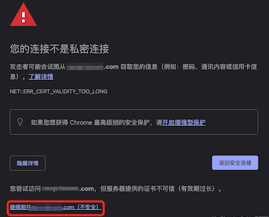
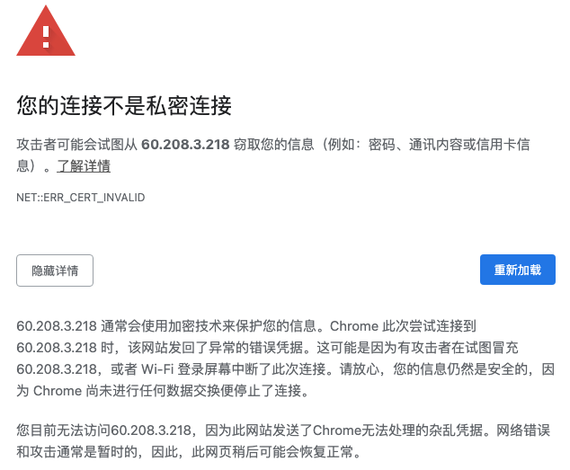

# 1. 13-chrome 打不开页面

某些页面可能因为证书过期等原因导致无法在 chrome 浏览器中直接打开，此时存在两种情况：

## 1.1. 有“继续前往”按钮 

在 `高级` 中有 `继续前往` 的超链接，如下

对于这一种，直接点击 `继续前往xx` 即可打开对应页面。

## 1.2. 没有“继续前往”

在 `高级` 中没有 `继续前往` 的超链接，如下：

对于这一种，点击 `重新加载` 也不会有任何反应。

此时，可以**将光标移动到该页面内容，然后点击任意位置，让当前页面获取鼠标焦点，然后在键盘上敲击 `thisisunsafe` ，敲击完成后，点击 `回车` 键**即可进入对应页面。而且，之后再打开该页面也不会在出现上述提示页面。

## 1.3. 其他

相关关键词：

* 您的连接不是私密连接
* 此网站发送了Chrome无法处理的杂乱凭据