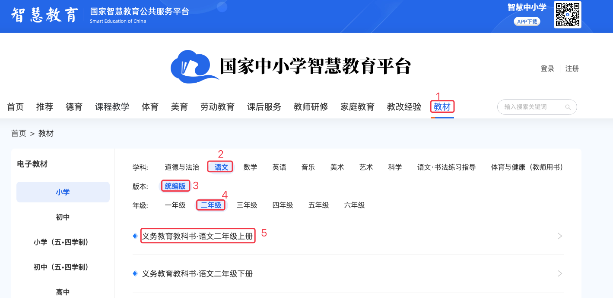
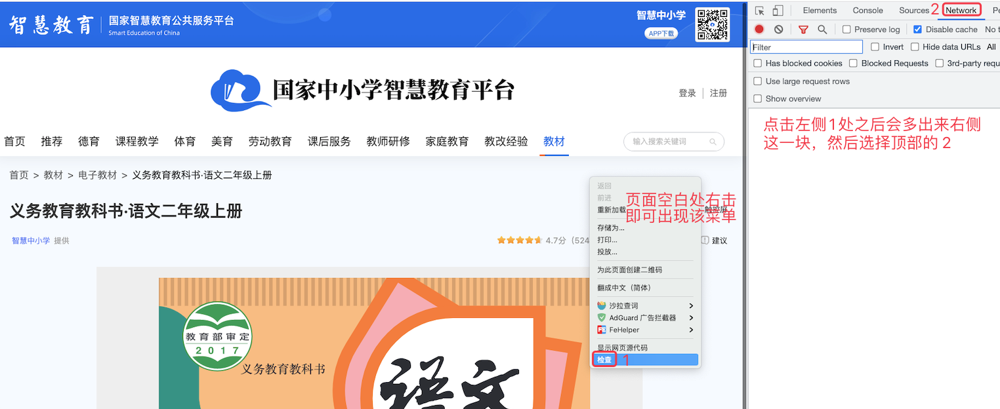
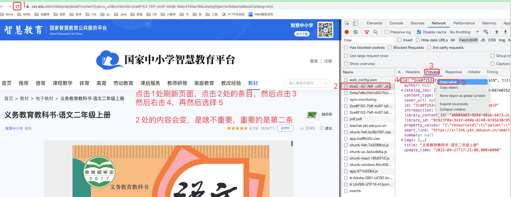
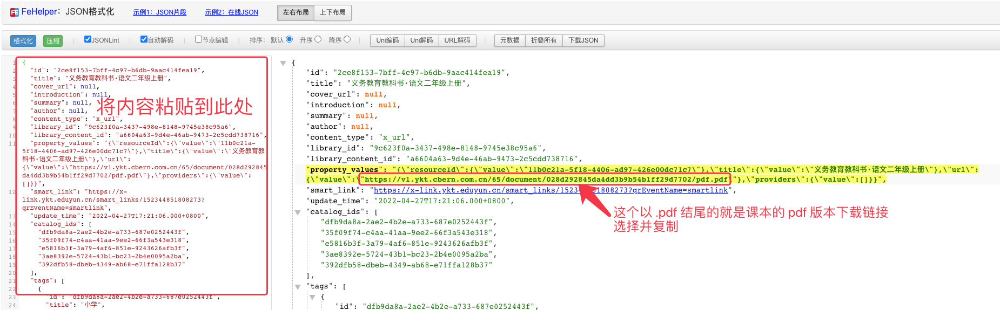
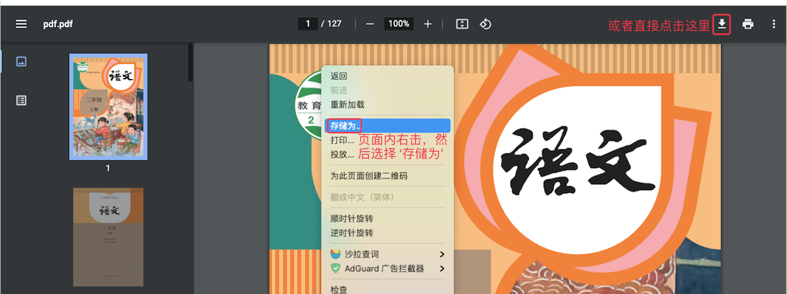

# 1. 14-国家中小学智慧教育平台教材下载

[国家中小学智慧教育平台教材列表页面](https://www.zxx.edu.cn/tchMaterial)

介绍如何下载该平台的 pdf 文件，从而不用下载 App 即可在手机或平板等其他设备上查看：

* 选择学科、版本、年级等数据，并点击课本名称

* 开启`检查`

* 刷新页面，并复制响应结果内容

* 进入如下界面格式化内容，并复制课本的下载链接

[点击进入 json 格式化页面](chrome-extension://pkgccpejnmalmdinmhkkfafefagiiiad/dynamic/index.html?tool=json-format)

* 将链接粘贴到浏览器中，然后点击回车键（enter键），然后按下图示例下载课本

也可以将复制出来的课本链接直接粘贴到迅雷等专用下载工具中进行下载。