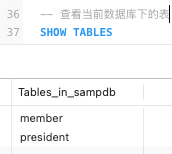

# 1. MySql技术内幕-第五版

基于 《MySql技术内幕-第五版》整理，原书封面如下：


## 1.1. MySQl 入门

注意：在语句中调用函数时，函数名和后面的括号之间不要添加空格。如果有空格，就会导致语法错误。

### 1.1.1. 创建数据库

* 执行 sql 脚本：

将多条语句存放在一个后缀名为 `.sql` 的文件中，借助 shell 的输入重定向功能可以让 mysql 执行该文件中的全部语句。假设文件名为 `myscript.sql` ，在终端中执行 `mysql < myscript.sql` 即可。


* `SELECT DATABASE()`  ：查看当前正在使用的数据库。


* `USE 数据库名称` 选择要使用的数据库 (切换数据库)


* 选择数据库方式2：

```sql
mysql sampdb
```

如上，另一种选择默认数据库的方式是：调用 mysql 时直接指定数据库名称。


实际上，在选择数据库时这种方式会使用的更多。

如果还需要使用连接参数，则可以在命令行中指定，如下：

```bash
# 让用户 sampadm 连接到本地主机（未指定主机名时，默认为本地主机）上的 sampdb 数据库
mysql -p -u sampadm sampdb
```


```sql
# 连接到远程主机上的 mysql 数据库
mysql -h cn.peng.com -p -u sampadm sampdb
```

### 1.1.2. 创建表

#### 1.1.2.1. 创建美史联盟表

美史联盟表包含：

* president 表，包含美国历任总统的描述
* member 表，保存联盟美味成员的最新个人资料


##### 1.1.2.1.1. president 表


基本创建语句：

```sql
CREATE TABLE president (
	last_name VARCHAR ( 15 ) NOT NULL,
	first_name VARCHAR ( 15 ) NOT NULL,
	suffix VARCHAR ( 5 ) NULL,
	city VARCHAR ( 20 ) NOT NULL,
	state VARCHAR ( 2 ) NOT NULL,
	birth DATE NOT NULL,
	death DATE NULL
)
```

我们也可以将上述创建语句存储在 `create_president.sql` 文件中，然后按照如下方式创建表：

```sql
# 使用 `sampdb` 数据库，基于该数据库执行 `create_president.sql` 中的语句
mysql sampdb < create_president.sql
```

在上述语句中，

* `VARCHAR(n)` 表示的是：该列可以存放长度可变的字符型值，且字符的最大长度为 `n` 。
* `DATE` 表示该列用于存放日期值。MySql 中使用 ISO 8601 的日期格式，即：`CCYY-MM-DD`，其中 `CC` 为世纪，`YY` 为年份，`MM` 为月份，`DD` 为日。
* `NULL` 表示可以为空，`NOT NULL` 表示不能为空。


##### 1.1.2.1.2. member 表

```sql
CREATE TABLE member (
	member_id INT UNSIGNED NOT NULL AUTO_INCREMENT,
	PRIMARY KEY ( member_id ),
	last_name VARCHAR ( 20 ) NOT NULL,
	first_name VARCHAR ( 20 ) NOT NULL,
	suffix VARCHAR ( 5 ) NULL,
	expiration DATE NULL,
	email VARCHAR ( 100 ) NULL,
	street VARCHAR ( 50 ) NULL,
	city VARCHAR ( 50 ) NOT NULL,
	state VARCHAR ( 2 ) NOT NULL,
	zip VARCHAR ( 10 ) NULL,
	phone VARCHAR ( 20 ) NULL,
	interests VARCHAR ( 255 ) NULL 
)
```

* `member_id` 列中，
    * `INT` 表示存放整数
    * `UNSIGNED` 表示值不能为负数
    * `NOT NULL` 表示必须要填值
    * `AUTO_INCREMENT` 是 MySql 的特殊属性，表示该列存放的是序号。其工作原理为：当向 `member` 表中添加记录时，如果没有为 `member_id` 列提供值，那么 MySql 会自动生成一个唯一编号并赋值给该列。
* `PRIMARY KEY` 子句表示为 `member_id` 列创建索引，这样**能加快查找速度**，同时**它也要求该列里的所有值都必须唯一**。

MySQL 要求 `AUTO_INCREMENT` 列必须有某种索引，如果没有索引，那么表的定义就是不合法的。任何一个 `PRIMARY KEY` 列也必须是 `NOT NULL` 的，因此即便在 `member_id` 列中没有定义  `NOT NULL`，MySQL 也会自动加上。


上述表字段中，

  * `expiration` 表示有效期
  * `zip` 表示邮编
  * `interests` 表示兴趣爱好

#### 1.1.2.2. 成绩考评项目表

##### 1.1.2.2.1. student 表


### 1.1.3. 查看表结构

#### 1.1.3.1. 查看表结构

当我们记不清表中有哪些字段，字段顺序以及字段的定义限制时，可以通过如下命令查看。

* `DESCRIBE president`，该语句可以简写为：`DESC president`


* `EXPLAIN president`


* `SHOW COLUMNS FROM president`


* `SHOW FIELDS FROM president`


上述语句还允许对输出列加以限制，如下：

* `SHOW COLUMNS FROM president LIKE '%name'`


* `SHOW FULL COLUMNS` 可以查看更详细的列信息。如：`SHOW FULL COLUMNS FROM president LIKE '%name'`：


#### 1.1.3.2. `show` 的其他使用

* `SHOW TABLES` -- 查看当前数据库下的表




* `SHOW DATABASES`  -- 查看当前数据库连接下的数据库


