[基于 B 站 《好程序员大数据_Mysql核心技术》-1 整理](https://www.bilibili.com/video/BV1ut4y1y7tt?from=search&seid=10801019508552053814)

## 1. 数据库简介
### 1.1. 数据库和数据库管理系统

**数据库**，英文名 DataBase , 简称 DB。是按照某种特定的数据结构来组织、存储和管理数据的仓库。

**数据库管理系统**，英文名 DataBase Management System，简称 DBMS。是一种操作和管理数据库的大型软件，用于建立、使用和维护数据库。它对数据库进行统一的管理和控制，以保证数据库的安全性和完整性。它介于用户和数据库之间。用户通过 DBMS 来访问数据库中的数据。

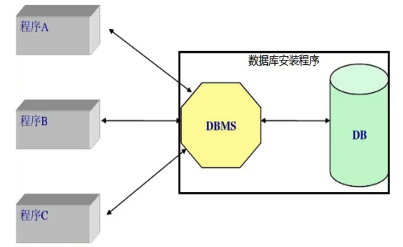

### 1.2. 关系型数据库

建立在 “关系模型” 基础上的数据库，称之为 **关系型数据库**。

**关系模型** 指的是数据具有 “一对一、一对多、多对多” 等关系模型。

常见的关系型数据库产品包括：MySql、Oracle、DB2、SQL Server、Sybase、Access

## 2. MySql 简介

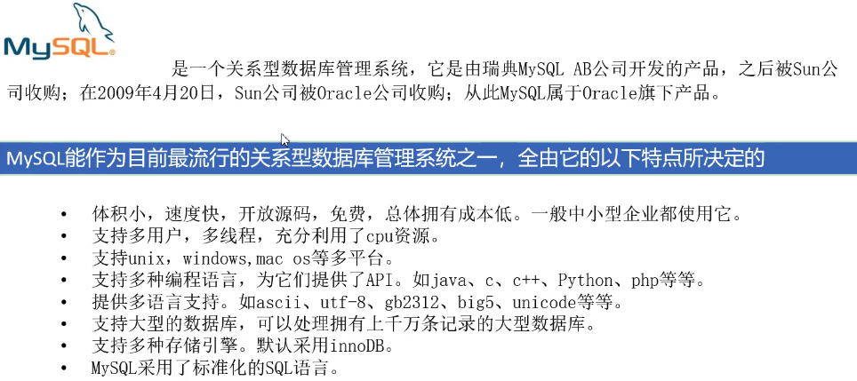

[基于 B 站 《好程序员大数据_Mysql核心技术》-2 整理](https://www.bilibili.com/video/BV1ut4y1y7tt?p=2)

## 3. MySql 安装

### 3.1. 下载

[MySql 官方下载页面](https://dev.mysql.com/downloads/mysql/)

[Windows 系统可以直接点击此处下载 exe 安装文件](https://dev.mysql.com/downloads/windows/installer/8.0.html)

### 3.2. 安装步骤

一步步的按照提示进行安装即可。


### 3.3. Window 安装过程中出现 error 1042 的解决


原文 [《安装mysql8.0出现error 1042，无法正常启动解决方案》](https://www.jianshu.com/p/de3adc46c8ec)

#### 3.3.1. 错误信息

安装过程中在 log 窗口中出现如下报错，导致安装进程无法 finish：

```
error 1042：Unable to connect to any of the specified MySQL hosts
```

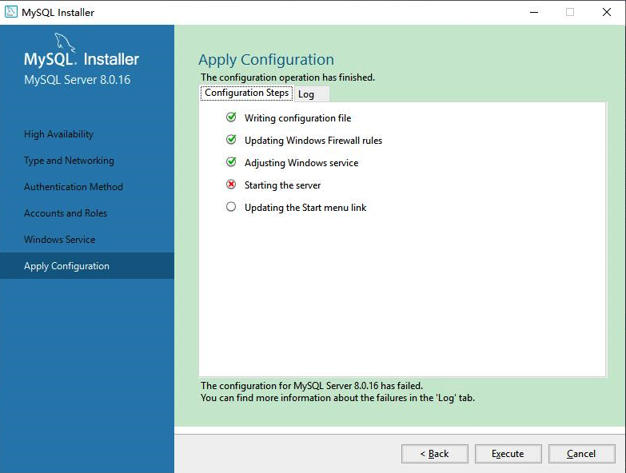

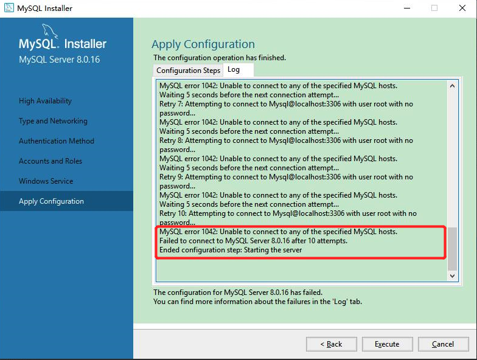

#### 3.3.2. 解决方案

windows 端使用 `Win+R` --> 运行 `services.msc` --> 打开 service 服务管理器，找到刚才安装 mysql 的服务名称（注意，此处服务名与版本号有关，前面固定的是 MySQL，后面的数字是 MySQL 版本号的前两位，如 8.0.20 的版本对应的服务名称为 MySQL80）

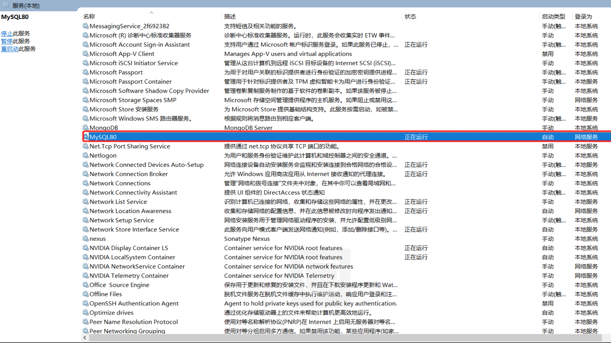

右键 --> 属性 --> 登录，更改成 “本地系统账户” --> 确定

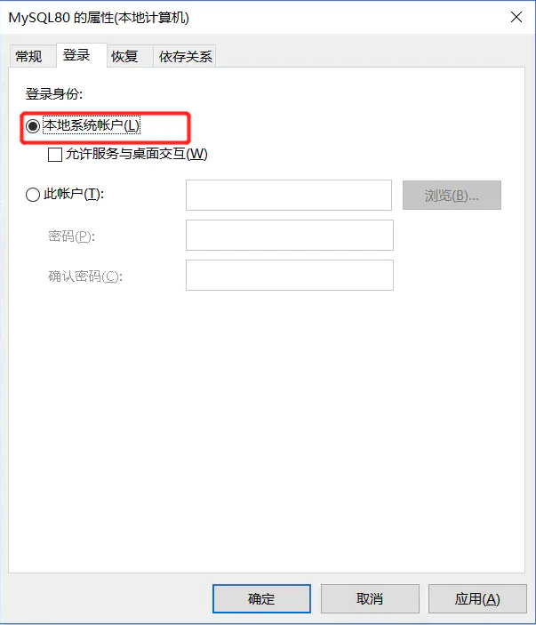

回到安装程序，在次点击 `Execute`，会发现已经可以成功到 Finish 界面

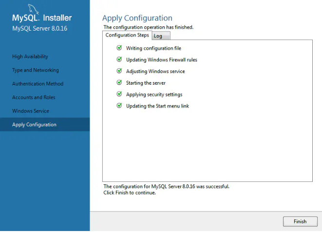

---

[基于 B 站 《好程序员大数据_Mysql核心技术》-3 整理](https://www.bilibili.com/video/BV1ut4y1y7tt?p=3)

MySQL 安装完成之后，为了能在任意位置登录到 MySQL ，我们需要先进行环境变量的配置，并且要先确保已经启动了 MySQL 服务。


### 3.4.  配置环境变量

#### 3.4.1. Windows 配置环境变量

MySql 的执行文件 `mysql.exe` 实际是在安装目录的 `bin` 文件夹中，所以，我们需要将该目录配置到环境变量中。

查看并复制安装目录：

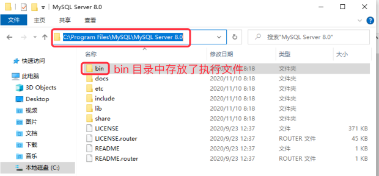

然后打开环境变量配置界面：

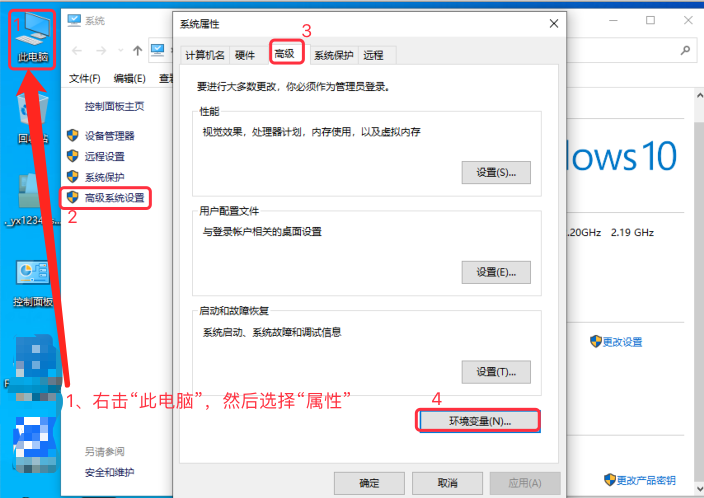

下图中填入的安装目录就是前面我们复制的安装目录，到 bin 的上一层即可：

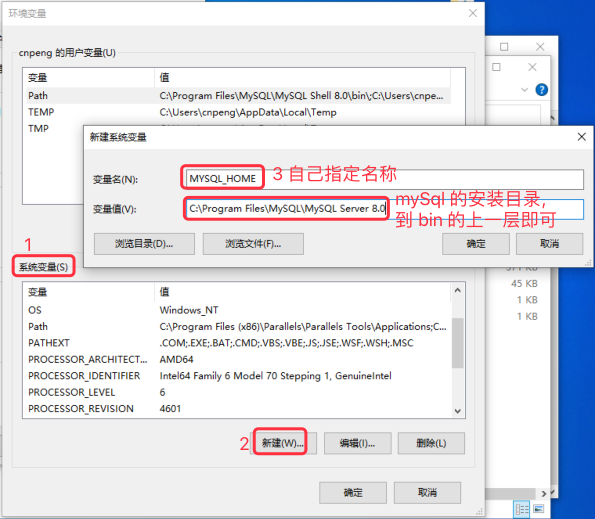

然后将刚才定义的变量名添加到 path 中，先双击下图中的 path

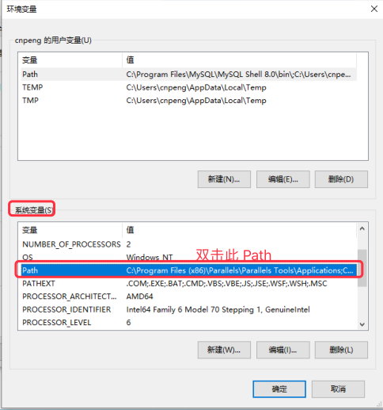

然后在弹出的页面中选择 `新建`，然后将我们前面定义的环境变量名添加到此处，如下图：

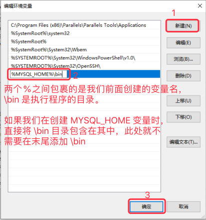

#### 3.4.2.  MAC 配置环境变量

安装完成之后，我们直接在命令行中输入 `mysql` 并回车时，会提示 `command not found`，这是因为还没有配置环境变量。

配置环境变量时，需要先使用 `where mysql` 命令查看我们的 MySQL 安装到哪个目录了：

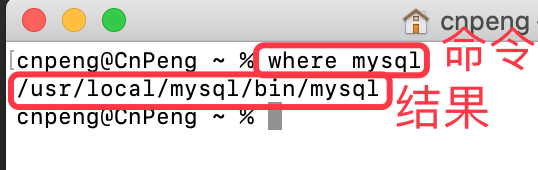

然后通过 `open -e .bash_profile` 命令打开配置文件，并将 MySQL 的安装路径配置到环境变量中：

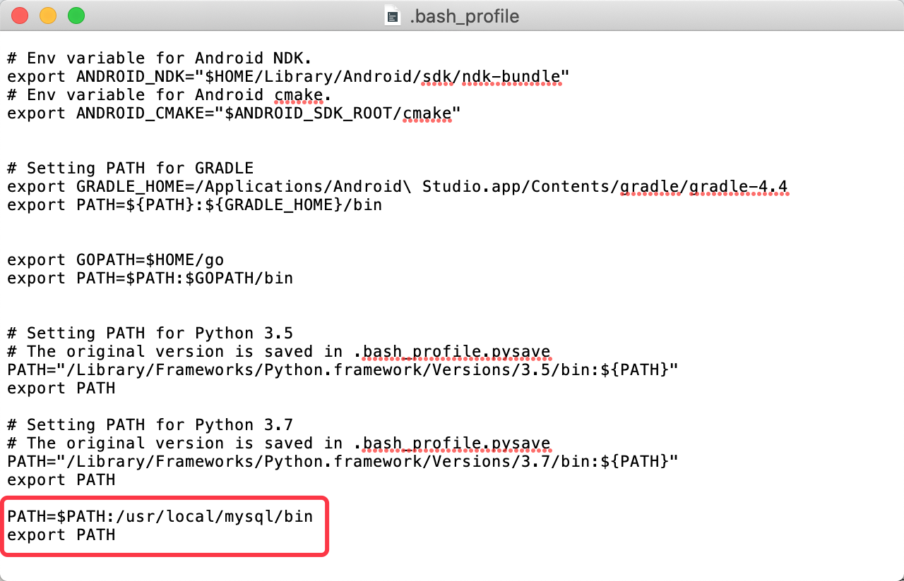

上图中的代码为：

```java
PATH=$PATH:/usr/local/mysql/bin
export PATH
```

编辑完成后，关闭文件，即可自动保存。

然后执行 `source ~/.bash_profile` 或 ` source ~/.zshrc` 让修改立即生效（如果还不生效，则重启电脑）。


### 3.5. 确认服务是否已经启动

#### 3.5.1. Windows 确认服务是否已经启动

Windows 端可以在服务管理器中确认服务是否打开，打开服务管理器的步骤为： `Win+R` --> 运行 `services.msc` --> 打开 service 服务管理器，然后找到 MySQL 服务。

#### 3.5.2.  MAC 确认服务是否已经启动

MAC 下可以在 `系统偏好设置` 中确认，如下图：

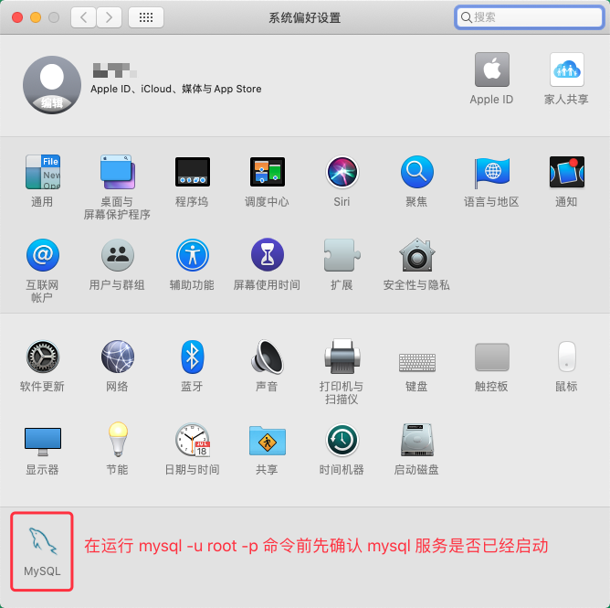

## 4. MySql 登录方式

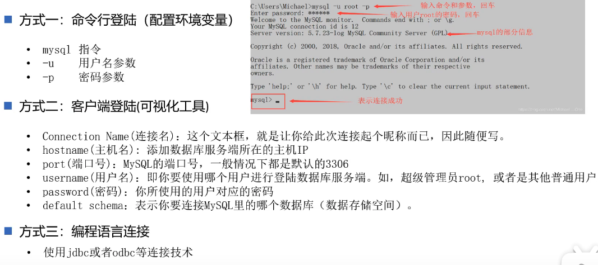


### 4.1. 命令登录

使用命令方式的前提是需要先配置好环境变量。同时需要确认 MySql 服务是否已经启动。

> **命令登录时，-p 后面千万不要带有分号！！！！**

打开终端，然后输入命令 ` mysql -u root -p ` , 然后输入密码即可。

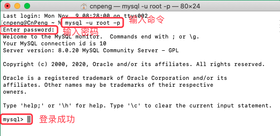

### 4.2. 客户端登录

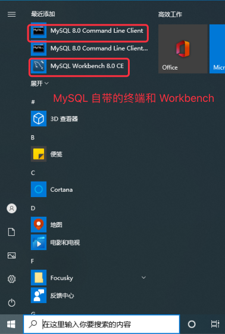

#### 4.2.1. 使用自带的 `MySql Command Line Client` 

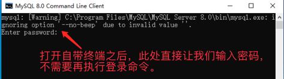

#### 4.2.2. 使用自带的 `MySql Workbench`

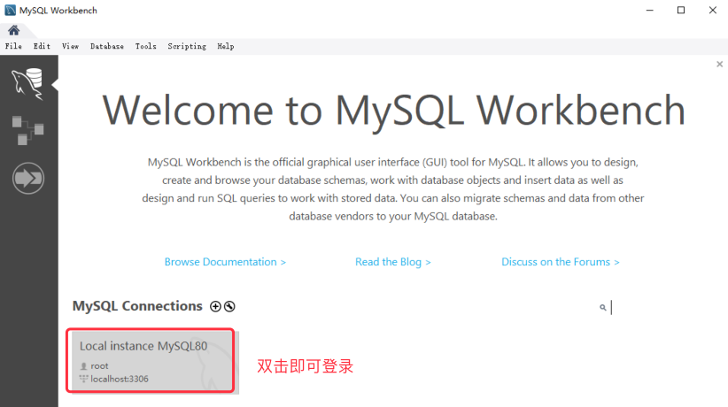

### 4.3.  使用 Sqlyog

初次使用时需要先新建 MySQL 的链接：

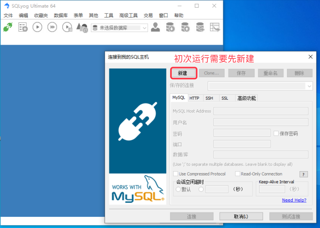

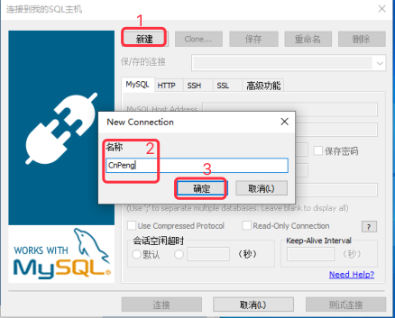

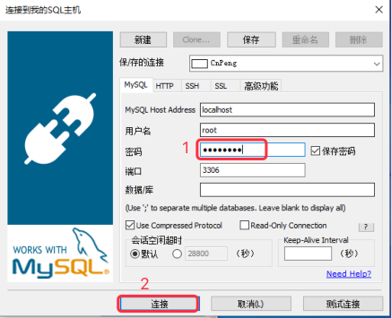

---

[基于 B 站 《好程序员大数据_Mysql核心技术》-4 整理](https://www.bilibili.com/video/BV1ut4y1y7tt?p=4)

## 5. 修改密码

修改密码的方式总览

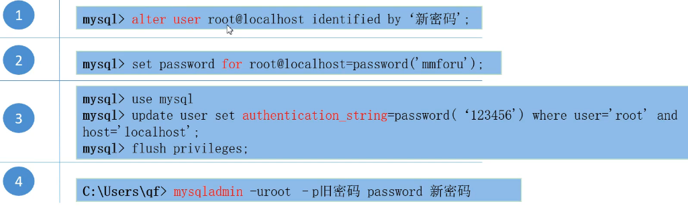

### 5.1.  `alter user`

这种方式需要先使用当前密码登录到 mysql 系统中，也就是说，需要先执行 `mysql -u root -p` 命令。然后在终端中输入如下命令：

```
alter user root@localhost identified by '123';
```

上述命令的含义是将密码重置为 123。需要注意，**新密码需要使用单引号包裹，语句末尾有分号**。

上述命令执行成功之后，输入 `exit;` 退出 mysql 系统，然后重新登录时就需要输入新的密码了。

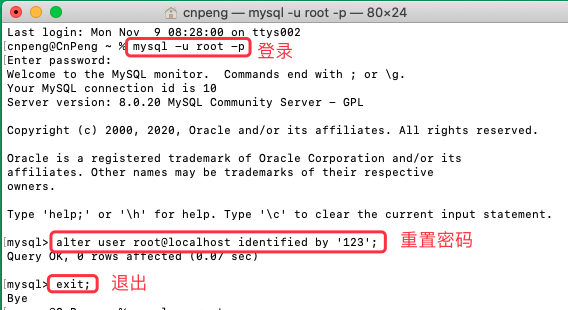

### 5.2.  `set password`

这种方式也需要先使用当前密码登录到 mysql 系统中，也就是说，需要先执行 `mysql -u root -p` 命令。然后在终端中输入如下命令：

```
set password for root@localhost = '123456';
```

注意：在视频中，这种方式的 `=` 右边使用了 `password('123456');` 这种方式，但是，在 MAC  端的 8.0.20 版本下，不需要 `password()`, 直接赋值即可，也就是上面的书写方式。

### 5.3.  `update user`

> **注意，这种方式有问题，在 MAC  端的 8.0.20 版本下修改完成之后，退出在登录时不论输入新密码还是旧密码都无法登录，暂时不确定是不是系统差异导致的。该方法慎用。**

这种方式实际是修改了 mysql 自带的 `mysql` 数据库中的 `user` 表中的信息，该 `user` 表中存储了所有的用户信息。该表中包含 `User` 和 `authentication_string` 字段，分别表示用户名和密码。

登录 mysql 之后，先通过 `user mysql;` 指定要使用的数据库：

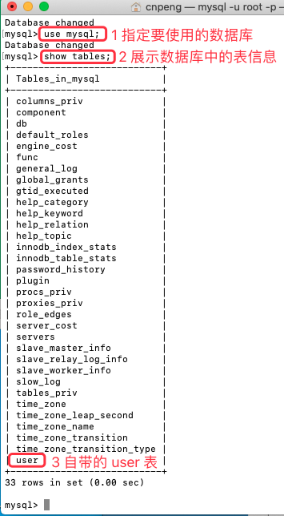

通过 `update` 命令修改密码:

```
 update user set authentication_string = '123' where User = 'root' and Host = 'localhost';
```

注意：在视频中，使用的是 `authentication_string = password('123456');` ，但是，在 MAC  端的 8.0.20 版本下，这样写会报错，拿掉 `password()` 直接赋值则不会报错，也就是上面的书写方式。

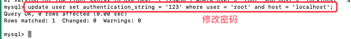

最后再输入 ` flush privileges;` 命令确保上面的 update 语句生效。

### 5.4.  `mysqladmin`

这种方式不需要先登录 mysql，直接在终端中输入命令即可。但该方式也需要先配置环境变量。

```
 mysqladmin -u root -p12345678 password 123; 
```

注意：

* `-p` 和旧密码之间不需要空格，`password` 和新密码之间需要空格。 
* 执行该命令之后，还需要输入旧密码进行确认。
* 该方式是不安全的，不推荐使用。

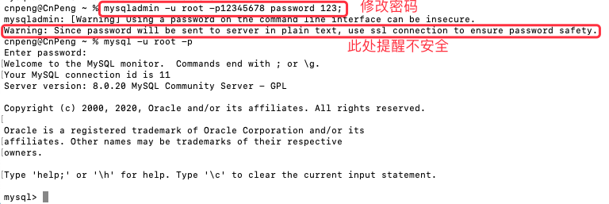


## 6.  绕过密码

> 注意，视频中介绍的方法已经不好使了，所以，此处不再记录。。。SQL8 之后已经

密码全部忘记了的时候，可以使用该方式。

注意：

* MAC  下默认没有 `cni` 或 `ini` 文件，因为已经使用了最优配置。具体参考：[Mac下MySQL的my.cnf配置文件在哪](https://blog.csdn.net/qq_31708763/article/details/104357798)
* Windows 端 5.7 版本之后默认没了 `my.cnf` , 而 `my.ini` 是在 `C:\ProgramData\MySQL\MySQL Server 8.0` 目录中（最后的 8.0 是版本号 ）