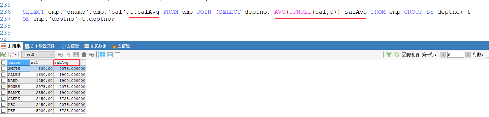

[基于 B 站 《好程序员大数据_Mysql核心技术》-20、21 整理](https://www.bilibili.com/video/BV1ut4y1y7tt?p=20)

# 18. 子查询

## 18.1 Where 中的子查询

* 查询工资大于员工编号为 7566 这个员工的所有员工信息：

```sql
SELECT * FROM emp WHERE sal >(SELECT sal FROM emp WHERE empno=7566);
```

* 查询工资大于 20 号部门平均工资的非 20 号部门的员工信息：

```sql
SELECT * FROM emp WHERE sal > (SELECT AVG(IFNULL(sal,0)) FROM emp WHERE deptno = 20) AND deptno != 20;
```

## 18.2 join 中的子查询

* 查询工资大于本部门平均工资的员工信息

```sql
# avgSal 是 AVG(IFNULL(sal,0)) 的别名; 
# 括号内 select 语句得到的也是一个表，t 是该表的别名，avgSal 就是该表中的字段
SELECT emp.`ename`,emp.`empno`,t.deptno,t.avgSal FROM emp 
JOIN (SELECT deptno,AVG(IFNULL(sal,0)) avgSal FROM emp GROUP BY deptno) t
ON emp.`deptno` = t.`deptno` WHERE emp.sal > t.avgSal;
```


* 查询每个员工的工资、姓名及其所在部门的平均工资

```sql
SELECT emp.`ename`,emp.`sal`,t.salAvg FROM emp JOIN (SELECT deptno, AVG(IFNULL(sal,0)) salAvg FROM emp GROUP BY deptno) t
ON emp.`deptno`=t.deptno;
```  



## 18.3 having 中的子查询

* 查询平均工资大于 30 号部门平均工资的部门号和平均工资

```sql
SELECT deptno,AVG(IFNULL(sal,0))
FROM emp
GROUP BY deptno
HAVING AVG(IFNULL(sal,0))>(SELECT AVG(IFNULL(sal,0)) FROM emp WHERE emp.`deptno`=30);
```

## 18.4 select 中的子查询

* 查询每个员工的姓名、工资 及其所在部门的平均工资、工资之和

```sql
SELECT t.`ename`,t.`sal`,
# 查询平均值，并为结果表设置别名 avgSal
(SELECT AVG(IFNULL(sal,0)) FROM emp t1 WHERE t1.`deptno` = t.`deptno`) avgSal,
# 查询工资和，并为结果表设置别名 sumSal
(SELECT SUM(sal) FROM emp t2 WHERE t2.`deptno` = t.`deptno`) sumSal
# 为表格设置别名 t
FROM emp t;
```

