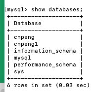
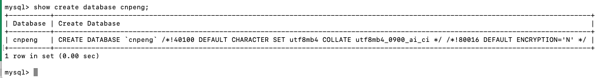
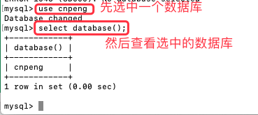
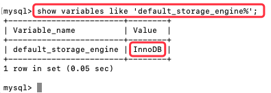
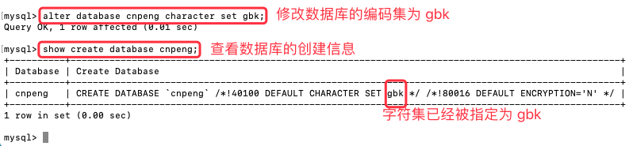

[基于 B 站 《好程序员大数据_Mysql核心技术》-5 整理](https://www.bilibili.com/video/BV1ut4y1y7tt?p=5)

## 1. SQL 概述

### 1.1. SQL(结构化查询语言)

`SQL` 全称  Structured Query Language , 即 结构化查询语言。

SQL 是一种标准化的语言，允许我们在数据库上进行操作，如：创建项目、查询内容、更新内容和删除内容等操作。

SQL 最早时被美国国家标准局（ANSI）确定为关系型数据库语言的美国标准。后来被国际化标准组织（ISO）采纳为关系型数据库语言的国际标准。

各种数据库厂商都支持 ISO 标准的 SQL，类似于普通话。各个数据库厂商在标准的基础上，又定义了若干自己的扩展，这就类似于方言。

### 1.2. SQL 语言的分类

种类| 英文全称 | 含义 | 关键字
---|---|---|---
DDL | Data Definition Language | 数据定义语言，用来定义数据库对象（数据库、表、列） | alter、create、drop、truncate 等
DML | Data Manipulation Language| 数据操纵语言，用于修改表中记录 | insert、delete、update 
DQL | Data Query Language | 数据查询语言，用于查询表中记录 | select 
DCL | Data Control Language | 数据控制语言，用于定义访问权限和安全级别 | grant、revoke、alter、user 
TDL | Transaction Control Language | 事务控制语言，用于保证数据的商业逻辑和安全性 | commit、rollback、savepoint 

---

[基于 B 站 《好程序员大数据_Mysql核心技术》-6 整理](https://www.bilibili.com/video/BV1ut4y1y7tt?p=6)

## 2. 数据库操作

> 在后续内容中，`[关键字]` 的格式表示该关键字内容可以省略


### 2.1. 数据库的创建

* 创建数据库

```sql
create database DBName;
```

* 创建数据库的同时指定字符集

```sql
CREATE DATABASE DBName CHARACTER SET UTF8;
```

### 2.2. 数据库的查看

* 查看所有数据库

```sql
 show databases;
```



* 查看指定数据库的创建信息

```sql
show create database DBName;
```



* 查看当前数据库的名称

```sql
select database();
```



### 2.3. 数据库的切换

* 切换当前使用的数据库

```sql
use DBName;
```


### 2.4. 查看数据库引擎

```sql
 show variables like 'default_storage_engine%';
```



通过上图可知，MySql 默认使用的数据库引擎为 InnoDB, InnoDB 支持事务。

### 2.5. 修改字符集

```sql
 alter database 数据库名 character set gbk;
```



### 2.6. 删除数据库

```sql
drop database 数据库名;
```

