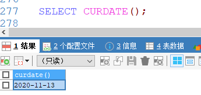
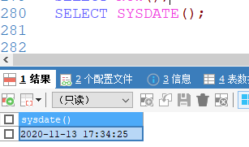
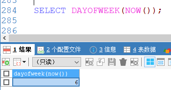
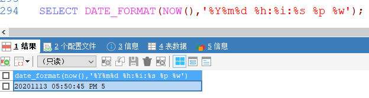
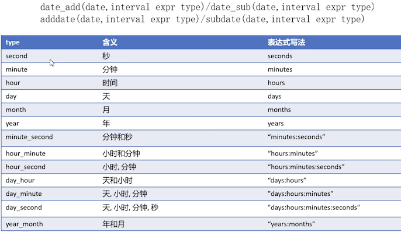
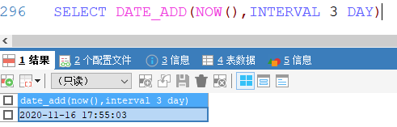
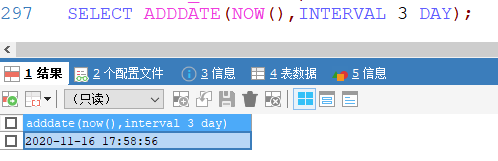
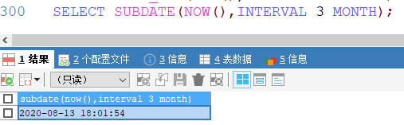

[基于 B 站 《好程序员大数据_Mysql核心技术》-23 整理](https://www.bilibili.com/video/BV1ut4y1y7tt?p=23)

# 20. 日期函数

## 20.1 获取日期的函数

* 获取当前系统时间的函数
	* `curdate()`、
	* `curtime()`、
	* `now()`、
	* `sysdate()`、
	* `current_timestamp()`

* 获取星期几的函数
	* `dayofweek(date)`  1=星期天，1~7
	* `weekday(date)`  0=星期一
	* `dayname(date)` 0~6

* 获取第几天的函数
	* `dayofmonth(date)`
	* `dayofyear(date)`
	* `monthname(date)`

* 截取时间分量函数
	* `year(date)`
	* `month(date)`
	* `day(date)`
	* `hour(date)`
	* `minute(date)`
	* `second(date)`

* 日期格式化函数
	* `date_format(date, format)` 根据 format 字符串格式化 date 值
	* `%Y` 年、`%m` 月、`%d` 日、`%h` 时、`%i` 分、`%s` 秒、`%p` 上下午、`%W` 星期

## 20.2 示例：

### 20.2.1 获取系统时间

```sql
SELECT CURDATE();
```	



---

```sql
SELECT CURTIME();
```


---

```sql
SELECT NOW();
```


---	

```sql
SELECT SYSDATE();
```



---	

```sql
SELECT CURRENT_TIMESTAMP();
```


### 20.2.2 获取星期几

```sql
# 星期天对应 1
SELECT DAYOFWEEK(NOW());
```



---	

```sql
# 星期一是0
SELECT WEEKDAY(NOW());
```


---	

```sql
SELECT DAYNAME('2020-11-13');
```


### 20.2.3 第几天

```sql
SELECT DAYOFMONTH(NOW());
```


---	

```sql
SELECT DAYOFYEAR(NOW());
```


---	

```sql
SELECT MONTHNAME(NOW());
```


### 20.2.4 时间分量

```sql
SELECT YEAR(NOW()),MONTH(NOW()),DAY(NOW()),HOUR(NOW()),MINUTE(NOW()),SECOND(NOW());
```


### 20.2.4 格式化

```sql
SELECT DATE_FORMAT(NOW(),'%Y%m%d %h:%i:%s %p %w');
```



## 20.3 日期运算函数



```sql
SELECT DATE_ADD(NOW(),INTERVAL 3 DAY)
```



---	

```sql
SELECT ADDDATE(NOW(),INTERVAL 3 DAY);
```



---	

```sql
SELECT DATE_SUB(NOW(),INTERVAL 3 MONTH);
```


---	

```sql
SELECT SUBDATE(NOW(),INTERVAL 3 MONTH);
```


