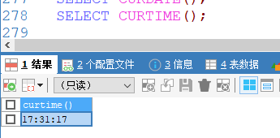
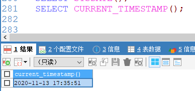
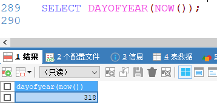
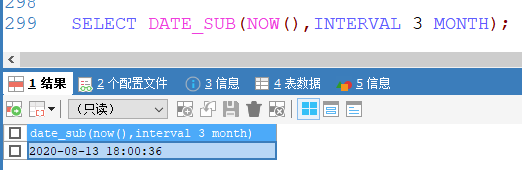
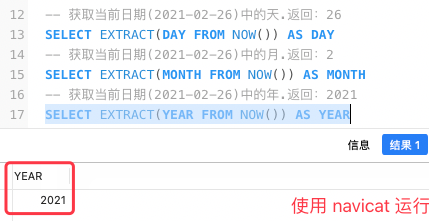

[基于 B 站 《好程序员大数据_Mysql核心技术》-23 整理](https://www.bilibili.com/video/BV1ut4y1y7tt?p=23)

# 1. 日期函数

## 1.1. 获取日期的函数

* 获取当前系统时间的函数
	* `curdate()`、
	* `curtime()`、
	* `now()`、
	* `sysdate()`、
	* `current_timestamp()`

* 获取星期几的函数
	* `dayofweek(date)`  1=星期天，1~7
	* `weekday(date)`  0=星期一
	* `dayname(date)` 0~6

* 获取第几天的函数
	* `dayofmonth(date)`
	* `dayofyear(date)`
	* `monthname(date)`

* 截取时间分量函数
	* `year(date)`
	* `month(date)`
	* `day(date)`
	* `hour(date)`
	* `minute(date)`
	* `second(date)`

* 日期格式化函数
	* `date_format(date, format)` 根据 format 字符串格式化 date 值
	* `%Y` 年、`%m` 月、`%d` 日、`%h` 时、`%i` 分、`%s` 秒、`%p` 上下午、`%W` 星期

## 1.2. 示例：

### 1.2.1. 获取系统时间

```sql
SELECT CURDATE();
```	


---

```sql
SELECT CURTIME();
```



---

```sql
SELECT NOW();
```


---	

```sql
SELECT SYSDATE();
```


---	

```sql
SELECT CURRENT_TIMESTAMP();
```



### 1.2.2. 获取星期几

```sql
# 星期天对应 1
SELECT DAYOFWEEK(NOW());
```


---	

```sql
# 星期一是0
SELECT WEEKDAY(NOW());
```


---	

```sql
SELECT DAYNAME('2020-11-13');
```


### 1.2.3. 第几天

```sql
SELECT DAYOFMONTH(NOW());
```


---	

```sql
SELECT DAYOFYEAR(NOW());
```



---	

```sql
SELECT MONTHNAME(NOW());
```


### 1.2.4. 时间分量

```sql
SELECT YEAR(NOW()),MONTH(NOW()),DAY(NOW()),HOUR(NOW()),MINUTE(NOW()),SECOND(NOW());
```


### 1.2.5. 格式化

```sql
SELECT DATE_FORMAT(NOW(),'%Y%m%d %h:%i:%s %p %w');
```


## 1.3. 日期运算函数


### 1.3.1. 日期加

```sql
SELECT DATE_ADD(NOW(),INTERVAL 3 DAY)
```


---	

```sql
SELECT ADDDATE(NOW(),INTERVAL 3 DAY);
```


### 1.3.2. 日期减

```sql
SELECT DATE_SUB(NOW(),INTERVAL 3 MONTH);
```



---	

```sql
SELECT SUBDATE(NOW(),INTERVAL 3 MONTH);
```


### 1.3.3. 补充：获取日期差值

[MySQL DATEDIFF() 函数](https://www.w3school.com.cn/sql/func_datediff_mysql.asp)

```sql
-- 查询两个日期之间的时间差。值为 后者-前者 。 返回 ：-873
SELECT DATEDIFF('20150605','2017-10-25') AS diffDate

-- DATEDIFF 只计算日期部分 返回：-873
SELECT DATEDIFF('20150605091011','2017-10-25') AS diffDate

-- 计算当前日期(2021-02-26)和 2020-01-01 间的时间差值。 返回：422
SELECT DATEDIFF(NOW(),'2020-01-01') AS diffDate
```

### 1.3.4. 补充：取出日期中的节点

格式：[EXTRACT(unit FROM date)](https://www.w3school.com.cn/sql/func_extract.asp)

其中，date 为合法的日期，unit 单位的取值如下：

* MICROSECOND
* SECOND
* MINUTE
* HOUR
* DAY
* WEEK
* MONTH
* QUARTER
* YEAR
* SECOND_MICROSECOND
* MINUTE_MICROSECOND
* MINUTE_SECOND
* HOUR_MICROSECOND
* HOUR_SECOND
* HOUR_MINUTE
* DAY_MICROSECOND
* DAY_SECOND
* DAY_MINUTE
* DAY_HOUR
* YEAR_MONTH

示例：

```sql
-- 获取当前日期(2021-02-26)中的天.返回：26
SELECT EXTRACT(DAY FROM NOW()) AS DAY
-- 获取当前日期(2021-02-26)中的月.返回：2
SELECT EXTRACT(MONTH FROM NOW()) AS MONTH
-- 获取当前日期(2021-02-26)中的年.返回：2021
SELECT EXTRACT(YEAR FROM NOW()) AS YEAR
```



### 1.3.5. 补充：获取 date 对象中的日期

[DATE(date)](https://www.w3school.com.cn/sql/func_date.asp) 函数返回日期或日期/时间表达式的日期部分。

```sql
-- 返回日期对象中的 date
SELECT DATE(NOW()) AS date
SELECT DATE('2021-02-26 15:39:42 345') AS date
```


