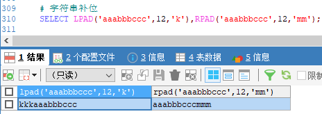
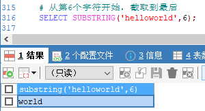
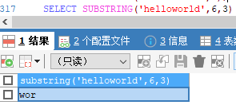
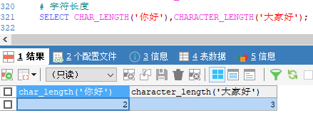
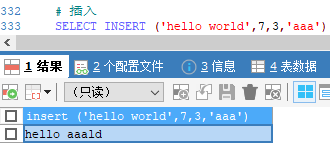

[基于 B 站 《好程序员大数据_Mysql核心技术》-24 整理](https://www.bilibili.com/video/BV1ut4y1y7tt?p=24)

# 21.字符串函数

## 21.1 字符串函数介绍

字符串函数包括如下：

* 进制转换函数
	* `conv(n,from_base,to_base)` 将 `from_Base` 表示的数 n 改为 `to_base` 表示

* 拼接函数
	* `concat(str1, str2, ...)` 将多个参数拼接成一个字符串，只要有一个为 null，则返回 null

* 补位函数
	* `lpad(str, len, padstr)` 用字符串 padstr 填补到 str 的左端，直到字符串长度为 len 并返回
	* `rpad(str, len, padstr)`  用字符串 padstr 填补到 str 的右端，直到字符串长度为 len 并返回

* 截取函数
	* `left(str, len) / right(str, len)` 返回字符串 str 的左端/右端 len 个字符
	* `substring(str, pos[,len])` 返回字符串 str 中从 pos 起的 len 个字符，**该函数下标从 1 开始**。 

* 字符串长度函数
	* `length(str) / octet_length(str)` 返回参数对应的默认字符串的所有字节数。
	* `char_length(str) / character_length(str)` 返回字符串 str 的字符长度

* 去空格函数
	* `ltrim(str) / rtrim(str) / trim(str)` 去除 str 指定位置的空格。

* 大小写转换函数
	* `lcase(str) / lower(str) / ucase(str) / upper(str)` 返回 str 的大小写

* 替换函数
	* `replace(str, from_str, to_str)` 用字符串 `to_str` 替换字符串 str 中的子串 `from_str` 并返回。
	* `insert(str, pos, len, newstr)` 把字符串 str 由位置 pos 起 len 个字符替换为 newstr 并返回。   

## 21.2 示例

```sql
# 将 10 进制的 6 转换成 2 进制
SELECT CONV(6,10,2)
```	


```sql
# 字符串拼接
SELECT CONCAT('hello','world');
```


```sql
# 字符串补位
SELECT LPAD('aaabbbccc',12,'k'),RPAD('aaabbbccc',12,'mm');
```



```sql
# 截取
SELECT LEFT('aaabbbccc',6),RIGHT('helloworld',5);
```


```sql
# 从第6个字符开始，截取到最后
SELECT SUBSTRING('helloworld',6);
```



```sql
SELECT SUBSTRING('helloworld',6,3)
```



```sql
# 字符串所占的字节长度
SELECT LENGTH('你好'),OCTET_LENGTH('大家好');
```


```sql
# 字符长度
SELECT CHAR_LENGTH('你好'),CHARACTER_LENGTH('大家好');
```



```sql
# trim 去除空格
SELECT LTRIM('  hello'),RTRIM('world   '),TRIM('  good   ');
```


```sql
# 大小写
SELECT LCASE('ABC'),LOWER('ABC'),UCASE('abc'),UPPER('abc');
```


```sql
# 替换
SELECT REPLACE('hello world','world','hello');
```


```sql
# 插入. 从第 7 个字符开始，数 3 个替换成 aaa
SELECT INSERT ('hello world',7,3,'aaa')
```




