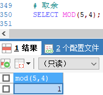
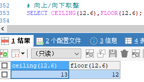
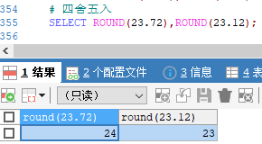
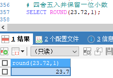

[基于 B 站 《好程序员大数据_Mysql核心技术》-25 整理](https://www.bilibili.com/video/BV1ut4y1y7tt?p=25)

# 22.数值函数

## 22.1 数值函数介绍

* 幂函数
	* `pow(x,y) / power(x,y)`  返回 x 的 y 次幂
* 平方根函数
 	* `sqrt(n)` 返回非负数 n 的平方根	
* 圆周率函数
 	* `pi()` 返回圆周率 	
* 随机函数
	* `rand() / rand(n)` 返回在范围 0 到 0.1 内的随机浮点值（可以使用数组 n 作为随机种子）
* 截取函数
 	* `truncate(n,d)` 保留数字 n 的 d 为小数	
* 求最大、最小值
 	* `least(x,y,...) / greatest(x,y,...)`		
* 取模函数（取余）
 	* `mod(n,m)` 取模运算，返回 n 被 m 除的余数（同 `%` 操作符）
* 向上/向下去整
	* `ceiling(n) / floor(n)` 
* 四舍五入函数
	* `round(n,d)` 返回 n 的四舍五入值，保留 d 为小数（d 的默认值为 0 ） 
 		 	
## 22.2 示例

```sql
# 计算 2 的 3 次幂
SELECT POW(2,3),POWER(2,3);
```


```sql
# 开平方
SELECT SQRT(4);
```


```sql
# π 值
SELECT PI();
```


```sql
# 随机数
SELECT RAND(),RAND(5);
```


```sql
# 截取
SELECT TRUNCATE(123.456,2);
```


```sql
# 最小值和最大值
SELECT LEAST(12,3,45,6,7),GREATEST(99,123,34,6);
```


```sql
# 取余
SELECT MOD(5,4);
```



```sql
# 向上/向下取整
SELECT CEILING(12.6),FLOOR(12.6);
```



```sql
# 四舍五入
SELECT ROUND(23.72),ROUND(23.12);
```



```sql
# 四舍五入并保留一位小数
SELECT ROUND(23.72,1);
```

