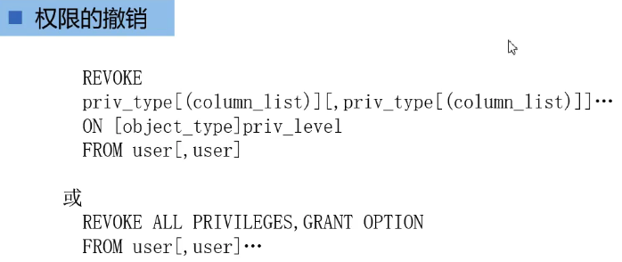

[基于 B 站 《好程序员大数据_Mysql核心技术》-27、28 整理](https://www.bilibili.com/video/BV1ut4y1y7tt?p=27)

# 24. 账户权限管理

## 24.1 授予权限

### 24.1.1 授予权限的语法


* `priv_type` 操作名称，如：select 、del 等
* `object_type` 取值为：TABLE 、 FUNCTION 、PROCEDURE，分别代表：表、函数、存储过程
* `priv_level` 的取值为：`*`——当前数据库中的所有表，`*.*`——所有数据库中的所有表，`db_nam.*`——某个数据库中的所有表，`db.name.tbl_nam`——某个数据库中的某个表或视图，`tbl_nam`——表或视图，`db_nam.routine_name`——某个数据库中的存储过程或者函数。
* `user_spefification` 的格式为：

```sql
user [
	IDENTIFICATION BY [PASSWORD] 'password'
	| IDENTIFIED WITH auth_plugin [AS] 'auth_string'
]
``` 

* `with_option` 的格式为： 

```sql
GRANT OPTION
| MAX_QUERIES_PER_HOUR count
| MAX_UPDATES_PER_HOUR count
| MAX_CONNECTIONS_PER_HOUR count
| MAX_USER_CONNECTIONS count
```

### 24.1.2 示例

授予用户 lisi 在数据库 `cnpeng ` 中 `emp` 表中拥有对 `ename ` 和 `job ` 列的 select 权限：

```sql
# 授予权限——注意，此处的 lisi 加了引号
GRANT SELECT (ename,job) ON cnpeng.`emp` TO 'lisi'@localhost;

# 新开一个终端窗口，并依次执行如下命令：
# 登录
mysql -u lisi -p

# 查询 emp 中的指定字段，查询未授权的权限时会报错
select ename,job from cnpeng.emp;

# 下面这样写会报错，因为仅授予了其 ename 和 job 的查询权限。
# select * from cnpeng.emp;
``` 

## 24.2 权限撤销

### 24.2.1 语法




### 24.2.2 示例

回收用户 lisi 在 cnpeng 数据库中对 emp 表的 select 权限。

```sql
# 撤销 lisi 对 cnpeng 库中 emp 表的 select 权限，注意：此处的 lisi 没有加引号。
REVOKE SELECT ON cnpeng.`emp` FROM lisi@localhost;
```

撤销权限之后，再执行查询就会报错了，如下图：

