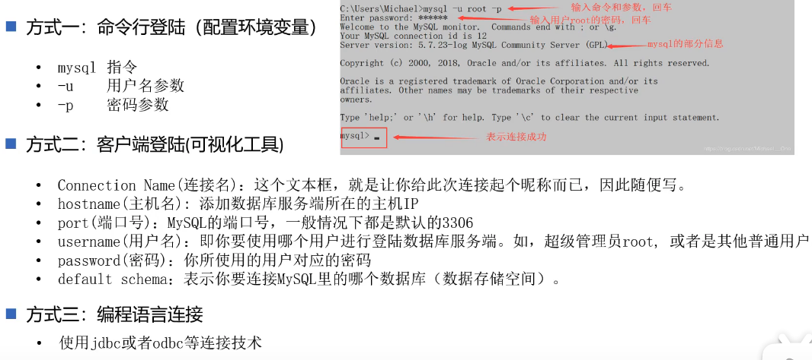
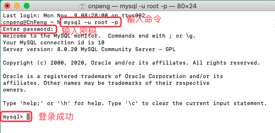
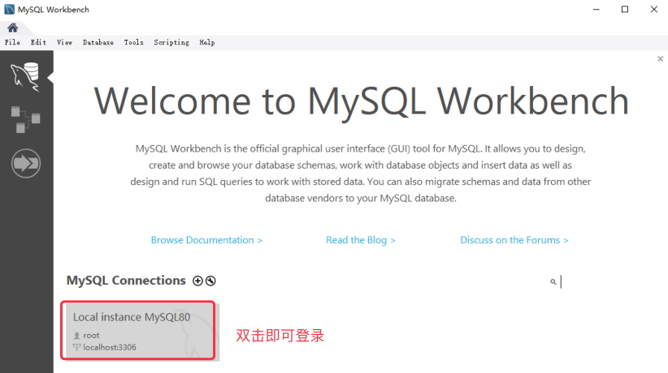
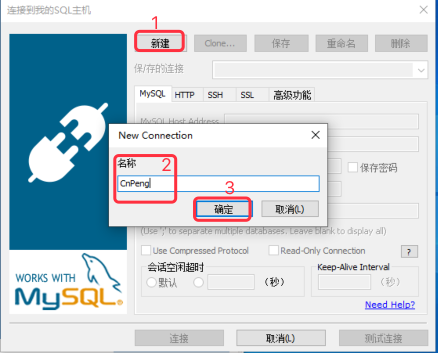

[基于 B 站 《好程序员大数据_Mysql核心技术》-3 整理](https://www.bilibili.com/video/BV1ut4y1y7tt?p=3)

MySQL 安装完成之后，为了能在任意位置登录到 MySQL ，我们需要先进行环境变量的配置，并且要先确保已经启动了 MySQL 服务。


## 3.1 配置环境变量

### 3.2.1 Windows 配置环境变量

MySql 的执行文件 `mysql.exe` 实际是在安装目录的 `bin` 文件夹中，所以，我们需要将该目录配置到环境变量中。

查看并复制安装目录：


然后打开环境变量配置界面：


下图中填入的安装目录就是前面我们复制的安装目录，到 bin 的上一层即可：


然后将刚才定义的变量名添加到 path 中，先双击下图中的 path


然后在弹出的页面中选择 `新建`，然后将我们前面定义的环境变量名添加到此处，如下图：


#### 3.2.1.2 MAC 配置环境变量

安装完成之后，我们直接在命令行中输入 `mysql` 并回车时，会提示 `command not found`，这是因为还没有配置环境变量。

配置环境变量时，需要先使用 `where mysql` 命令查看我们的 MySQL 安装到哪个目录了：


然后通过 `open -e .bash_profile` 命令打开配置文件，并将 MySQL 的安装路径配置到环境变量中：


上图中的代码为：

```java
PATH=$PATH:/usr/local/mysql/bin
export PATH
```

编辑完成后，关闭文件，即可自动保存。

然后执行 `source ~/.bash_profile` 或 ` source ~/.zshrc` 让修改立即生效（如果还不生效，则重启电脑）。


## 3.2 确认服务是否已经启动

### 3.2.1 Windows 确认服务是否已经启动

Windows 端可以在服务管理器中确认服务是否打开，打开服务管理器的步骤为： `Win+R` --> 运行 `services.msc` --> 打开 service 服务管理器，然后找到 MySQL 服务。

### 3.2.2 MAC 确认服务是否已经启动

MAC 下可以在 `系统偏好设置` 中确认，如下图：


## 3.3 登录方式一览




### 3.3.1 命令登录

使用命令方式的前提是需要先配置好环境变量。同时需要确认 MySql 服务是否已经启动。

> **命令登录时，-p 后面千万不要带有分号！！！！**

打开终端，然后输入命令 ` mysql -u root -p ` , 然后输入密码即可。



### 3.3.2 客户端登录


#### 3.3.2.1 使用自带的 `MySql Command Line Client` 


#### 3.3.2.2 使用自带的 `MySql Workbench`



### 3.3.3 使用 Sqlyog

初次使用时需要先新建 MySQL 的链接：




