[基于 B 站 《好程序员大数据_Mysql核心技术》-7 整理](https://www.bilibili.com/video/BV1ut4y1y7tt?p=7)

## 1. 表的创建和修改

### 1.1. 表的概念

* 数据库中存储数据的基本单位就是表，一个数据库是由多个表组成的。
* 表是二维结构，由行和列组成。
* 表的行是横排数据，也被称之为**记录**（Record）
* 表的列是竖排数据，也被称之为**字段**（Field）
* 表与表之间存在着关联关系。

### 1.2. 数据类型

表中的数据是按类型进行存储的，类型的定义只需要在建表时对字段进行规定即可。常用类型如下：

类型 | 含义
---|---
int  | 整型
double / float | 浮点型
char / varchar / text | 字符串类型
blob | 字节类型
date | 日期类型（`yyyy-MM-dd`）
time | 时间类型（`hh:mm:ss`）
timestamp | 时间戳类型（`yyyy-MM-dd hh:mm:ss`）
datetime | 时间类型 （`yyyy-MM-dd hh:mm:ss`）

* varchar 表示可变长度的 char, 会根据实际存储数据的长度动态调整存储空间。

### 1.3. 创建表

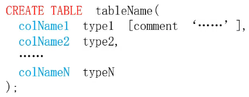

```sql
 create table t_user(
         name VARCHAR(50) comment 'this is name of user',
         age INT,
   	   gender VARCHAR(10),
         height INT,
         weight INT
);
```

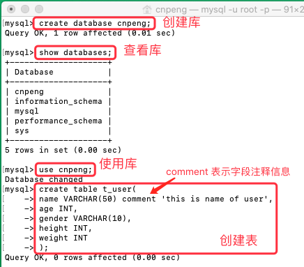

### 1.4. 查看表信息

* 查看当前库的全部表

```sql
 show tables;
```

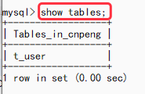

* 查看某个表的结构

```sql
desc tableName;
```

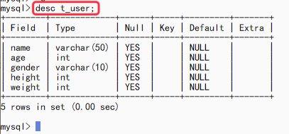

* 查看建表语句信息

```sql
 show create table tableName;
```

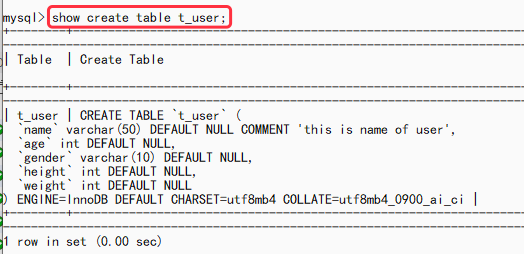

### 1.5. 修改表

操作 | 对应语句格式
---|---
添加字段 | `alter table tableName add colName type`
修改字段类型 | `alter table tableName modify colName newType`
修改字段名称 | `alter table tableName change oldColName newColName type`
删除字段 | `alter table tableName drop colName`
删除表 | `drop table tableName`

* 添加字段

```sql
 alter table t_user add address VARCHAR(50);d
```

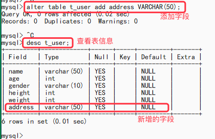

* 修改字段类型

```sql
 alter table t_user modify address VARCHAR(60);
```

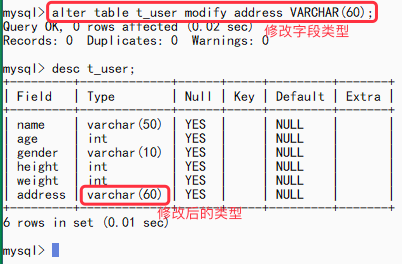

* 删除字段

```sql
 alter table t_user drop address;
```

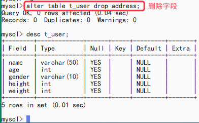

* 修改字段名称

```sql
 alter table t_user change name userName varchar(50);
```

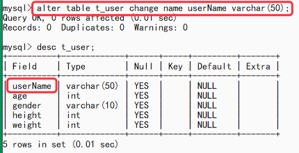

* 删除表

```sql
drop table t_user;
```

---

[基于 B 站 《好程序员大数据_Mysql核心技术》-8 整理](https://www.bilibili.com/video/BV1ut4y1y7tt?p=8)

## 2. 表数据的添加、修改、删除

### 2.1. 使用 Sqlyog 连接数据库

连接时先新建，然后输入密码即可，其他暂不用修改。

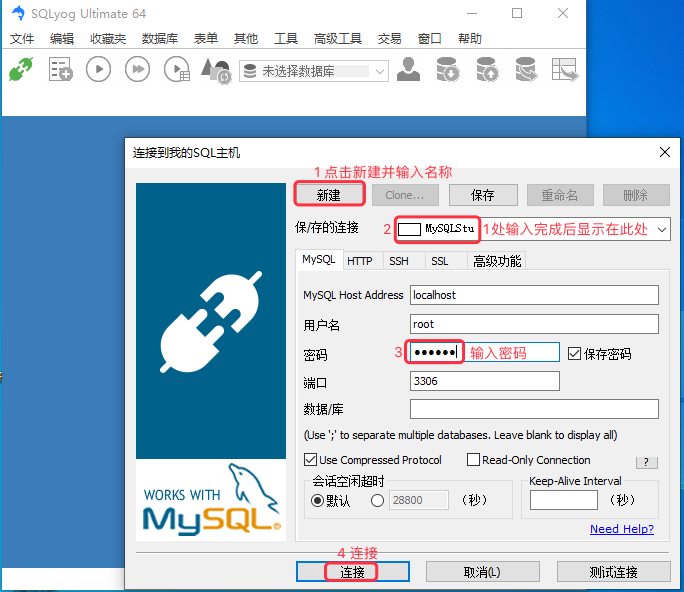

连接过程中如果出现下图中的报错信息：

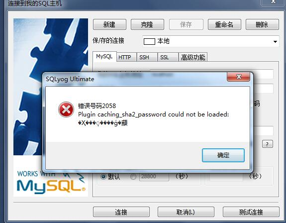

则需要先从终端使用 `mysql -u root -p` 登录到 mysql, 然后执行如下语句：

```sql
 ALTER USER 'root'@'localhost' IDENTIFIED WITH mysql_native_password BY 'password';
```

其中的 password 是 mysql 的密码。

执行完上述语句之后，我们就可以通过 Sqlyog 连接上了。

### 2.2. 插入数据

DML  全称：`Data Manipulation Language`	，即数据操纵语言，用于修改表中记录。常用关键字有：insert、delete、update

#### 2.2.1. 表中插入单条记录

* 关键词组：`insert into`

* 语法1：不指定字段，但必须按照建表顺序赋值

```sql
insert into tableName values (value1, value2, ... valueN)
```

* 语法2：指定字段，这种方式可以仅指定部分字段。

```sql
insert into tableName (colName1, colName2, ...) values (value1, value2, ...)
```

* 示例

```sql
INSERT INTO t_user VALUES("张三",23,"male",180,90);INSERT INTO t_user (userName,age,gender,height,weight) VALUES("李四",24,"female",160,45);SELECT * FROM t_user;
```

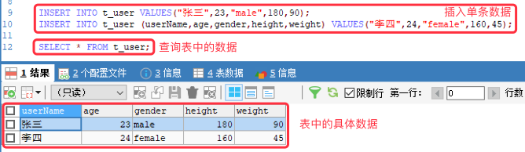

#### 2.2.2. 同时插入多条记录

* 语法格式：

```sql
insert into tableName values (value1, value2, ... valueN), (value1, value2, ... valueN), (value1, value2, ... valueN)
```

* 示例：

```sql
INSERT INTO t_user VALUES("王五",25,"male",170,80),("王二麻子",26,"male",175,70),("赵大",21,"male",170,65);
```

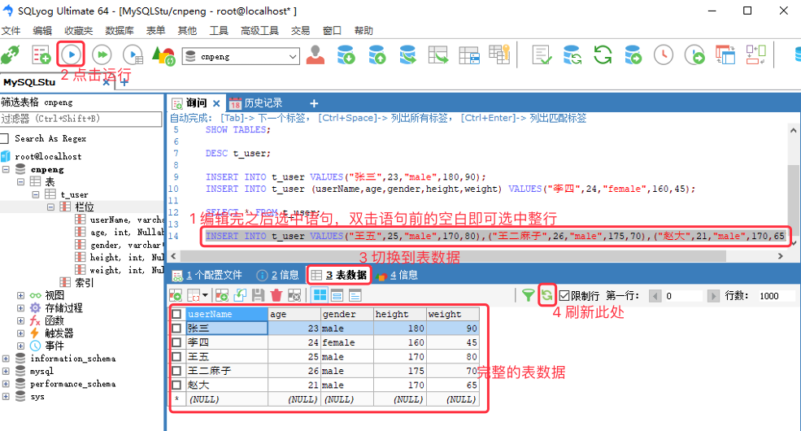

### 2.3. 删除表中记录

#### 2.3.1. 删除表中的所有记录

* 语法

```sql
// delete 是逐行删除，效率比较低。操作会记录到日志中。
delete from tableName;
// truncate 是直接删除表，然后创建一个同名空表。操作不会被记录到日志中。
truncate table tableName;
```


#### 2.3.2. 删除满足条件的记录

* 语法：（支持的条件语句参考后面的 《where 子句》 ）

```sql
delete from tableName where condition;
```

* 示例：

```sql
DELETE FROM t_user WHERE userName='王二麻子';
```

#### 2.3.3. 删除表

直接删除表时，使用 drop, 语法如下：

```sql
`drop table tableName`
```

### 2.4. 修改表中的记录

* 关键字：UPDATE
* 语法：

```sql
update tableName set colName = newValue [, colName = newValue] [where condition]
```

* 注意：**不加 where 条件的 update 语句会修改表中所有记录的相关字段数据**

示例如下：

```sql
UPDATE t_user SET gender = "female",height = 185 WHERE NAME = "张三";
```

### 2.5. where 子句

**where 子句：** 即 条件子句，对表进行操作时可以使用条件进行筛选和过滤。

#### 2.5.1. 支持的关键字

类型 | 关键字
---|---
关系运算表达式 | >、<、>=、<=、=、!=、<>
条件连接符号 | and、or、`between...and...`、[not]
模糊查询 | like
集合操作 | [not]in(set)、>any(set)、>all(set)、<any ( set )、<all ( set )

在上表中，

* `!=` 和 `<>` 都表示不等于。
* like 模糊查询时：`_` 表示匹配任意单个字符；`%` 则表示匹配任意 N 个字符，N 大于等于0.
* mysql 不支持简单的集合查询操作，但是支持子查询，是针对于 all 和 any 集合操作来说的。
* `>all(set)` 表示查询的值必须大于 set 中的全部值；`>any(set)` 表示查询的值只要大于 set 中的任意一个即可。
 
示例

```sql
// 查询 height 在 160-180 之间的数据
SELECT * FROM t_user WHERE height > 160 AND height < 180 ;

// 查询 height 在 160 和 170 之间的数据，包括 160 和 170
SELECT * FROM t_user WHERE height BETWEEN 160 AND 170 ;

SELECT * FROM t_user WHERE height = 160 OR height = 180;
```

#### 2.5.2. 对 NULL 数据进行筛选

**`IS NULL` 用来筛选为 NULL 的值，`IS NOT NULL` 用来筛选非 NULL 的值。**

先通过如下语句插入部分字段信息：

```sql
INSERT INTO t_user (userName,age,gender) VALUES ("钱二",23,"male");
```

执行之后，我们从表结构中可以看到如下样子：

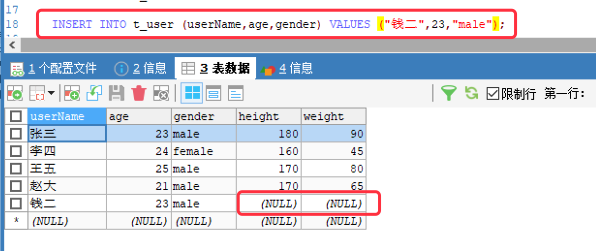

我们继续执行下面的语句——其中的 `IS NULL` 就表示筛选 NULL 数据。

```sql
DELETE FROM t_user WHERE height IS NULL;
```

执行之后，表结构如下：

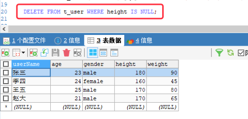

---

[基于 B 站 《好程序员大数据_Mysql核心技术》-9 整理](https://www.bilibili.com/video/BV1ut4y1y7tt?p=9)


## 3. 基本查询语句

DQL，全称 Data Query Language，即数据查询语言，用于查询表中记录。关键字：select。

### 3.1. 查询语句结构

* 完整的普通查询语句结构如下：

```sql
select [distinct] ...... from ......	 # 用于去重
	[where ......]				# 指定查询条件
	[group by ......]			# 对数据进行分组
	[having ......]				# 对分组之后的数据进行筛选
	[order by ......]			# 对数据进行排序
	[limit ......]				# 对数据进行限制
```

* 最基本的查询结构为：

```sql
select ...... from ......
```

* select 也可以用于一般的数学计算, 如：

```sql
select 1+1;
select (2+1)*3;
select 3*4/(1+2);
```

### 3.2. DQL 语句的执行顺序

* 先执行 from 子句：
	* 查询时，一定时基于表操作，因此，第一步先执行 from 子句。
* 再执行 where 子句
	* 确定表之后，使用 where 子句可以进行条件筛选或者条件过滤。
* 然后执行 group...by ：
	* 对数据进行分组查询
* 其次执行 having 语句：
	* 分组之后，还想使用条件筛选或过滤某些组的数据，就使用 having    
* 之后执行 select :
	* 此时，就需要根据业务需求选择需要的字段进行显示。
* 再执行 order by :
	* 对筛选出来的数据进行排序
* 最后执行 limit ：
	* 进行分页查询或者查询前 n 条数据。

### 3.3. 示例

#### 3.3.1. 查询全部

```sql
SELECT * FROM t_user;
```

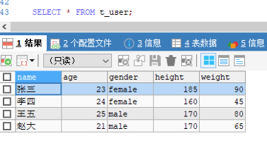

#### 3.3.2. 查询数据时指定别名

在 select 语句中，可以对表或者列起别名。指定别名时有两种格式：`字段名 别名`, `字段名 AS 别名`。

在使用汉字作为列别名时，可以加单/双引号，也可以不加。表别名不能加单/双引号。

```sql
SELECT NAME 姓名 ,age 年龄,gender AS 性别,height,weight FROM t_user;
```

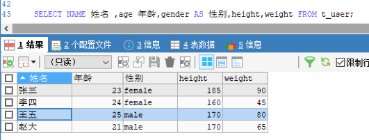

如上图，我们指定别名之后，查询结果的表格中会以别名进行显示，不再以字段名显示。

其他示例：

```sql
// 末尾的 t 是表别名
select name 姓名, (year(now())-year(birth)) 年龄 from test1 t;

// 此处的 e.empno 、e,ename、e.job 中的 e 是调用的末尾的表别名 e。
// 因为 from 先于 select 执行，所以可以这么用。而且，也可以用于 order by、limit 子句中
select e.empno 员工编号, e.ename , e.job , mgr '领导编号', hiredate, sal, comm, deptno from emp e;
```

#### 3.3.3. 其他查询示例

先创建一个 stu 表，然后插入数据。

```sql
CREATE TABLE stu( 
	stuId CHAR(10), 
	stuName VARCHAR(50), 
	age INT, 
	gender VARCHAR(50) 
);

INSERT INTO stu VALUES ("0001","zhangsan1",21,"male"); 
INSERT INTO stu VALUES ("0002","zhangsan2",22,"male");  
INSERT INTO stu VALUES ("0003","zhangsan3",23,"male");  
INSERT INTO stu VALUES ("0004","zhangsan4",24,"male");  
INSERT INTO stu VALUES ("0005","zhangsan5",25,"male");  
INSERT INTO stu VALUES ("0006","zhangsan6",26,"male"); 
 INSERT INTO stu VALUES ("0007","zhangsan7",24,"female");  
 INSERT INTO stu VALUES ("0008","zhangsan8",26,"male");  
 INSERT INTO stu VALUES ("0009","zhangsan9",20,"female"); 
 INSERT INTO stu VALUES ("0010","zhangsan10",NULL,NULL); 
```

* 查询性别为女，且年龄为24 的人

```sql
 SELECT * FROM stu WHERE gender="female" AND age = "24";
```

* 查询学号为 0001 或者名字为zhangsan1 的人

```sql
SELECT * FROM stu WHERE stuId = "0001" OR stuName = "zhangsan1";
```

* 查询学号为 0001 、0002、0003 的人

```sql
SELECT * FROM stu WHERE stuId = "0001" OR stuId = "0002" OR stuId = "0003";
// 下面这种方式不上面的方便一些
SELECT * FROM stu WHERE stuId IN('0001','0002','0003');
```

* 查询学号不是 0001 、0002、0003 的人

```sql
SELECT * FROM stu WHERE stuId NOT IN('0001','0002','0003');
```

* 查询年龄为 NULL 的记录

```sql
SELECT * FROM stu WHERE age IS NULL;
```

* 查询姓名不为 NULL 的记录

```sql
SELECT * FROM stu WHERE stuName IS NOT NULL;
```

* 查询年龄在 20 到 23 之间的人

```sql
SELECT * FROM stu WHERE age BETWEEN 20 AND 23;

SELECT * FROM stu WHERE age>=20 AND age<=23;
```

* 查询性别不是 male 的人

```sql
SELECT * FROM stu WHERE gender!='male';SELECT * FROM stu WHERE gender<>'male';
SELECT * FROM stu WHERE NOT gender = "male";
```

#### 3.3.4. 模糊查询

内容依旧基于 9.3.3 中创建的表。

* 查询姓名有9个字符的人

```sql
// 一下下划线 _ 表示一个任意字符，9个字符就需要使用 9 个下划线
SELECT * FROM stu WHERE stuName LIKE '_________';
```

* 查询姓名有 9 个字符，并且第 9 个字符为 5 的人 

```sql
SELECT * FROM stu WHERE stuName LIKE '________5';
```

* 查询姓名以字母 z 开头的人

```sql
SELECT * FROM stu WHERE stuName LIKE 'z%';
```

* 查询姓名第二个字母为 h 的记录

```sql
SELECT * FROM stu WHERE stuName LIKE '_h%';
```

* 查询姓名中包含 9 的记录

```sql
SELECT * FROM stu WHERE stuName LIKE '%9%';
```
     
---

[基于 B 站 《好程序员大数据_Mysql核心技术》-10 整理](https://www.bilibili.com/video/BV1ut4y1y7tt?p=10)

## 4. order by 子句

### 4.1. 基本语法

`order by` 对于查询出来的数据按照规则进行排序, 通常放在一个查询语句的最后部分。

语法:

```sql
order by colName [asc | desc] [, colName [asc | desc]]
```

上述语句中：`asc` 表示升序，默认就是升序；`desc` 降序。

### 4.2. 示例

先创建一个员工表，并添加数据：

```sql
CREATE TABLE emp(	empno INT,				# 员工号	ename VARCHAR(50),	# 姓名	job VARCHAR(50),		# 职位	mgr INT,					# 领导工号	hiredata DATE,			# 入职日期	sal DECIMAL(7,2),		# 薪资	comm DECIMAL(7,2),		# 奖金	deptno INT 				# 部门编号);INSERT INTO emp VALUES(7369,'SMITH','CLERK',7902,'1980-12-17',800,NULL,20);INSERT INTO emp VALUES(7499,'ALLEN','SALESMAN',7698,'1981-02-20',1600,300,30);INSERT INTO emp VALUES(7521,'WARD','SALESMAN',7698,'1981-02-22',1250,500,30);INSERT INTO emp VALUES(7566,'HONES','MANAGER',7839,'1981-04-02',2975,NULL,20);INSERT INTO emp VALUES(7654,'MARTIN','SALESMAN',7698,'1981-0928',1250,1400,30);INSERT INTO emp VALUES(7698,'BLAKE','MANAGER',7839,'1981-05-01',2850,NULL,30);INSERT INTO emp VALUES(7782,'CLERK','MANAGER',7839,'1981-06-09',2450,NULL,10);
INSERT INTO emp VALUES(7788,'ABC','CLERK',7698,'1988-09-02',2450,300,20);INSERT INTO emp VALUES(7839,'DEF','PRESIDENT',NULL,'1988-07-02',5000,NULL,10);
```

示例：

```sql
# 查询员工表中的所有信息，按照工资降序排列
SELECT * FROM emp ORDER BY sal DESC;

# 查询员工表中的所有员工信息，按照工资降序排雷，如果相同，再按照奖金升序排列。
SELECT * FROM emp ORDER BY sal DESC, comm ASC;
```

---

[基于 B 站 《好程序员大数据_Mysql核心技术》-11 整理](https://www.bilibili.com/video/BV1ut4y1y7tt?p=11)

## 5. 聚合函数

### 5.1. 聚合函数介绍

聚合函数对一组值执行计算，并返回单个值，也被称为组函数。

函数 | 含义
---|---
COUNT() | 统计指定列不为 NULL 的记录行数。但是 `count(*)` 写法不会忽略 NULL 值之所在的行记录。
MAX() | 计算指定列的最大值，如果指定列是字符串类型，那么使用字符串排序运算。
MIN() | 计算指定列的最小值，如果指定列是字符串类型，那么使用字符串排序运算。
SUM() | 计算指定列的数值和，如果指定列类型不是数值类型，那么计算结果为 0。
AVG() | 计算指定列的平均值，如果指定列类型不是数值类型，那么计算结果为 0.

注意：所有的聚合函数都会忽略字段为 NULL 的那条记录。`count(*)` 写法不会忽略 NULL 值所在的行记录，通常用语统计总行数。

### 5.2. 示例

基于上一节中建立的 emp 表进行查询。

```sql
# 查询 emp 表中的记录数（一共有多少条数据）
SELECT COUNT(*) FROM emp;
# 查询 emp 表中有奖金的人数
SELECT COUNT(comm) FROM emp;
# 查询月薪和奖金之和大于 2500 的人数。IFNULL(comm,0) 表示如果 comm 为 NULL, 则取 0
SELECT COUNT(*) FROM emp WHERE (sal+IFNULL(comm,0))>2500;
# 查询有奖金的人数，以及有领导的人数
SELECT COUNT(comm),COUNT(comm) FROM emp ;
# 查看所有人的月薪和，以及奖金和。
SELECT SUM(sal) ,SUM(comm)FROM emp;
# SUM() 聚合函数会自动忽略 NULL, 所以，下面的 IFNULL(,) 可以省略
SELECT SUM(sal) ,SUM(IFNULL(comm,0))FROM emp;
# 查询所有人的月薪+奖金和
# comm 可能为 null，sal 不能与 null 运算，所以需要 IFNULL(,)
SELECT SUM(sal + IFNULL(comm,0)) FROM emp;
# 查询所有员工的平均工资。AVG 默认不统计值为 NULL 的行，如果需要统计，就需要使用 IFNULL(,)
SELECT AVG(sal) FROM emp;

# 查询所有员工的平均奖金
# AVG 自动忽略 NULL 值，所以，得到的仅是有奖金的人的平均值
SELECT AVG(comm) FROM emp;
# 如果奖金为 NULL 用 0 替代，这样得到的是全部员工的奖金平均值——不论他是否有奖金
SELECT AVG(IFNULL(comm,0)) FROM emp;

# 查询最高工资和最低工资
SELECT MAX(sal),MIN(sal) FROM emp;
```

---

[基于 B 站 《好程序员大数据_Mysql核心技术》-12 整理](https://www.bilibili.com/video/BV1ut4y1y7tt?p=12)

## 6. group by 和 having

### 6.1. group by 

某些时候，需要对数据进行分组统计其最大值、最小值、平均值、和、总数等信息，而分组查询都要和聚合函数配合使用。

**在分组查询时，只有分组字段或者聚合函数可以写在 select 子句中，其他的非分组字段不应该写在 select 子句中，** 否则会报错。

示例:

```sql
# 查询每个部门的部门编号和每个部门的工资和
select deptno, sum(sal) from emp group by deptno;

# 查询每个部门中的每种职位的最高工资、最低工资、工资之和
SELECT deptno,job, MAX(sal),MIN(sal),SUM(sal) FROM emp GROUP BY deptno,job;

# 查询每个部门的部门编号以及部门中的总人数
SELECT deptno ,COUNT(*) FROM emp GROUP BY deptno;

# 查询每个部门的部门编号以及每个部门中工资大于 1500 的人数
SELECT deptno ,COUNT(*) FROM emp  WHERE  sal>1500 GROUP BY deptno ;
```

### 6.2. having

**having 子句** ，只能使用在分组查询子句后面，起到二次过滤的作用。

having 和 where 的区别：

* having 后面可以写聚合函数，where 后面不可以写聚合函数。
* having 是对分组后的数据进行二次过滤，where 则是对分组前的数据做过滤。
	* where 对分组前的数据做过滤，如果么有满足条件的数据，将不再执行分组操作
	* having 则是对分组后的数据进行过滤，即先分组，后过滤。 

示例:

```sql

# 查询部门平均工资大于 1000 的部门编号，以及平均工资
SELECT deptno, AVG(IFNULL(sal,0)) FROM emp GROUP BY deptno HAVING AVG(IFNULL(sal,0))>1000 ;

# 查询每种职位中最高工资大于 1500 的职位、以及该职位的最高工资、平均工资、平均奖金
SELECT job, MAX(sal), AVG(IFNULL(sal,0)), AVG(IFNULL(comm,0)) FROM emp GROUP BY job HAVING MAX(sal)>1500;

```

---

[基于 B 站 《好程序员大数据_Mysql核心技术》-13 整理](https://www.bilibili.com/video/BV1ut4y1y7tt?p=13)

## 7. distinct 去重

distinct 用于过滤掉重复数据（即查询表中有哪些不同数据）。只能放在 select 关键字之后，如 :

```sql
# 查询全部部门编号（即列出所有人的所有部门编号，会有重复数据）
SELECT deptno FROM emp;

 # 查询有哪些部门编号（仅查询部门编号，会去除重复数据）
SELECT DISTINCT deptno FROM emp;
# 这种方式也能实现效果，但是略繁琐
SELECT deptno FROM emp GROUP BY deptno;
```

distinct 后面可以跟多个需要去重的条件，如：

```sql
# 这样就是一个组合条件，deptno 和 sal 只要有一项不重复的就符合条件
SELECT DISTINCT deptno, sal FROM emp;
```

---

[基于 B 站 《好程序员大数据_Mysql核心技术》-13 整理](https://www.bilibili.com/video/BV1ut4y1y7tt?p=13)

## 8. limit 分页

当一页的数据过大时，我们可以进行分页显示操作。需要注意的是，**分页查询时，一般都要先排序，然后再分页。**

语法：`limit m [, n];` , 其中：

* m 表示从第几条记录开始查询
* n 表示要查询的记录数量。
* mysql 查询出来的记录的 index 从 0 开始。
* `limit n` 表示从 0 索引开始查询 n 条记录。

示例：

```sql
# 查询工资最高的三个人
SELECT * FROM emp ORDER BY sal DESC LIMIT 3;
 
# 分页查询
# 从索引 0 开始，查询 5 条数据。
SELECT * FROM emp LIMIT 0,5;
# 从索引 5 开始，查询 5 条数据。SELECT * FROM emp LIMIT 5,5;
```

---

[基于 B 站 《好程序员大数据_Mysql核心技术》15-17 节 整理](https://www.bilibili.com/video/BV1ut4y1y7tt?p=15)

## 9. 数据完整性

### 9.1. 概念和分类

#### 9.1.1. 约束的概念

* 完整性约束条件，简称约束（constrant），用于保证表中数据的完整性和安全性。
* 约束是对表进行的一种强制性的校验规则。
* 在进行 DML 操作时，必须符合约束条件，否则不能执行。

#### 9.1.2. 约束的分类

* 实体完整性（数据唯一）
* 域完整性
* 引用完整性

### 9.2. 15.2 实体完整性

表中的一行（一条记录）对应一个实体（entity）, **实体完整性是为了保证表中每条记录唯一**。

通过 **主键约束**（primary key, 简称 PK）、**唯一性约束**（unique, 简称 UK） 的方式可以实现实体完整性。

#### 9.2.1. 主键约束

主键约束是非空约束和唯一性约束的组合形式，表示字段的值不能为 null 并且唯一。通常用作记录的唯一标识来使用。

我们把某个字段作为约束主键时，需要满足如下要求：

* 对业务需求没有实际意义的字段，如序号。
* 如果设置了主键约束，那么该字段最好不要再进行人为修改，而是自动生成。数值类型可以通过 `auto_increment` 自增
* 不建议将动态赋值的字段设置为主键，比如时间戳。

##### 9.2.1.1. 设置主键

* 为新建表设置主键

```sql
create table tableName(
	tid int primary key auto_increment,
	tname varchar(20) not null
);
```

* 对已有表格设置主键

```sql
alter table tableName add primary key (colName);
```

##### 9.2.1.2. 设置主键的示例

基于之前创建的 stu 表为例：

```sql
// 为已经存在的表设置主键
ALTER TABLE stu ADD PRIMARY KEY (stuId);

// 查看建表信息
SHOW CREATE TABLE stu;
```

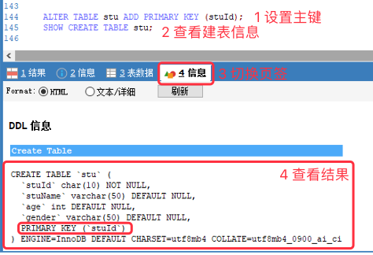

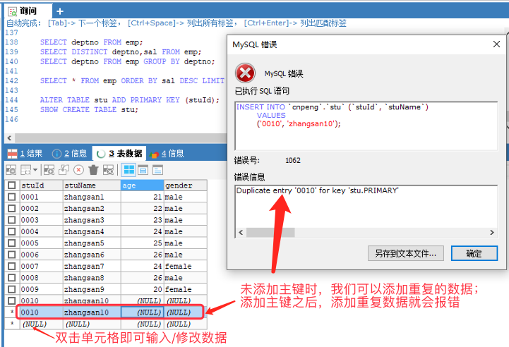

#### 9.2.2. 唯一性约束

唯一性约束的关键字是 `unique`

如果字段设置了唯一性约束，那个在表中此字段的值将不能重复，但是可以为 NULL（无穷大不等于无穷大）。

##### 9.2.2.1. 设置唯一性约束

* 为新建表设置主键

```sql
create table tableName(
	tid int ,
	tname varchar(20) not null,
	username varchar(20) unique
);
```

* 对已有表格设置主键

```sql
alter table tableName add unique (colName);
```

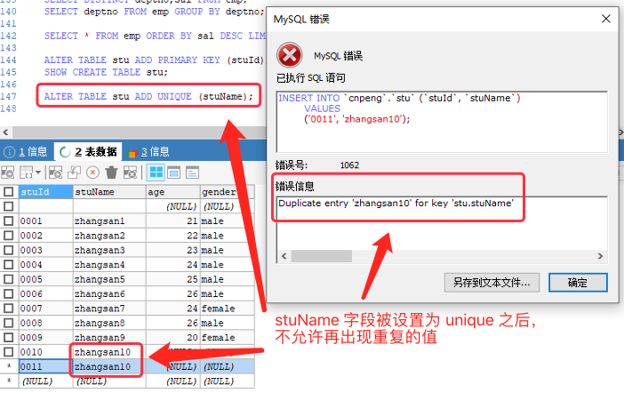

#### 9.2.3. 主键约束和唯一性约束对比

* 一个表只能有一个主键，但一个表可以有多个 unique 字段。
* 主键约束的值不能为 NULL，但是唯一约束的字段值可以为 NULL。


### 9.3. 15.3 域完整性

#### 9.3.1. 域完整性介绍

**域完整性**，即对表中每列上数据的约束。包括：

* 非空约束，`not null` 简称 NN
* 数据类型约束
* 默认值约束 DEFAULT
* 检查约束 


#### 9.3.2. 语法

* 创建新表时的写法

```sql
create table tableName(
	tid int,
	tname varchar(20) not null,
	gender char(1) default 'M'
);
```

* 为已有的表添加约束

```sql
alter table tableName modify colName type not null;
```

#### 9.3.3. 示例

```sql
# 不加 NOT NULL 的话表示可以为 null
CREATE TABLE test1 (tid INT PRIMARY KEY,tname VARCHAR(50) NOT NULL,gender CHAR(1) DEFAULT 'F');
    
# 末尾的 DEFAULT 表示取默认值
INSERT INTO test1 VALUES (1,"李四",DEFAULT);

# 未指定 gender 字段，也是使用默认值
INSERT INTO test1 (tid,tname) VALUES(2,"张三");
```

#### 9.3.4. 检查约束

检查约束，全称 check, 简称 CK.

示例：

```sql
# 检查 gender 的值是不是 F 或 M，不是则报错	
CREATE TABLE test2(	tid INT,tname VARCHAR(20),gender CHAR(1) CHECK(gender IN ('F','M')));

# 能正常插入
INSERT INTO test2 VALUES(2,"lisi","F");

# 会报错，INSERT INTO test2 VALUES(1,"zhangsan","A");
```

也可以通过枚举的方式来实现 check 的效果：

```sql
# 使用枚举
CREATE TABLE test3(	tid INT,	tname VARCHAR(50),gender ENUM('F','M'));

# 可以正常插入
INSERT INTO test3 VALUES(1,'zhangsan','F');

# 插入时会报错
INSERT INTO test3 VALUES(2,'lisi','A');
```

### 9.4. 引用完整性

#### 9.4.1. 引用完整性的概念

字段 A 的值依赖于字段 B 的值。这两个字段可以在同一张表中，也可以在不同的表中。字段 A 所在的表称之为从表（副表），字段 B 所在的表称之为 主表（父表）。字段 A 的值可以为 null，字段 B 必须为主键（即 非 null）。

如果 B 为 NULL，我们就不应该让 A 输入值，否则数据就有问题了。


#### 9.4.2. 外键约束

外键约束，全称 foreign key, 简称 FK。通过外键约束可以实现引用完整性。

* 创建新表时的写法

```sql
create table tableName(
	tid int primary key auto_increment,
	tname varchar(20),
	tmgr int,
	constraint constraintName foreign key (tmgr) references tableName(tid)
);
```

* 为已有的表添加外键约束

```sql
alter table tableName add constraint constraintName foreign key (colName) references tableName2(colName2);
```

#### 9.4.3. 示例

基于前面的 stu 表，我们再创建一个 `stu_score` 表并指定其外键：

```sql
CREATE TABLE stu_score(	id INT PRIMARY KEY AUTO_INCREMENT,	score INT,	stu_id CHAR(6),	# 指定 stu_id 为外键，它的引用为 stu 表中的 stuId 字段, 被引用的 stuId 必须是主键。	#foreign key (stu_id) references stu(stuId)	# 指定 stu_id 为外键，其引用指向 stu 表的 sid 字段，并自定义外键名为 fk_sid	CONSTRAINT fk_sid FOREIGN KEY (stu_id) REFERENCES stu(stuId));# 如果创建 stu_score 表示没有指定外键，可以使用如下方式创建外键# alter table stu_score add foreign key (stu_id) references stu(stuId);# fk_sid 是自定义的外键名# ALTER TABLE stu_score ADD CONSTRAINT fk_sid FOREIGN KEY (stu_id) REFERENCES stu(stuID);
```

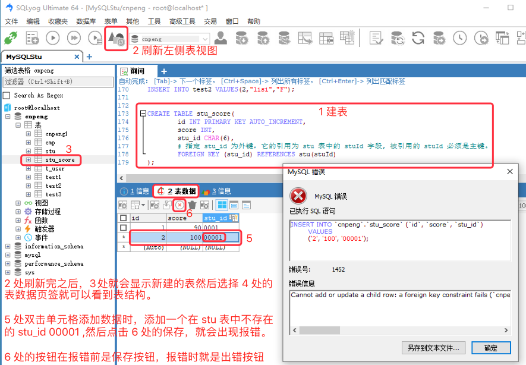

---

[基于 B 站 《好程序员大数据_Mysql核心技术》18 节 整理](https://www.bilibili.com/video/BV1ut4y1y7tt?p=18)

## 10. 多表查询

### 10.1. 简介

我们业务需求的数据可能会在一张或多张表中，这些表中通常都会存在着 “有关系” 的字段，那么，此时的查询操作就会涉及到多表查询，我们称之为 **关联查询**。

最简单的关联查询语句：

```sql
SELECT * FROM stu,stu_score;
SELECT * FROM stu JOIN stu_score;
```

### 10.2. 写法分类

在进行多表关联查询时，通常有两种写法：

* 方式1：在 from 子句中直接写多个表名，表名之间使用逗号分隔，如：

```sql
select A.* , B.*, C.* from A, B, C where 关联条件
```

* 方式2：在 from 子句中，多个表名之间使用 `join` 关键字链接，并在 `on` 关键字后面添加关联条件，如：

```sql
select A.*, B.* from A join B on 关联条件;

select A.*, B.*, C.* from A join B on AB 关联条件 join C on AC 或 BC 的关联关系;

select A.*, B.* ,C.* from A join B join C on AB 的关联条件 and BC 或 AC 的关联条件;  
```


 先创建一张部门表

```sql
CREATE TABLE dept(	deptno INT,	dname VARCHAR(14),	loc VARCHAR(13));

INSERT INTO dept VALUES (10,'ACCOUNTING','NEW YORK');

INSERT INTO dept VALUES (20,'RESEARCH','DALLAS');

INSERT INTO dept VALUES (30,'SALES','CHICAGO');

INSERT INTO dept VALUES (40,'OPERATIONS','BOSTON');
```

> 本节后面的示例内容基于前面建立的 `emp` 和 `dept` 表

### 10.3. 笛卡尔积

```sql
# 这样查询会将 emp 和 dept 中的每一条数据进行关联，从而得到 emp.行数 * dept.行数 条结果。
SELECT * FROM emp,dept; # 8
SELECT COUNT(*) FROM emp;# 4
SELECT COUNT(*) FROM dept;# 32
SELECT COUNT(*) FROM emp,dept;
```

上面语句得到的效果就称为 **笛卡尔积**。

当做关联查询时，如果两张表中不存在关联字段，或者忘记写关联条件，就会出现下图所示的情况：

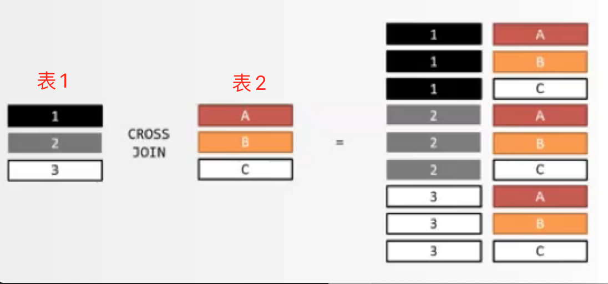

上图中，表 1 中的每一条记录都会与表 2 中的所有记录进行匹配组合。假设表 1 中有 M 条数据，表 2 中有 N  条数据，匹配组合之后得到了 `M*N` 条数据，这个 `M*N` 的积就称为 **笛卡尔积**。

### 10.4. 等值连接

在做关联查询时，使用有关系的字段进行等值条件的限制操作，我们就称之为 **等值查询**。

如：

```sql
select A.* , B.* from A, B where A.colName = B.colName;
```

```sql
# 注意，等值连接时，字段使用反引号包裹！！不是单引号，不是单引号，不是单引号！
SELECT * FROM emp,dept WHERE emp.`deptno`=dept.`deptno`;

# 也可以使用这种 join on 的形式——内连接
SELECT * FROM emp JOIN dept ON emp.`deptno` = dept.`deptno`;
```

### 10.5. Join 连接

Join 连接只支持等号连接。它分为内连接和外连接两种。

#### 10.5.1. 内连接

在多表查询时，通过 join 连接表，并且 **仅显示符合条件的数据** 的方式就称作内连接。

关键字：`[inner] join`

语法格式如下：

```sql
from tableName1 [inner] join tableName2 on 条件;
``` 

**内连接的效果和等值查询的效果一致。** 都是仅展示符合条件的数据。

#### 10.5.2. 外连接

在多表查询时，通过 join 连接表，除显示符合条件的数据外还需要把其中一张表的数据也显示出来的方式就称作外连接。

外连接的两张表分别为 **驱动表** 和 **从动表**。

外连接 (outer join ) 又分为：左外连接（left [outer] join）、右外连接（right [outer] join）、全外连接（full [outer] join）。

* 对于左/右外连接来说，**驱动表的数据都会显示，从动表的数据仅显示满足条件的数据**。
* 全外连接会显示两张表中的全部数据——但是，**mysql 不支持全外连接**。
* 左外连接中左边的表就是驱动表。
* 右外连接中右边的表就是驱动表。


语法如下：

```sql
# 左外连接：
from tableName1 left join tableName2 on 条件;

# 右外连接
from tableName1 right join tableName2 on 条件;
```

示例：

先看一下 emp 表和 dept 表中的现有数据：

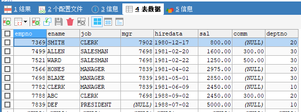

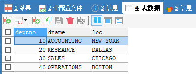

```sql
SELECT * FROM emp RIGHT JOIN dept ON emp.`deptno`=dept.`deptno`;
```

上述代码中使用的是右外连接，所以 dept 为驱动表，结果中会显示其全部数据——虽然 emp 中没有 deptno = 40 的数据，但结果中还是会显示这个部门编号：

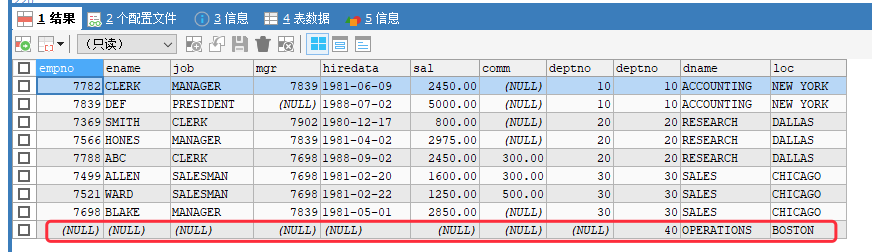

```sql
SELECT * FROM emp LEFT JOIN dept ON emp.`deptno`=dept.`deptno`;
```

上述代码中使用的是左外连接，所以 emp 为驱动表，结果中会显示其全部数据以及符合条件的 dept 中的数据——emp表中没有 deptno=40 的数据，所以 dept 中 deptno=40 的数据不会显示：

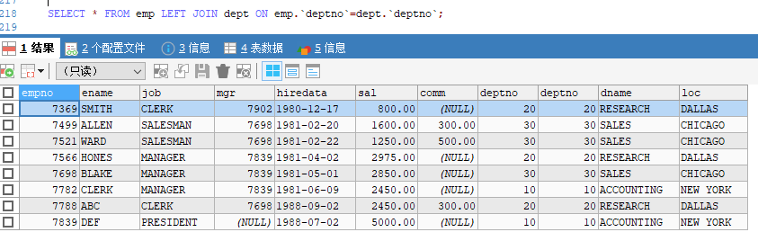

---

[基于 B 站 《好程序员大数据_Mysql核心技术》-19 整理](https://www.bilibili.com/video/BV1ut4y1y7tt?p=19)

## 11. 集合查询（union）

### 11.1. 关键字

* union 会去除重复数据
* union all 不会去除重复数据

将两个查询语句使用上述关键字链接即可实现集合查询。

注意：两个查询语句的字段名、字段个数必须一一对应。

### 11.2. 示例

查询部门编号为 10 和 20 的员工信息，与查询部门编号为 20 和 30 的员工信息相联合。

```sql
SELECT * FROM emp WHERE deptno IN (10,20) UNION SELECT * FROM emp WHERE deptno IN (20,30);
``` 

上述代码的效果如下：

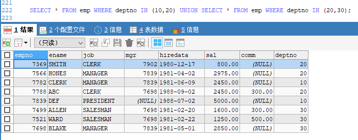

```sql
SELECT * FROM emp WHERE deptno IN (10,20) UNION ALL SELECT * FROM emp WHERE deptno IN (20,30);
```

上述代码效果如下：


```sql
# 指定查询部分字段
SELECT ename , job FROM emp WHERE deptno IN (10,20) UNION ALL SELECT ename, job FROM emp WHERE deptno IN (20,30);
```

在使用集合查询时，如果字段数量或者字段名称不一致，就会报错，如下：

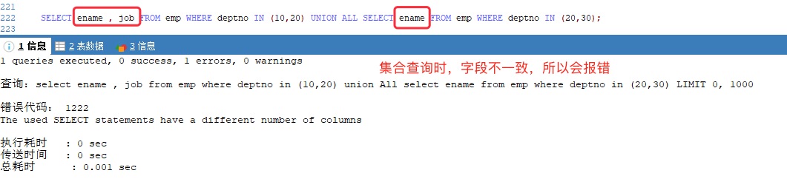

---

[基于 B 站 《好程序员大数据_Mysql核心技术》-20、21 整理](https://www.bilibili.com/video/BV1ut4y1y7tt?p=20)

## 12. 子查询

### 12.1. Where 中的子查询

* 查询工资大于员工编号为 7566 这个员工的所有员工信息：

```sql
SELECT * FROM emp WHERE sal >(SELECT sal FROM emp WHERE empno=7566);
```

* 查询工资大于 20 号部门平均工资的非 20 号部门的员工信息：

```sql
SELECT * FROM emp WHERE sal > (SELECT AVG(IFNULL(sal,0)) FROM emp WHERE deptno = 20) AND deptno != 20;
```

### 12.2. join 中的子查询

* 查询工资大于本部门平均工资的员工信息

```sql
# avgSal 是 AVG(IFNULL(sal,0)) 的别名; # 括号内 select 语句得到的也是一个表，t 是该表的别名，avgSal 就是该表中的字段SELECT emp.`ename`,emp.`empno`,t.deptno,t.avgSal FROM emp JOIN (SELECT deptno,AVG(IFNULL(sal,0)) avgSal FROM emp GROUP BY deptno) tON emp.`deptno` = t.`deptno` WHERE emp.sal > t.avgSal;
```

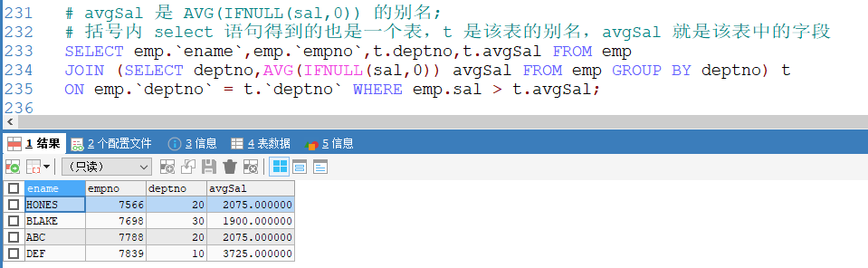

* 查询每个员工的工资、姓名及其所在部门的平均工资

```sql
SELECT emp.`ename`,emp.`sal`,t.salAvg FROM emp JOIN (SELECT deptno, AVG(IFNULL(sal,0)) salAvg FROM emp GROUP BY deptno) tON emp.`deptno`=t.deptno;
```  

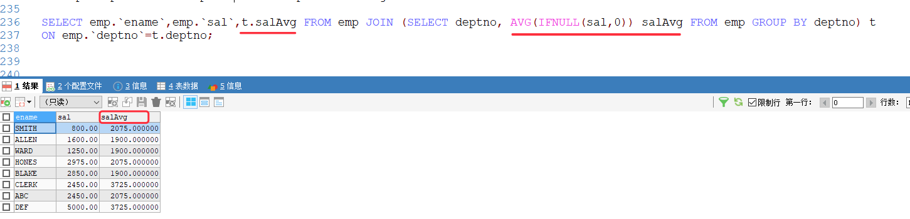

### 12.3. having 中的子查询

* 查询平均工资大于 30 号部门平均工资的部门号和平均工资

```sql
SELECT deptno,AVG(IFNULL(sal,0))FROM empGROUP BY deptnoHAVING AVG(IFNULL(sal,0))>(SELECT AVG(IFNULL(sal,0)) FROM emp WHERE emp.`deptno`=30);
```

### 12.4. select 中的子查询

* 查询每个员工的姓名、工资 及其所在部门的平均工资、工资之和

```sql
SELECT t.`ename`,t.`sal`,# 查询平均值，并为结果表设置别名 avgSal(SELECT AVG(IFNULL(sal,0)) FROM emp t1 WHERE t1.`deptno` = t.`deptno`) avgSal,# 查询工资和，并为结果表设置别名 sumSal(SELECT SUM(sal) FROM emp t2 WHERE t2.`deptno` = t.`deptno`) sumSal# 为表格设置别名 tFROM emp t;
```

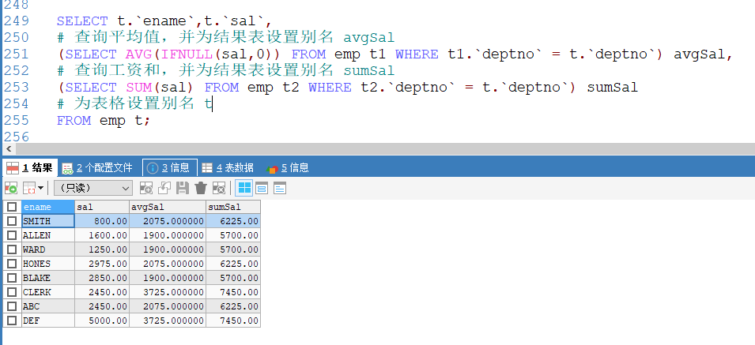

---

[基于 B 站 《好程序员大数据_Mysql核心技术》-22 整理](https://www.bilibili.com/video/BV1ut4y1y7tt?p=22)

## 13. case-when 语句

`case-when` 语句可以做一些简单的分支逻辑，类似于 `if-else` 和 `switch-case`.

语法：

```sql
case [colName] when 条件1 then 值1
			     when 条件2 then 值2
			     ......
			     else 值n
			     end
```

* 查询员工的信息，及其工资等级（>=5000 第一等级，>=3000 第二等级，>=1000 第三等级，其他等级 ）

```sql
# case 中指定一个条件
SELECT *,CASE 	# 注意末尾没有逗号	WHEN sal>=5000 THEN '第一等级'	WHEN sal>=3000 THEN '第二等级'	WHEN sal>=1000 THEN '第三等级'	ELSE '其他'	# levels 是指定的描述文本的字段名称——别名	END levelsFROM emp;
```

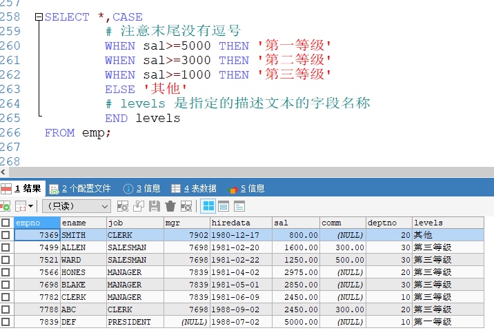

* 查询员工表中的姓名、部门（显示效果如：10 第一部门，20 第二部门，30 第三部门，其他）

```sql
# case 中指定一个具体的值
SELECT ename,CASE deptno	WHEN 10 THEN '第一部门'	WHEN 20 THEN '第二部门'	WHEN 30 THEN '第三部门'	ELSE '其他'	ENDFROM emp;
```

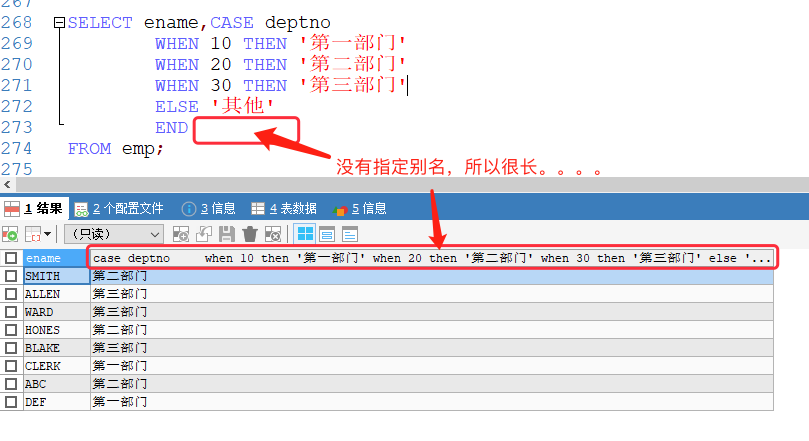

```sql
SELECT ename,CASE deptno	WHEN 10 THEN '第一部门'	WHEN 20 THEN '第二部门'	WHEN 30 THEN '第三部门'	ELSE '其他'	END levelsFROM emp;
```

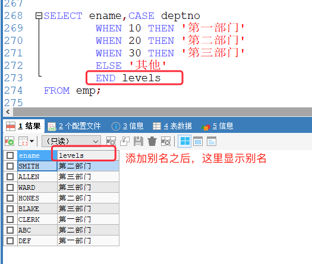

---

[基于 B 站 《好程序员大数据_Mysql核心技术》-23 整理](https://www.bilibili.com/video/BV1ut4y1y7tt?p=23)

## 14. 日期函数

### 14.1. 获取日期的函数

* 获取当前系统时间的函数
	* `curdate()`、
	* `curtime()`、
	* `now()`、
	* `sysdate()`、
	* `current_timestamp()`

* 获取星期几的函数
	* `dayofweek(date)`  1=星期天，1~7
	* `weekday(date)`  0=星期一
	* `dayname(date)` 0~6

* 获取第几天的函数
	* `dayofmonth(date)`
	* `dayofyear(date)`
	* `monthname(date)`

* 截取时间分量函数
	* `year(date)`
	* `month(date)`
	* `day(date)`
	* `hour(date)`
	* `minute(date)`
	* `second(date)`

* 日期格式化函数
	* `date_format(date, format)` 根据 format 字符串格式化 date 值
	* `%Y` 年、`%m` 月、`%d` 日、`%h` 时、`%i` 分、`%s` 秒、`%p` 上下午、`%W` 星期

### 14.2. 示例：

#### 14.2.1. 获取系统时间

```sql
SELECT CURDATE();
```	

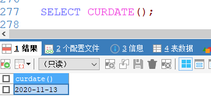

---

```sql
SELECT CURTIME();
```

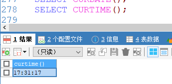

---

```sql
SELECT NOW();
```

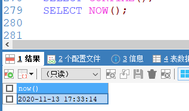

---	

```sql
SELECT SYSDATE();
```

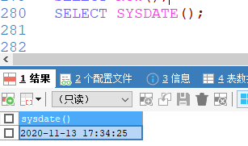

---	

```sql
SELECT CURRENT_TIMESTAMP();
```

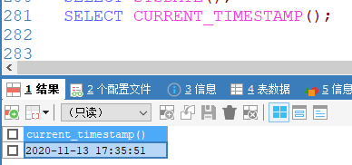

#### 14.2.2. 获取星期几

```sql
# 星期天对应 1
SELECT DAYOFWEEK(NOW());
```

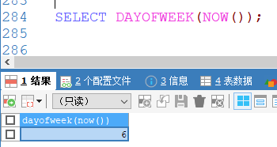

---	

```sql
# 星期一是0
SELECT WEEKDAY(NOW());
```

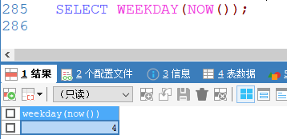

---	

```sql
SELECT DAYNAME('2020-11-13');
```

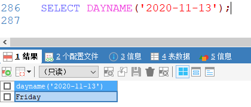

#### 14.2.3. 第几天

```sql
SELECT DAYOFMONTH(NOW());
```


---	

```sql
SELECT DAYOFYEAR(NOW());
```

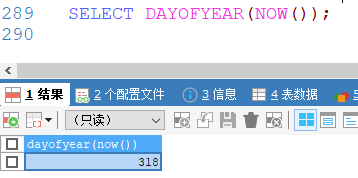

---	

```sql
SELECT MONTHNAME(NOW());
```

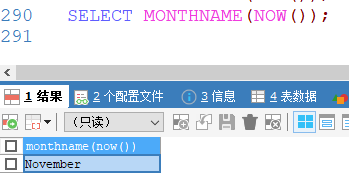

#### 14.2.4. 时间分量

```sql
SELECT YEAR(NOW()),MONTH(NOW()),DAY(NOW()),HOUR(NOW()),MINUTE(NOW()),SECOND(NOW());
```

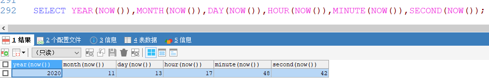

#### 14.2.5. 格式化

```sql
SELECT DATE_FORMAT(NOW(),'%Y%m%d %h:%i:%s %p %w');
```

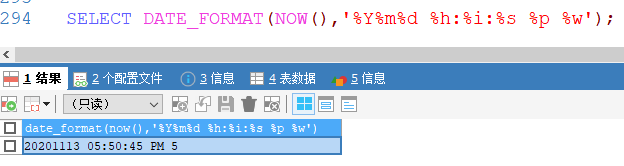

### 14.3. 日期运算函数


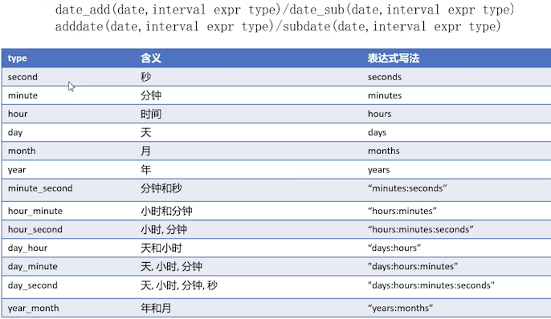


#### 14.3.1. 日期加

```sql
SELECT DATE_ADD(NOW(),INTERVAL 3 DAY)
```

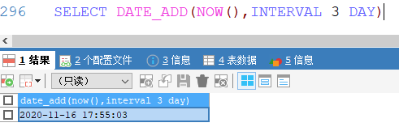

---	

```sql
SELECT ADDDATE(NOW(),INTERVAL 3 DAY);
```

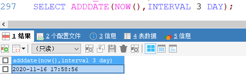

#### 14.3.2. 日期减

```sql
SELECT DATE_SUB(NOW(),INTERVAL 3 MONTH);
```

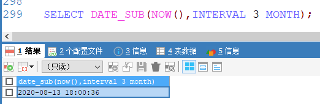

---	

```sql
SELECT SUBDATE(NOW(),INTERVAL 3 MONTH);
```


#### 14.3.3. 补充：获取日期差值

[MySQL DATEDIFF() 函数](https://www.w3school.com.cn/sql/func_datediff_mysql.asp)

```sql
-- 查询两个日期之间的时间差。值为 后者-前者 。 返回 ：-873
SELECT DATEDIFF('20150605','2017-10-25') AS diffDate

-- DATEDIFF 只计算日期部分 返回：-873
SELECT DATEDIFF('20150605091011','2017-10-25') AS diffDate

-- 计算当前日期(2021-02-26)和 2020-01-01 间的时间差值。 返回：422
SELECT DATEDIFF(NOW(),'2020-01-01') AS diffDate
```

#### 14.3.4. 补充：取出日期中的节点

格式：[EXTRACT(unit FROM date)](https://www.w3school.com.cn/sql/func_extract.asp)

其中，date 为合法的日期，unit 单位的取值如下：

* MICROSECOND
* SECOND
* MINUTE
* HOUR
* DAY
* WEEK
* MONTH
* QUARTER
* YEAR
* SECOND_MICROSECOND
* MINUTE_MICROSECOND
* MINUTE_SECOND
* HOUR_MICROSECOND
* HOUR_SECOND
* HOUR_MINUTE
* DAY_MICROSECOND
* DAY_SECOND
* DAY_MINUTE
* DAY_HOUR
* YEAR_MONTH

示例：

```sql
-- 获取当前日期(2021-02-26)中的天.返回：26
SELECT EXTRACT(DAY FROM NOW()) AS DAY
-- 获取当前日期(2021-02-26)中的月.返回：2
SELECT EXTRACT(MONTH FROM NOW()) AS MONTH
-- 获取当前日期(2021-02-26)中的年.返回：2021
SELECT EXTRACT(YEAR FROM NOW()) AS YEAR
```


#### 14.3.5. 补充：获取 date 对象中的日期

[DATE(date)](https://www.w3school.com.cn/sql/func_date.asp) 函数返回日期或日期/时间表达式的日期部分。

```sql
-- 返回日期对象中的 date
SELECT DATE(NOW()) AS date
SELECT DATE('2021-02-26 15:39:42 345') AS date
```


---

[基于 B 站 《好程序员大数据_Mysql核心技术》-24 整理](https://www.bilibili.com/video/BV1ut4y1y7tt?p=24)

## 15. 字符串函数

### 15.1. 字符串函数介绍

字符串函数包括如下：

* 进制转换函数
	* `conv(n,from_base,to_base)` 将 `from_Base` 表示的数 n 改为 `to_base` 表示

* 拼接函数
	* `concat(str1, str2, ...)` 将多个参数拼接成一个字符串，只要有一个为 null，则返回 null

* 补位函数
	* `lpad(str, len, padstr)` 用字符串 padstr 填补到 str 的左端，直到字符串长度为 len 并返回
	* `rpad(str, len, padstr)`  用字符串 padstr 填补到 str 的右端，直到字符串长度为 len 并返回

* 截取函数
	* `left(str, len) / right(str, len)` 返回字符串 str 的左端/右端 len 个字符
	* `substring(str, pos[,len])` 返回字符串 str 中从 pos 起的 len 个字符，**该函数下标从 1 开始**。 

* 字符串长度函数
	* `length(str) / octet_length(str)` 返回参数对应的默认字符串的所有字节数。
	* `char_length(str) / character_length(str)` 返回字符串 str 的字符长度

* 去空格函数
	* `ltrim(str) / rtrim(str) / trim(str)` 去除 str 指定位置的空格。

* 大小写转换函数
	* `lcase(str) / lower(str) / ucase(str) / upper(str)` 返回 str 的大小写

* 替换函数
	* `replace(str, from_str, to_str)` 用字符串 `to_str` 替换字符串 str 中的子串 `from_str` 并返回。
	* `insert(str, pos, len, newstr)` 把字符串 str 由位置 pos 起 len 个字符替换为 newstr 并返回。   

### 15.2. 示例

```sql
# 将 10 进制的 6 转换成 2 进制
SELECT CONV(6,10,2)
```	


```sql
# 字符串拼接
SELECT CONCAT('hello','world');
```


```sql
# 字符串补位
SELECT LPAD('aaabbbccc',12,'k'),RPAD('aaabbbccc',12,'mm');
```


```sql
# 截取
SELECT LEFT('aaabbbccc',6),RIGHT('helloworld',5);
```


```sql# 从第6个字符开始，截取到最后
SELECT SUBSTRING('helloworld',6);
```


```sql
SELECT SUBSTRING('helloworld',6,3)
```


```sql
# 字符串所占的字节长度
SELECT LENGTH('你好'),OCTET_LENGTH('大家好');
```


```sql
# 字符长度
SELECT CHAR_LENGTH('你好'),CHARACTER_LENGTH('大家好');
```


```sql
# trim 去除空格
SELECT LTRIM('  hello'),RTRIM('world   '),TRIM('  good   ');
```


```sql
# 大小写
SELECT LCASE('ABC'),LOWER('ABC'),UCASE('abc'),UPPER('abc');
```


```sql
# 替换
SELECT REPLACE('hello world','world','hello');
```


```sql
# 插入. 从第 7 个字符开始，数 3 个替换成 aaa
SELECT INSERT ('hello world',7,3,'aaa')
```


---

[基于 B 站 《好程序员大数据_Mysql核心技术》-25 整理](https://www.bilibili.com/video/BV1ut4y1y7tt?p=25)

## 16. 数值函数

### 16.1. 数值函数介绍

* 幂函数
	* `pow(x,y) / power(x,y)`  返回 x 的 y 次幂
* 平方根函数
 	* `sqrt(n)` 返回非负数 n 的平方根	
* 圆周率函数
 	* `pi()` 返回圆周率 	
* 随机函数
	* `rand() / rand(n)` 返回在范围 0 到 0.1 内的随机浮点值（可以使用数组 n 作为随机种子）
* 截取函数
 	* `truncate(n,d)` 保留数字 n 的 d 为小数	
* 求最大、最小值
 	* `least(x,y,...) / greatest(x,y,...)`		
* 取模函数（取余）
 	* `mod(n,m)` 取模运算，返回 n 被 m 除的余数（同 `%` 操作符）
* 向上/向下去整
	* `ceiling(n) / floor(n)` 
* 四舍五入函数
	* `round(n,d)` 返回 n 的四舍五入值，保留 d 为小数（d 的默认值为 0 ） 
 		 	
### 16.2. 示例

```sql
# 计算 2 的 3 次幂
SELECT POW(2,3),POWER(2,3);
```


```sql
# 开平方
SELECT SQRT(4);
```


```sql
# π 值
SELECT PI();
```


```sql
# 随机数
SELECT RAND(),RAND(5);
```


```sql
# 截取
SELECT TRUNCATE(123.456,2);
```


```sql
# 最小值和最大值
SELECT LEAST(12,3,45,6,7),GREATEST(99,123,34,6);
```


```sql
# 取余
SELECT MOD(5,4);
```


```sql
# 向上/向下取整
SELECT CEILING(12.6),FLOOR(12.6);
```


```sql
# 四舍五入
SELECT ROUND(23.72),ROUND(23.12);
```


```sql
# 四舍五入并保留一位小数
SELECT ROUND(23.72,1);
```


---


