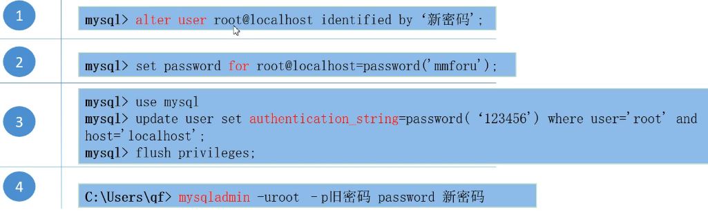
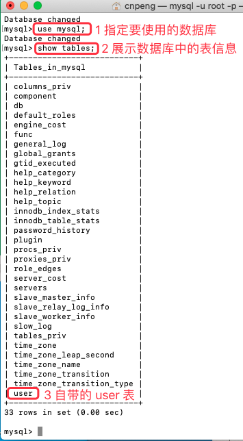
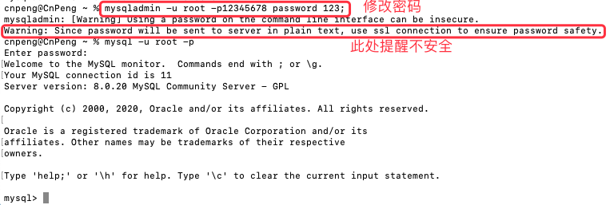

[基于 B 站 《好程序员大数据_Mysql核心技术》-4 整理](https://www.bilibili.com/video/BV1ut4y1y7tt?p=4)

## 4.1 修改密码的方式总览



### 4.1.1 `alter user`

这种方式需要先使用当前密码登录到 mysql 系统中，也就是说，需要先执行 `mysql -u root -p` 命令。然后在终端中输入如下命令：

```
alter user root@localhost identified by '123';
```

上述命令的含义是将密码重置为 123。需要注意，**新密码需要使用单引号包裹，语句末尾有分号**。

上述命令执行成功之后，输入 `exit;` 退出 mysql 系统，然后重新登录时就需要输入新的密码了。


### 4.1.2 `set password`

这种方式也需要先使用当前密码登录到 mysql 系统中，也就是说，需要先执行 `mysql -u root -p` 命令。然后在终端中输入如下命令：

```
set password for root@localhost = '123456';
```

注意：在视频中，这种方式的 `=` 右边使用了 `password('123456');` 这种方式，但是，在 MAC  端的 8.0.20 版本下，不需要 `password()`, 直接赋值即可，也就是上面的书写方式。

### 4.1.3 `update user`

> **注意，这种方式有问题，在 MAC  端的 8.0.20 版本下修改完成之后，退出在登录时不论输入新密码还是旧密码都无法登录，暂时不确定是不是系统差异导致的。该方法慎用。**

这种方式实际是修改了 mysql 自带的 `mysql` 数据库中的 `user` 表中的信息，该 `user` 表中存储了所有的用户信息。该表中包含 `User` 和 `authentication_string` 字段，分别表示用户名和密码。

登录 mysql 之后，先通过 `user mysql;` 指定要使用的数据库：



通过 `update` 命令修改密码:

```
 update user set authentication_string = '123' where User = 'root' and Host = 'localhost';
```

注意：在视频中，使用的是 `authentication_string = password('123456');` ，但是，在 MAC  端的 8.0.20 版本下，这样写会报错，拿掉 `password()` 直接赋值则不会报错，也就是上面的书写方式。


最后再输入 ` flush privileges;` 命令确保上面的 update 语句生效。

### 4.1.4 `mysqladmin`

这种方式不需要先登录 mysql，直接在终端中输入命令即可。但该方式也需要先配置环境变量。

```
 mysqladmin -u root -p12345678 password 123; 
```

注意：

* `-p` 和旧密码之间不需要空格，`password` 和新密码之间需要空格。 
* 执行该命令之后，还需要输入旧密码进行确认。
* 该方式是不安全的，不推荐使用。




## 4.2 绕过密码

> 注意，视频中介绍的方法已经不好使了，所以，此处不再记录。。。SQL8 之后已经

密码全部忘记了的时候，可以使用该方式。

注意：

* MAC  下默认没有 `cni` 或 `ini` 文件，因为已经使用了最优配置。具体参考：[Mac下MySQL的my.cnf配置文件在哪](https://blog.csdn.net/qq_31708763/article/details/104357798)
* Windows 端 5.7 版本之后默认没了 `my.cnf` , 而 `my.ini` 是在 `C:\ProgramData\MySQL\MySQL Server 8.0` 目录中（最后的 8.0 是版本号 ）