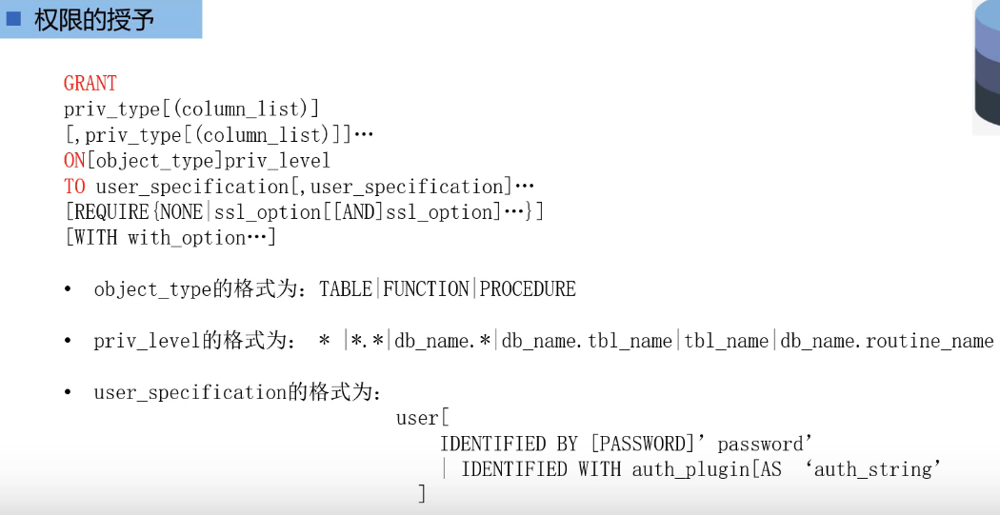
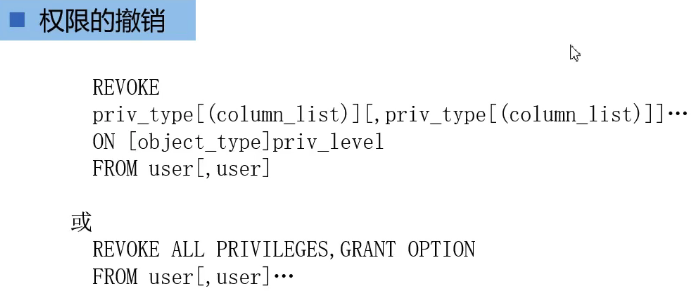
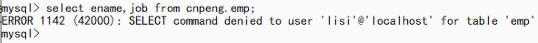

[基于 B 站 《好程序员大数据_Mysql核心技术》-26 整理](https://www.bilibili.com/video/BV1ut4y1y7tt?p=26)

## 1. 用户账号管理

### 1.1. 用户介绍

MySql 的用户账号及相关信息存储在 `mysql` 数据库的 `user` 表中, 对应用户名的字段是 `user`.

`root` 用户是由系统创建的，并且被赋予了操作和管理 MySql 的所有权限。

### 1.2. 创建用户的语法

创建用户账号的语法格式：

```sql
CREATE USER user_specification [, user_specification] ...
```

其中，`user_specification` 的格式为：

```sql
user
	[
		IDENTIFIED BY [PASSWORD] 'password'
		| IDENTIFIED WITH auth_plugin[AS 'auth_string'] 
	]
```

### 1.3. 案例

#### 1.3.1. 创建用户

添加两个新的用户，用户名分别为 `zhangsan` 和 'lisi' ，他们的主机名均为 `localhost`, 用户 `zhangsan` 的口令设置为 `123` ; 用户 `lisi` 的口令设置为使用 `md5()` 函数对 `456` 加密之后的散列值。

> 原视频中使用 `password("456")` 加密，但新版本中，该函数已经不存在了，只能使用 `md5("456")` 

以下内容在终端（命令行）中输入：

```sql
# 登录 root 用户
mysql -u root -p 

# 切换到 mysql 数据库
use mysql;

# md5 加密，得到加密后的数据为： 250cf8b51c773f3f8dc8b4be867a9a02
select md5("456");

# 创建用户名和密码
 create user "zhangsan" @localhost identified by "123",    	"lisi" @localhost identified by "250cf8b51c773f3f8dc8b4be867a9a02";
    	
# 查看 user 表中的用户和对应的主机名
SELECT HOST,USER FROM USER;  	
``` 

#### 1.3.2. 删除用户

语法：`DROP USER user1 [, user2]...`

```sql
# 删除用户李四
 drop user lisi@localhost;
```

#### 1.3.3. 修改用户账户

语法：`RENAME USER oldUser1 to newUser1 [, oldUser2 to newUser2] ...`

注意：如果旧账户不存在或者新账户已经存在，就会报错。

```sql
# 将 zhangsan 修改为 lisi
RENAME USER zhangsan@localhost TO lisi@localhost;
```

#### 1.3.4. 修改用户口令

语法：

```sql
SET PASSWORD [FOR user] = {
	PASSWORD('new_password')
	| 'encrypted password'
}
```

上述语法中，如果省略 `for` 子句表示修改当前登录用户的口令。

示例：

```sql
# 修改 lisi 的密码为 456
SET PASSWORD FOR 'lisi'@localhost = '456';
```

---

[基于 B 站 《好程序员大数据_Mysql核心技术》-27、28 整理](https://www.bilibili.com/video/BV1ut4y1y7tt?p=27)

## 2. 账户权限管理

### 2.1. 授予权限

#### 2.1.1. 授予权限的语法



* `priv_type` 操作名称，如：select 、del 等
* `object_type` 取值为：TABLE 、 FUNCTION 、PROCEDURE，分别代表：表、函数、存储过程
* `priv_level` 的取值为：`*`——当前数据库中的所有表，`*.*`——所有数据库中的所有表，`db_nam.*`——某个数据库中的所有表，`db.name.tbl_nam`——某个数据库中的某个表或视图，`tbl_nam`——表或视图，`db_nam.routine_name`——某个数据库中的存储过程或者函数。
* `user_spefification` 的格式为：

```sql
user [
	IDENTIFICATION BY [PASSWORD] 'password'
	| IDENTIFIED WITH auth_plugin [AS] 'auth_string'
]
``` 

* `with_option` 的格式为： 

```sql
GRANT OPTION
| MAX_QUERIES_PER_HOUR count
| MAX_UPDATES_PER_HOUR count
| MAX_CONNECTIONS_PER_HOUR count
| MAX_USER_CONNECTIONS count
```

#### 2.1.2. 示例

授予用户 lisi 在数据库 `cnpeng ` 中 `emp` 表中拥有对 `ename ` 和 `job ` 列的 select 权限：

```sql
# 授予权限——注意，此处的 lisi 加了引号
GRANT SELECT (ename,job) ON cnpeng.`emp` TO 'lisi'@localhost;

# 新开一个终端窗口，并依次执行如下命令：
# 登录
mysql -u lisi -p

# 查询 emp 中的指定字段，查询未授权的权限时会报错
select ename,job from cnpeng.emp;

# 下面这样写会报错，因为仅授予了其 ename 和 job 的查询权限。
# select * from cnpeng.emp;
``` 

### 2.2. 权限撤销

#### 2.2.1. 语法




#### 2.2.2. 示例

回收用户 lisi 在 cnpeng 数据库中对 emp 表的 select 权限。

```sql
# 撤销 lisi 对 cnpeng 库中 emp 表的 select 权限，注意：此处的 lisi 没有加引号。
REVOKE SELECT ON cnpeng.`emp` FROM lisi@localhost;
```

撤销权限之后，再执行查询就会报错了，如下图：

