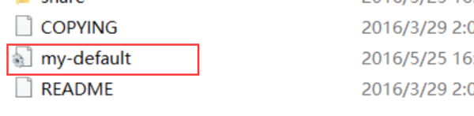
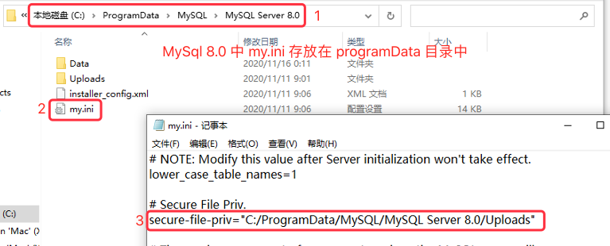
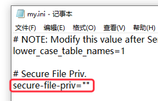
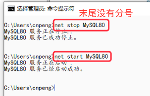
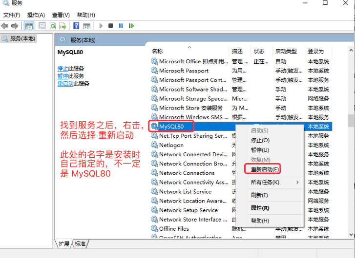
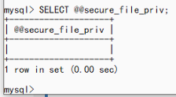
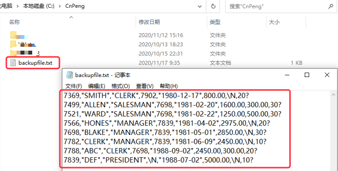
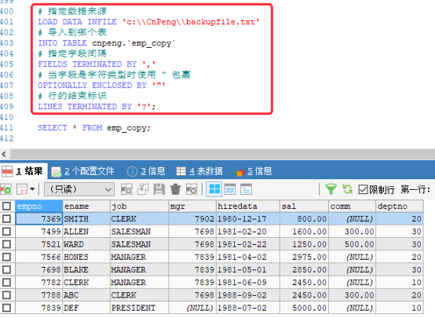
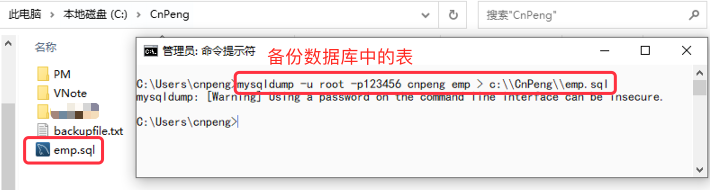

[基于 B 站 《好程序员大数据_Mysql核心技术》-29 整理](https://www.bilibili.com/video/BV1ut4y1y7tt?p=29)

# 25.数据库的备份与恢复

## 25.1 使用 SQL 语句备份与恢复表数据

### 25.1.1 语法

* `SELECT INTO...OUTFILE` 备份语句

```sql
# 这种方式可以指定数据字段等的分割符
SELECT * INTO OUTFILE 'file_name' [ character set charset_name ] export_options 

# 这种方式导出的文件中，数据和数据之间没有任何分割符号，是紧挨着的
SELECT * INTO  DUMPFILE 'file_name'
```

`export_options` 的格式为：

```sql
FIELDS [
	# 指明字段间的分割符，默认 /t
	[ TERMINATED BY 'string']
	# 字符类型的数据使用什么包裹, 默认空格
	[[ OPTIONALLY] ENCLOSED BY ‘char’]
	# 指定转义字符，默认 /
	[ESCAPED BY 'char']
]
# 指定数据行的结束标记, 默认换行，即 /n
[LINES TERMINATED BY 'string']
```


* `LOAD DATA...INFILE` 恢复语句

```sql
# 从 filename.txt 文件中加载备份数据，LOW_PRIORITY 表示延时执行加载，CONCURRENT 表示加载数据时，其他线程也可以同时使用该表中的数据。local 表示文件在本地的路径，不指定时，文件必须来自服务器。
LOAD DATA [LOW_PRIORITY | CONCURRENT] [LOCAL] INFILE 'filename.txt'
# 与原有数据重复时替换或者跳过
[REPLACE | IGNORE]
# 将数据加载到指定的表
INTO TABLE tb_name
[FIELDS
	[TERMINATED BY 'string']
	[[OPTIONALLY] ENCLOSED BY 'char']
	[ESCAPED BY 'char']
]
[LINES
	# 指定数据前缀，数据前缀及其前面的内容不会被导入到数据表中
	[STARTING BY 'string']
	# 指定一行的结束标记
	[TERMINATED BY 'string']
]
# 忽略备份文件中的前若干行
[IGNORE number LINES]
# 如果仅载入表中的部分列，或者文件中值的顺序和原表列的顺序不一致时需要指定的列名或用户变量
[(col_name_or_user_var, ...)]
# 在导入数据的时候修改表中某列的值
[SET col_name=expr, ...]
```


### 25.1.2 修改配置文件

在初次执行导入导出操作时，我们必须先从 `my.ini` 文件中修改 `secure-file-priv` 目录，否则会报如下错误：

```sql
ERROR 1290 (HY000): The MySQL server is running with the --secure-file-priv option so it cannot execute this statement
```	

#### 25.1.2.1 查找并修改 `my.ini`

MySql 数据库的安装可以分为两种方式：解压方式和安装方式。

两者的区别在于：如果是安装方式，通常会运行一个 向导 程序，当按照向导，一步步完成，mysql 会配置完成，并生成 `my.ini`, 该文件可能会在 `C:\Program Files\MySQL\MySQL Server 8.0` 目录下，也可能会在 `C:\ProgramData\MySQL\MySQL Server 8.0` 目录下。

而 解压方式，解压完成后并没有向导程序，因此需要手动完成 mysql 的配置。在早期版本的解压包中提供了一个默认的`my-default.ini` 配置文件，如下图：



将上面的 `my-default.ini`（由于系统的设置，没有显示 `.ini` 的扩展名) 复制一份，并将副本重命名为 `my.ini` 的文件即可——如果直接改名可能会出错。

> MySQL 两种安装方式的区别摘自 [《编辑mysql配置文件my.ini 可我的mysql里边没有my.ini》](https://zhidao.baidu.com/question/307669939405298324.html?qbl=relate_question_1)。注意：MySql 8.0 版本中，解压包中并没有发现  `my-default.ini` 文件。

找到 `my.ini` 文件之后，我们可以看到 `secure-file-priv` 的当前值，如下图：

 

将上面的值改为 `""` ，或者改为自定义的一个目录。（`""` 表示任意目录；指定目录后，导出和导入时仅能操作该目录下的文件。）。



#### 25.1.2.2 重启 MySql 服务

重置服务有两种方式，一种是命令方式，一种是直接从服务管理器中。

##### 25.1.2.2.1 命令重启服务

关闭服务的命令为：`net stop MySQL80`, 开启服务的命令为 :`net start MySQL80`。其中，服务名 `MySQL80` 是在安装时指定的，如果忘记了可以从服务管理器中查看（参考后面从服务管理器中重启服务的内容）。命令重启具体如下图



##### 25.1.2.2.2 服务管理器中重启服务

Win10 系统中先按下 `Windows + R` 快捷键，调出运行窗口，输入 `services.msc` , 然后确定，


从新打开的服务列表页面找到 MySQL 服务，



#### 25.1.2.3 补充

`SELECT @@secure_file_priv;` 命令可以查看当前  `secure-file-priv` 指向的目录。



### 25.1.3 示例

备份数据库 cnpeng 中 emp 表的全部数据到 c 盘的 backup 目录的 backup.txt 文件中，如果字段是字符需要用双引号标注，字段之间使用逗号隔开，每行以问号为结束标记。然后将备份后的数据导入到一个和 emp 表结构相同的空表中，表名为 `emp_copy`。

#### 25.1.3.1 导出数据:

```sql
# 导出 emp 中的全部数据
SELECT * FROM cnpeng.`emp`
# 导出到指定文件。注意此处目录使用的是 \\ , 目录下不能有重名文件，否则报错。
INTO OUTFILE 'C:\\CnPeng\\backupfile.txt'
# 指定字段间隔
FIELDS TERMINATED BY ','
# 当字段是字符类型时使用 “ 包裹
OPTIONALLY ENCLOSED BY '"'
# 行的结束标识
LINES TERMINATED BY '?';
```



#### 25.1.3.2 导入数据到 `emp_copy` 表中:

##### 25.1.3.2.1 复制表

参考：[MySQL 复制表](https://www.runoob.com/mysql/mysql-clone-tables.html)

```sql
# 只复制表结构到新表——方式1
create table 新表 select * from 旧表 where 1=2
# 只复制表结构到新表——方式2
create table 新表 like 旧表 

# 复制表结构及数据到新表——方式1
create table新表 select * from 旧表 
# 复制表及其数据——方式2
CREATE TABLE targetTable LIKE sourceTable;
INSERT INTO targetTable SELECT * FROM sourceTable;

# 可以拷贝一个表中其中的一些字段:
CREATE TABLE newadmin AS(
    SELECT username, password FROM admin
)

# 可以将新建的表的字段改名:
CREATE TABLE newadmin AS(  
    SELECT id, username AS uname, password AS pass FROM admin
)

# 可以拷贝一部分数据:
CREATE TABLE newadmin AS(
    SELECT * FROM admin WHERE LEFT(username,1) = 's'
)

# 可以在创建表的同时定义表中的字段信息:
CREATE TABLE newadmin(
    id INTEGER NOT NULL AUTO_INCREMENT PRIMARY KEY
) AS (
    SELECT * FROM admin
)  
```

##### 25.1.3.2.1 导入数据

```sql
# 复制表结构方式1
CREATE TABLE emp_copy LIKE emp;

# 指定数据来源
LOAD DATA INFILE 'c:\\CnPeng\\backupfile.txt'
# 导入到哪个表
INTO TABLE cnpeng.`emp_copy`
# 指定字段间隔
FIELDS TERMINATED BY ','
# 当字段是字符类型时使用 “ 包裹
OPTIONALLY ENCLOSED BY '"'
# 行的结束标识
LINES TERMINATED BY '?';

SELECT * FROM emp_copy;
```



## 25.2 使用 MySql 命令实现数据备份与恢复

其他参考：[MySQL数据备份与还原(mysqldump)](https://www.runoob.com/mysql/mysql-database-export.html)

### 25.2.1 使用 mysqldump 备份数据

注意： 打开终端后直接输入以下命令即可，不需要登录到 mysql 系统，末尾也不需要分号

* 备份表数据库
	* `mysqldump [OPTIONS] database [tables] > filename`
* 备份表
	* `mysqldump [OPTIONS] --databases [OPTIONS] DB1 [DB2 DB3...] > filename`
* 备份整个数据库系统
	* `mysqldump [OPTIONS] --all -database [OPTIONS] > filename`    

```sql
# 备份表
mysqldump -u root -p123456 cnpeng emp > c:\\CnPeng\\emp.sql
```



```sql
# 备份库
mysqldump -u root -p123456 cnpeng > c:\\CnPeng\\cnpengdb.sql

# 备份全部库
mysqldump -u root -p --all-databases >c:\\CnPeng\\alldb.txt
```

### 25.2.2 恢复数据

> 注意：恢复数据时一直报错，没想明白为啥——数据表中一直为空

```sql
$ mysql -u root -p database_name < dump.txt
password *****
```

```sql
mysqldump -u root -p cnpeng emp2<c:\\CnPeng\\emp.txt
```
