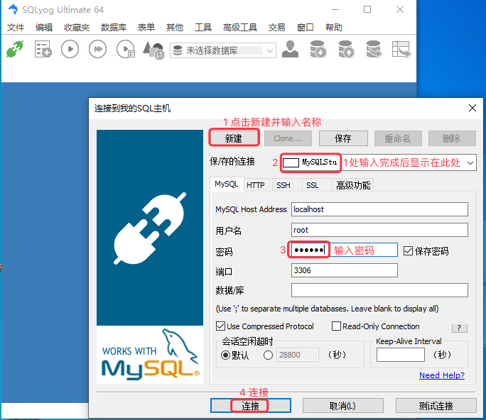
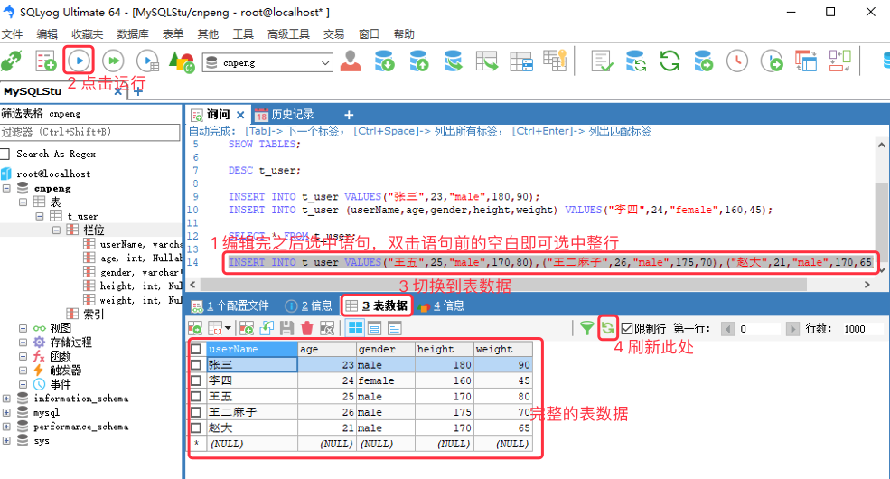

[基于 B 站 《好程序员大数据_Mysql核心技术》-8 整理](https://www.bilibili.com/video/BV1ut4y1y7tt?p=8)

# 8. 表数据的添加、修改、删除

## 8.1 使用 Sqlyog 连接数据库

连接时先新建，然后输入密码即可，其他暂不用修改。



连接过程中如果出现下图中的报错信息：


则需要先从终端使用 `mysql -u root -p` 登录到 mysql, 然后执行如下语句：

```sql
 ALTER USER 'root'@'localhost' IDENTIFIED WITH mysql_native_password BY 'password';
```

其中的 password 是 mysql 的密码。

执行完上述语句之后，我们就可以通过 Sqlyog 连接上了。

## 8.2 插入数据

DML  全称：`Data Manipulation Language`	，即数据操纵语言，用于修改表中记录。常用关键字有：insert、delete、update

### 8.2.1 表中插入单条记录

* 关键词组：`insert into`

* 语法1：不指定字段，但必须按照建表顺序赋值

```sql
insert into tableName values (value1, value2, ... valueN)
```

* 语法2：指定字段，这种方式可以仅指定部分字段。

```sql
insert into tableName (colName1, colName2, ...) values (value1, value2, ...)
```

* 示例

```sql
INSERT INTO t_user VALUES("张三",23,"male",180,90);
INSERT INTO t_user (userName,age,gender,height,weight) VALUES("李四",24,"female",160,45);

SELECT * FROM t_user;
```


### 8.2.2 同时插入多条记录

* 语法格式：

```sql
insert into tableName values (value1, value2, ... valueN), (value1, value2, ... valueN), (value1, value2, ... valueN)
```

* 示例：

```sql
INSERT INTO t_user VALUES("王五",25,"male",170,80),("王二麻子",26,"male",175,70),("赵大",21,"male",170,65);
```



## 8.3 删除表中记录

### 8.3.1 删除表中的所有记录

* 语法

```sql
// delete 是逐行删除，效率比较低。操作会记录到日志中。
delete from tableName;
// truncate 是直接删除表，然后创建一个同名空表。操作不会被记录到日志中。
truncate table tableName;
```


### 8.3.2 删除满足条件的记录

* 语法：（支持的条件语句参考后面的 《where 子句》 ）

```sql
delete from tableName where condition;
```

* 示例：

```sql
DELETE FROM t_user WHERE userName='王二麻子';
```

### 8.3.3 删除表

直接删除表时，使用 drop, 语法如下：

```sql
`drop table tableName`
```

## 8.4 修改表中的记录

* 关键字：UPDATE
* 语法：

```sql
update tableName set colName = newValue [, colName = newValue] [where condition]
```

* 注意：**不加 where 条件的 update 语句会修改表中所有记录的相关字段数据**

示例如下：

```sql
UPDATE t_user SET gender = "female",height = 185 WHERE NAME = "张三";
```

## 8.5 where 子句

**where 子句：** 即 条件子句，对表进行操作时可以使用条件进行筛选和过滤。

### 8.5.1 支持的关键字

类型 | 关键字
---|---
关系运算表达式 | >、<、>=、<=、=、!=、<>
条件连接符号 | and、or、`between...and...`、[not]
模糊查询 | like
集合操作 | [not]in(set)、>any(set)、>all(set)、<any ( set )、<all ( set )

在上表中，

* `!=` 和 `<>` 都表示不等于。
* like 模糊查询时：`_` 表示匹配任意单个字符；`%` 则表示匹配任意 N 个字符，N 大于等于0.
* mysql 不支持简单的集合查询操作，但是支持子查询，是针对于 all 和 any 集合操作来说的。
* `>all(set)` 表示查询的值必须大于 set 中的全部值；`>any(set)` 表示查询的值只要大于 set 中的任意一个即可。
 
示例

```sql
// 查询 height 在 160-180 之间的数据
SELECT * FROM t_user WHERE height > 160 AND height < 180 ;

// 查询 height 在 160 和 170 之间的数据，包括 160 和 170
SELECT * FROM t_user WHERE height BETWEEN 160 AND 170 ;

SELECT * FROM t_user WHERE height = 160 OR height = 180;
```

### 8.5.2 对 NULL 数据进行筛选

**`IS NULL` 用来筛选为 NULL 的值，`IS NOT NULL` 用来筛选非 NULL 的值。**

先通过如下语句插入部分字段信息：

```sql
INSERT INTO t_user (userName,age,gender) VALUES ("钱二",23,"male");
```

执行之后，我们从表结构中可以看到如下样子：


我们继续执行下面的语句——其中的 `IS NULL` 就表示筛选 NULL 数据。

```sql
DELETE FROM t_user WHERE height IS NULL;
```

执行之后，表结构如下：


