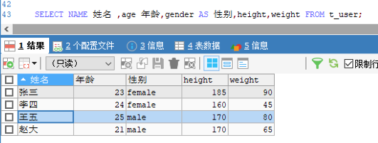

[基于 B 站 《好程序员大数据_Mysql核心技术》-9 整理](https://www.bilibili.com/video/BV1ut4y1y7tt?p=9)


# 9. 基本查询语句

DQL，全称 Data Query Language，即数据查询语言，用于查询表中记录。关键字：select。

## 9.1 查询语句结构

* 完整的普通查询语句结构如下：

```sql
select [distinct] ...... from ......	 # 用于去重
	[where ......]				# 指定查询条件
	[group by ......]			# 对数据进行分组
	[having ......]				# 对分组之后的数据进行筛选
	[order by ......]			# 对数据进行排序
	[limit ......]				# 对数据进行限制
```

* 最基本的查询结构为：

```sql
select ...... from ......
```

* select 也可以用于一般的数学计算, 如：

```sql
select 1+1;
select (2+1)*3;
select 3*4/(1+2);
```

## 9.2 DQL 语句的执行顺序

* 先执行 from 子句：
	* 查询时，一定时基于表操作，因此，第一步先执行 from 子句。
* 再执行 where 子句
	* 确定表之后，使用 where 子句可以进行条件筛选或者条件过滤。
* 然后执行 group...by ：
	* 对数据进行分组查询
* 其次执行 having 语句：
	* 分组之后，还想使用条件筛选或过滤某些组的数据，就使用 having    
* 之后执行 select :
	* 此时，就需要根据业务需求选择需要的字段进行显示。
* 再执行 order by :
	* 对筛选出来的数据进行排序
* 最后执行 limit ：
	* 进行分页查询或者查询前 n 条数据。

## 9.3 示例

### 9.3.1 查询全部

```sql
SELECT * FROM t_user;
```


### 9.3.2 查询数据时指定别名

在 select 语句中，可以对表或者列起别名。指定别名时有两种格式：`字段名 别名`, `字段名 AS 别名`。

在使用汉字作为列别名时，可以加单/双引号，也可以不加。表别名不能加单/双引号。

```sql
SELECT NAME 姓名 ,age 年龄,gender AS 性别,height,weight FROM t_user;
```



如上图，我们指定别名之后，查询结果的表格中会以别名进行显示，不再以字段名显示。

其他示例：

```sql
// 末尾的 t 是表别名
select name 姓名, (year(now())-year(birth)) 年龄 from test1 t;

// 此处的 e.empno 、e,ename、e.job 中的 e 是调用的末尾的表别名 e。
// 因为 from 先于 select 执行，所以可以这么用。而且，也可以用于 order by、limit 子句中
select e.empno 员工编号, e.ename , e.job , mgr '领导编号', hiredate, sal, comm, deptno from emp e;
```

### 9.3.3 其他查询示例

先创建一个 stu 表，然后插入数据。

```sql
CREATE TABLE stu( 
	stuId CHAR(10), 
	stuName VARCHAR(50), 
	age INT, 
	gender VARCHAR(50) 
);
 
 INSERT INTO stu VALUES ("0001","zhangsan1",21,"male"); 
 INSERT INTO stu VALUES ("0002","zhangsan2",22,"male"); 
 INSERT INTO stu VALUES ("0003","zhangsan3",23,"male"); 
 INSERT INTO stu VALUES ("0004","zhangsan4",24,"male"); 
 INSERT INTO stu VALUES ("0005","zhangsan5",25,"male"); 
 INSERT INTO stu VALUES ("0006","zhangsan6",26,"male"); 
 INSERT INTO stu VALUES ("0007","zhangsan7",24,"female"); 
 INSERT INTO stu VALUES ("0008","zhangsan8",26,"male"); 
 INSERT INTO stu VALUES ("0009","zhangsan9",20,"female"); 
 INSERT INTO stu VALUES ("0010","zhangsan10",NULL,NULL); 
```

* 查询性别为女，且年龄为24 的人

```sql
 SELECT * FROM stu WHERE gender="female" AND age = "24";
```

* 查询学号为 0001 或者名字为zhangsan1 的人

```sql
SELECT * FROM stu WHERE stuId = "0001" OR stuName = "zhangsan1";
```

* 查询学号为 0001 、0002、0003 的人

```sql
SELECT * FROM stu WHERE stuId = "0001" OR stuId = "0002" OR stuId = "0003";
// 下面这种方式不上面的方便一些
SELECT * FROM stu WHERE stuId IN('0001','0002','0003');
```

* 查询学号不是 0001 、0002、0003 的人

```sql
SELECT * FROM stu WHERE stuId NOT IN('0001','0002','0003');
```

* 查询年龄为 NULL 的记录

```sql
SELECT * FROM stu WHERE age IS NULL;
```

* 查询姓名不为 NULL 的记录

```sql
SELECT * FROM stu WHERE stuName IS NOT NULL;
```

* 查询年龄在 20 到 23 之间的人

```sql
SELECT * FROM stu WHERE age BETWEEN 20 AND 23;

SELECT * FROM stu WHERE age>=20 AND age<=23;
```

* 查询性别不是 male 的人

```sql
SELECT * FROM stu WHERE gender!='male';
SELECT * FROM stu WHERE gender<>'male';
SELECT * FROM stu WHERE NOT gender = "male";
```

### 9.3.4 模糊查询

内容依旧基于 9.3.3 中创建的表。

* 查询姓名有9个字符的人

```sql
// 一下下划线 _ 表示一个任意字符，9个字符就需要使用 9 个下划线
SELECT * FROM stu WHERE stuName LIKE '_________';
```

* 查询姓名有 9 个字符，并且第 9 个字符为 5 的人 

```sql
SELECT * FROM stu WHERE stuName LIKE '________5';
```

* 查询姓名以字母 z 开头的人

```sql
SELECT * FROM stu WHERE stuName LIKE 'z%';
```

* 查询姓名第二个字母为 h 的记录

```sql
SELECT * FROM stu WHERE stuName LIKE '_h%';
```

* 查询姓名中包含 9 的记录

```sql
SELECT * FROM stu WHERE stuName LIKE '%9%';
```
     