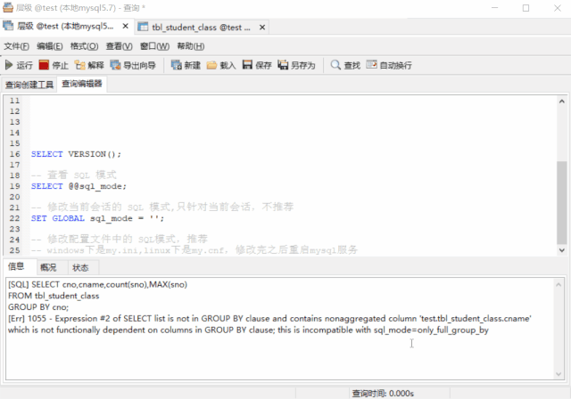
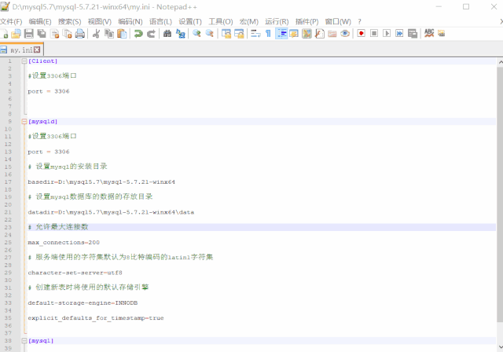
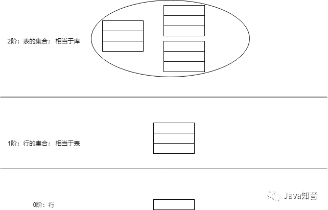
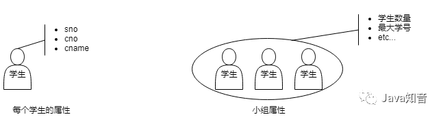

[原文地址1：《为什么 GROUP BY 之后不能直接引用原表中的列？》](https://blog.csdn.net/qq_37217713/article/details/108313757)

[原文地址2：](cnblogs.com/youzhibing/p/11516154.htm)

## 1. GROUP BY 后 SELECT 列的限制

标准 SQL 规定，在对表进行聚合查询的时候，**只能在 SELECT 子句中写下面 3 种内容：通过 GROUP BY 子句指定的聚合键、聚合函数（SUM 、AVG 等）、常量**。我们来看个例子：

我们有 学生班级表（tbl_student_class） 以及 数据如下 ：

```sql
DROP TABLE IF EXISTS tbl_student_class;
CREATE TABLE tbl_student_class (
  id int(8) unsigned NOT NULL AUTO_INCREMENT COMMENT '自增主键',
  sno varchar(12) NOT NULL COMMENT '学号',
  cno varchar(5) NOT NULL COMMENT '班级号',
  cname varchar(20) NOT NULL COMMENT '班级名',
  PRIMARY KEY (id)
) COMMENT='学生班级表';
 
-- ----------------------------
-- Records of tbl_student_class
-- ----------------------------
INSERT INTO tbl_student_class VALUES ('1', '20190607001', '0607', '影视7班');
INSERT INTO tbl_student_class VALUES ('2', '20190607002', '0607', '影视7班');
INSERT INTO tbl_student_class VALUES ('3', '20190608003', '0608', '影视8班');
INSERT INTO tbl_student_class VALUES ('4', '20190608004', '0608', '影视8班');
INSERT INTO tbl_student_class VALUES ('5', '20190609005', '0609', '影视9班');
INSERT INTO tbl_student_class VALUES ('6', '20190609006', '0609', '影视9班');
```

我们想统计各个班（班级号、班级名）一个有多少人、以及最大的学号，我们该怎么写这个查询 SQL ？我想大家应该都会

```sql
SELECT cno,cname,count(sno),MAX(sno)
FROM tbl_student_class
GROUP BY cno,cname;
```

可是有人会想了，cno 和 cname 本来就是一对一，cno 一旦确定，cname 也就确定了，那 SQL 是不是可以这么写 ？

```sql
SELECT cno,cname,count(sno),MAX(sno)
FROM tbl_student_class
GROUP BY cno;
```

执行报错了：


[Err] 1055 - Expression #2 of SELECT list is not in GROUP BY clause and contains nonaggregated column 'test.tbl_student_class.cname' which is not functionally dependent on columns in GROUP BY clause; this is incompatible with sql_mode=only_full_group_by

提示信息：SELECT 列表中的第二个表达式（cname）不在 GROUP BY 的子句中，同时它也不是聚合函数；这与 sql 模式：ONLY_FULL_GROUP_BY 不相容。

为什么 GROUP BY 之后不能直接引用原表（不在 GROUP BY 子句）中的列 ？莫急，我们慢慢往下看。


## 2. SQL 模式

MySQL 服务器可以在不同的 SQL 模式下运行，并且可以针对不同的客户端以不同的方式应用这些模式，具体取决于 `sql_mode` 系统变量的值。DBA 可以设置全局SQL模式以匹配站点服务器操作要求，并且每个应用程序可以将其会话 SQL 模式设置为其自己的要求。

**模式会影响 MySQL 支持的 SQL 语法以及它执行的 数据验证检查**，这使得在不同环境中使用 MySQL 以及将 MySQL 与其他数据库服务器一起使用变得更加容易。更多详情请查阅官网：Server SQL Modes。

MySQL 版本不同，内容会略有不同（包括默认值），查阅的时候注意与自身的 MySQL 版本保持一致。

SQL 模式主要分两类：**语法支持类**和**数据检查类**，常用的如下

### 2.1. 语法支持类　

#### 2.1.1. `ONLY_FULL_GROUP_BY`

对于 GROUP BY 聚合操作，如果在 SELECT 中的列、HAVING 或者 ORDER BY 子句的列，没有在GROUP BY中出现，那么这个SQL是不合法的

#### 2.1.2. `ANSI_QUOTES`

启用 `ANSI_QUOTES` 后，不能用双引号来引用字符串，因为它被解释为识别符，作用与 **`** 一样。设置它以后，update t set f1=""…，会报 Unknown column ‘’ in field list 这样的语法错误

#### 2.1.3. `PIPES_AS_CONCAT`

将 `||` 视为字符串的连接操作符而非 或 运算符，这和 Oracle 数据库是一样的，也和字符串的拼接函数 CONCAT() 相类似

#### 2.1.4. `NO_TABLE_OPTIONS`

使用 SHOW CREATE TABLE 时不会输出MySQL特有的语法部分，如 ENGINE ，这个在使用 mysqldump 跨DB种类迁移的时候需要考虑

#### 2.1.5. `NO_AUTO_CREATE_USER`

字面意思不自动创建用户。在给 MySQL 用户授权时，我们习惯使用 GRANT … ON … TO dbuser 顺道一起创建用户。设置该选项后就与 oracle 操作类似，授权之前必须先建立用户

### 2.2. 数据检查类

#### 2.2.1. `NO_ZERO_DATE`

认为日期 ‘0000-00-00’ 非法，与是否设置后面的严格模式有关

* 如果设置了严格模式，则 `NO_ZERO_DATE` 自然满足。但如果是 INSERT IGNORE 或 UPDATE IGNORE，’0000-00-00’依然允许且只显示warning；
* 如果在非严格模式下，设置了 `NO_ZERO_DATE`，效果与上面一样，’0000-00-00’ 允许但显示 warning；如果没有设置 `NO_ZERO_DATE`，no warning，当做完全合法的值；
* `NO_ZERO_IN_DATE` 情况与上面类似，不同的是控制日期和天，是否可为 0 ，即 2010-01-00 是否合法；

#### 2.2.2. `NO_ENGINE_SUBSTITUTION`

使用 ALTER TABLE 或 CREATE TABLE 指定 ENGINE 时， 需要的存储引擎被禁用或未编译，该如何处理。启用 `NO_ENGINE_SUBSTITUTION` 时，那么直接抛出错误；不设置此值时，CREATE 用默认的存储引擎替代，ATLER 不进行更改，并抛出一个 warning

#### 2.2.3. `STRICT_TRANS_TABLES`

设置它，表示启用严格模式。注意 `STRICT_TRANS_TABLES` 不是几种策略的组合，单独指 INSERT、UPDATE 出现少值或无效值该如何处理：

* 前面提到的把 ‘’ 传给int，严格模式下非法，若启用非严格模式则变成 0，产生一个warning；
* Out Of Range，变成插入最大边界值；
* 当要插入的新行中，不包含其定义中没有显式 DEFAULT 子句的非 NULL 列的值时，该列缺少值；

### 2.3. 默认模式

当我们没有修改配置文件的情况下，MySQL 是有自己的默认模式的；版本不同，默认模式也不同


```sql
-- 查看 MySQL 版本
SELECT VERSION();
 
-- 查看 sql_mode
SELECT @@sql_mode;
```



我们可以看到，5.7.21 的默认模式包含：

`ONLY_FULL_GROUP_BY`, `STRICT_TRANS_TABLES`, `NO_ZERO_IN_DATE`, `NO_ZERO_DATE`, `ERROR_FOR_DIVISION_BY_ZERO`, `NO_AUTO_CREATE_USER`, `NO_ENGINE_SUBSTITUTION`
 
而第一个：`ONLY_FULL_GROUP_BY` 就会约束：当我们进行聚合查询的时候，SELECT 的列不能直接包含非 GROUP BY 子句中的列。那如果我们去掉该模式（从“严格模式”到“宽松模式”）呢 ？



我们发现，上述报错的 SQL 在宽松模式下 可以执行

```sql
SELECT cno,cname,count(sno),MAX(sno)
FROM tbl_student_class
GROUP BY cno;
```

能正常执行了，但是一般情况下不推荐这样配置，**线上环境往往是“严格模式”，而不是“宽松模式”**；虽然案例中，无论是“严格模式”，还是“宽松模式”，结果都是对的，那是因为 cno 与 cname 唯一对应的，如果 cno 与 cname 不是唯一对应，那么在“宽松模式下” cname 的值是随机的，这就会造成难以排查的问题，有兴趣的可以去试试。

那为什么会有 `ONLY_FULL_GROUP_BY` 模式呢 ？ 我们继续往下看

## 3. 阶

阶（order）是用来区分集合或谓词的阶数的概念。谓词逻辑中，根据输入值的阶数对谓词进行分类。

`=`或者 `BETWEEEN` 等输入值为一行的谓词叫作"**一阶谓词**"，而像 `EXISTS` 这样输入值为行的集合的谓词叫作"**二阶谓词**"（HAVING 的输入值也是集合，但它不是谓词）。以此类推，三阶谓词＝输入值为"集合的集合"的谓词，四阶谓词＝输入值为"集合的集合的集合"的谓词，但是 SQL 里并不会出现三阶以上的情况，所以不用太在意。

简单点如下图



谈到了阶，就不得不谈下集合论；集合论是 SQL 语言的根基，因为它的这个特性，**SQL 也被称为面向集合语言**。只有从集合的角度来思考，才能明白 SQL 的强大威力。通过上图，相信大家也都能看到，这里不做更深入的讲解了，有兴趣的可以去查相关资料。

### 3.1. 为什么聚合后不能再引用原表中的列

很多人都知道聚合查询的限制，但是很少有人能正确地理解为什么会有这样的约束。表 `tbl_student_class` 中的 cname 存储的是每位学生的班级信息。

但需要注意的是，这里的 cname 只是每个学生的属性，并不是小组的属性，而 GROUP BY 又是聚合操作，操作的对象就是由多个学生组成的小组，因此，小组的属性只能是平均或者总和等统计性质的属性，如下图



询问每个学生的 cname 是可以的，但是询问由多个学生组成的小组的 cname 就没有意义了。对于小组来说，只有"一共多少学生"或者"最大学号是多少？"这样的问法才是有意义的。

强行将适用于个体的属性套用于团体之上，纯粹是一种分类错误；而 GROUP BY 的作用是将一个个元素划分成若干个子集，使用 GROUP BY 聚合之后，SQL 的操作对象便由 0 阶的"行"变为了 1 阶的"行的集合"，此时，行的属性便不能使用了。

SQL 的世界其实是层级分明的等级社会，将低阶概念的属性用在高阶概念上会导致秩序的混乱，这是不允许的。此时我相信大家都明白：为什么聚合后不能再引用原表中的列 。

### 3.2. 单元素集合也是集合

现在的集合论认为单元素集合是一种正常的集合。单元素集合和空集一样，主要是为了保持理论的完整性而定义的。因此对于以集合论为基础的 SQL 来说，当然也需要严格地区分元素和单元素集合。因此，元素 a 和集合 {a} 之间存在着非常醒目的层级差别。

a ≠ {a}

这两个层级的区别分别对应着 SQL 中的 WHERE 子句和 HAVING 子句的区别。WHERE 子句用于处理"行"这种 0 阶的对象，而 HAVING 子句用来处理"集合"这种 1 阶的对象。

## 4. 总结

* SQL 严格区分层级，包括谓词逻辑中的层级（EXISTS），也包括集合论中的层级（GROUP BY）；

* 有了层级区分，那么适用于个体上的属性就不适用于团体了，这也就是为什么聚合查询的 SELECT 子句中不能直接引用原表中的列的原因；

* 一般来说，单元素集合的属性和其唯一元素的属性是一样的。这种只包含一个元素的集合让人觉得似乎没有必要特意地当成集合来看待，但是为了保持理论的完整性，我们还是要严格区分元素和单元素集合；
