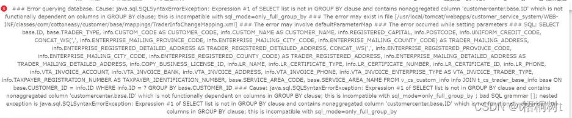

# 1. 4-MySql严格模式

[原文：mysql sql_mode严格模式](https://blog.csdn.net/winerpro/article/details/123466731)

在前两天工作中,突然发现之前运行的好好的服务,在部署到新的换测试环境中后一些sql都出现了报错,一时间就很纳闷,之前都好好的,后来查看日志发现,都是使用了GROUP BY的查询报错,百度完后发现原来是新的环境中mysql开启了严格模式,导致这样的情况,之前确实没有了解过这方面的知识,就此来总结一下mysql的sql_mode




## 1.1. 设置严格模式

* 为当前会话设置严格模式

```sql
SET sql_mode = 'STRICT_TRANS_TABLES'
```

 或者

```sql
SET sql_mode = 'STRICT_ALL_TABLES'
```

* 全局设置严格模式

```sql
SET global sql_mode = 'STRICT_TRANS_TABLES' 
```

或者

```sql
SET global sql_mode = 'STRICT_ALL_TABLES'
```

## 1.2. 设置非严格模式

```sql
SET sql_mode=''
```

## 1.3. sql_mode支持的模式

### 1.3.1. ONLY_FULL_GROUP_BY

这个模式对查询的影响有点大。mysql5.7默认启用这个模式，这个模式是指在mysql的select查询不能出现group by语句字段之外的其余字段。这也就是导致上面错误的地方,也是最常用的设置,开发的时候大家这一设置可以避免一些错误的查询

### 1.3.2. ALLOW_INVALID_DATES

字母意思允许不合法的数据。不对日期做全面的检查，仅仅检查月份是否在1~12之间，天数是否在1~31之间；这种模式可能是有用的对web应用来说去获取年，月，日在三个不同的字段并且准确存储用户的输入数值，没有验证数据的合法性。这种模式对date和datetime类型有作用，但是对timestamp类型不起作用，timestamp总是要合法的数据。当ALLOW_INVALID_DATES启用时，服务端要求年和月时合法的。如果strict模式禁用，不合法的数据如”2004-04-31”被存储为”0000-00-00”并且审查警告；若严格模式启用则会生成错误。（最后这一句我确定没有翻译错，但是测试的时候，数据时原样插入的，没有转换为0000-00-00）

### 1.3.3. ANSI_QUOTES 

这个模式反人类，大致意思就是启用来这个模式，不能使用双引号来引用字符创，因为双引号也被认为是一种标识字符创，可以使用单引号。

### 1.3.4. ERROR_FOR_DIVISION_BY_ZERO 

如果这个模式未启用，那么零除操作将会插入空值并且不会产生警告；如果这个模式启用，零除操作插入空值并产生警告；如果这个模式和严格模式都启用，零除从操作将会产生一个错误，除非使用来ignore来忽略错误。例如insert ignore和update ignore，这样的话零除操作将插入空并发出警告。ERROR_FOR_DIVISION_BY_ZERO不是严格模式的一部分，应该和严格模式一起启用，默认是启用的。

### 1.3.5. HIGH_NOT_PRECEDENCE

 (高not优先级):在如下一个表达式中not a between b and c,在当前设置下被解析为not (a between b and c)，在旧的行为中同一个表达式被解析为(not a) between b and c;启用了HIGH_NOT_PRECEDENCE这个模式，就是启用来旧的优先级设置，表达式将被解析为后一种行为。

### 1.3.6. IGNORE_SPACE 

用于忽略mysql系统函数名与之后括号之间的空格。

### 1.3.7. NO_AUTO_CREATE_USER 

禁止grant语句自动创建用户，除非认证信息被指定，语句必须包含一个非空的密码使用identified by或使用认证插件identified with.

### 1.3.8. NO_AUTO_VALUE_ON_ZERO 

这个值影响自增列，正常情况下可以通过插入“0”值或者null空值来生成自增序列的下一个值。NO_AUTO_VALUE_ON_ZERO模式会抑制这种行为，仅仅当插入null值才会生成下一个序列的自增值。这个模式是非常有用的当0值已经在表的自增序列中存储时。例如，如果你dump这个表并且重新reload它，mysql可能会生成新的值当导入数值为0的值时，这样就会导致数据的不一致，启用这个模式在导入dumo出的文件之前可以解决这个不一致的问题。mysqldump会自动包含了这个模式。

### 1.3.9. NO_BACKSLASH_ESCAPES 

（禁用反斜线转义）这个模式启用，反斜线将会变成一个普通的字符串。

### 1.3.10. NO_DIR_IN_CREATE 

在创建表时忽略所有的index directory和data directory选项。

### 1.3.11. NO_ENGINE_SUBSTITUTION

 此模式指定当执行create语句或者alter语句指定的存储引擎没有启用或者没有编译时，控制默认默认存储引擎的自动切换。默认是启用的。当NO_ENGINE_SUBSTITUTION被禁用，当create表时的默认存储引擎不可使用则产生警告信息，对于alter语句产生警告并且表不会被alter。当NO_ENGINE_SUBSTITUTION启用，会生成错误并且表不会被创建或alter如果期望的存储引擎不可用。

### 1.3.12. NO_UNSIGNED_SUBTRACTION 

在整型数值之间的减法，一个值得类型是unsigned的，那么默认结果也是unsigned的。若是结果是一个负数，则会产生一个错误。

### 1.3.13. NO_ZERO_DATE 

这个模式影响着插入的’0000-00-00’值是否作为合法的数值，这个结果和是否启用严格模式有关。如果这个模式禁用，则’0000-00-00’被允许并且插入没有警告，如果这个模式启用，则’0000-00-00’被运行并且插入产生一个警告信息；如果这个模式和严格模式被启用，则’0000-00-00’不被允许并且插入产生错误，除非ignore被使用。NO_ZERO_DATE不是严格模式的一部分，应该和严格模式一起被使用。因为NO_ZERO_DATE将会被放弃在将来的mysql中，它的影响将会被包含进严格模式中。

### 1.3.14. NO_ZERO_IN_DATE 

这个模式影响着日期中的月份和天数是否可以为0（注意年份是非0的），这个模式也取决于严格模式是否被启用。如果这个模式未启用，date中的零部分被允许并且插入没有警告。如果这个模式启用，dates中的零部分插入被作为“0000-00-00”并且产生一个警告。如果这个模式和严格模式被启用，则dates中的零部分不被允许并且插入产生错误，除非ignore也被使用。这个模式也不是严格模式的一部分，应该和严格模式一起被使用。

## 1.4. 参考连接:

[mysql 严格模式_MySQL: 严格模式_黄继新的博客-CSDN博客](https://blog.csdn.net/weixin_31255215/article/details/113119285)

[MySQL sql_mode的坑及严格模式详解 - Stephen's Blog](https://www.stephen520.cn/blog/10250)