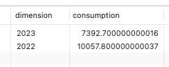
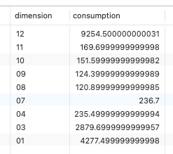
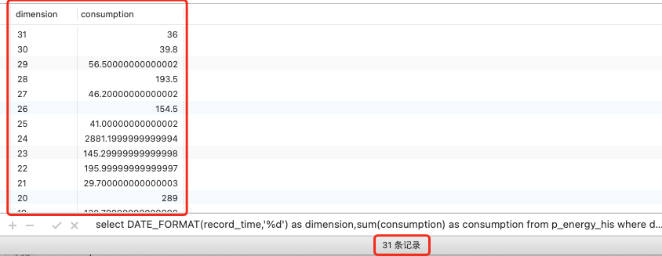
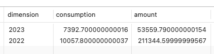
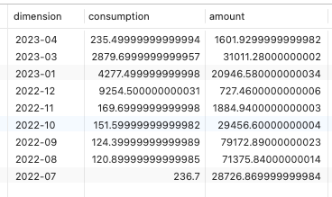
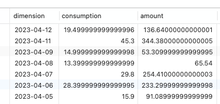

# 1. 0005-基于日期函数实现统计查询

## 1.1. DATE_FORMAT

在 `DATE_FORMAT(,)` 函数中：第一个参数是具体的日期值或者日期字段；第二个参数是日期格式字符串，`%Y`-年，`%m`-月，`%d`-日。

### 1.1.1. 示例1

```sql
-- 基于日期函数对数据进行筛选。实现按年对数据进行统计
select DATE_FORMAT(record_time,'%Y') as dimension,sum(consumption) as consumption from p_energy_his where deleted_at is null GROUP BY dimension DESC
```



```sql
-- 基于日期函数对数据进行筛选。实现按月进行数据统计（不同年份的同一个月会进行合并）
select DATE_FORMAT(record_time,'%m') as dimension,sum(consumption) as consumption from p_energy_his where deleted_at is null GROUP BY dimension DESC
```



```sql
-- 基于日期函数对数据进行筛选。实现按月进行数据统计（不同月份的同一天会进行合并）
select DATE_FORMAT(record_time,'%d') as dimension,sum(consumption) as consumption from p_energy_his where deleted_at is null GROUP BY dimension DESC
```




### 1.1.2. 示例2

```sql
-- 使用日期函数：以 年 为维度，查询符合条件的统计数据
select DATE_FORMAT(record_time,'%Y') as dimension,SUM(consumption) as consumption ,SUM(amount) as amount from p_energy_his where deleted_at is null GROUP BY dimension DESC
```



```sql
-- 使用日期函数：以 年-月 为维度，查询符合条件的统计数据
select DATE_FORMAT(record_time,'%Y-%m') as dimension,SUM(consumption) as consumption ,SUM(amount) as amount from p_energy_his where deleted_at is null GROUP BY dimension DESC
```



```sql
-- 使用日期函数：以 年-月-日 为维度，查询符合条件的统计数据
select DATE_FORMAT(record_time,'%Y-%m-%d') as dimension,SUM(consumption) as consumption ,SUM(amount) as amount from p_energy_his where deleted_at is null GROUP BY dimension DESC
```

