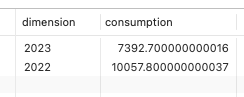
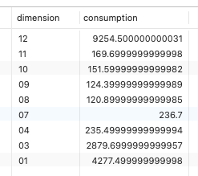
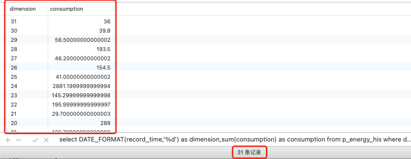
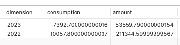
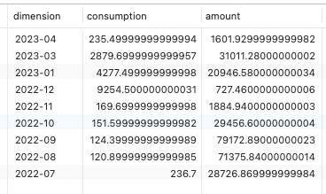
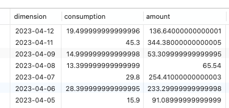

# 1. 判断日期字段是否与传入的日期一致

## 1.1. DATE()

可以使用 MySQL 中的 `DATE()` 函数来判断时间字段与传入的日期是否相同。

### 1.1.1. 判断日期是否一致

`DATE()` 函数可以将日期时间类型的值转换成日期类型，并且去掉时间部分。因此，我们可以将时间字段和传入的日期都使用 `DATE()` 函数来转换成日期类型，然后进行比较。

示例 SQL 语句：

```sql
SELECT * FROM table_name WHERE DATE(time_field) = '2022-01-01';
```

上面的 SQL 语句中，

* `table_name` 表是需要查询的表，
* `time_field` 是需要比较的时间字段，
* `'2022-01-01'` 是传入的日期。

`DATE()` 函数将 `time_field` 转换成日期类型，并与传入的日期比较，如果相同则返回该行数据。

### 1.1.2. 判断是否在时间范围内


如果要判断时间字段是否在某个日期之间，可以使用 `BETWEEN` 和 `DATE()` 函数结合起来，示例 SQL 语句：

```sql
SELECT * FROM table_name WHERE DATE(time_field) BETWEEN '2022-01-01' AND '2022-01-31';
```

上面的 SQL 语句中，

* `table_name` 表是需要查询的表，
* `time_field` 是需要比较的时间字段，
* `'2022-01-01'` 和 `'2022-01-31'` 是需要比较的日期范围。

`DATE()` 函数将 `time_field` 转换成日期类型，并与传入的日期范围比较，如果在该范围内则返回该行数据。

需要注意的是，以上示例中的日期和时间格式需要与数据库中实际存储的格式相同，否则可能无法正确匹配到数据。另外，如果需要统计的数据量较大，可以使用索引来优化查询性能。

## 1.2. 查询某年的数据

### 1.2.1. YEAR()

在 MySQL 中，可以使用 `DATE_SUB` 函数和 `YEAR` 函数来查询某一年的数据。

`YEAR()` 函数用来获取某个日期的年份。具体语法如下：

```sql
SELECT column_name FROM table_name WHERE YEAR(created_at) = ?
```

其中，

* `table_name` 是要查询的表名，
* `column_name` 是要查询的列名，
* `created_at` 是要查询的日期列名，
* `year` 是要查询的年份。
* `SELECT` 语句用于查询数据，
* `WHERE` 语句用于添加筛选条件，即只查询创建时间为指定年份的数据。

例如，假设有一个 `users` 表，其中有一个 `created_at` 列是一个日期类型，我们可以使用以下代码查询 2022 年的用户数量：

```sql
SELECT COUNT(*) FROM users WHERE YEAR(created_at) = 2022;
```

这将返回一个包含 2022 年用户数量的结果。

### 1.2.2. DATE_SUB

Mysql 中如何使用 `DATE_SUB`?

在 MySQL 中，可以使用 `DATE_SUB` 函数来计算某个日期的前一天、后一天等相对日期。具体语法如下：

```sql
DATE_SUB(date, INTERVAL unit amount)
```

其中，

* `date` 是要计算的日期，
* `unit` 是要计算的时间单位，
* `amount` 是要减去的时间量。
* `DATE_SUB` 函数的返回值是一个新的日期，它比原始日期早或晚指定的时间量。

例如，假设有一个 users 表，其中有一个 `created_at` 列是一个日期类型，我们可以使用以下代码查询创建时间为当前日期前一天的用户数量：

```sql
SELECT COUNT(*) FROM users WHERE created_at = DATE_SUB(NOW(), INTERVAL 1 DAY);
```

这将返回一个包含当前日期前一天的用户数量的结果。

其中，

* `NOW()` 函数返回当前日期和时间，
* `DATE_SUB` 函数用于计算前一天的日期，
* `COUNT` 函数用于统计用户数量。

### 1.2.3. 如何使用 DATE_SUB 查询某年的数据

在 MySQL 中，可以使用 `DATE_SUB` 函数和 `YEAR` 函数来查询某一年的数据。具体语法如下：

```sql
SELECT column_name FROM table_name WHERE YEAR(created_at) = YEAR(DATE_SUB(NOW(), INTERVAL 1 YEAR));
```

其中，

* `table_name` 是要查询的表名，
* `column_name` 是要查询的列名，
* `created_at` 是要查询的日期列名，
* `NOW()` 函数返回当前日期和时间，
* `DATE_SUB` 函数用于计算当前日期前一年的日期，`YEAR` 函数用于获取该日期的年份。
* `SELECT` 语句用于查询数据，
* `WHERE` 语句用于添加筛选条件，即只查询创建时间为指定年份的数据。

例如，假设有一个 users 表，其中有一个 `created_at` 列是一个日期类型，我们可以使用以下代码查询 2022 年的用户数量：

```sql
SELECT COUNT(*) FROM users WHERE YEAR(created_at) = YEAR(DATE_SUB(NOW(), INTERVAL 1 YEAR));
```
这将返回一个包含 2022 年用户数量的结果。


## 1.3. DATE_FORMAT(,)

在 `DATE_FORMAT(,)` 函数中：第一个参数是具体的日期值或者日期字段；第二个参数是日期格式字符串，`%Y`-年，`%m`-月，`%d`-日。

### 1.3.1. 示例1

```sql
-- 基于日期函数对数据进行筛选。实现按年对数据进行统计
select DATE_FORMAT(record_time,'%Y') as dimension,sum(consumption) as consumption from p_energy_his where deleted_at is null GROUP BY dimension DESC
```



```sql
-- 基于日期函数对数据进行筛选。实现按月进行数据统计（不同年份的同一个月会进行合并）
select DATE_FORMAT(record_time,'%m') as dimension,sum(consumption) as consumption from p_energy_his where deleted_at is null GROUP BY dimension DESC
```



```sql
-- 基于日期函数对数据进行筛选。实现按月进行数据统计（不同月份的同一天会进行合并）
select DATE_FORMAT(record_time,'%d') as dimension,sum(consumption) as consumption from p_energy_his where deleted_at is null GROUP BY dimension DESC
```




### 1.3.2. 示例2

```sql
-- 使用日期函数：以 年 为维度，查询符合条件的统计数据
select DATE_FORMAT(record_time,'%Y') as dimension,SUM(consumption) as consumption ,SUM(amount) as amount from p_energy_his where deleted_at is null GROUP BY dimension DESC
```



```sql
-- 使用日期函数：以 年-月 为维度，查询符合条件的统计数据
select DATE_FORMAT(record_time,'%Y-%m') as dimension,SUM(consumption) as consumption ,SUM(amount) as amount from p_energy_his where deleted_at is null GROUP BY dimension DESC
```



```sql
-- 使用日期函数：以 年-月-日 为维度，查询符合条件的统计数据
select DATE_FORMAT(record_time,'%Y-%m-%d') as dimension,SUM(consumption) as consumption ,SUM(amount) as amount from p_energy_his where deleted_at is null GROUP BY dimension DESC
```




## 1.4. 日期函数汇总

在 MySQL 中，有许多用于处理日期和时间的函数，例如：

函数 | 含义
---|---
DATE_FORMAT | 将日期格式化为指定的字符串格式。
DATE_ADD | 将日期加上或减去指定的时间量。
DATE_SUB |  将日期减去指定的时间量。
DAY | 返回给定日期的天数。
MONTH | 返回给定日期的月份。
WEEK | 返回给定日期的周数。
YEAR | 返回给定日期的年份。
NOW | 返回当前日期和时间。
LOCALTIME |  返回当前本地时间。
LOCALFecha | 返回当前本地日期。
UTC_DATE |  返回 UTC 时间下的日期。
UTC_TIME |  返回 UTC 时间下的时间。
UTC_TIMESTAMP |  返回 UTC 时间下的日期时间。

这些函数可以根据实际需要进行选择和使用。

## 1.5. 其他示例


### 1.5.1. 查询近30天内的数据

要查询 MySQL 数据库中近30天内的数据量，您可以使用以下SQL查询语句：

```sql
SELECT COUNT(*) AS data_count
FROM your_table
WHERE your_date_column >= CURDATE() - INTERVAL 30 DAY;
```

请将上述查询中的 "your_table" 替换为您要查询的表名，"your_date_column" 替换为包含日期的列名。

该查询将返回满足条件的行数，即近30天内的数据量。

注意：这个查询假设您的日期列是以 MySQL 的日期或日期时间格式存储的。如果您的日期列是以其他格式存储的，请相应地调整查询条件