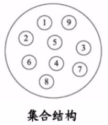
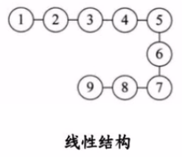
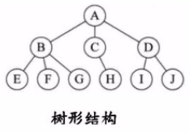
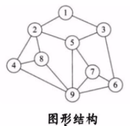
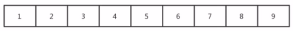
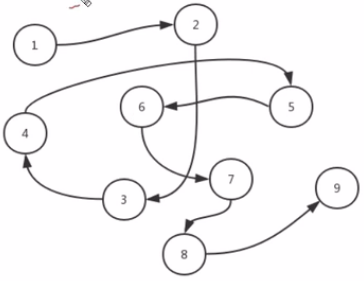

# 1. 1-数据结构和算法概述

基于 [B站-【黑马】2020最新数据结构与算法教程（求职面试必备）](https://www.bilibili.com/video/BV1Cz411B7qd?spm_id_from=pageDriver) 整理

## 1.1. 什么是数据结构

官方解释：数据结构是一门研究非数值计算的程序设计问题中的操作对象，以及他们之间的关系和操作等相关问题的学科。

简单来说，数据结构就是把数据元素按照一定的关系组织起来的集合，用来组织和存储数据。

## 1.2. 数据结构分类

通常可以分为**逻辑结构**和**物理结构**两类。

### 1.2.1. 逻辑结构

逻辑结构是从具体问题中抽象出来的模型，是抽象意义上的结构，**按照对象中数据元素之间的相互关系进行分类**。主要包括：集合结构、线性结构、树形结构、图形结构。

#### 1.2.1.1. 逻辑结构-集合结构

集合结构中数据元素除了同属于一个集合之后，他们之间没有任务其他关系。



#### 1.2.1.2. 逻辑结构-线性结构

线性结构中的数据元素之间存在一对一的关系。




#### 1.2.1.3. 逻辑结构-树形结构

树形结构中的数据元素之间存在一对多的关系。



#### 1.2.1.4. 逻辑结构-图形结构

图形结构的数据元素之间存在多对对的关系



### 1.2.2. 物理结构

逻辑结构在计算机中真正的表达方式（又称为映射）称为物理结构，也可以叫做**存储结构**。常见的物理结构有：顺序存储结构、链式存储结构。

#### 1.2.2.1. 物理结构-顺序存储结构

**把数据元素放在地址连续的存储单元中**，其数据间的逻辑关系和物理关系是一致的。比如我们常用的数组就是顺序存储结构。



顺序结构中元素的内存地址是连续的，所以每个元素都有对应的索引，查找方便。

但是，插入或删除数据时效率比较低，就像生活中排队时如果有人从队伍中离开，整个结构就都会发生变化。针对这种情况，就需要链式存储结构。

#### 1.2.2.2. 物理结构-链式存储结构

是把数据元素存放在任意的存储单元中，这组存储单元可以是连续的也可以是不连续的。此时，数据元素之间并不能反映元素间的逻辑关系。

因此**在链式存储结构中引进了一个指针——用来存储数据元素的地址**，地址和地址之间存在指向关系，这样通过地址就可以找到相关联数据元素的位置。

如下图中，元素1指向元素2，元素2 指向元素三，等等。



链式结构的查找效率没有顺序结构的效率高。

但插入效率比较高，比如，我们在 3 和 4 之间插入一个新的数据 10，此时，我们需要先断开 3 和 4 之间的地址指向关系，然后将 3 指向 10，再将 10 指向 4 。这样，就完成了数据的插入。

而在顺序结构中，假如我们在 3 和 4 之间插入一个新的数据 10 ，那么，首先要将从 4 开始的数据都向后移动一位，从而空出位置，然后再将 10 放到空出的位置上。这样的效率就比较低了。

## 1.3. 什么是算法

官方解释：算法是指解题方案的准确而完整的描述，是一系列解决问题的清晰指令，算法代表着用系统的方法解决问题的策略机制。也就是说，能够对一定规范的输入，在有限时间内获得所要求的输出。

简单来说，就是根据一定的条件，对一些数据进行计算，从而得到需要的结构。

## 1.4. 算法初体验

在我们生活中，遇到某个问题时，解决方案通常不是唯一的。

比如，从西安到北京，我们可以坐飞机，可以坐火车，可以做汽车，甚至可以骑行或者步行。不同的解决方案带来的时间成本和金钱成本是不一样的。比如，坐飞机时间最短，但是费用也最高；步行费用最低，但是时间最长。

再比如，我们在济南高新区买房，付款时我们可以选择一次性全款付清，也可以通过银行做按揭。这两种解决方案带来的成本也不一样，一次性付清时虽然当时出的钱多，压力大，但是没有利息；按揭虽然当时出的钱少，压力比较小，但是会有利息，而且 30 年的利息几乎时贷款额度的一倍，需要多付钱。

在编码过程中，我们也可以用多种算法解决一个问题，不同算法的成本也不一样。总的来说，一个优秀的算法追求一下两个目标：

* 花最少的时间完成需求
* 占用最少的内容空间完成需求

### 1.4.1. 算法体验案例1

计算 1 到 100 的和。

会有如下两种解决方案：

```java
/**
 * 作者：CnPeng
 * 时间：3/16/21
 */
class TempStu {

    public static void main(String[] args) {
        getSum1();
        getSum2();
    }

    // 方案1：普通 for 循环。需要 100 次运算
    private static void getSum1() {
        int sum = 0;
        int n = 100;

        for (int i = 1; i <= n; i++) {
            sum += i;
        }

        System.out.println("方法1：" + sum);
    }

    // 方案2：高斯公式，一次加法，一次乘法，一次除法
    private static void getSum2() {
        int sum = 0;
        int n = 100;
        sum = (n + 1) * n / 2;
        System.out.println("方法2：" + sum);
    }
}
```

### 1.4.2. 算法体验案例2

求 10 的阶乘

```java
class TempStu {

    public static void main(String[] args) {
        func1(10);
        func2(10);
    }


    // 使用递归计算 n 的阶乘
    private static long func1(long n) {
        if (n == 1) {
            return 1;
        }
        return n * func1(n - 1);
    }

    // 使用普通 for 循环计算阶乘
    private static long func2(long n) {
        int result = 1;
        for (long i = 1; i <= n; i++) {
            result *= i;
        }
        return result;
    }
}
```

上述代码中，`func1` 使用递归完成需求，func1 函数会被执行 10 次，并且第一次执行未完成时就会继续调用第二次，第二次未完时也会调用第三次，依次类推。最终，最多的时候需要在栈内存中开辟 10 块内存来分别执行这个 10 次 func1 函数。

而 `func2` 中使用 for 循环完成需求，func2 函数只会执行一次，也就是，只需要在内存中开辟一块内存即可。这种方式在完成需求时占用的内存就更小。

## 1.5. 算法分析

通过前面的内容我们已经知道，研究算法的最终目的就是花费更少的时间和内存去完成相同的需求。并且也通过两个简单案例演示了不同算法之间时间耗费和空间耗费上的差异，但我们无法将时间占用和空间占用进行量化。因此，接下来我们就要学习如何对算法的时间耗费和空间耗费进行分析。

有关算法时间的耗费分析，我们称之为算法的时间复杂度分析。

有关算法的空间耗费分析，我们称之为算法的空间复杂度分析。

### 1.5.1. 算法的时间复杂度分析

我们要计算算法的时间耗费情况，首先就需要度量算法的执行时间，那么，如何度量呢？

#### 1.5.1.1. 事后分析估算法

比较容易想到的方法就是通过设计好的测试程序和测试数据将算法程序执行若干次，然后用计算机语言内置的计时器对不同算法的运行结果进行比较，从而确定算法效率的高低。

这种算法有很大的缺陷：必须依据算法实现编制好的测试程序，通常需要花费大量的时间和精力，测试完成后，如果发现被测试的算法非常糟糕，那么之前所做的事情就全部白费了，并且不同的测试环境（硬件环境）的差别也会导致测试结果的差异很大。

```java
class TempStu {

    public static void main(String[] args) {
        timeConsume();
    }

    private static void timeConsume() {
        long start = System.currentTimeMillis();
        int sum = 0;
        int n = 100;
        for (int i = 1; i <= n; i++) {
            sum += i;
        }
        System.out.println("sum=" + sum);
        long end = System.currentTimeMillis();

        System.out.println("耗时:" + (end - start));
    }
}
```


#### 1.5.1.2. 事前分析方法

在计算机程序编写前，依据统计方法对算法进行估算，经过总结，我们发现一个高级语言编写的程序在计算机上运行所消耗的时间取决于下列因素：


