## 1. 1-数据结构概述

基于 [B站-【黑马】2020最新数据结构与算法教程（求职面试必备）](https://www.bilibili.com/video/BV1Cz411B7qd?spm_id_from=pageDriver) 整理

### 1.1. 什么是数据结构

官方解释：数据结构是一门研究非数值计算的程序设计问题中的操作对象，以及他们之间的关系和操作等相关问题的学科。

简单来说，数据结构就是把数据元素按照一定的关系组织起来的集合，用来组织和存储数据。

### 1.2. 数据结构分类

通常可以分为**逻辑结构**和**物理结构**两类。

#### 1.2.1. 逻辑结构

逻辑结构是从具体问题中抽象出来的模型，是抽象意义上的结构，**按照对象中数据元素之间的相互关系进行分类**。主要包括：集合结构、线性结构、树形结构、图形结构。

##### 1.2.1.1. 逻辑结构-集合结构

集合结构中数据元素除了同属于一个集合之后，他们之间没有任务其他关系。


##### 1.2.1.2. 逻辑结构-线性结构

线性结构中的数据元素之间存在一对一的关系。


##### 1.2.1.3. 逻辑结构-树形结构

树形结构中的数据元素之间存在一对多的关系。


##### 1.2.1.4. 逻辑结构-图形结构

图形结构的数据元素之间存在多对对的关系


#### 1.2.2. 物理结构

逻辑结构在计算机中真正的表达方式（又称为映射）称为物理结构，也可以叫做**存储结构**。常见的物理结构有：顺序存储结构、链式存储结构。

##### 1.2.2.1. 物理结构-顺序存储结构

**把数据元素放在地址连续的存储单元中**，其数据间的逻辑关系和物理关系是一致的。比如我们常用的数组就是顺序存储结构。


顺序结构中元素的内存地址是连续的，所以每个元素都有对应的索引，查找方便。

但是，插入或删除数据时效率比较低，就像生活中排队时如果有人从队伍中离开，整个结构就都会发生变化。针对这种情况，就需要链式存储结构。

##### 1.2.2.2. 物理结构-链式存储结构

是把数据元素存放在任意的存储单元中，这组存储单元可以是连续的也可以是不连续的。此时，数据元素之间并不能反映元素间的逻辑关系。

因此**在链式存储结构中引进了一个指针——用来存储数据元素的地址**，地址和地址之间存在指向关系，这样通过地址就可以找到相关联数据元素的位置。

如下图中，元素1指向元素2，元素2 指向元素三，等等。


链式结构的查找效率没有顺序结构的效率高。

但插入效率比较高，比如，我们在 3 和 4 之间插入一个新的数据 10，此时，我们需要先断开 3 和 4 之间的地址指向关系，然后将 3 指向 10，再将 10 指向 4 。这样，就完成了数据的插入。

而在顺序结构中，假如我们在 3 和 4 之间插入一个新的数据 10 ，那么，首先要将从 4 开始的数据都向后移动一位，从而空出位置，然后再将 10 放到空出的位置上。这样的效率就比较低了。

## 2. 算法概述

### 2.1. 什么是算法

官方解释：算法是指解题方案的准确而完整的描述，是一系列解决问题的清晰指令，算法代表着用系统的方法解决问题的策略机制。也就是说，能够对一定规范的输入，在有限时间内获得所要求的输出。

简单来说，就是根据一定的条件，对一些数据进行计算，从而得到需要的结构。

### 2.2. 算法初体验

在我们生活中，遇到某个问题时，解决方案通常不是唯一的。

比如，从西安到北京，我们可以坐飞机，可以坐火车，可以做汽车，甚至可以骑行或者步行。不同的解决方案带来的时间成本和金钱成本是不一样的。比如，坐飞机时间最短，但是费用也最高；步行费用最低，但是时间最长。

再比如，我们在济南高新区买房，付款时我们可以选择一次性全款付清，也可以通过银行做按揭。这两种解决方案带来的成本也不一样，一次性付清时虽然当时出的钱多，压力大，但是没有利息；按揭虽然当时出的钱少，压力比较小，但是会有利息，而且 30 年的利息几乎时贷款额度的一倍，需要多付钱。

在编码过程中，我们也可以用多种算法解决一个问题，不同算法的成本也不一样。总的来说，一个优秀的算法追求一下两个目标：

* 花最少的时间完成需求
* 占用最少的内容空间完成需求

#### 2.2.1. 算法体验案例1

计算 1 到 100 的和。

会有如下两种解决方案：

```java
/**
 * 作者：CnPeng
 * 时间：3/16/21
 */
class TempStu {

    public static void main(String[] args) {
        getSum1();
        getSum2();
    }

    // 方案1：普通 for 循环。需要 100 次运算
    private static void getSum1() {
        int sum = 0;
        int n = 100;

        for (int i = 1; i <= n; i++) {
            sum += i;
        }

        System.out.println("方法1：" + sum);
    }

    // 方案2：高斯公式，一次加法，一次乘法，一次除法
    private static void getSum2() {
        int sum = 0;
        int n = 100;
        sum = (n + 1) * n / 2;
        System.out.println("方法2：" + sum);
    }
}
```

#### 2.2.2. 算法体验案例2

求 10 的阶乘

```java
class TempStu {

    public static void main(String[] args) {
        func1(10);
        func2(10);
    }


    // 使用递归计算 n 的阶乘
    private static long func1(long n) {
        if (n == 1) {
            return 1;
        }
        return n * func1(n - 1);
    }

    // 使用普通 for 循环计算阶乘
    private static long func2(long n) {
        int result = 1;
        for (long i = 1; i <= n; i++) {
            result *= i;
        }
        return result;
    }
}
```

上述代码中，`func1` 使用递归完成需求，func1 函数会被执行 10 次，并且第一次执行未完成时就会继续调用第二次，第二次未完时也会调用第三次，依次类推。最终，最多的时候需要在栈内存中开辟 10 块内存来分别执行这个 10 次 func1 函数。

而 `func2` 中使用 for 循环完成需求，func2 函数只会执行一次，也就是，只需要在内存中开辟一块内存即可。这种方式在完成需求时占用的内存就更小。

## 3. 算法分析

通过前面的内容我们已经知道，研究算法的最终目的就是花费更少的时间和内存去完成相同的需求。并且也通过两个简单案例演示了不同算法之间时间耗费和空间耗费上的差异，但我们无法将时间占用和空间占用进行量化。因此，接下来我们就要学习如何对算法的时间耗费和空间耗费进行分析。

有关算法时间的耗费分析，我们称之为算法的时间复杂度分析。

有关算法的空间耗费分析，我们称之为算法的空间复杂度分析。

### 3.1. 算法的时间复杂度分析

我们要计算算法的时间耗费情况，首先就需要度量算法的执行时间，那么，如何度量呢？

#### 3.1.1. 事后分析估算法

比较容易想到的方法就是通过设计好的测试程序和测试数据将算法程序执行若干次，然后用计算机语言内置的计时器对不同算法的运行结果进行比较，从而确定算法效率的高低。

这种算法有很大的缺陷：必须依据算法实现编制好的测试程序，通常需要花费大量的时间和精力，测试完成后，如果发现被测试的算法非常糟糕，那么之前所做的事情就全部白费了，并且不同的测试环境（硬件环境）的差别也会导致测试结果的差异很大。

```java
class TempStu {

    public static void main(String[] args) {
        timeConsume();
    }

    private static void timeConsume() {
        long start = System.currentTimeMillis();
        int sum = 0;
        int n = 100;
        for (int i = 1; i <= n; i++) {
            sum += i;
        }
        System.out.println("sum=" + sum);
        long end = System.currentTimeMillis();

        System.out.println("耗时:" + (end - start));
    }
}
```


#### 3.1.2. 事前分析方法

在计算机程序编写前，依据统计方法对算法进行估算，经过总结，我们发现一个高级语言编写的程序在计算机上运行所消耗的时间取决于下列因素：

* 算法采用的策略和方案
* 编译产生的代码质量
* 问题的输入规模（即输入量的多少）
* 机器执行指令的速度

由此可见，抛开与计算机软硬件相关的因素，一个程序的运行时间依赖于算法的好坏和问题的输入规模。如果算法固定，那么该算法的执行时间就只和问题的输入规模有关系了。

##### 3.1.2.1. 示例1：

还是看下面这个求和的示例：

```java
/**
 * 作者：CnPeng
 * 时间：3/16/21
 */
class TempStu {

    public static void main(String[] args) {
        getSum1();
        getSum2();
    }

    // 方案1：普通 for 循环。需要 100 次运算。
    private static void getSum1() {
        int sum = 0;    // 执行 1 次
        int n = 100;    // 执行 1 次。

        for (int i = 1; i <= n; i++) {    // 执行了 n+1 次
            sum += i;    // 执行了 n 次
        }

        System.out.println("方法1：" + sum);
    }

    // 方案2：高斯公式，一次加法，一次乘法，一次除法
    private static void getSum2() {
        int sum = 0;    // 执行 1 次
        int n = 100;    // 执行 1 次 
        sum = (n + 1) * n / 2;    // 执行 1 次
        System.out.println("方法2：" + sum);
    }
}
```

在上述示例中，当输入规模为 n 时，第一种算法执行了 1+1+（n+1）+n = 2n + 3 次；第二种算法执行了 1+1+1=3 次。

假设我们把第一种算法中的 for 循环体看做一个整体，忽略 for 循坏的判断条件和自增计算，只看 `sum+=i`，那么，两种算法在执行真正的加法计算时就是 n 和 1 进行对比。

为什么循环判断在算法 1 中执行了 n+1 次，看起来是个不小的计算量，但是却可以忽略呢？我们看如下的例子：

##### 3.1.2.2. 示例2：

计算 100个1+100个2+100个3+...+100个100 的结果。

```java
class TempStu {

    public static void main(String[] args) {
        get100nSum();
    }


    // 计算 100个1+100个2+100个3+...+100个n的和
    private static void get100nSum() {
        int sum = 0;
        int n = 100;
        for (int i = 1; i <= n; i++) {
            for (int j = 1; j <= n; j++) {
                sum += i;
            }
        }
        System.out.println("sum=" + sum);
    }
}
```

在上面这个例子中，我们要精确的研究虚幻的条件执行了多少次，是一件很麻烦的事情，并且，由于真正计算和的代码是内循环的循环体，所以，**在研究算法的效率时，我们只考虑核心代码的执行次数，这样可以简化分析**。

我们研究算法复杂度，侧重的是**当输入规模不断增大时算法增长量的一个抽象（规律），而不是精确的定位需要执行多少次**。

我们不关心编写程序所用的语言是什么，也不关心这些程序将跑在什么样的计算机上，我们只关心它所实现的算法。

这样，不计那些循环索引的递增和循环终止的条件、变量声明、打印结果等操作，**最终在分析程序的运行时间时，最重要的是把程序看做独立于程序设计语言的算法或一系列步骤，然后把这些核心步骤的操作次数和输入规模关联起来。**

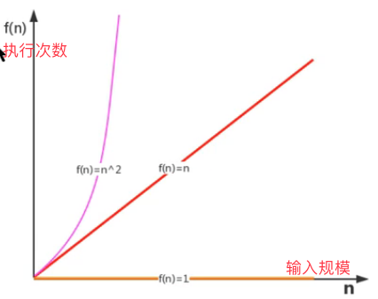

上图中，横向坐标表示输入规模，纵向坐标表示函数核心内容的执行次数。

* 橙色线表示函数核心内容的执行次数为 1，
* 红色线表示函数核心内容的执行次数为 n
* 分色线表示函数核心内容的执行次数为 n*n （即 n 的平方）

从上图描述来看，随着输入规模的增加，橙色线的执行效率最高，红色次之，粉色效率最低。

#### 3.1.3. 函数渐近增长

给定两个函数 f(n) 和 g(n)，如果存在一个整数 N , 使得对于所有的 n>N，f(n) 总是比 g(n) 大，那么，我们就说 f(n) 的增长渐近快于 g(n)。

##### 3.1.3.1. 测试1：

假设有四个算法，四个算法的输入规模都是 n:

* 算法 A1 要做 2n+3 次操作（比如：先执行 n 次循环，执行完毕后，再执行一个 n 次循环，最后有个 3 次运算）
* 算法 A2 要做 2n 次操作
* 算法 B1 要做 3n+1 次操作（比如：先执行 n 次循环，再执行 n 次循环，再执行 n 次循环，最后有 1 次运算）
* 算法 B2 要做 3n 次操作

那么，上述算法中，哪一个更快一些呢？

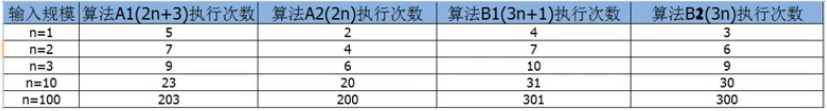

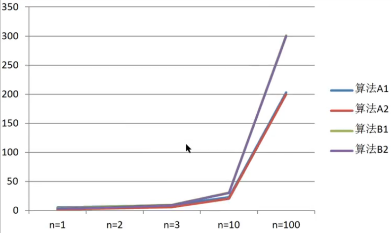

通过上面的数据表格，比较算法 A1 和 B1:

* 当输入规模 n=1 时，A1 需要执行 5 次，B1 需要执行 4 次，所以 A1 的效率低于 B1
* 当输入规模 n=2 时，A1 需要执行 7 次，B1需要执行 7 次，此时，两者效率一样。
* 当输入规模 n>2 时，A1 需要的执行次数一直比 B1 少，此时，A1 的效率高于 B1 

所以，我们可以得出结论：

**当输入规模 n>2 时，算法 A1 的渐近增长小于算法 B1 的渐近增长**。

通过观察折线图，我们发现，随着输入规模的增大，算法 A1 和 A2 逐渐重叠到一起，算法 B1 和 B2 逐渐重叠到一起，所以，我们得出结论：

**随着输入规模的增大，算法的常数操作可以忽略不计。**（上面的算法中，A1算法的 2n+3 次操作中，3 就是常数操作次数 ）

##### 3.1.3.2. 测试2

假设有四个算法的输入规模都是 n:

* 算法 C1 需要做 4n+8 次操作
* 算法 C2 需要做 n 次操作
* 算法 D1 需要做 2n^2 次操作
* 算法 D2 需要做 n^2 此操作

那么上述算法中，那个更快一些呢？

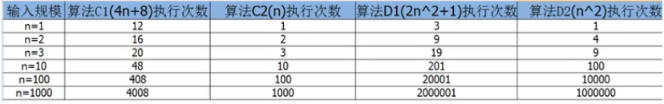

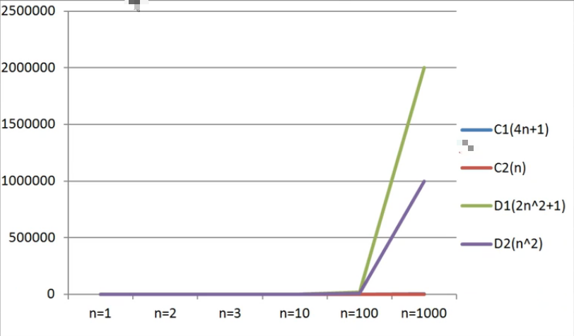

通过数据表格，对比 C1 和 算法 D1：

* 当输入规模 n<=3 时，算法 C1 的执行次数多于算法 D1 , 所以 C1 的效率低一些
* 当输入规模 n>3 时，算法 C1 的执行次数少于算法 D1, 所以算法 D1 效率低一些

所以，总体上看，算法 C1 优于算法 D1

通过折线图，对比 C1 和 C2，可以发现：随着输入规模的增大，算法 C1 和 C2 几乎重叠；

通过折线图，对比 C 系列和 D 系列，可以发现：随着输入规模的增大，即使去除 n^2 前面的常数因子，D 系列的次数也远高于 C 系列。

因此可以得出结论：

**随着输入规模增大，与最高次项相乘的常数可以忽略**（如 算法 D1 的 2n^2+1 次操作中，最前面的 2 就是与最高次项相乘的常数。  ）

##### 3.1.3.3. 测试3

假设四个算法的输入规模都是 n:

* 算法 E1 :  2n^2+3n+1
* 算法 E2 :  n^2
* 算法 F1：2n^3+3n+1
* 算法 F2 :  n^3

那么，上述算法中哪一个更快些呢？

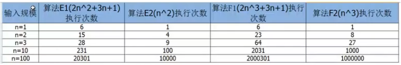

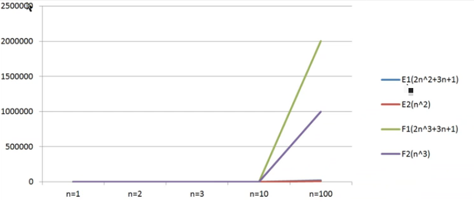

通过数据表格，对比算法 E1 和 F1：

* 当 n=1 时，算法 E1 和 算法 F1 的执行次数一样
* 当 n >1 时，算法 E1 的执行次数远远小于算法 F1 的执行次数

所以，算法 E1 总体上优于算法 F1

通过折线图我们会看到，算法 F 系列随着 n 的增长会变的特别快，算法 E 系列随着 n 的增长相比较算法 F 来说，变得比较慢，所以可以得出结论：

**最高次项的指数大的，随着 n 的增长，结果也会变得增长特快**。


##### 3.1.3.4. 测试4

假设 5 个算法的输入规模都是 n:

* 算法 G： n^3
* 算法 H： n^2
* 算法 I： n
* 算法 J： logn
* 算法 K：1 

那么，上述算法哪个效率高呢？

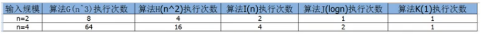

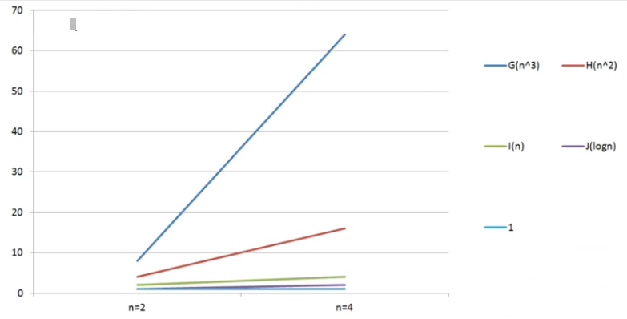

通过观察表格和折线图，可以得出如下结论：

**算法函数中 n 最高次幂越小，算法效率越高**


##### 3.1.3.5. 总结：

综合前面四个测试案例，在我们比较算法随着输入规模的增长量时，有如下规则：

* **算法函数中的常数可以忽略**
* **算法函数中最高次幂的常数因子可以忽略**
* **算法函数中最高次幂越小，算法效率越高**

#### 3.1.4. 算法时间复杂度

##### 3.1.4.1. 大O记法

在进行算法分析时，语句总的执行次数 T(n) 是关于问题规模 n 的函数。进而分析 T(n) 随着 n 的变化情况并确定 T(n) 的量级。

算法的时间复杂度就是算法的时间量度，记作：**T(n)=O(f(n))** 。它表示随着问题规模 n 的增大，算法执行时间的增长率和 f(n) 的增长率相同，称作**算法的渐近时间复杂度**，简称**时间复杂度**。其中，f(n) 是问题规模 n 的某个函数。

此处，需要明确一个事情：**执行次数=执行时间**

用大写 O() 来体现算法时间复杂度的记法就被成为 **大 O 标记法**。

一般情况下，随着输入规模 n 的增大，T(n) 增长最慢的算法为最优算法。

下面我们使用大 O 标记法来表示一些求和算法的时间复杂度：

```java
/**
 * 作者：CnPeng
 * 时间：3/16/21
 */
class TempStu {

    public static void main(String[] args) {
        getSum1();
        getSum2();
    }


  // 算法1：
    private static void getSum1() {
        int sum = 0; // 执行 1 次
        int n = 100; // 执行 1 次

        for (int i = 1; i <= n; i++) {
            sum += i;    // 执行 n 次
        }

        System.out.println("方法1：" + sum);
    }

    // 算法2
    private static void getSum2() {
        int sum = 0;    // 执行 1 次
        int n = 100;    // 执行 1 次
        sum = (n + 1) * n / 2;  // 执行 1 次
        System.out.println("方法2：" + sum);
    }
    
     // 算法3： 计算 100个1+100个2+100个3+...+100个n的和
    private static void get100nSum() {
        int sum = 0;    // 执行 1 次
        int n = 100;    // 执行 1 次
        for (int i = 1; i <= n; i++) {
            for (int j = 1; j <= n; j++) {
                sum += i;    // 执行 n^2 次
            }
        }
        System.out.println("sum=" + sum);
    }
}
```

如果忽略判断条件的执行次数和输出语句的执行次数，那么，当输入规模为 n 时，以上算法执行的次数分别为：

* 算法1：n +3 次
* 算法2:  3 次
* 算法3 ： n^2+2 次

如果用 大 O 记法表示上述每个算法的时间复杂度，应该如何表示呢？

基于我们对函数渐近增长的分析，推导大 O 记法的表示法有如下几个规则可以使用：

* **使用常数 1 取代运行时间中的所有加法常数**
* **在修改后的运行次数中，只保留高阶项**
* **如果最高阶项存在，且常数因子不为 1， 则去除与这个像相乘的常数**

所以，上述算法的 大 O 记法分别如下：

* 算法1：O(n)
* 算法2 ： O(1)
* 算法3：O(n^2)

##### 3.1.4.2. 常见的大 O 阶

###### 3.1.4.2.1. 线性阶

一般含有非嵌套循环涉及线性阶。线性阶就是随着输入规模的扩大，对应计算次数呈直线增长，如：

```java
    // 算法1：
    private static void getSum1() {
        int sum = 0; // 执行 1 次
        int n = 100; // 执行 1 次

        for (int i = 1; i <= n; i++) {
            sum += i;    // 执行 n 次
        }

        System.out.println("方法1：" + sum);
    }
```

上面代码中，它的循环时间复杂度为 O(n) ，因为循环体中的代码需要执行 n 次。

###### 3.1.4.2.2. 平方阶

一般来说，嵌套循环数据平方阶。

```java
    // 算法3： 计算 100个1+100个2+100个3+...+100个n的和
    private static void get100nSum() {
        int sum = 0;    // 执行 1 次
        int n = 100;    // 执行 1 次
        for (int i = 1; i <= n; i++) {
            for (int j = 1; j <= n; j++) {
                sum += i;    // 执行 n^2 次
            }
        }
        System.out.println("sum=" + sum);
    }
```

上述代码中，n = 100，所有外层循环每执行一次，内存循环就执行 100 次。所以，只有当程序执行 100*100 次之后才会结束，也就是 n^2 次。所以，这段代码的时间复杂度为 O(n^2)

###### 3.1.4.2.3. 立方阶

一般来说，三层嵌套循环属于立方阶。

```java
private static void getSum3() {
    int x = 0, n = 100;
    for (int i = 1; i <= n; i++) {
        for (int j = 1; j <= n; j++) {
            for (int k = 1; k <= n; k++) {
                x++;
            }
        }
    }
    System.out.println(x);
}
```

上述代码中，n=100, 外层循环每执行一次，中间循环执行 100 次，最内层循环执行 100 次，所以，更需要执行 100 * 100 * 100 ,即 n^3 次。所以，这段代码的时间复杂度为 O(n^3)

###### 3.1.4.2.4. 对数阶

[对数](https://baike.baidu.com/item/%E5%AF%B9%E6%95%B0/91326?fr=aladdin)，属于高等数学中的内容。如果 a 的 x 次方等于N（a>0，且a≠1），那么数 x 叫做以 a 为底 N 的对数（logarithm），记作 x=log(a) N。其中，a 叫做对数的底数，N 叫做真数。

```java
int i=1;n=100;
while(i<n){
    i=i*2;
}
```

上述代码中，由于每次 i*2 之后，就距离 n 更近一些，假设有 x 个 2 相乘后大于 n , 则会退出循环。

由于是 2^x=n, 得到 x=log(2)N, 所以，这个循环的时间复杂度为 O(logn).

**对于对数阶，由于随着输入规模 n 的增大，不管底数是多少，他们的增长趋势是一样的，所以，我们会忽略底数。**

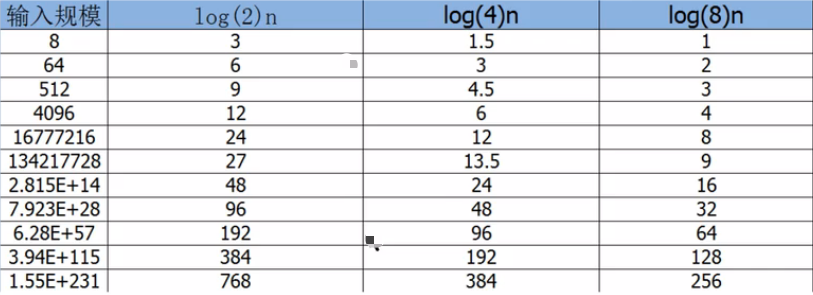

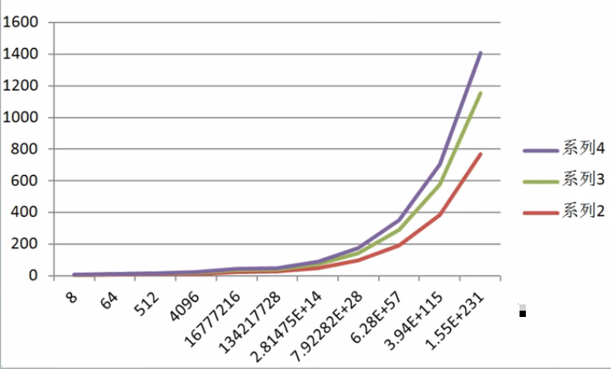

###### 3.1.4.2.5. 常数阶

一般不涉及循环操作的都是常数阶。因为它不会随着 n 的增长而增加操作次数，如：

```java
private void getSum4() {
    int n = 100;
    int i = n + 2;
    System.out.println(i);
}
```

上述代码中，不管输入规模 n 是多少，都只执行 2 次运算，根据大 O 推导法则，常用用 1 来替换，所以，上述代码的时间复杂度为 O(1).

###### 3.1.4.2.6. 常见时间复杂度（阶）的总结：

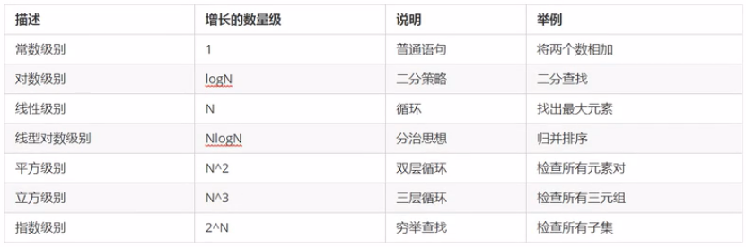

它们的复杂度从低到高一次为：

O(1) < O(logN) < O(n) < O(nlogn) < O(n^2) < O(n^3)

根据前面的折线图分析，我们会发现，从平方阶开始，随着输入规模的增大，时间成本会急剧增大，所以，我们的算法尽可能追求的是 O(1) 、O(logN) 、 O(n) <、O(nlogn) 这几种时间复杂度。而如果发现算法的时间复杂度为平方阶、立方阶或者更为复杂的，那我们就认为这种算法是不可取的，需要优化。

#### 3.1.5. 函数调用的时间复杂度分析

之前我们分析的都是单个函数内算法代码的时间复杂度，接下来我们分析函数调用过程中的时间复杂度。

##### 3.1.5.1. 案例1：

```java
public static void main(String[] args) {
    int n=100;
    for (int i = 0; i < n; i++) {
        show(i);
    }
}
private static void show(int i){
    System.out.println(i);
}
```

在上述 main 方法中，有一个 for 循环，循环体调用了 show 方法，由于 show 方法内部只执行了一行代码，所以 show 方法的时间复杂度为 O(1), 那么 main 方法的时间复杂度就是 O(n)

##### 3.1.5.2. 案例2

```java
public static void main(String[] args) {
    int n=2;
    for (int i = 1; i <= n; i++) {
        show2(n);
    }
}
private static void  show2(int i){
    for(int j=1;j<=i;j++){
        System.out.println(j);
    }
}
```

在 main 方法中，有一个 for 循环，循环体调用了 show 方法，由于 show 方法内也有一个 for 循环，所以，show 方法的时间复杂度为 O(n)，那么 main 方法的时间复杂度为 O(n^2)

##### 3.1.5.3. 案例3

```java
public static void main(String[] args) {
    int n = 100;
    show(n);  
    
    for (int i = 0; i < n; i++) {   // O(n^2)
        show(i);
    }
    for (int i = 0; i < n; i++) {  // O(n^2)
        for (int j = 0; j < n; j++) {
            System.out.println(n);
        }
    }
}
private static void show(int n) {
    for (int i = 0; i < n; i++) {   // O(n)
        System.out.println(n);
    }
}
```

在 show 方法中，有一个 for 循环，所以，

* show 方法的时间复杂度为 O(n)
* 在 main 方法中，show(n) 这行代码内部执行的次数为 n
* 第一个 for 循环内调用了 show 方法，所以其执行次数为 n^2
* 第二个 for 嵌套循环中，内层 for 循环仅执行了一行代码，所以其执行次数为 n^2

所以，上述 main 方法的总执行次数为 n+n^2+n^2 = n+2n^2。根据大 O 推导规则，去掉 n 保留最高阶项，并去掉最高阶项的常数因子，所以，最终 main 方法的时间复杂度为 n^2

#### 3.1.6. 最坏情况

从心理学角度讲，每个人对发生的事情都会有一个预期，比如看到半杯水，有人会说：哇哦，还有半杯水哦！但也有人会说：天哪，只有半杯水了。一般人处于一种对未来失败的担忧，而在预期的时候趋向做最坏的打算，这样即使最糟糕的结果出现，当事人也有了心理准备，比较容易接受结果。加入最糟糕的结果并没有出现，当事人会很快乐。

算法也是类似，假如有一个需求：有一个存储了 n 个随机数字的数组，请从中查找出指定的数字。

```java
private static int search(int num) {
    int[] arr = {11, 10, 8, 9, 7, 22, 23, 0};
    for (int i = 0; i < arr.length; i++) {
        if (num == arr[i]) {
            return i;
        }
    }
    return -1;
}
```

最好情况：查找的第一个数字就是期望的数字，那么算法的时间复杂度为 O(1)

最坏情况：查找的最后一个数字才是期望的数字，那么所发的时间复杂度为 O(n)

平均情况：任何数字查找的平均成本为 O(n/2)

最坏情况是一种保证，在应用中，这是一种最基本的保障，即使在最坏情况下，也能够正常提供服务，所以，**除非特别指定，我们提到的运行时间都指的是最坏情况下的运行时间。**


### 3.2. 算法的空间复杂度分析

计算机的软硬件都经历了一个比较漫长的演变史，作为为运算提供环境的内存更是如此，从早期的 512k, 经历了 1M, 2M, 4M 直到今天的 8G、16G、32G 。在早期，算法在运行过程中对内存的占用情况也是一个经常需要考虑的问题。我们可以 **用算法的空间复杂度来描述算法对内存的占用**。

#### 3.2.1. java 中常见的内存占用

* 基本数据类型的内存占用情况：

数据类型|内存占用字节数
---|---
byte | 1
short | 2
int | 4
long | 8
float | 4 
double | 8
boolean | 1
char |2 

* 计算机访问内存的方式都是一次一个字节。如下图：


* **一个引用（即机器地址）需要 8 个字节表示**。如：Date date=new Date(), 其中构建的 date 变量需要占用 8 个字节来表示。

* 创建一个对象，比如 new Date() ，除了 Date  对象内存存储的数据（例如年月日等信息）占用的内存，该对象本身也有内存开销，**每个对象的自身开销量是 16 个字节，用来保存对象的头信息。**

* 一般内存的使用，如果不够 8 个字节，都会被自动填充为 8 个字节，如下：

```java
public class A{
    public int a = 1;
}
```

在上述代码中，通过 `new A()` 创建一个对象时的内存占用情况为：整型成员变量 a 占用四个字节，对象本身占用 16 个字节。那么创建该对象总共需要 20 个字节，但由于无法被 8 整除，所以，会自动填充为能被 8 整除的 24 个字节。

* java 中数组被限定为对象，他们一般都会因为记录长度而需要额外的内存，**一个原始数据类型的数组一般需要 24 字节的头信息（16 个自己的对象开销，4 字节用于保存长度以及 4 个填充字节），再加上保存值所需要的内存**。

#### 3.2.2. 算法的空间复杂度

了解了 java 的内存最近本的机制，就能够有效帮助我们估计大量程勋的内存使用情况。

算法的空间复杂度计算公式记作：`S(n)=O(f(n))`,其中 n 为输入规模，f(n) 为语句关于 n 所占存储空间的函数。

##### 3.2.2.1. 案例1

对指定的数组元素进行反转，并返回反转的内容。

```java
//  解法1 
public static int[] reverse1(int[] arr) {
    int n = arr.length;  // 申请 4 个字节
    int temp;    // 申请 4 个字节
    for (int start = 0, end = n - 1; start <= end; start++, end--) {
        temp = arr[start];
        arr[start] = arr[end];
        arr[end] = temp;
    }
    return arr;
}
//  解法2 
public static int[] reverse2(int[] arr) {
    int n = arr.length; // 申请 4 个字节
    int[] temp = new int[n]; // 申请 n*4 个字节存储元素，并申请数组自身头信息开销 24 字节。共 (n*4)+24
    for (int i = n - 1; i >= 0; i--) {
        temp[n - 1 - i] = arr[i];
    }
    return temp;
}
```

忽略判断条件占用的内存，我们得出的内存占用情况如下：

算法1：

* 不管出入的数组长度为多少，额外申请的字节数始终为 4+4=8 ，即 O(8), 根据大 O 推导规则，常数记为 1， 所以算法1 的空间复杂度最终为 O(1).

算法2： 

* 变量 n 申请了 4 个字节；
* 临时数组变量 temp 本身需要 24 个字节（16 个自己的对象开销，4 字节用于保存长度以及 4 个填充字节），其存储的元素为 int 类型，每个 int 占 4 字节，所以需要 4*n 字节，该数组共需要  `（4*n）+24` 个字节；
* 所以，算法 2 的空间复杂度为 `（4*n）+24 + 4` , 根据大 O 推导规则，去掉常数得到 4*n,  再去掉常数因子，得到 n ，所以，算法2 的空间复杂度最终为 O(n）

通过上述分析可知：算法 1 优于 算法2。

由于 java 中有内存垃圾的回收机制，并且 jvm 对程序的内存占用也有优化（例如即时编译），我们无法精确的评估一个 Java 程序的内存占用情况，但是了解了 java 的最基本内存占用，使我们可以对 java 程序的内存情况进行估算。

现在的计算机设备内存一般都比较大，基本上个人计算机都在 4-32G 之间，所以内存占用一般情况下并不是我们算法的瓶颈，**普通情况下说的算法复杂度，默认为算法的时间复杂度。**

但是，在嵌入式开发中，尤其是一些传感器设备上的内存程序，由于这些设备的内存很小，一般为几 kb, 这个时候对算法的空间复杂度就有要求了。一般的 java 服务器开发，由于服务器配置比较高，所以一般不用考虑空间复杂度。


