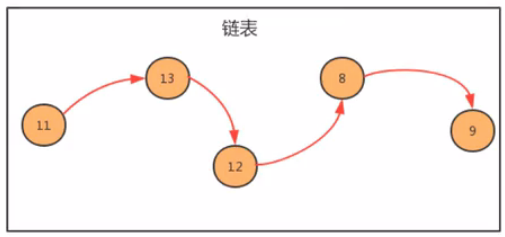

# 1. 3-线性表

线性表时最基本、最简单、也是最常用的一种数据结构。

**一个线性表是 n 个具有相同特性的数据元素的有限序列**。

**前驱元素**： 若 A 元素在 B 元素的前面，则称  A 为 B 的前驱元素。

**后继元素**：若 B 元素在 A 元素的后面，则称 B 为 A 的后继元素。

**线性表的特征** ：数据元素之间有一种 '一对一' 的逻辑关系，具体如下：

* 第一个数据元素没有前驱，这个数据元素被称为头结点
* 最后一个数据元素没有后继，这个数据元素被称为尾结点
* 除了第一个和最后一个数据元素外，其他数据元素有且仅有一个前驱和一个后继。

如果把线性表用数学语言来定义，则可以表示为 (a1,...ai-1,ai,ai+1,..an) 。ai-1领先于 ai，ai 领先于 ai+1，称 ai-1 是 ai 的前驱元素，ai+1 是 ai 的后继元素。


**线性表的分类：** 线性表中数据存储的方式可以是连续的顺序存储，也可以是不连续的链式存储，**按照数据的存储方式不同，可以把线性表分为顺序表和链表**。

## 1.1. 顺序表

顺序表时在计算机内存中以数组的形式保存的线性表。

线性表的顺序存储是指用一组地址连续的存储单元，依次存储线性表中的各个元素，使得线性表中在逻辑结构上相应的数据元素存储在相邻的物理存储单元中。即通过数据元素物理存储的相邻关系来反应数据元素之间逻辑上的相邻关系。


### 1.1.1. 顺序表的基本实现

#### 1.1.1.1. 顺序表 API 设计


#### 1.1.1.2. 代码实现

```java
package liner.sequenceList;

/**
 * 作者：CnPeng
 * 时间：3/31/21
 * 功用：顺序表
 */
class SequenceList<T> {
    // 存储元素的数组
    private T[] eles;
    // 记录顺序表中的元素个数
    private int N;

    // 构造方法
    public SequenceList(int capacity) {
        // 初始化数组. 无法直接 new T[], 所以先 new Object[] 再强转为 T[]
        this.eles = (T[]) new Object[capacity];
        // 初始化元素个数
        this.N = 0;
    }

    // 将线性表置为空
    public void clear() {
        this.N = 0;
    }

    // 判断线性表是否为空
    public boolean isEmpty() {
        return N == 0;
    }

    // 获取线性表的长度
    public int length() {
        return N;
    }

    // 获取指定索引 i 处的元素
    public T get(int i) {
        return eles[i];
    }

    // 向线性表末尾追加元素
    public void insert(T t) {
        // N 表示当前存储了多少个元素，先将 t 赋值给 else[N]，此时就有 N+1 个元素，即 N++
        eles[N++] = t;
    }

    // 在指定位置插入元素
    public void insert(int i, T t) {

        // 先把 i 索引及其后面的元素依次向后移动一位(原先有N个元素，最大索引为N-1，新增之后，最大索引将变成 N)
        for (int index = N; index > i; index--) {
            eles[index] = eles[index - 1];
        }

        // 再把 T 放到 i 索引处
        eles[i] = t;

        // 元素数量 +1
        N++;
    }

    // 删除指定位置的元素，并返回该元素
    public T remove(int i) {
        // 记录索引 i 处对应的值
        T current = eles[i];
        // 将 i 后面的值全都前移一位
        for (int index = i; i < N - 1; i++) {
            eles[index] = eles[index + 1];
        }
        // 元素个数减1
        N--;
        return current;
    }

    // 查找某元素第一次出现的位置
    public int indexOf(T t) {
        for (int i = 0; i < N; i++) {
            if (eles[i].equals(t)) {
                return i;
            }
        }
        return -1;
    }
}
```

#### 1.1.1.3. 简单测试

```java
package liner.sequenceList;

/**
 * 作者：CnPeng
 * 时间：3/31/21
 * 功用：顺序表测试
 */
class SequenceListTest {
    public static void main(String[] args) {
        // 创建顺序表对象
        SequenceList<String> sequenceList = new SequenceList<>(10);

        // 测试插入
        sequenceList.insert("张三");
        sequenceList.insert("王五");
        sequenceList.insert("赵六");

        sequenceList.insert(1, "李四");
        System.out.println("插入后的长度 = [" + sequenceList.length() + "]");

        // 测试获取
        String result = sequenceList.get(1);
        System.out.println("get = [" + result + "]");
        String result2 = sequenceList.get(3);
        System.out.println("get = [" + result2 + "]");


        // 测试删除
        String removeRes = sequenceList.remove(0);
        System.out.println("remove = [" + removeRes + "]");

        // 测试清空
        sequenceList.clear();
        System.out.println("清空后的长度 = [" + sequenceList.length() + "]");
    }
}
```

### 1.1.2. 顺序表的遍历

作为存储数据的容器，通常都需要向外部提供遍历的方式，因此我们需要给顺序表提供遍历方式。

在 java 中，遍历集合的方式一般都是用 foreach 循环，如果想让我们的 SequenceList 也能支持 foreach 循环，则需要做如下操作：

* 让 SequenceList 实现 Iterable 接口，重写 Iterator 接口
* 在 SequenceList 内部提供一个内部类 SIterator , 实现 Iterator 接口，重写 hasNext 和 next 方法

代码如下：

* SequenceList.java

```java
package liner.sequenceList;

import java.util.Iterator;

/**
 * 作者：CnPeng
 * 时间：3/31/21
 * 功用：顺序表
 */
class SequenceList<T> implements Iterable<T> {
    // 存储元素的数组
    private T[] eles;
    // 记录顺序表中的元素个数
    private int N;

    // 构造方法
    public SequenceList(int capacity) {
        // 初始化数组. 无法直接 new T[], 所以先 new Object[] 再强转为 T[]
        this.eles = (T[]) new Object[capacity];
        // 初始化元素个数
        this.N = 0;
    }

    // 将线性表置为空
    public void clear() {
        this.N = 0;
    }

    // 判断线性表是否为空
    public boolean isEmpty() {
        return N == 0;
    }

    // 获取线性表的长度
    public int length() {
        return N;
    }

    // 获取指定索引 i 处的元素
    public T get(int i) {
        return eles[i];
    }

    // 向线性表末尾追加元素
    public void insert(T t) {
        // N 表示当前存储了多少个元素，先将 t 赋值给 else[N]，此时就有 N+1 个元素，即 N++
        eles[N++] = t;
    }

    // 在指定位置插入元素
    public void insert(int i, T t) {

        // 先把 i 索引及其后面的元素依次向后移动一位(原先有N个元素，最大索引为N-1，新增之后，最大索引将变成 N)
        for (int index = N; index > i; index--) {
            eles[index] = eles[index - 1];
        }

        // 再把 T 放到 i 索引处
        eles[i] = t;

        // 元素数量 +1
        N++;
    }

    // 删除指定位置的元素，并返回该元素
    public T remove(int i) {
        // 记录索引 i 处对应的值
        T current = eles[i];
        // 将 i 后面的值全都前移一位
        for (int index = i; i < N - 1; i++) {
            eles[index] = eles[index + 1];
        }
        // 元素个数减1
        N--;
        return current;
    }

    // 查找某元素第一次出现的位置
    public int indexOf(T t) {
        for (int i = 0; i < N; i++) {
            if (eles[i].equals(t)) {
                return i;
            }
        }
        return -1;
    }


    // 实现 Itreator 接口中的函数，由于 Iterator 是接口，不支持 new ，所以需要定义一个内部实现类
    @Override
    public Iterator<T> iterator() {
        return new SIterator();
    }

    /**
     * 作者：CnPeng
     * 时间：3/31/21 9:38 AM
     * 功用：Iterator 内部实现类
     */
    private class SIterator implements Iterator {
        // 记录当前遍历到第几个元素了
        private int cursor;

        public SIterator() {
            this.cursor = 0;
        }

        @Override
        public boolean hasNext() {
            return cursor < N;
        }

        @Override
        public Object next() {
            return eles[cursor++];
        }
    }
}
```

* SequenceListTest.java

```java
package liner.sequenceList;

/**
 * 作者：CnPeng
 * 时间：3/31/21
 * 功用：顺序表测试
 */
class SequenceListTest {
    public static void main(String[] args) {
        // 创建顺序表对象
        SequenceList<String> sequenceList = new SequenceList<>(10);

        // 测试插入
        sequenceList.insert("张三");
        sequenceList.insert("王五");
        sequenceList.insert("赵六");

        sequenceList.insert(1, "李四");
        System.out.println("插入后的长度 = [" + sequenceList.length() + "]");

        // 遍历元素
        for (int i = 0; i < sequenceList.length(); i++) {
            System.out.println("遍历 = [" + sequenceList.get(i) + "]");
        }

        // 测试获取
        String result = sequenceList.get(1);
        System.out.println("get = [" + result + "]");
        String result2 = sequenceList.get(3);
        System.out.println("get = [" + result2 + "]");


        // 测试删除
        String removeRes = sequenceList.remove(0);
        System.out.println("remove = [" + removeRes + "]");

        // 测试清空
        sequenceList.clear();
        System.out.println("清空后的长度 = [" + sequenceList.length() + "]");
    }
}
```

运行结果：


### 1.1.3. 顺序表的容量可变

在之前实现中，当我们使用 SequenceList 时，先通过 new SequenceList(5) 创建了一个对象，创建对象时就需要指定容器的大小，初始化一个指定大小的数组来存储元素。当我们插入元素时，如果我们已经插入了 5 个元素，还要继续插入数据时，就会报索引越界的错误，就不能在插入了。这种设计不符合容器的设计理念，因此我们在设计顺序表时，应该考虑他的容量的动态可变性。

考虑容器的容量动态可变性，其实就是改变存储数据元素的数组的大小，我们什么时候需要改变数组的大小呢？

#### 1.1.3.1. 添加元素时

**添加元素时，应该检查当前数组的大小是否能容纳新的元素，如果不能容纳，则需要创建新的容量更大的数组**。我们这里创建一个原数组两倍容量的新数组来存储元素。


#### 1.1.3.2. 移除元素时

移除元素时，需要检查当前数组容量是否太大。比如正在用 100 个容量的数组存储 10 个元素，这样就会造成内存空间的浪费，应该创建一个容量更小的数组来存储元素。**如果我们发现数据元素的数量不足数组容量的 1/4, 则创建一个原数组容量 1/2 的新数组来存储元素。**


下面代码中，重点是 resize 函数，及其调用方。

* SequenceList.java 

```java
package liner.sequenceList;

import java.util.Iterator;

/**
 * 作者：CnPeng
 * 时间：3/31/21
 * 功用：顺序表
 */
class SequenceList<T> implements Iterable<T> {
    // 存储元素的数组
    private T[] eles;
    // 记录顺序表中的元素个数
    private int N;

    // 构造方法
    public SequenceList(int capacity) {
        // 初始化数组. 无法直接 new T[], 所以先 new Object[] 再强转为 T[]
        this.eles = (T[]) new Object[capacity];
        // 初始化元素个数
        this.N = 0;
    }

    // 将线性表置为空
    public void clear() {
        this.N = 0;
    }

    // 判断线性表是否为空
    public boolean isEmpty() {
        return N == 0;
    }

    // 获取线性表的长度
    public int length() {
        return N;
    }

    // 获取指定索引 i 处的元素
    public T get(int i) {
        return eles[i];
    }

    // 向线性表末尾追加元素
    public void insert(T t) {
        // 如果现有数据量等于数组长度，则扩容为2倍
        if (N == eles.length) {
            resize(eles.length * 2);
        }

        // N 表示当前存储了多少个元素，先将 t 赋值给 else[N]，此时就有 N+1 个元素，即 N++
        eles[N++] = t;
    }

    // 在指定位置插入元素
    public void insert(int i, T t) {
        // 如果现有数据量等于数组长度，则扩容为2倍
        if (N == eles.length) {
            resize(eles.length * 2);
        }

        // 先把 i 索引及其后面的元素依次向后移动一位(原先有N个元素，最大索引为N-1，新增之后，最大索引将变成 N)
        for (int index = N; index > i; index--) {
            eles[index] = eles[index - 1];
        }

        // 再把 T 放到 i 索引处
        eles[i] = t;

        // 元素数量 +1
        N++;
    }

    // 删除指定位置的元素，并返回该元素
    public T remove(int i) {
        // 记录索引 i 处对应的值
        T current = eles[i];
        // 将 i 后面的值全都前移一位
        for (int index = i; i < N - 1; i++) {
            eles[index] = eles[index + 1];
        }
        // 元素个数减1
        N--;

        // 删除数据之后，如果剩余数据量不足数组容量的 1/4 ，缩容为 1/2
        if (N <= eles.length / 4) {
            resize(eles.length / 2);
        }
        return current;
    }

    // 查找某元素第一次出现的位置
    public int indexOf(T t) {
        for (int i = 0; i < N; i++) {
            if (eles[i].equals(t)) {
                return i;
            }
        }
        return -1;
    }

    // 调整用来存储元素的数组大小
    private void resize(int size) {
        // 用临时数据暂存原有数组
        T[] temp = eles;
        // 为原有数组赋新内存地址
        eles = (T[]) new Object[]{size};
        // 遍历，将旧数据放到新数组中
        for (int i = 0; i < N; i++) {
            eles[i] = temp[i];
        }
    }

    // 实现 Itreator 接口中的函数，由于 Iterator 是接口，不支持 new ，所以需要定义一个内部实现类
    @Override
    public Iterator<T> iterator() {
        return new SIterator();
    }

    /**
     * 作者：CnPeng
     * 时间：3/31/21 9:38 AM
     * 功用：Iterator 内部实现类
     */
    private class SIterator implements Iterator {
        // 记录当前遍历到第几个元素了
        private int cursor;

        public SIterator() {
            this.cursor = 0;
        }

        @Override
        public boolean hasNext() {
            return cursor < N;
        }

        @Override
        public Object next() {
            return eles[cursor++];
        }
    }
}
```


### 1.1.4. 顺序表的时间复杂度

* get(i) : 不论数据元素量 N 有多大，该函数只需要一次 eles[i] 就可以获取到对应的元素。所以时间复杂度为 O(1)
* insert(int i, T t) : 每一次插入都需要把 i 位置后面的元素移动一次，随着元素数量 N 的增大，移动的元素也越多，时间复杂度为 O(n)
* remove(int i) : 每一次删除，都需要把 i 位置后面的元素前移一次，随着元素数量 N 的增大，移动的元素也越多，时间复杂度为 O(n)

由于顺序表的底层由数组实现，数组的长度是固定的，所以在操作的过程中涉及到了容器扩容的操作。**这样会导致顺序表在使用过程中的时间复杂度不是线性的，在某些需要扩容的节点处，耗时会突增，尤其是元素越多，该问题越明显。**


### 1.1.5. 顺序表-ArrayList 源码

java 中 ArrayList 集合的底层也是一种顺序表，使用数组实现，同样提供了增删改查以及扩容等功能。

扩容源码截图如下：


## 1.2. 链表

前面我们使用顺序存储结构实现了线性表，我们会发现虽然顺序表的查询很快，时间复杂度为 O(1), 

但是增删的效率是比较低的，因为每次增删都伴随着大量的数据元素的移动。

通过链式存储结构则可以规避增删慢的问题。

**链表是一种物理存储单元上非连续、非顺序的存储结构。**其物理结构不能直观的描述数据元素的逻辑顺序，数据元素的逻辑顺序是通过**链表中的指针链接次序**实现的。

链表由一系列的节点（链表中的每一个元素称为节点）组成，节点可以在运行时动态生成。

如下图，链表中的元素没有直接的逻辑顺序，而是通过一些列的箭头进行关联。



如下图，当我们需要插入数据 22 时，断开 11 与 13 之间的连接，然后将 11 连接到 22 ，22 再连接到 13 即可。


如下图，删除元素 13 时，断开 11 与 13、13 与 12 之间的连接，然后直接让 11 连接到 12 即可。


我们如何使用链表呢？

按照面向对象的思想，我们可以设计一个类，用来描述节点这个事物，用一个属性描述节点存储的元素，用另外一个属性描述这个节点关联的下一个节点。

* 节点 API 设计


* 节点类实现


* 生成链表：


### 1.2.1. 单向链表

单向链表是链表的一种，它由多个节点组成，**每个节点都由一个数据域和指针组成**。

数据域用来存储数据，指针域用来指向其他后继节点。

**链表的头节点的数据域不存储数据，其指针域指向第一个真正存储数据的节点。**


#### 1.2.1.1. 单向链表 API 设计


#### 1.2.1.2. 单向链表代码实现

##### 1.2.1.2.1. 基本实现

* LinkList.java

```java
package liner.linkList;

/**
 * 作者：CnPeng
 * 时间：3/31/21
 * 功用：单向链表
 */
class LinkList<T> {
    // 记录头结点
    private Node head;
    // 记录链表中有数据的节点数量，即数据量
    private int  N;

    /**
     * 作者：CnPeng 3/31/21 9:30 PM
     * 功用：内部节点类
     */
    private class Node {
        // 节点中存储的数据
        T    item;
        // 下一个节点
        Node next;

        public Node(T item, Node next) {
            this.item = item;
            this.next = next;
        }
    }

    /**
     * CnPeng 4/1/21 8:10 AM
     * 功用：构造函数
     */
    public LinkList() {
        // 初始化头结点
        this.head = new Node(null, null);
        // 初始化元素个数
        this.N = 0;

    }

    /**
     * CnPeng 3/31/21 9:34 PM
     * 功用：清除数据.断开头结点与第一个数据节点的连接，并将元素数量设置为0即可。
     */
    public void clear() {
        head.next = null;
        this.N = 0;
    }

    /**
     * CnPeng 3/31/21 9:34 PM
     * 功用：获取链表长度
     */
    public int length() {
        return N;
    }

    /**
     * CnPeng 3/31/21 9:34 PM
     * 功用：判断是否为空
     */
    public boolean isEmpty() {
        return N == 0;
    }

    /**
     * CnPeng 3/31/21 9:35 PM
     * 功用：获取指定位置的元素
     */
    public T get(int i) {
        // 通过循环， 从头结点开始向后找，依次找 i 次，就可以得到对应的元素
        Node node = head.next;
        for (int j = 0; j < i; j++) {
            node = node.next;
        }

        return node.item;
    }


    /**
     * CnPeng 3/31/21 9:36 PM
     * 功用：末尾插入数据. 找到当前最后一个节点，然后将其 next 赋值为新的 node 即可
     */
    public void insert(T t) {
        // 找到当前链表最后一个节点，
        Node curNode = head;
        while (curNode.next != null) {
            curNode = curNode.next;
        }

        // 创建新节点，保存新元素 t
        Node newNode = new Node(t, null);

        // 让当前最后一个节点指向新节点
        curNode.next = newNode;

        // 元素个数+1
        N++;
    }


    /**
     * CnPeng 3/31/21 9:36 PM
     * 功用：向指定位置插入数据。找到指定位置和位置前的节点，然后将新节点分别与前一个节点和指定位置节点关联。
     */
    public void insert(int i, T t) {
        Node beforeI = head;
        // 找到 i 位置的前一个节点，
        for (int j = 0; j <= i - 1; j++) {
            beforeI = beforeI.next;
        }

        // 找到 i 位置的节点
        Node curINode = beforeI.next;

        // 创建新节点，并将新节点与前一个节点和之前的 i 位置节点关联，之前的 i 位置节点将变成 i+1 节点
        Node newNode = new Node(t, curINode);
        beforeI.next = newNode;


        // 元素个数 +1
        N++;
    }

    /**
     * CnPeng 3/31/21 9:36 PM
     * 功用：删除并返回指定位置的数据。
     * 说明：找到指定位置的前一个元素和后一个元素，然后将前后元素节点关联即可
     */
    public T remove(int i) {
        Node preNode = head;
        // 找到前一个节点
        for (int j = 0; j <= i - 1; j++) {
            preNode = preNode.next;
        }
        // 获取当前节点
        Node curNode = preNode.next;
        // 下一个节点
        Node nextNode = curNode.next;
        // 变更节点关联关系
        preNode.next = nextNode;
        // 数量 -1
        N--;

        return curNode.item;
    }


    /**
     * CnPeng 3/31/21 9:37 PM
     * 功用：返回指定元素第一次出现的索引位置
     */
    public int indexOf(T t) {
        Node node = head;
        // 此处 for 循环的条件是判断 next 是否为空，为空表示到了最后一个元素
        for (int i = 0; node.next != null; i++) {
            node = node.next;
            if (node.item.equals(t)) {
                return i;
            }
        }
        return -1;
    }
}
```

##### 1.2.1.2.2. 单向链表遍历

* LinkList.java

```java
package liner.linkList;

import java.util.Iterator;

/**
 * 作者：CnPeng
 * 时间：3/31/21
 * 功用：单向链表
 * 其他：
 */
class LinkList<T> implements Iterable<T> {
    // 记录头结点
    private Node head;
    // 记录链表中有数据的节点数量，即数据量
    private int  N;

    /**
     * 作者：CnPeng 3/31/21 9:30 PM
     * 功用：内部节点类
     */
    private class Node {
        // 节点中存储的数据
        T    item;
        // 下一个节点
        Node next;

        public Node(T item, Node next) {
            this.item = item;
            this.next = next;
        }
    }

    /**
     * CnPeng 4/1/21 8:10 AM
     * 功用：构造函数
     */
    public LinkList() {
        // 初始化头结点
        this.head = new Node(null, null);
        // 初始化元素个数
        this.N = 0;

    }

    /**
     * CnPeng 3/31/21 9:34 PM
     * 功用：清除数据.断开头结点与第一个数据节点的连接，并将元素数量设置为0即可。
     */
    public void clear() {
        head.next = null;
        this.N = 0;
    }

    /**
     * CnPeng 3/31/21 9:34 PM
     * 功用：获取链表长度
     */
    public int length() {
        return N;
    }

    /**
     * CnPeng 3/31/21 9:34 PM
     * 功用：判断是否为空
     */
    public boolean isEmpty() {
        return N == 0;
    }

    /**
     * CnPeng 3/31/21 9:35 PM
     * 功用：获取指定位置的元素
     */
    public T get(int i) {
        // 通过循环， 从头结点开始向后找，依次找 i 次，就可以得到对应的元素
        Node node = head.next;
        for (int j = 0; j < i; j++) {
            node = node.next;
        }

        return node.item;
    }


    /**
     * CnPeng 3/31/21 9:36 PM
     * 功用：末尾插入数据. 找到当前最后一个节点，然后将其 next 赋值为新的 node 即可
     */
    public void insert(T t) {
        // 找到当前链表最后一个节点，
        Node curNode = head;
        while (curNode.next != null) {
            curNode = curNode.next;
        }

        // 创建新节点，保存新元素 t
        Node newNode = new Node(t, null);

        // 让当前最后一个节点指向新节点
        curNode.next = newNode;

        // 元素个数+1
        N++;
    }


    /**
     * CnPeng 3/31/21 9:36 PM
     * 功用：向指定位置插入数据。找到指定位置和位置前的节点，然后将新节点分别与前一个节点和指定位置节点关联。
     */
    public void insert(int i, T t) {
        Node beforeI = head;
        // 找到 i 位置的前一个节点，
        for (int j = 0; j <= i - 1; j++) {
            beforeI = beforeI.next;
        }

        // 找到 i 位置的节点
        Node curINode = beforeI.next;

        // 创建新节点，并将新节点与前一个节点和之前的 i 位置节点关联，之前的 i 位置节点将变成 i+1 节点
        Node newNode = new Node(t, curINode);
        beforeI.next = newNode;


        // 元素个数 +1
        N++;
    }

    /**
     * CnPeng 3/31/21 9:36 PM
     * 功用：删除并返回指定位置的数据。
     * 说明：找到指定位置的前一个元素和后一个元素，然后将前后元素节点关联即可
     */
    public T remove(int i) {
        Node preNode = head;
        // 找到前一个节点
        for (int j = 0; j <= i - 1; j++) {
            preNode = preNode.next;
        }
        // 获取当前节点
        Node curNode = preNode.next;
        // 下一个节点
        Node nextNode = curNode.next;
        // 变更节点关联关系
        preNode.next = nextNode;
        // 数量 -1
        N--;

        return curNode.item;
    }

    /**
     * CnPeng 3/31/21 9:37 PM
     * 功用：返回指定元素第一次出现的索引位置
     */
    public int indexOf(T t) {
        Node node = head;
        // 此处 for 循环的条件是判断 next 是否为空，为空表示到了最后一个元素
        for (int i = 0; node.next != null; i++) {
            node = node.next;
            if (node.item.equals(t)) {
                return i;
            }
        }
        return -1;
    }

    // 实现 Iterable 接口
    @Override
    public Iterator<T> iterator() {
        return new LIterator();
    }

    // Iterator 内部实现类
    private class LIterator implements Iterator {
        private Node n;

        public LIterator() {
            this.n = head;
        }

        @Override
        public boolean hasNext() {
            return n.next != null;
        }

        @Override
        public Object next() {
            n = n.next;
            return n.item;
        }
    }
}

```

##### 1.2.1.2.3. 单向链表测试

* LinkListTest.java

```java
package liner.linkList;

/**
 * 作者：CnPeng
 * 时间：3/31/21
 * 功用：单向链表测试
 */
class LinkListTest {
    public static void main(String[] args) {
        // 创建顺序表对象
        LinkList<String> LinkList = new LinkList<>();

        // 测试插入
        LinkList.insert("张三");
        LinkList.insert("王五");
        LinkList.insert("赵六");

        LinkList.insert(0, "李四");
        System.out.println("插入后的长度 = [" + LinkList.length() + "]");

        // 查找索引
        System.out.println("索引位置[张三] = [" + LinkList.indexOf("张三") + "]");

        // 遍历元素
        for (int i = 0; i < LinkList.length(); i++) {
            System.out.println("遍历 = [" + LinkList.get(i) + "]");
        }

        // 测试获取
        String result = LinkList.get(1);
        System.out.println("get[1] = [" + result + "]");
        String result2 = LinkList.get(3);
        System.out.println("get[3] = [" + result2 + "]");


        // 测试删除
        String removeRes = LinkList.remove(1);
        System.out.println("remove = [" + removeRes + "]");

        // 测试清空
        LinkList.clear();
        System.out.println("清空后的长度 = [" + LinkList.length() + "]");
    }
}
```

测试结果：


### 1.2.2. 双向链表

双向链表也叫双向表，是链表的一种。

它由多个节点组成，每个节点都由一个数据域和两个指针域组成，数据域用来存储数据，其中一个指针域指向前驱节点，一个指针域指向后继节点。

头节点的数据域不存储数据，其前驱节点指针域为 null，后继节点指针域指向第一个真正存储数据的节点。


按照面向对象的四项，我们设计一个类来描述节点这个事物。由于节点是属于链表的，所以我们把节点类作为链表类的一个内部类来实现。

#### 1.2.2.1. 节点 API 设计


#### 1.2.2.2. 双向链表的 API 设计


#### 1.2.2.3. 双向链表代码实现

* TwoWayLinkList.java

```java
package liner.twoWayLinkList;

import java.util.Iterator;

/**
 * 作者：CnPeng
 * 时间：4/1/21
 * 功用：双向链表
 * 其他：
 */
class TwoWayLinkList<T> implements Iterable<T> {
    // 头节点
    private Node head;
    // 尾结点
    private Node last;
    // 数据量
    private int  N;

    private class Node {
        // 存储的数据
        public T    item;
        // 前驱节点
        public Node pre;
        // 后继节点
        public Node next;

        public Node(T item, Node pre, Node next) {
            this.item = item;
            this.pre = pre;
            this.next = next;
        }
    }

    public TwoWayLinkList() {
        this.head = new Node(null, null, null);
        this.last = null;
        this.N = 0;
    }

    /**
     * CnPeng 4/1/21 10:52 AM
     * 功用：返回数据量
     * 说明：
     */
    public int length() {
        return N;
    }

    /**
     * CnPeng 4/1/21 10:52 AM
     * 功用：清除数据
     * 说明：重置头节点、尾结点、数据量
     */
    public void clear() {
        this.head.next = null;
        this.last = null;
        this.N = 0;
    }

    /**
     * CnPeng 4/1/21 10:53 AM
     * 功用：是否为空
     * 说明：
     */
    public boolean isEmpty() {
        return N == 0;
    }

    /**
     * CnPeng 4/1/21 10:59 AM
     * 功用：获取第一个数据
     * 说明：
     */
    public T getFirst() {
        if (isEmpty()) {
            return null;
        }
        return head.next.item;
    }

    /**
     * 作者：CnPeng 4/1/21 11:00 AM
     * 功用：获取最后一个数据
     */
    public T getLast() {
        if (isEmpty()) {
            return null;
        }
        return last.item;
    }

    /**
     * CnPeng 4/1/21 11:02 AM
     * 功用：在末尾插入数据
     * 说明：
     */
    public void insert(T t) {
        if (isEmpty()) {
            // 现有元素为空时，构造一个新节点，并将其作为尾结点，然后与头节点关联
            Node newNode = new Node(t, head, null);
            this.last = newNode;
            this.head.next = last;
        } else {
            // 非空时，将新插入的节点作为最后节点，并与之前的最后节点关联
            Node oldLast = last;
            Node newNode = new Node(t, oldLast, null);
            oldLast.next = newNode;
            this.last = newNode;
        }

        // 插入数据之后，数据量+1
        N++;
    }


    /**
     * CnPeng 4/1/21 11:01 AM
     * 功用：指定位置插入数据
     * 说明：取出当前 i 位置节点，断开其与 i-1 节点的连接，然后将新增数据分别与 i-1 和 旧 i 节点进行关联
     */
    public void insert(int i, T t) {
        // 获取 i-1 节点
        Node pre = head;
        for (int j = 0; j < i; j++) {
            pre = head.next;
        }

        // 获取 i 节点
        Node cur = pre.next;

        // 创建新节点，并更新链表关系
        Node newNode = new Node(t, pre, cur);
        pre.next = newNode;
        cur.pre = newNode;

        // 插入元素后，数量+！
        N++;
    }

    /**
     * CnPeng 4/1/21 11:08 AM
     * 功用：获取指定位置的元素
     * 说明：
     */
    public T get(int i) {
        // 取 i 节点
        Node node = head.next;
        for (int j = 0; j < i; j++) {
            node = node.next;
        }

        return node.item;
    }

    /**
     * CnPeng 4/1/21 11:09 AM
     * 功用：移除指定位置的元素
     * 说明：
     */
    public T remove(int i) {
        Node pre = head;
        for (int j = 0; j < i; j++) {
            pre = head.next;
        }
        Node cur = pre.next;
        Node next = cur.next;

        // 更新关联关系
        pre.next = next;
        next.pre = pre;

        // 数量自减
        N--;

        return cur.item;
    }

    /**
     * CnPeng 4/1/21 11:03 AM
     * 功用：查找第一次出现的索引位置
     * 说明：
     */
    public int indexOf(T t) {
        Node pre = head;
        for (int i = 0; pre.next != null; i++) {
            pre = pre.next;
            if (pre.item.equals(t)) {
                return i;
            }
        }

        return -1;
    }

    @Override
    public Iterator<T> iterator() {
        return new TLIterator();
    }

    private class TLIterator implements Iterator {
        private Node node;

        public TLIterator() {
            this.node = head;
        }

        @Override
        public boolean hasNext() {
            return node.next != null;
        }

        @Override
        public Object next() {
            node = node.next;
            return node.item;
        }
    }
}
```

* TwoWayLinkListTest.java

```java
package liner.twoWayLinkList;

/**
 * 作者：CnPeng
 * 时间：4/1/21 10:45 AM
 * 功用：双向链表测试
 * 其他：
 */
class TwoWayLinkListTest {
    public static void main(String[] args) {
        // 创建顺序表对象
        TwoWayLinkList<String> TwoWayLinkList = new TwoWayLinkList<>();

        // 测试插入
        TwoWayLinkList.insert("张三");
        TwoWayLinkList.insert("王五");
        TwoWayLinkList.insert("赵六");

        TwoWayLinkList.insert(0, "李四");
        System.out.println("插入后的长度 = [" + TwoWayLinkList.length() + "]");

        // 查找索引
        System.out.println("索引位置[张三] = [" + TwoWayLinkList.indexOf("张三") + "]");

        System.out.println("--------------------");

        // 遍历元素
        for (int i = 0; i < TwoWayLinkList.length(); i++) {
            System.out.println("遍历 = [" + TwoWayLinkList.get(i) + "]");
        }

        System.out.println("--------------------");

        // 测试获取
        String result = TwoWayLinkList.get(1);
        System.out.println("get[1] = [" + result + "]");
        String result2 = TwoWayLinkList.get(3);
        System.out.println("get[3] = [" + result2 + "]");
        System.out.println("第一个元素 = [" + TwoWayLinkList.getFirst() + "]");
        System.out.println("最后一个元素 = [" + TwoWayLinkList.getLast() + "]");

        System.out.println("--------------------");
        // 测试删除
        String removeRes = TwoWayLinkList.remove(1);
        System.out.println("remove[1] = [" + removeRes + "]");

        // 测试清空
        TwoWayLinkList.clear();
        System.out.println("清空后的长度 = [" + TwoWayLinkList.length() + "]");
    }
}
```

运行结果：


#### 1.2.2.4. 分析 java 中 linkedList 的实现

java 中 LinkedList 集合也是使用双向链表实现，并提供了增删改查等相关方法。

* 底层使用双向链表
* 节点由两个指针域和一个数据域组成


### 1.2.3. 链表的复杂度分析

* get(int i): 每一次查询，都需要从链表的头部开始，依次向后查找，随着数据元素 N 的增多，比较的元素越多，时间复杂度为 O(n)
* insert(int i, T t) : 每一次插入，需要先找到 i 位置的前一个元素，然后完成插入操作，随着数据元素 N 的增多，查找的元素也越多，时间复杂度为 O(n)
* remove(int i): 每一次移除，需要先找到 i 位置的前一个元素，然后完成删除操作，随着数据元素 N 的增多，查找的元素也越多，时间复杂度为 O(n)

与顺序表相比，链表插入和删除的时间复杂度虽然一样，但仍有很大的优势，因为链表的物理地址是不连续的，它不需要预先指定存储空间大小，在存储过程中也不需要动态改变容量，也没有涉及元素的交换。

与顺序表相比，链表的查询操作性能比较低，但增删快。

所以，如果程序中查询操作比较多，优先使用顺序表；如果增删比较多，优先使用链表。


### 1.2.4. 链表反转

单链表的反转，是一个高频面试题目。

#### 1.2.4.1. 需求

原链表数据为：1，2，3，4

反转后的数据为：4，3，2，1


#### 1.2.4.2. 单链表反转 API 设计

* public void reverse() : 反转整个链表
* public Node reverse(Node curr) : 反转链表中的某个节点 curr , 并把反转后的 curr 节点返回。

使用递归可以完成反转，递归反转其实就是从原链表的第一个存数据的节点开始，依次递归调用反转每一个节点，直到把最后一个节点反转完毕，整个链表就反转完毕。


#### 1.2.4.3. 核心代码

```java
  /**
     * CnPeng 4/1/21 4:15 PM
     * 功用：反转整个列表
     */
    public void reverse() {
        // 判断当前链表是否为空，为空终止；非空调用重载的反转函数
        if (isEmpty()) {
            return;
        }
        reverse(head.next);
    }

    /**
     * CnPeng 4/1/21 4:16 PM
     * 功用：反转当前节点
     */
    public Node reverse(Node curr) {
        // 如果没有元素了，将该元素与 head 关联。递归结束
        if (curr.next == null) {
            head.next = curr;
            return curr;
        }

        // 将当前元素与后一个元素反转，反转之后，原先的后一个元素在前，当前元素在后
        Node newFront = reverse(curr.next);
        newFront.next = curr;
        curr.next = null;

        return curr;
    }
```

#### 1.2.4.4. 完整代码

* LinkList.java

```java
package liner.linkList;

import java.util.Iterator;

/**
 * 作者：CnPeng
 * 时间：3/31/21
 * 功用：单向链表
 */
class LinkList<T> implements Iterable<T> {
    // 记录头结点
    private Node head;
    // 记录链表中有数据的节点数量，即数据量
    private int  N;

    /**
     * 作者：CnPeng 3/31/21 9:30 PM
     * 功用：内部节点类
     */
    private class Node {
        // 节点中存储的数据
        T    item;
        // 下一个节点
        Node next;

        public Node(T item, Node next) {
            this.item = item;
            this.next = next;
        }
    }

    /**
     * CnPeng 4/1/21 8:10 AM
     * 功用：构造函数
     */
    public LinkList() {
        // 初始化头结点
        this.head = new Node(null, null);
        // 初始化元素个数
        this.N = 0;

    }

    /**
     * CnPeng 3/31/21 9:34 PM
     * 功用：清除数据.断开头结点与第一个数据节点的连接，并将元素数量设置为0即可。
     */
    public void clear() {
        head.next = null;
        this.N = 0;
    }

    /**
     * CnPeng 3/31/21 9:34 PM
     * 功用：获取链表长度
     */
    public int length() {
        return N;
    }

    /**
     * CnPeng 3/31/21 9:34 PM
     * 功用：判断是否为空
     */
    public boolean isEmpty() {
        return N == 0;
    }

    /**
     * CnPeng 3/31/21 9:35 PM
     * 功用：获取指定位置的元素
     */
    public T get(int i) {
        // 通过循环， 从头结点开始向后找，依次找 i 次，就可以得到对应的元素
        Node node = head.next;
        for (int j = 0; j < i; j++) {
            node = node.next;
        }

        return node.item;
    }


    /**
     * CnPeng 3/31/21 9:36 PM
     * 功用：末尾插入数据. 找到当前最后一个节点，然后将其 next 赋值为新的 node 即可
     */
    public void insert(T t) {
        // 找到当前链表最后一个节点，
        Node curNode = head;
        while (curNode.next != null) {
            curNode = curNode.next;
        }

        // 创建新节点，保存新元素 t
        Node newNode = new Node(t, null);

        // 让当前最后一个节点指向新节点
        curNode.next = newNode;

        // 元素个数+1
        N++;
    }


    /**
     * CnPeng 3/31/21 9:36 PM
     * 功用：向指定位置插入数据。找到指定位置和位置前的节点，然后将新节点分别与前一个节点和指定位置节点关联。
     */
    public void insert(int i, T t) {
        Node beforeI = head;
        // 找到 i 位置的前一个节点，
        for (int j = 0; j <= i - 1; j++) {
            beforeI = beforeI.next;
        }

        // 找到 i 位置的节点
        Node curINode = beforeI.next;

        // 创建新节点，并将新节点与前一个节点和之前的 i 位置节点关联，之前的 i 位置节点将变成 i+1 节点
        Node newNode = new Node(t, curINode);
        beforeI.next = newNode;


        // 元素个数 +1
        N++;
    }

    /**
     * CnPeng 3/31/21 9:36 PM
     * 功用：删除并返回指定位置的数据。
     * 说明：找到指定位置的前一个元素和后一个元素，然后将前后元素节点关联即可
     */
    public T remove(int i) {
        Node preNode = head;
        // 找到前一个节点
        for (int j = 0; j <= i - 1; j++) {
            preNode = preNode.next;
        }
        // 获取当前节点
        Node curNode = preNode.next;
        // 下一个节点
        Node nextNode = curNode.next;
        // 变更节点关联关系
        preNode.next = nextNode;
        // 数量 -1
        N--;

        return curNode.item;
    }

    /**
     * CnPeng 3/31/21 9:37 PM
     * 功用：返回指定元素第一次出现的索引位置
     */
    public int indexOf(T t) {
        Node node = head;
        // 此处 for 循环的条件是判断 next 是否为空，为空表示到了最后一个元素
        for (int i = 0; node.next != null; i++) {
            node = node.next;
            if (node.item.equals(t)) {
                return i;
            }
        }
        return -1;
    }

    // 实现 Iterable 接口
    @Override
    public Iterator<T> iterator() {
        return new LIterator();
    }

    // Iterator 内部实现类
    private class LIterator implements Iterator {
        private Node n;

        public LIterator() {
            this.n = head;
        }

        @Override
        public boolean hasNext() {
            return n.next != null;
        }

        @Override
        public Object next() {
            n = n.next;
            return n.item;
        }
    }

    /**
     * CnPeng 4/1/21 4:15 PM
     * 功用：反转整个列表
     */
    public void reverse() {
        // 判断当前链表是否为空，为空终止；非空调用重载的反转函数
        if (isEmpty()) {
            return;
        }
        reverse(head.next);
    }

    /**
     * CnPeng 4/1/21 4:16 PM
     * 功用：反转当前节点
     */
    public Node reverse(Node curr) {
        // 如果没有元素了，递归结束
        if (curr.next == null) {
            head.next = curr;
            return curr;
        }

        // 将当前元素与后一个元素反转，反转之后，原先的后一个元素在前，当前元素在后
        Node newFront = reverse(curr.next);
        newFront.next = curr;
        curr.next = null;

        return curr;
    }
}
```

* LinkListTest2.java

```java
package liner.linkList;

/**
 * 作者：CnPeng
 * 时间：3/31/21
 * 功用：单向链表测试
 */
class LinkListTest2 {
    public static void main(String[] args) {
        // 创建顺序表对象
        LinkList<String> linkList = new LinkList<>();

        // 测试插入
        linkList.insert("2");
        linkList.insert("3");
        linkList.insert("4");
        linkList.insert(0, "1");

        // 遍历元素
        for (int i = 0; i < linkList.length(); i++) {
            System.out.println("遍历 = [" + linkList.get(i) + "]");
        }

        System.out.println("---------------");
        linkList.reverse();
        // 遍历元素
        for (int i = 0; i < linkList.length(); i++) {
            System.out.println("遍历 = [" + linkList.get(i) + "]");
        }
    }
}
```

* 运行结果：


### 1.2.5. 快慢指针

快慢指针是指定义两个指针，这两个指针的移动速度一个快一个慢，以此来制造自己想要的差值，这个差值可以让我们找到链表上相应的节点。

**一般情况下，快指针的移动步长为慢指针的两倍。**

通过快慢指针可以解决三个问题：

* 查找链表的中间值
* 判断链表是否有环
* 查找有环链表的入口

#### 1.2.5.1. 中间值问题

##### 1.2.5.1.1. 需求

先看下面一段代码，然后完成需求。

```java
package liner.linkList.FastSlowPointer;

/**
 * 作者：CnPeng
 * 时间：4/1/21 4:48 PM
 * 功用：通过快慢指针获取链表中间值
 */
class LinkListMid {
    public static void main(String[] args) {
        // 构建节点
        Node<String> first = new Node<String>("aa", null);
        Node<String> second = new Node<String>("bb", null);
        Node<String> third = new Node<String>("cc", null);
        Node<String> four = new Node<String>("dd", null);
        Node<String> five = new Node<String>("ee", null);
        Node<String> six = new Node<String>("ff", null);
        Node<String> seven = new Node<String>("gg", null);

        // 关联节点间的指向
        first.next = second;
        second.next = third;
        third.next = four;
        four.next = five;
        five.next = six;
        six.next = seven;

        // 查找中间值
        String mid = getMid(first);
        System.out.println("中间值为" + mid);
    }

    /**
     * CnPeng 4/1/21 4:53 PM
     * 功用：获取中间值
     *
     * @param first 链表的首节点
     * @return 链表中间节点的值
     */
    public static String getMid(Node<String> first) {
        return null;
    }

    /**
     * CnPeng 4/1/21 5:00 PM
     * 功用：节点类
     */
    private static class Node<T> {
        // 节点存储的数据
        T    item;
        // 下一个节点
        Node next;

        public Node(T item, Node next) {
            this.item = item;
            this.next = next;
        }
    }
}
```

需求：实现 getMid 函数, 找出链表的中间元素值并返回。

##### 1.2.5.1.2. 简要分析

利用快慢指针，我们把一个链表看成一个跑道，假设 a 的速度是 b 的两倍，那么当 a 跑完全程后，b 刚好跑到一半，以此来达到找到中间节点的目的。

如下图，最开始，slow 与 fast 指针都指向链表第一个节点，然后 slow 每次移动一个指针，fast 每次移动两个指针。


**由于 fast 是 slow 的两倍，所，当 fast 移动到链表末尾时，slow 所指向的节点就是中间节点。**

##### 1.2.5.1.3. 完整实现代码

```java
package liner.linkList.FastSlowPointer;

/**
 * 作者：CnPeng
 * 时间：4/1/21 4:48 PM
 * 功用：通过快慢指针获取链表中间值
 */
class LinkListMid {
    public static void main(String[] args) {
        // 构建节点
        Node<String> first = new Node<String>("aa", null);
        Node<String> second = new Node<String>("bb", null);
        Node<String> third = new Node<String>("cc", null);
        Node<String> four = new Node<String>("dd", null);
        Node<String> five = new Node<String>("ee", null);
        Node<String> six = new Node<String>("ff", null);
        Node<String> seven = new Node<String>("gg", null);

        // 关联节点间的指向
        first.next = second;
        second.next = third;
        third.next = four;
        four.next = five;
        five.next = six;
        six.next = seven;

        // 查找中间值
        String mid = getMid(first);
        System.out.println("中间值为 [" + mid + "]");
    }

    /**
     * CnPeng 4/1/21 4:53 PM
     * 功用：获取中间值
     * 说明：快指针是慢指针的两倍，所以，当 fast 到达最后时，慢指针指向的位置就是中间节点。
     *
     * @param first 链表的首节点
     * @return 链表中间节点的值
     */
    public static String getMid(Node<String> first) {
        // 定义快慢指针
        Node<String> fast = first;
        Node<String> slow = first;

        // 在循环中更改 fast 和 slow。当 fast.next==null 时表示到了尾结点，此时不再执行循环
        while (fast != null && fast.next != null) {
            // fast 每次移动两个位置，slow 移动一个位置
            fast = fast.next.next;
            slow = slow.next;
        }

        return slow.item;
    }

    /**
     * CnPeng 4/1/21 5:00 PM
     * 功用：节点类
     */
    private static class Node<T> {
        // 节点存储的数据
        T    item;
        // 下一个节点
        Node next;

        public Node(T item, Node next) {
            this.item = item;
            this.next = next;
        }
    }
}
```

运行结果：


#### 1.2.5.2. 单向链表是否有环


无环链表：从头结点依次指向尾结点

有环链表:  从头结点依次指向尾结点，但也存在从尾结点指向其他中间结点的情况。

无环链表中，快慢指针永远不会相遇；但有环链表中，快慢指针可能会相遇。

##### 1.2.5.2.1. 需求

看下面的代码，完成需求：

```java
package liner.linkList.FastSlowPointer;

/**
 * 作者：CnPeng
 * 时间：4/1/21 5:36 PM
 * 功用：通过快慢指针判断链表是否有环
 * 其他：
 */
class LinkListCircle {
    public static void main(String[] args) {
        // 构建节点
        Node<String> first = new Node<>("aa", null);
        Node<String> second = new Node<>("bb", null);
        Node<String> third = new Node<>("cc", null);
        Node<String> four = new Node<>("dd", null);
        Node<String> five = new Node<>("ee", null);
        Node<String> six = new Node<>("ff", null);
        Node<String> seven = new Node<>("gg", null);

        // 关联节点间的指向
        first.next = second;
        second.next = third;
        third.next = four;
        four.next = five;
        five.next = six;
        six.next = seven;

        // 构建链表环
        seven.next = third;

        // 是否有环
        boolean circle = isCircle(first);
        System.out.println("是否有环 [" + circle + "]");
    }

    /**
     * CnPeng 4/1/21 4:53 PM
     * 功用：判断链表是否有环
     *
     * @param first 链表的首节点
     * @return 链表是否有环
     */
    public static boolean isCircle(Node<String> first) {
        return false;
    }

    /**
     * CnPeng 4/1/21 5:00 PM
     * 功用：节点类
     */
    private static class Node<T> {
        // 节点存储的数据
        T    item;
        // 下一个节点
        Node next;

        public Node(T item, Node next) {
            this.item = item;
            this.next = next;
        }
    }
}
```

需求：完善上述代码中的 isCircle 函数，判断链表是否有环。

##### 1.2.5.2.2. 简要分析

使用快慢指针的思想，还是把链表比作跑道。如果链表有环，那就是圆环型跑道，在一条圆环跑道中，两人有速度差，那么两人必然会有相遇的时机，只要相遇就说明是有环。


##### 1.2.5.2.3. 代码实现

```java
package liner.linkList.FastSlowPointer;

/**
 * 作者：CnPeng
 * 时间：4/1/21 5:36 PM
 * 功用：通过快慢指针判断链表是否有环
 * 其他：
 */
class LinkListCircle {
    public static void main(String[] args) {
        // 构建节点
        Node<String> first = new Node<>("aa", null);
        Node<String> second = new Node<>("bb", null);
        Node<String> third = new Node<>("cc", null);
        Node<String> four = new Node<>("dd", null);
        Node<String> five = new Node<>("ee", null);
        Node<String> six = new Node<>("ff", null);
        Node<String> seven = new Node<>("gg", null);

        // 关联节点间的指向
        first.next = second;
        second.next = third;
        third.next = four;
        four.next = five;
        five.next = six;
        six.next = seven;

        // 构建链表环
        seven.next = third;

        // 是否有环
        boolean circle = isCircle(first);
        System.out.println("是否有环 [" + circle + "]");
    }

    /**
     * CnPeng 4/1/21 4:53 PM
     * 功用：判断链表是否有环
     *
     * @param first 链表的首节点
     * @return 链表是否有环
     */
    public static boolean isCircle(Node<String> first) {
        // 定义快慢指针
        Node<String> fast = first;
        Node<String> slow = first;

        //循环，修改快慢指针，并判断快慢指针指向的元素是否一致，一致则认为有环
        while (fast != null && fast.next != null) {
            fast = fast.next.next;
            slow = slow.next;

            if (fast.equals(slow)) {
                return true;
            }
        }

        return false;
    }

    /**
     * CnPeng 4/1/21 5:00 PM
     * 功用：节点类
     */
    private static class Node<T> {
        // 节点存储的数据
        T    item;
        // 下一个节点
        Node next;

        public Node(T item, Node next) {
            this.item = item;
            this.next = next;
        }
    }
}
```

运行结果：


#### 1.2.5.3. 有环链表的入口

##### 1.2.5.3.1. 分析

**当快慢指针相遇时，我们可以判定链表有环，此时重新设定以一个指向链表起点的新指针，该新指针步长与慢指针一致都为1，则慢指针与新指针相遇的地方就是环的入口。**

> 证明上述结论需要诸多数论知识，此处我们直接记住该结论并实现相关代码即可。


##### 1.2.5.3.2. 代码实现

```java
package liner.linkList.FastSlowPointer;

/**
 * 作者：CnPeng
 * 时间：4/1/21 5:36 PM
 * 功用：通过快慢指针判断有环链表的入口
 * 其他：
 */
class LinkListCircleEnter {
    public static void main(String[] args) {
        // 构建节点
        Node<String> first = new Node<>("aa", null);
        Node<String> second = new Node<>("bb", null);
        Node<String> third = new Node<>("cc", null);
        Node<String> four = new Node<>("dd", null);
        Node<String> five = new Node<>("ee", null);
        Node<String> six = new Node<>("ff", null);
        Node<String> seven = new Node<>("gg", null);

        // 关联节点间的指向
        first.next = second;
        second.next = third;
        third.next = four;
        four.next = five;
        five.next = six;
        six.next = seven;

        // 构建链表环
        seven.next = third;

        // 查找入口节点元素
        Node<String> entrance = getEntrance(first);
        System.out.println("入口节点元素 [" + entrance.item + "]");
    }

    /**
     * CnPeng 4/1/21 4:53 PM
     * 功用：查找有环链表的入口
     *
     * @param first 链表的首节点
     * @return 链表节点
     */
    public static Node<String> getEntrance(Node<String> first) {
        // 定义快慢指针和临时指针
        Node<String> fast = first;
        Node<String> slow = first;
        Node<String> temp = null;

        //循环，修改快慢指针，并判断快慢指针指向的元素是否一致，一致则认为有环
        while (fast != null && fast.next != null) {
            fast = fast.next.next;
            slow = slow.next;

            if (fast.equals(slow)) {
                // 快慢指针相遇时为有环链表，此时，初始化新的指针为入口节点
                temp = first;
                // 注意：初始化之后，跳过本次循环。不跳过的话，找不到入口
                continue;
            }

            // 当新的慢指针与旧有慢指针相遇时，该节点即为入口节点
            if (null != temp) {
                temp = temp.next;
                if (slow.equals(temp)) {
                    break;
                }
            }
        }

        return temp;
    }

    /**
     * CnPeng 4/1/21 5:00 PM
     * 功用：节点类
     */
    private static class Node<T> {
        // 节点存储的数据
        T    item;
        // 下一个节点
        Node next;

        public Node(T item, Node next) {
            this.item = item;
            this.next = next;
        }
    }
}
```

运行结果：


### 1.2.6. 循环链表

循环链表，即链表整体形成了一个圆环状。

在单向链表中，最后一个节点的指针为 null，不指向任何节点，因为没有下一个元素了。

要实现循环链表，我们只需要让单向链表最后一个节点的指针指向头节点即可。


```java
package liner.linkList.FastSlowPointer;

/**
 * 作者：CnPeng
 * 时间：4/1/21 7:21 PM
 * 功用：循环链表
 * 其他：
 */
class CyclicLinkList {
    public static void main(String[] args) {
        // 构建节点
        Node<String> first = new Node<>("aa", null);
        Node<String> second = new Node<>("bb", null);
        Node<String> third = new Node<>("cc", null);
        Node<String> four = new Node<>("dd", null);
        Node<String> five = new Node<>("ee", null);
        Node<String> six = new Node<>("ff", null);
        Node<String> seven = new Node<>("gg", null);

        // 关联节点间的指向
        first.next = second;
        second.next = third;
        third.next = four;
        four.next = five;
        five.next = six;
        six.next = seven;

        // 构建循环链表：让最后一个节点指向头节点
        seven.next = first;
    }

    /**
     * CnPeng 4/1/21 5:00 PM
     * 功用：节点类
     */
    private static class Node<T> {
        // 节点存储的数据
        T    item;
        // 下一个节点
        Node next;

        public Node(T item, Node next) {
            this.item = item;
            this.next = next;
        }
    }
}
```

### 1.2.7. 约瑟夫问题

#### 1.2.7.1. 问题描述

传说有这样一个故事，在罗马人占领乔塔帕特后，39 个犹太人与约瑟夫及他的朋友躲到一个洞中。39 个犹太人决定宁愿死也不愿被敌人抓到，于是决定了一个自杀方式：41 个人排成一个圆圈，第一个人从 1 开始报数，依次往后，如果有人报数到 3，那么这个人就必须自杀。然后再由他的下一个人重新从1开始报数，直到所有人都自杀身亡为止。于是，约瑟夫要他的朋友先假装遵从，他将朋友与自己安排在第 16 和 31 个位置，从而逃过了这场死亡游戏。


#### 1.2.7.2. 问题转换

41 个人坐一圈，第一个人编号为1，第二个人编号为2，第n个人的编号为n.

* 编号为 1 的人从 1 开始报数，依次向后，报数为 3 的人退出圈
* 自退出的那个人开始的下一个人再次从 1 开始报数，以次类推
* 求最后退出的那个人的编号


上图本质上就是一个循环链表。

#### 1.2.7.3. 解题思路

* 构建含有 41 个节点的单向循环链表，分别存储 1-41 的值，分别代表这 41 个人
* 使用计数器 count , 记录当前报数的值
* 遍历链表，每循环一次，count++
* 判断 count 的值，如果是 3，则从链表中删除这个节点并打印节点的值，同时把 count 置为 0

#### 1.2.7.4. 实现代码

```java
package liner.linkList.FastSlowPointer;

/**
 * 作者：CnPeng
 * 时间：4/1/21 7:38 PM
 * 功用：使用循环链表解决约瑟夫问题
 * 其他：
 */
class JosephCyclicLinkList {

    public static void main(String[] args) {
        // 1-构建循环链表，包含 41 个节点，分别存储 1-41 的值
        Node<Integer> first = null;
        Node<Integer> pre = null;

        for (int i = 1; i <= 41; i++) {
            // 如果是第一个节点
            if (i == 1) {
                first = new Node<>(i, null);
                pre = first;
                continue;
            }
            // 如果不是第一个元素
            Node<Integer> newNode = new Node<>(i, null);
            pre.next = newNode;
            pre = newNode;
            // 如果是最后一个节点，则将 next 指向 first，从而形成循环链表
            if (i == 41) {
                pre.next = first;
            }
        }

        // 2-定义 count 计数器，模拟报数
        int count = 0;

        // 3-遍历循环链表
        Node<Integer> n = first;
        Node<Integer> before = null;
        while (n != n.next) {  // 当只剩一个元素时，循环链表中 n == n.next
            // 计数
            count++;
            if (count == 3) {
                // 数到3了, 将 n 移除
                before.next = n.next;
                System.out.println("被删除的元素 = [" + n.item + "]");
                
                n = n.next;
                count = 0;
            } else {
                // 不是3则继续
                before = n;
                n = n.next;
            }
        }
        System.out.println("剩余元素 = [" + n.item + "]");
    }

    /**
     * CnPeng 4/1/21 5:00 PM
     * 功用：节点类
     */
    private static class Node<T> {
        // 节点存储的数据
        T    item;
        // 下一个节点
        Node next;

        public Node(T item, Node next) {
            this.item = item;
            this.next = next;
        }
    }
}
```

运行结果：


## 1.3. 栈

### 1.3.1. 栈概述

#### 1.3.1.1. 生活中的栈

存储货物或者供旅客住宿的地方，可引申为仓库、中转站。例如，我们生活中的酒店在古代叫客栈，是供旅客休息的地方，旅客进客栈修复，休息完毕后会离开客栈。

#### 1.3.1.2. 计算机中栈的概念

我们把生活中栈的概念引入到计算机中，就是供数据休息的地方。它是一种数据结构，数据既可以进入到栈中，也可以从栈中出去。

栈是一种基于**先进后出（FILO，First In Last Out）** 的数据结构。是一种只能在一端进行插入和删操作的特殊线性表。

它按照先进后出的原则存储数据，先进入的数据被压入栈底，最后的数据在栈顶。需要读取数据时从栈顶开始弹出数据（最后进入的数据最先被弹出）。

我们将数据进入到栈的动作称为**压栈**，数据从栈中出去的动作为**弹栈**。


### 1.3.2. 栈的实现

#### 1.3.2.1. 栈 API 设计


#### 1.3.2.2. 代码实现

* Stack.java

```java
package liner.stack;

import java.util.Iterator;

/**
 * 作者：CnPeng
 * 时间：4/1/21 9:17 PM
 * 功用：使用链表模拟栈
 */
class Stack<T> implements Iterable<T> {
    // 头节点
    private Node head;
    // 记录栈中的数据量
    private int  N;

    private class Node<T> {
        private T    item;
        private Node next;

        public Node(T item, Node next) {
            this.item = item;
            this.next = next;
        }
    }

    public Stack() {
        head = new Node(null, null);
        N = 0;
    }

    // 是否为空
    public boolean isEmpty() {
        return N == 0;
    }

    // 返回元素数量
    public int size() {
        return N;
    }

    /**
     * CnPeng 4/1/21 9:21 PM
     * 功用：入栈/压栈
     * 说明：把新压栈的数据放到头节点后面，原有数据后移
     */
    public void push(T t) {
        // 获取现有的 first
        Node<T> oldFirst = head.next;
        // 构建新 first
        Node<T> newFirst = new Node(t, null);
        // 头节点的 next 指向新的 first
        head.next = newFirst;
        // 将现有 first 作为新 first 的 next
        newFirst.next = oldFirst;

        // 数量 +1
        N++;
    }

    /**
     * CnPeng 4/1/21 9:22 PM
     * 功用：出栈
     * 说明：每次弹出 head 后面的第一个元素
     */
    public T pop() {
        // 获取将要被移除的 first
        Node<T> oldFirst = head.next;
        if (oldFirst == null) {
            return null;
        }
        // 获取新的 first
        Node<T> newFirst = oldFirst.next;
        // 将头节点关联到新 first
        head.next = newFirst;

        // 数量 -1
        N--;
        return oldFirst.item;
    }


    @Override
    public Iterator<T> iterator() {
        return new SIterator();
    }

    private class SIterator implements Iterator<T> {
        private Node<T> n;

        public SIterator() {
            n = head;
        }

        @Override
        public boolean hasNext() {
            return n.next != null;
        }

        @Override
        public T next() {
            n = n.next;
            return n.item;
        }
    }
}
```

* StackTest.java

```java
package liner.stack;

/**
 * 作者：CnPeng
 * 时间：4/1/21 9:38 PM
 * 功用：链表模拟栈测试
 */
class StackTest {
    public static void main(String[] args) {
        // 创建对象
        Stack<String> stack = new Stack<>();

        // 测试压栈
        stack.push("a");
        stack.push("b");
        stack.push("c");
        stack.push("d");

        // 遍历
        for (String item : stack) {
            System.out.println("遍历 = [" + item + "]");
        }

        // 测试弹栈
        System.out.println("弹栈 = [" + stack.pop() + "]，剩余元素个数-"+stack.size());
        System.out.println("弹栈 = [" + stack.pop() + "]，剩余元素个数-"+stack.size());
        System.out.println("弹栈 = [" + stack.pop() + "]，剩余元素个数-"+stack.size());
        System.out.println("弹栈 = [" + stack.pop() + "]，剩余元素个数-"+stack.size());
    }
}
```

* 运行结果


### 1.3.3. 案例

#### 1.3.3.1. 括号匹配问题

##### 1.3.3.1.1. 问题描述

给定一个字符串，里边可能包含 `()` 小括号和其他字符，请编写程序检查该字符串中小括号是否成对出现。

如：

* "(上海)(长安)" ：正确匹配
* "上海((长安))"：正确匹配
* "上海(长安(北京)(深圳)南京)"：正确匹配
* "上海(长安))" ：错误匹配
* "((上海)长安"：错误匹配

##### 1.3.3.1.2. 分析

* 创建一个栈用来存储左括号
* 从左向右遍历字符串，拿到每一个字符
* 判断该字符串是不是左括号，如果是，放入栈中存储
* 判断该字符是不是右括号，
    * 如果不是，继续下一次循环。
    * 如果是，从栈中弹出一个元素 t；**判断元素 t 是否为 null，非 null 表示有匹配的左括号，null 则表示没有匹配的左括号**
* 循环结束后，判断栈中还有没有剩余的左括号
    * 如果有，则表示不匹配
    * 如果没有，则表示匹配

##### 1.3.3.1.3. 示例代码

注意：下面代码中 Stack 是前面一节使用链表模拟的 Stack

* BracketsMatch.java

```java
package liner.stack;

/**
 * 作者：CnPeng
 * 时间：4/2/21 8:23 AM
 * 功用：括号匹配
 * 其他：
 */
class BracketsMatch {
    public static void main(String[] args) {
        String str = "(上海(长安)())";
        boolean match = isMatch(str);
        System.out.println("括号成对匹配1 = [" + match + "]");

        String str2 = "(上海(长安)()";
        boolean match2 = isMatch(str2);
        System.out.println("括号成对匹配2 = [" + match2 + "]");
    }

    /**
     * CnPeng 4/2/21 8:24 AM
     * 功用：检测括号是否成对匹配
     *
     * @param str 包含括号的字符串
     * @return 是否成对匹配，true-匹配成功，false-匹配失败
     */
    private static boolean isMatch(String str) {
        // 1 构建栈存储左括号
        Stack<String> charStack = new Stack<>();

        // 2 遍历字符串
        for (int i = 0; i < str.length(); i++) {
            // 获取字符并转为字符串
            String charStr = str.charAt(i) + "";

            if (charStr.equals("(")) {
                // 如果是左括号，入栈
                charStack.push("(");
            } else if (charStr.equals(")")) {
                // 如果是右括号，栈中弹出一个元素，并判断该元素是否为 null，为空表示不匹配，不匹配则结束
                String matchRight = charStack.pop();
                if (null == matchRight) {
                    return false;
                }
            }
        }

        // 3 循环结束后，判断栈中是否有剩余，剩余则不匹配
        return charStack.isEmpty();
    }
}
```

运行结果：


#### 1.3.3.2. 逆波兰表达式求值

逆波兰表达式求值问题是我们计算机中常见的一类问题，要研究明白该问题，首先我们要搞清楚什么是逆波兰表达式，要搞清楚逆波兰表达式，首先需要从中缀表达式说起。

##### 1.3.3.2.1. 中缀表达式

中缀表达式就是我们日常使用的表达式，如：`1+3*2`，`2-(1+3)` 等等，中缀表达式的特点是：**二元运算符总是置于两个操作数中间**

中缀表达式是人们最喜欢的表达式方式，因为简单，易懂。但是对于计算机来说则不是这样，因为中缀表达式的运算顺序不具有规律性。不同的运算符具有不同的优先级，如果计算机执行中缀表达式，需要解析表达式语义，做大量的优先级相关操作。

##### 1.3.3.2.2. 逆波兰表达式（后缀表达式）

逆波兰表达式是波兰逻辑学家 J.卢卡西维兹（J.Lukasewicz）于 1929 年首先提出的一种表达式的表示方法，后缀表达式的特点是：**运算符总是放在跟它相关的操作数后面**。如：

中缀表达式|后缀表达式
---|---
a+b | ab+
a+(b-c) | abc-+
`a+(b-c)*d` | `abc-d*+`
`a*(b-c)+d` | `abc-*d+`

##### 1.3.3.2.3. 需求

给定一个只包含加减乘除四种运算的逆波兰表达式的数组表示方式，求出该逆波兰表达式的结果。

> 逆波兰数组的数组表示方式，即用数组来存储逆波兰表达式中的元素。

未完成的代码如下：

```java
package liner.stack;

/**
 * 作者：CnPeng 4/2/21 9:16 AM
 * 功用：逆波兰表达式测试类
 * 其他：
 */
class ReversePolishNotation {
    public static void main(String[] args) {
        // 中缀表达式为：3*(17-15)+(18/6)，对应的逆波兰表达式如下：
        String[] notation = {"3", "17", "15", "-", "*", "18", "6", "/", "+"};
        int result = caculate(notation);
        System.out.println("逆波兰表达式的计算结果为： = [" + result + "]");
    }

    /**
     * CnPeng 4/2/21 9:21 AM
     * 功用：计算逆波兰表达式的值
     *
     * @param notation 逆波兰表达式的数组表示方式
     * @return 逆波兰表达式的计算结果
     */
    private static int caculate(String[] notation) {
        return 0;
    }
}
```

##### 1.3.3.2.4. 分析

* 创建一个栈对象 oprands 存储逆波兰表达式的操作数（运算符不存储）
* 从左往右遍历逆波兰表达式（以数组为表示方式的逆波兰表达式），获取其中每一个字符串
* 判断该字符串是不是运算符，
    * 如果不是，把该操作数压入 oprands 栈中
    * 如果是，则从 oprands 栈中弹出两个操作数 O1,O2。使用该运算符计算 O1 和 O2 的运算结果-result，将运算结果 result 压入栈中。
* 遍历结束后，拿出栈中最终的结果返回。

##### 1.3.3.2.5. 代码实现

* ReversePolishNotation.java

```java
package liner.stack;

/**
 * 作者：CnPeng 4/2/21 9:16 AM
 * 功用：逆波兰表达式测试类
 * 其他：
 */
class ReversePolishNotation {
    public static void main(String[] args) {
        // 中缀表达式为：3*(17-15)+(18/6)，对应的逆波兰表达式如下：
        String[] notation = {"3", "17", "15", "-", "*", "18", "6", "/", "+"};
        int result = caculate(notation);
        System.out.println("逆波兰表达式的计算结果为： = [" + result + "]");
    }


    /**
     * CnPeng 4/2/21 9:21 AM
     * 功用：计算逆波兰表达式的值
     *
     * @param notation 逆波兰表达式的数组表示方式
     * @return 逆波兰表达式的计算结果
     */
    private static int caculate(String[] notation) {
        // 1 定义栈，存储操作数
        Stack<Integer> oprands = new Stack<>();

        // 2 遍历逆波兰表达式元素
        for (int i = 0; i < notation.length; i++) {
            String oprand = notation[i];
            Integer o1;
            Integer o2;
            switch (oprand) {
                case "+":
                    // 操作符，弹出两个元素，运算完之后将结果压入栈
                    o1 = oprands.pop();
                    o2 = oprands.pop();
                    oprands.push(o2 + o1);
                    break;
                case "-":
                    // 操作符，弹出两个元素，运算完之后将结果压入栈
                    o1 = oprands.pop();
                    o2 = oprands.pop();
                    // 注意：入栈时，操作符前面的数先入，后面的数后入，出栈时后面的数先出-o1,前面的数后出-o2,所以此处要用 o2-o1
                    oprands.push(o2 - o1);
                    break;
                case "*":
                    // 操作符，弹出两个元素，运算完之后将结果压入栈
                    o1 = oprands.pop();
                    o2 = oprands.pop();
                    oprands.push(o2 * o1);
                    break;
                case "/":
                    // 操作符，弹出两个元素，运算完之后将结果压入栈
                    o1 = oprands.pop();
                    o2 = oprands.pop();
                    // 注意：入栈时，操作符前面的数先入，后面的数后入，出栈时后面的数先出-o1,前面的数后出-o2,所以此处要用 o2/o1
                    oprands.push(o2 / o1);
                    break;
                default:
                    // 操作数，转成 Integer 入栈
                    oprands.push(Integer.parseInt(oprand));

                    break;
            }
        }

        // 3 循环结束后，仅剩一个元素，该元素即为逆波兰表达式的运算结果
        return oprands.pop();
    }
}
```

运行结果：


#### 1.3.3.3. 补充


## 1.4. 队列

队列是一种基于**先进先出（FIFO）** 的数据结构，是一种只能在**一端进行插入，在另一端进行删除**操作的特殊线性表。

它按照先进先出的原则存储数据，先进入的数据在读取数据时先被读出来。


### 1.4.1. 队列 API 设计


### 1.4.2. 队列实现

* Queue.java

```java
package liner.Queue;

import java.util.Iterator;

/**
 * 作者：CnPeng 4/2/21 10:50 AM
 * 功用：使用链表模拟队列
 * 其他：
 */
class Queue<T> implements Iterable<T> {
    // 头节点
    private Node head;
    // 尾结点
    private Node last;
    // 数据总量
    private int  N;

    public Queue() {
        head = new Node(null, null);
        last = null;
        N = 0;
    }

    /**
     * CnPeng 4/2/21 10:53 AM
     * 功用：判断队列是否为空
     */
    public boolean isEmpty() {
        return N == 0;
    }

    /**
     * CnPeng 4/2/21 10:54 AM
     * 功用：当前队列的元素数量
     */
    public int size() {
        return N;
    }

    /**
     * CnPeng 4/2/21 10:55 AM
     * 功用：从队列中取出数据，取第一个数据节点
     * 说明：
     */
    public T dequeue() {
        Node<T> oldFirst = head.next;
        // 当前没有数据节点，直接返回
        if (oldFirst == null) {
            return null;
        }

        // 有数据节点，更新链表
        Node<T> newFirst = oldFirst.next;
        head.next = newFirst;

        // 元素 -1
        N--;

        // 假设元素都被删除了，重置 last
        if (N == 0) {
            last = null;
        }
        return oldFirst.t;
    }

    /**
     * CnPeng 4/2/21 10:55 AM
     * 功用：入栈
     * 说明：将新元素追加到队尾
     */
    public void enqueue(T t) {
        Node newNode = new Node(t, null);
        // 原先没有数据，追加到 head 后，原先有数据追加到 last 后
        if (N == 0) {
            head.next = newNode;
        } else {
            last.next = newNode;
        }
        // 更新 last
        last = newNode;

        // 数量 +1
        N++;
    }

    @Override
    public Iterator<T> iterator() {
        return new QIterator();
    }

    private class QIterator implements Iterator {
        private Node node;

        public QIterator() {
            this.node = head;
        }

        @Override
        public boolean hasNext() {
            return node.next != null;
        }

        @Override
        public Object next() {
            node = node.next;
            return node.t;
        }
    }

    // 节点类
    private class Node<T> {
        Node next;
        T    t;

        public Node(T t, Node next) {
            this.next = next;
            this.t = t;
        }
    }
}
```

* QueueTest.java

```java
package liner.Queue;

/**
 * 作者：CnPeng 4/2/21 11:16 AM
 * 功用：队列测试
 * 其他：
 */
class QueueTest {
    public static void main(String[] args) {
        Queue<Integer> intQueue = new Queue<>();

        intQueue.enqueue(1);
        intQueue.enqueue(2);
        intQueue.enqueue(3);
        intQueue.enqueue(4);
        intQueue.enqueue(5);

        int size = intQueue.size();
        System.out.println("出站前队列大小 = [" + intQueue.size() + "]");

        for (int i = 0; i < size; i++) {
            System.out.println("出栈 = [" + intQueue.dequeue() + "]");
            System.out.println("队列大小 = [" + intQueue.size() + "]");
        }
    }
}
```

运行结果：


