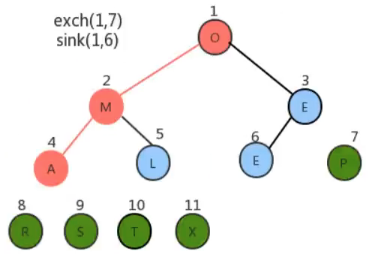

# 1. 6-堆

## 1.1. 堆的定义

堆是计算机科学中一类特殊的数据结构的统称，堆通常可以看做是一棵完全二叉树的数组对象。

### 1.1.1. 堆的特性

#### 1.1.1.1. 特性1：是完全二叉树

它是完全二叉树，除了树的最后一层节点不需要是满的，其他的每一层从左到右都是满的。如果最后一层不是满的，则是左满右不满


#### 1.1.1.2. 特性2：由数组实现

它通常用数组来实现，具体方法就是将二叉树的节点按照层级顺序放入数组中，根节点在位置 1，它的子节点在位置 2 和 3 ，而孙子节点则分别在位置 4、5、6 和 7，以次类推。

通常数组的 0 索引置空，且将最大的元素放到 1 索引处。


如上图，如果一个节点的索引位置为 k，则它的父节点的位置为 [k/2]。而它的两个子节点的位置则分别为 2k 和 2k+1.

这样，在不使用指针的情况下，我们也可以通过计算数组的索引在数中上下移动：从 a[k] 向上一层，就让 k=k/2；向下一层就让 k=2k 或 k=2k+1.

#### 1.1.1.3. 特性3：节点>=子节点

每个节点都大于等于它的两个子节点。所以，**根节点就是最大的节点**。

需要注意，**堆中仅仅规定了每个节点大于等于它的两个子节点，但这两个子节点的顺序并没有做规定**。这与前面的二叉查找树是有区别的。

## 1.2. 堆的 API 设计


## 1.3. 堆的实现

### 1.3.1. 插入和上浮

[原视频 P98](https://www.bilibili.com/video/BV1Cz411B7qd?p=98&spm_id_from=pageDriver)

堆是用数组完成数据元素的存储中，由于数组的底层是一串连续的内存地址，所以我们要往堆中插入数据时只能从索引 0 开始（不包含 0），依次往后存放数据。

但是堆中对元素的数据是有要求的，每一个节点的数据都要大于或等于它的两个子节点的数据，所以，每次插入一个元素，都会使得堆中的数据顺序变乱，此时我们就需要通过一些方法让刚才插入的这个数据放入到合适的位置。


所以，如果向堆中插入新元素时，我们只需要不断的比较新节点 a[k] 和它的父节点 a[k/2] 的大小，然后根据结果完成数据元素的交换，就可以完成堆的有序调整。


```java
/**
 * CnPeng 4/7/21 6:15 PM
 * 功用：向堆中插入一个元素
 */
public void insert(T t) {
    // 堆中 0 索引置空，所以此处使用 ++N
    items[++N] = t;
    swim(N);
}
/**
 * CnPeng 4/7/21 6:16 PM
 * 功用：使用上浮算法让索引 k 处的元素能在堆中处于正确的位置
 * 说明：通过循环，不断比较当前节点和其父节点的值，如果插入的数据大于其父节点，则需要上浮（交换位置）；
 * 上浮时还需要与父节点的父节点比较，直到找到比新插入节点大的父节点为止。
 */
private void swim(int k) {
    // k>1 即表示 k 从 2 开始，
    while (k > 1) {
        // k/2 即 k 父节点的索引
        if (less(k / 2, k)) {
            // 父节点小于子节点时，交换位置
            exch(k / 2, k);
        }
        // 交换之后，更新 k 的值，不断上浮。
        k = k / 2;
    }
}
```

### 1.3.2. 删除和下沉

[原视频 P99](https://www.bilibili.com/video/BV1Cz411B7qd?p=99&spm_id_from=pageDriver)

根据堆的特性我们可以知道，索引 1 处（根节点）的元素就是最大元素，当我们把根节点的元素删除之后，需要有一个新的根节点出现。

此时，我们可以暂时把堆中最后一个元素放到索引 1 处，充当根节点，但是它有可能不满足堆的有序性需求，所以，我们就需要通过一些方法让这个新的根节点放入到合适的位置。


所以，当删除掉最大元素后，只需要将最后一个元素放到索引 1 处，并不断的拿着**当前节点 a[k] 与它的子节点 a[2k] 和 a[2k+1] 中的较大者交换位置**，即可完成堆的有序调整。

```java
/**
 * CnPeng 4/7/21 6:17 PM
 * 功用：删除堆中的最大元素，并返回该元素
 */
public T delMax() {
    // 去最大值
    T max = items[1];
    // 交换索引 1 和最大索引处的元素，让完全二叉树中最右侧的元素变为临时根节点
    exch(1, N);
    // 删除最大索引处的元素
    items[N] = null;
    // 元素个数 -1
    N--;
    // 通过下沉调整堆，让堆重新有序
    sink(1);
    return max;
}
/**
 * CnPeng 4/7/21 6:17 PM
 * 功用：使用下沉算法让索引 k 处的元素能在堆中处于正确的位置
 * 说明：将 k 处的元素与其左右子元素中的大者比较，如果 k 处元素小于大者，则交换。
 */
private void sink(int k) {
    // 2*k 为 k 的左子节点索引，2*k+1 为 k 的右子节点
    while (2 * k <= N) {
        int maxIndex;
        if (2 * k + 1 <= N) {
            // 2*k+1<=N 表示有右子节点。此时获取左右节点中，较大的那一个
            maxIndex = less(2 * k, 2 * k + 1) ? 2 * k + 1 : 2 * k;
        } else {
            // 如果没有右子节点，直接返回左子节点
            maxIndex = 2 * k;
        }
        if (!less(k, maxIndex)) {
            // 如果 k 节点元素大于左右子节点中的大值，跳过此次循环
            break;
        }
        // 如果 k 处的元素比其子节点中的大值小，则交换
        exch(k, maxIndex);
        // 更新 k 的值
        k = maxIndex;
    }
}
```

### 1.3.3. 完整代码

```java
package heap;

/**
 * 作者：CnPeng 4/7/21 6:12 PM
 * 功用：堆
 * 其他：
 */
class Heap<T extends Comparable<T>> {
    // 堆中的元素
    private T[] items;
    // 元素个数
    private int N;

    public Heap(int capacity) {
        // 初始化数组，并强转。元素可比较，所以是 Comparable；因为 0 索引不存数据，所以 容量+1
        this.items = (T[]) new Comparable[capacity + 1];
        this.N = 0;
    }

    /**
     * CnPeng 4/7/21 6:14 PM
     * 功用：判断索引 i 处的元素是否小于索引 j 处的元素
     */
    private boolean less(int i, int j) {
        return items[i].compareTo(items[j]) < 0;
    }

    /**
     * CnPeng 4/7/21 6:15 PM
     * 功用：将堆中索引 i 和 j 处的元素交换
     */
    private void exch(int i, int j) {
        T temp = items[i];
        items[i] = items[j];
        items[j] = temp;
    }

    /**
     * CnPeng 4/7/21 6:15 PM
     * 功用：向堆中插入一个元素
     */
    public void insert(T t) {
        // 堆中 0 索引置空，所以此处使用 ++N
        items[++N] = t;

        swim(N);
    }

    /**
     * CnPeng 4/7/21 6:16 PM
     * 功用：使用上浮算法让索引 k 处的元素能在堆中处于正确的位置
     * 说明：通过循环，不断比较当前节点和其父节点的值，如果插入的数据大于其父节点，则需要上浮（交换位置）；
     * 上浮时还需要与父节点的父节点比较，直到找到比新插入节点大的父节点为止。
     */
    private void swim(int k) {
        // k>1 即表示 k 从 2 开始，
        while (k > 1) {
            // k/2 即 k 父节点的索引
            if (less(k / 2, k)) {
                // 父节点小于子节点时，交换位置
                exch(k / 2, k);
            }
            // 交换之后，更新 k 的值，不断上浮。
            k = k / 2;
        }
    }

    /**
     * CnPeng 4/7/21 6:17 PM
     * 功用：删除堆中的最大元素，并返回该元素
     */
    public T delMax() {
        // 去最大值
        T max = items[1];
        // 交换索引 1 和最大索引处的元素，让完全二叉树中最右侧的元素变为临时根节点
        exch(1, N);
        // 删除最大索引处的元素
        items[N] = null;
        // 元素个数 -1
        N--;
        // 通过下沉调整堆，让堆重新有序
        sink(1);
        return max;
    }

    /**
     * CnPeng 4/7/21 6:17 PM
     * 功用：使用下沉算法让索引 k 处的元素能在堆中处于正确的位置
     * 说明：将 k 处的元素与其左右子元素中的大者比较，如果 k 处元素小于大者，则交换。
     */
    private void sink(int k) {
        // 2*k 为 k 的左子节点索引，2*k+1 为 k 的右子节点
        while (2 * k <= N) {
            int maxIndex;

            if (2 * k + 1 <= N) {
                // 2*k+1<=N 表示有右子节点。此时获取左右节点中，较大的那一个
                maxIndex = less(2 * k, 2 * k + 1) ? 2 * k + 1 : 2 * k;
            } else {
                // 如果没有右子节点，直接返回左子节点
                maxIndex = 2 * k;
            }

            if (!less(k, maxIndex)) {
                // 如果 k 节点元素大于左右子节点中的大值，跳过此次循环
                break;
            }

            // 如果 k 处的元素比其子节点中的大值小，则交换
            exch(k, maxIndex);
            // 更新 k 的值
            k = maxIndex;
        }
    }
}
```

测试代码：

```java
package heap;

/**
 * 作者：CnPeng 4/7/21 8:31 PM
 * 功用：堆测试
 * 其他：
 */
class HeapTest {
    public static void main(String[] args) {
        // 创建堆对象
        Heap<String> heapObj = new Heap<>(10);

        // 向堆中插入字符串数据
        heapObj.insert("A");
        heapObj.insert("B");
        heapObj.insert("C");
        heapObj.insert("D");
        heapObj.insert("E");
        heapObj.insert("F");
        heapObj.insert("G");

        // 通过循环从堆中删除数据
        String result;
        while (null != (result = heapObj.delMax())) {
            System.out.print(result);
        }
    }
}
```

运行结果：


## 1.4. 堆排序


### 1.4.1. 堆排序实例

#### 1.4.1.1. 需求

给定一个数组：`String[]arr={"S","O","R","T","E","X","A","M","P","L","E"}` , 将数组中的字符按照从小到大排序。

#### 1.4.1.2. API 设计


#### 1.4.1.3. 实现步骤

* 构造堆
* 得到堆顶元素，该值为最大值
* 交换堆顶元素和数组中的最后一个元素，此时所有元素中的最大元素已经放到合适的位置
* 对堆进行调整，重新让除了最后一个元素的剩余元素中的最大值放到堆顶
* 重复 2-4 这个步骤，直到堆中剩一个元素为止

先构造类及其简单的方法，如下：

```java
package heap;

/**
 * 作者：CnPeng 4/8/21 8:30 AM
 * 功用：堆排序
 * 其他：
 */
class HeapSort {
    /**
     * CnPeng 4/8/21 8:31 AM
     * 功用：判断 heap 中，i 处的元素是否小于 j 处的元素
     */
    private static boolean less(Comparable[] heap, int i, int j) {
        return heap[i].compareTo(heap[j]) < 0;
    }

    /**
     * CnPeng 4/8/21 8:32 AM
     * 功用：交换 heap 中 i 处和 j 处的元素
     */
    private static void exch(Comparable[] heap, int i, int j) {
        Comparable temp = heap[i];
        heap[i] = heap[j];
        heap[j] = temp;
    }

    /**
     * CnPeng 4/8/21 8:33 AM
     * 功用：基于原数组 source 构造出堆 heap
     */
    private static void createHeap(Comparable[] source, Comparable[] heap) {
    }

    /**
     * CnPeng 4/8/21 8:34 AM
     * 功用：对 source 中的数据从小到大排序
     */
    public static void sort(Comparable[] source) {

    }

    /**
     * CnPeng 4/8/21 8:35 AM
     * 功用：在 heap 堆中，对 target 处的元素做下沉，范围是 0-range，即参与下沉调整的元素索引为 0-range
     */
    public static void sink(Comparable[] heap, int target, int range) {

    }
}

```

在构造堆之前，需要先了解堆构造的原理。

### 1.4.2. 堆构造

#### 1.4.2.1. 堆构造原理


堆的构造，最直观的想法就是另外再构建一个新数组，然后从左向右遍历原数组，每得到一个元素就添加到新数组中，并通过**上浮**对堆进行调整，遍历完成后，新数组就是一个堆数组。

上述的方式虽然很直观，也很简单，但我们可以用更聪明一些的办法来实现它。如下：

创建一个新数组，把原数组 0~length-1 的数据拷贝到新数组的 1~length 处，再从新数组长度一半处开始往 1 索引处扫描（从右向左），然后对扫描到的每一个元素做下沉调整即可。

之所以从 **一半处** 开始向左遍历，是因为，根据堆的特性——堆是完全二叉树 可知，从一半处向后都是叶子节点——即没有子节点的节点，叶子节点不需要下沉。

假设有数组 `String[]arr={"S","O","R","T","E","X","A","M","P","L","E"}`, 其堆构造过程示意图如下：


> 上图中的 sink(5,11) 表示将 5 处的元素下沉，下沉索引范围是 0-11，对应前面实例 API 设计中的 sink 方法。


上图中，2 处之前为 O，4 处之前为 T，9 处之前为 P。在对 2 处做下沉时，因为 T 在 O 的后面，所以，T 和 O 处元素交换，即 2 处为 T，4 处为 O。4 处元素在和他子节点元素比较，O 在 P 的后面，所以，4 处和 9 处的元素再交换，即 4 处变为 P，9 处变为 O。


#### 1.4.2.2. 堆构造的实现

```java
/**
 * CnPeng 4/8/21 8:33 AM
 * 功用：基于原数组 source 构造出堆 heap
 */
private static void createHeap(Comparable[] source, Comparable[] heap) {
    //1-把source 中的元素拷贝到 heap 中，heap 中的元素就形成一个无序的堆
    // 1-1-参数分别为：源数组，从原数组的起始拷贝索引，目标数组，接收拷贝元素的起始索引，拷贝多少个元素，
    System.arraycopy(source, 0, heap, 1, source.length);
    //2-对堆中的元素做下沉调整——从长度一半处向左扫描，到索引1。一半向后为没有子节点的叶子节点，不需要下沉。
    for (int i = heap.length / 2; i > 0; i--) {
        sink(heap, i, heap.length - 1);
    }
}

/**
 * CnPeng 4/8/21 8:35 AM
 * 功用：在 heap 堆中，对 target 处的元素做下沉，范围是 0-range，即参与下沉调整的元素索引为 0-range
 */
public static void sink(Comparable[] heap, int target, int range) {
    while (2 * target <= range) {
        //1- 找出当前节点的较大子节点（target 的子节点为 2*target 和 2*target+1）
        int max;
        if (2 * target + 1 <= range) {
            // 2*target+1<=rang , 表示 target 有右子节点
            // 如果左子节点 2*target 的元素 < 右子节点 2*target+1 处的元素，则较大值为右子节点，反之亦然。
            max = less(heap, 2 * target, 2 * target + 1) ? 2 * target + 1 : 2 * target;
        } else {
            // 没有右子节点时，左子节点即为大值
            max = 2 * target;
        }
        //2-比较 target 和其较大子节点，
        if (!less(heap, target, max)) {
            // 如果 target 节点内容 > 其较大子节点的内容，终止
            break;
        }
        //3-target处的内容 < 较大子节点内容时，交换
        exch(heap, target, max);
        target = max;
    }
}
```

### 1.4.3. 堆排序

[原视频 P104](https://www.bilibili.com/video/BV1Cz411B7qd?p=104&spm_id_from=pageDriver)

#### 1.4.3.1. 堆排序原理

对构造好的堆，我们只需要做类似于堆的删除操作，就可以完成排序。

* 将堆顶元素和堆中最后一个元素交换位置
* 通过对堆顶元素下沉调整堆，把最大的元素放到堆顶（此时最后一个元素不参与堆的调整，因为最大的数据已经到了数组的最右边）
* 重复前两步，知道堆中剩余最后一个元素





#### 1.4.3.2. 堆排序实现

```java
/**
 * CnPeng 4/8/21 8:34 AM
 * 功用：对 source 中的数据从小到大排序
 */
public static void sort(Comparable[] source) {
    // 1-构建堆
    Comparable[] heap = new Comparable[source.length + 1];
    createHeap(source, heap);
    // 2-定义变量，记录未排序元素的最大索引
    int N = heap.length - 1;
    // 3-通过循环，交换索引 1 处和未排序元素最大索引处的元素
    while (N != 1) {
        exch(heap, 1, N);
        // 交换后的 原未排序元素最大索引 不参与下沉排序
        N--;
        // 对索引 1 处的元素进行下沉调整
        sink(heap, 1, N);
    }
    // 4-将排序后的元素复制到源中
    System.arraycopy(heap, 1, source, 0, source.length);
}
```

### 1.4.4. 完整代码

```java
package heap;

/**
 * 作者：CnPeng 4/8/21 8:30 AM
 * 功用：堆排序
 * 其他：
 */
class HeapSort {
    /**
     * CnPeng 4/8/21 8:31 AM
     * 功用：判断 heap 中，i 处的元素是否小于 j 处的元素
     */
    private static boolean less(Comparable[] heap, int i, int j) {
        return heap[i].compareTo(heap[j]) < 0;
    }

    /**
     * CnPeng 4/8/21 8:32 AM
     * 功用：交换 heap 中 i 处和 j 处的元素
     */
    private static void exch(Comparable[] heap, int i, int j) {
        Comparable temp = heap[i];
        heap[i] = heap[j];
        heap[j] = temp;
    }

    /**
     * CnPeng 4/8/21 8:33 AM
     * 功用：基于原数组 source 构造出堆 heap
     */
    private static void createHeap(Comparable[] source, Comparable[] heap) {
        //1-把source 中的元素拷贝到 heap 中，heap 中的元素就形成一个无序的堆
        // 1-1-参数分别为：源数组，从原数组的起始拷贝索引，目标数组，接收拷贝元素的起始索引，拷贝多少个元素，
        System.arraycopy(source, 0, heap, 1, source.length);
        //2-对堆中的元素做下沉调整——从长度一半处向左扫描，到索引1。一半向后为没有子节点的叶子节点，不需要下沉。
        for (int i = heap.length / 2; i > 0; i--) {
            // 将无序堆变成有序堆(父节点元素>=子元素)
            sink(heap, i, heap.length - 1);
        }
    }

    /**
     * CnPeng 4/8/21 8:34 AM
     * 功用：对 source 中的数据从小到大排序
     */
    public static void sort(Comparable[] source) {
        // 1-构建堆
        Comparable[] heap = new Comparable[source.length + 1];
        createHeap(source, heap);
        // 2-定义变量，记录未排序元素的最大索引
        int N = heap.length - 1;
        // 3-通过循环，交换索引 1 处和未排序元素最大索引处的元素
        while (N != 1) {
            exch(heap, 1, N);
            // 交换后的 原未排序元素最大索引 不参与下沉排序
            N--;
            // 对索引 1 处的元素进行下沉调整
            sink(heap, 1, N);
        }
        // 4-将排序后的元素复制到源中
        System.arraycopy(heap, 1, source, 0, source.length);
    }

    /**
     * CnPeng 4/8/21 8:35 AM
     * 功用：在 heap 堆中，对 target 处的元素做下沉，范围是 0-range，即参与下沉调整的元素索引为 0-range
     */
    public static void sink(Comparable[] heap, int target, int range) {
        while (2 * target <= range) {
            //1- 找出当前节点的较大子节点（target 的子节点为 2*target 和 2*target+1）
            int max;
            if (2 * target + 1 <= range) {
                // 2*target+1<=rang , 表示 target 有右子节点
                // 如果左子节点 2*target 的元素 < 右子节点 2*target+1 处的元素，则较大值为右子节点，反之亦然。
                max = less(heap, 2 * target, 2 * target + 1) ? 2 * target + 1 : 2 * target;
            } else {
                // 没有右子节点时，左子节点即为大值
                max = 2 * target;
            }

            //2-比较 target 和其较大子节点，
            if (!less(heap, target, max)) {
                // 如果 target 节点内容 > 其较大子节点的内容，终止
                break;
            }

            //3-target处的内容 < 较大子节点内容时，交换
            exch(heap, target, max);
            target = max;
        }
    }
}
```

测试代码：

```java
package heap;

import java.util.Arrays;

/**
 * 作者：CnPeng 4/8/21 5:10 PM
 * 功用：堆排序测试
 * 其他：
 */
class HeapSortTest {
    public static void main(String[] args) {

        // 待排序数组
        String[] arr = {"S", "O", "R", "T", "E", "X", "A", "M", "P", "L", "E"};
        // 通过堆排序对数组中的元素排序
        HeapSort.sort(arr);

        System.out.println(Arrays.toString(arr));

        // 打印排序后的数组元素
        for (int i = 0; i < arr.length; i++) {
            System.out.println(i + " = [" + arr[i] + "]");
        }
    }
}
```

运行结果：


