# 1. 001-认识机器人

可应用于焊接、搬运、码垛、打磨、切割、抓取等多种领域。

## 1.1. 安全操作规程

### 1.1.1. 示教和手动机器人

* 确认机器人底座固定牢固、完好
* **请不要带着手套操作示教器和操作面板。**
* 确认视角和急停按键按下后伺服动力电机处于断电状态，且电机处于抱闸状态。
* 在点动操作机器人时要采用较低的速度倍率以增加对机器人的控制机会。
* 在按下示教器上的点动键之前要考虑到机器人的运动趋势。考虑好避让机器人的运动轨迹，并确认该路线不受干涉。
* 机器人周围区域必须清洁、无油、水及杂质等。

### 1.1.2. 生产运行

* 在开机运行前，必须知道机器人根据所编程序将要执行的全部任务。
* 必须知道所有会左右机器人移动的开关、传感器和控制信号的位置和状态。
* 必须知道机器人控制柜和外围控制设备上的**紧急停止按钮的位置**，准备再紧急情况下使用这些按钮。
* 永远不要认为机器人没有移动其程序就已经完成。因为这时机器人很有可能是在等待让它继续移动的输入信号。

## 1.2. 工业机器人本体

### 1.2.1. 工业机器人类型

常见的工业机器人类型：

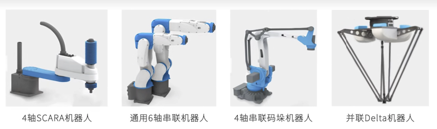 

### 1.2.2. 工业机器人的主要参数

* 电机参数
* 减速比
* 编码器精度
* 杆长参数
* 耦合参数

上述参数共同影响了机器人的正常运行与精度。

### 1.2.3. 机器人本体

工业机器人本体主要组成部分包括：谐波减速机、机械本体、伺服电机、线缆。 

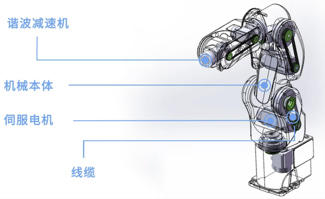

#### 1.2.3.1. RV减速机

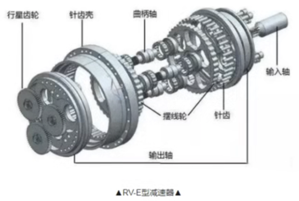

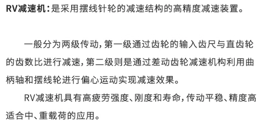 

#### 1.2.3.2. 谐波减速机

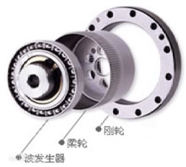

#### 1.2.3.3. 伺服电机

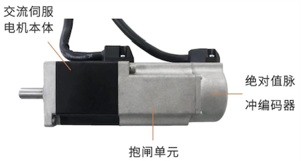

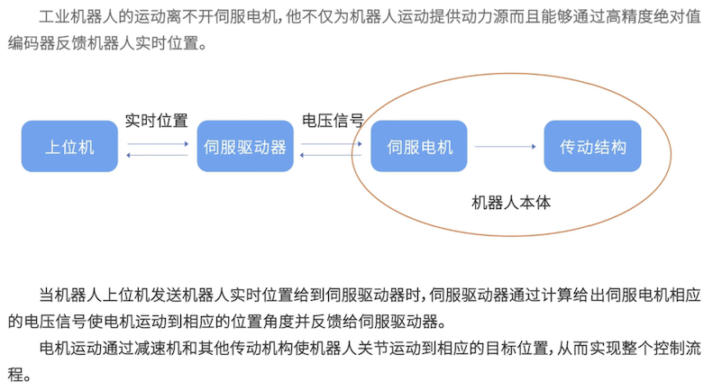

## 1.3. 机器人控制柜

### 1.3.1. 组成部分

机器人控制柜主要由以下部分构成：

* 安全电路包含各种断路器、交流接触器、继电器等。
* 电源模块包含开关电源、变压器等。
* 伺服驱动器
* 机器人运动控制器
* 模拟、数字IO 通讯模块，示教器通讯模块。

控制柜内部视图：

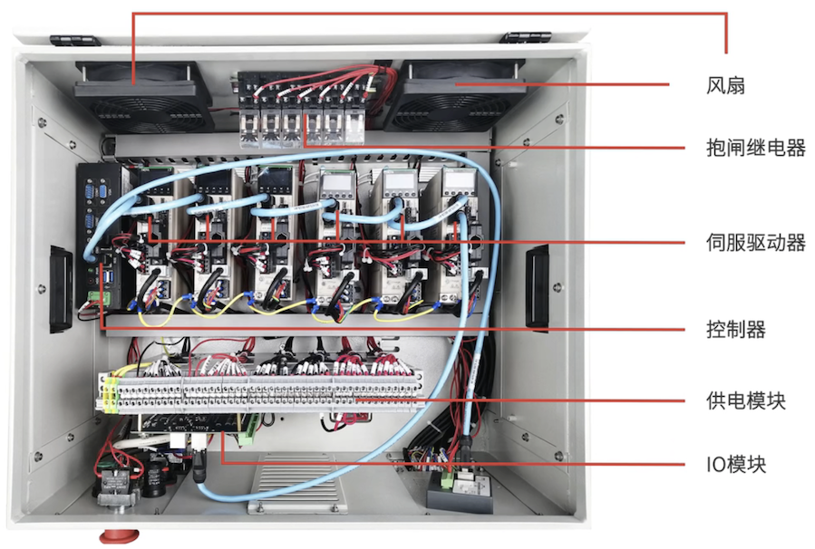

控制柜外部视图：

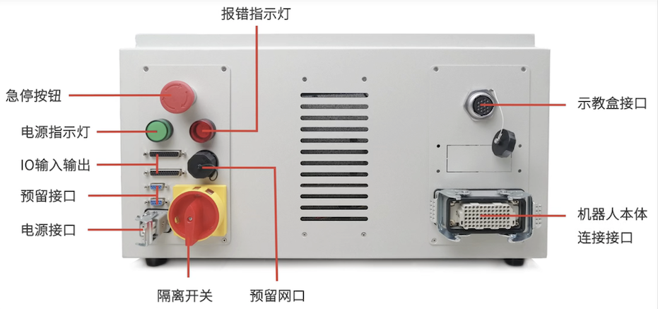

### 1.3.2. 内部连接

工业机器人控制柜内部各组成部分之间的连接比较简单，主要分成两块：电路连接、通讯连接。

#### 1.3.2.1. 电路连接

根据国家电气连接标准按照功率电流大小选择合适的线径接线，利用自锁电路控制柜体 220v 交流主电的通断，24v 开关电源给各个元器件供电。

#### 1.3.2.2. 通讯连接

总线式控制器、驱动器、IO 通讯板和示教器通讯板之间采用网线连接，建议使用工业级屏蔽网线。

一般连接顺序为：示教器通讯板 -> 控制器  ->  驱动器  ->  IO 通讯板。 

## 1.4. 机器人示教器

在操作机器人时都是通过示教器来实现的。

### 1.4.1. 什么是示教器

工业机器人示教器是人机交互的工具，工业机器人的所有基本操作都可以通过它来完成。

比如使用它蚁动机器人、**进行机器人程序编程**、监控机器人的各个状态、**进行系统的升级**、配置机器人等。

示教器一般由液晶屏幕和操作按键组成，每家的按键使用方式及第一功能都不同，但都是为了使我们更方便的熟悉操作工业机器人。

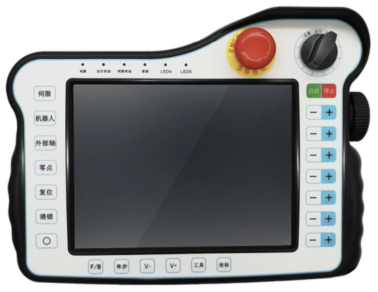

### 1.4.2. 示教器使能按键

使能按键就是让示教器开始工作的按键，可以理解为一种特殊的开关。

在工业机器人安全操作过程中 **`使能按键`** 具有非常重要的作用，**在示教模式下移动机器人的必需条件就是按下`使能按键`**。

`使能按键` 采用三位安全开关的模式，只有当按键处于中间状态下机器人才会使能，其他两个状态都处于非使能状态。

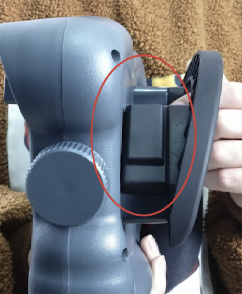

### 1.4.3. 示教器功能按钮

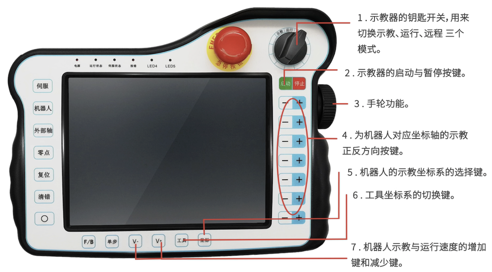

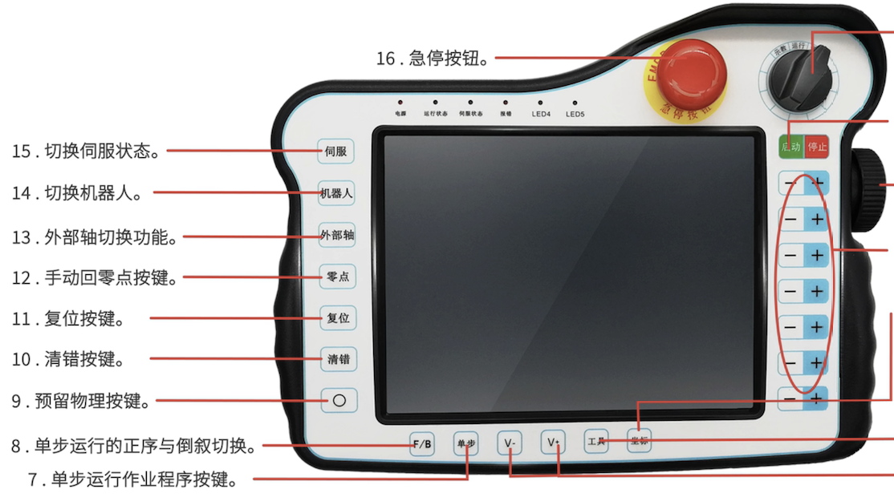
