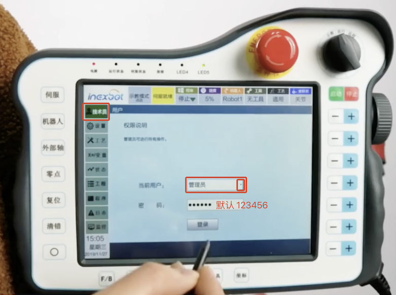
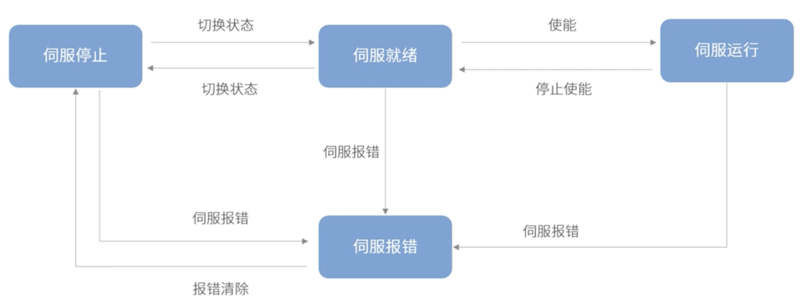
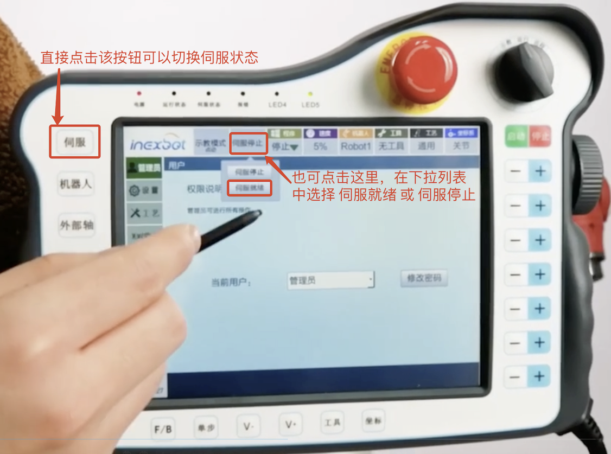
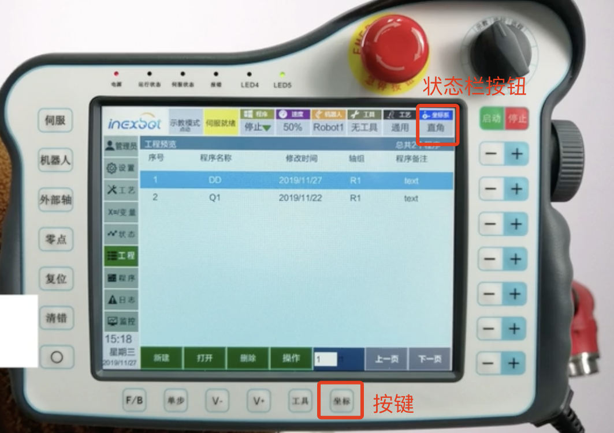
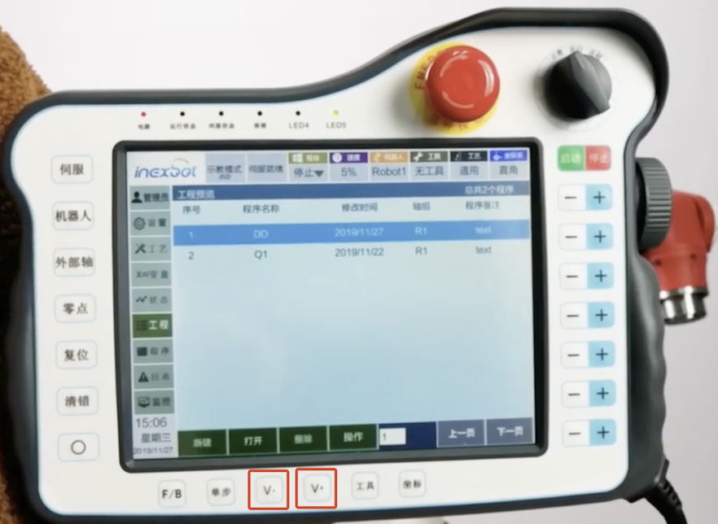
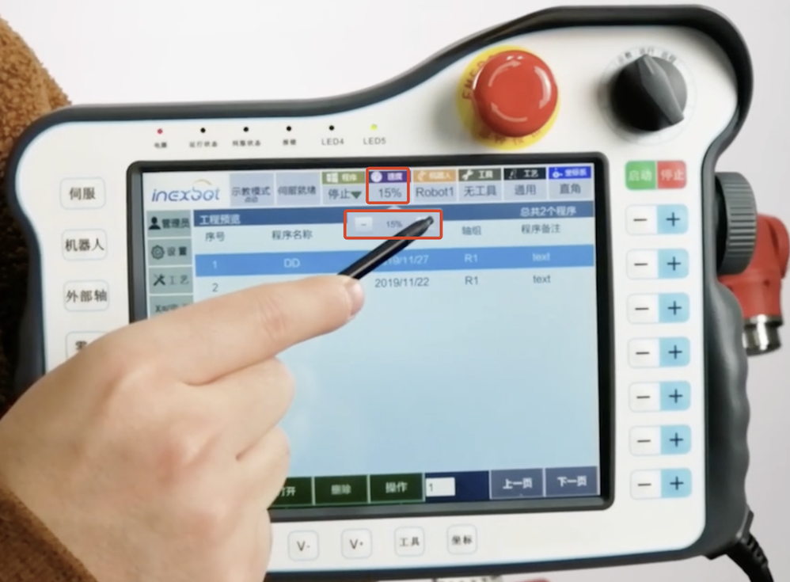
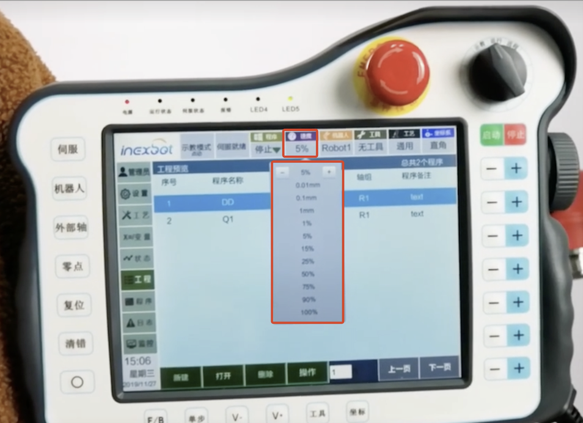
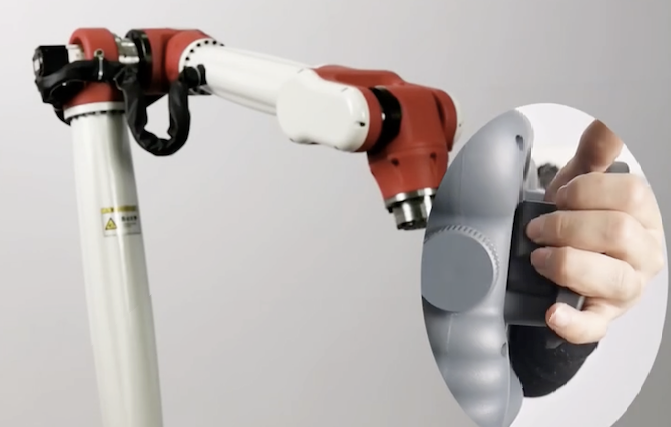
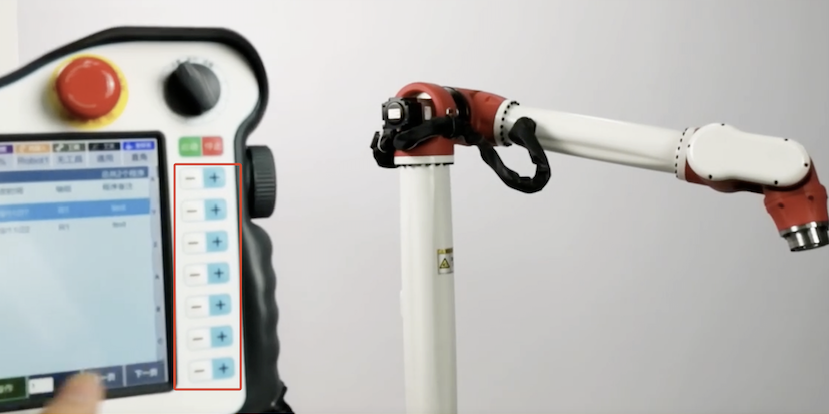

# 1. 002-让机器人动起来

 让机器人动起来的核心步骤包括：

* 切换权限
* 切换伺服状态
* 调整坐标系
* 调整速度
* 使能按键
* 轴对应按键

## 1.1. 示教器握姿

示教器 `使能按键` 的位置：

示教器的正确握姿：

## 1.2. 登录权限说明及操作

### 1.2.1. 权限分类

权限分为：操作员、技术员、管理员，是针对实际工作环境中各层级人员的技术水平进行划分。

#### 1.2.1.1. 操作员

`操作员` 面向的是基础的操作工。其没有编程、调试能力，所以不可以进行参数调节、程序编写等复杂操作。

操作员的权限如下：

* 进入状态、工程、程序、日志界面。
* 打开监控窗口
* 打开已经编辑好的程序
* 切换示教、运行、远程模式
* 调节运行模式、远程模式的速度
* 运行、暂停、停止程序。

#### 1.2.1.2. 技术员

`技术员` 面向的是普通技术人员，其具有一定的编程能力，并了解工艺的使用，但对机器人的关键参数没有修改权限。

技术员的权限如下：

除 `机器人参数`、`外部轴参数`、`IP设置`、`时间设置`、`修改示教器配置`、`清空程序`、`恢复出厂设置` 之外的所有功能。

#### 1.2.1.3. 管理员

`管理员` 面向的是高级技术人员，其具备机器人调试的能力。所以可以进行所有的操作。

### 1.2.2. 角色切换（权限切换）

## 1.3. 伺服状态切换

### 1.3.1. 伺服状态

开机后，伺服驱动器默认处于停滞状态，此时无法进行 `使能`（上电）等操作。需要切换伺服的状态，使其处于就绪状态。

伺服具有以下四种状态：

* 伺服停止：处于非就绪状态，此时**不可进行使能等任何操作**。
* 伺服就绪：伺服**处于等待使能状态，此时可使用示教器进行使能操作**。
* 伺服运行：**机器人已经使能，处于运行状态，应当与机器人保持安全距离**。
* 伺服报警：伺服发生错误，此时示教器已经收到伺服的报错代码，应该根据其报错代码查阅手册，针对其报错采取对应的解决方案。

### 1.3.2. 切换伺服状态

## 1.4. 切换坐标系

根据机器人的工作环境和工作目的，我们需要分别使用各个坐标系进行示教操作，以更方便、准确地进行点位示教。

切换坐标系有两种方式，分别为：

* 通过示教器按键切换
* 通过示教器状态栏按钮切换

详细内容参考下一章节。

## 1.5. 调整点动速度

> Velocity  [vəˈlɑsəti]  速度，速率，高速，快速。

### 1.5.1. 通过按钮调节

按下下图中的 `V+` 或 `V-` 即可调整点动速度。

点动机器人需要指定机器人的运动速度。当机器人与目标点距离较远且中间没有障碍物时，可以适当将速度调快，当机器人需要移动很短的位置时，则需要将速度调慢。

#### 1.5.1.1. 速度增大

按动示教器底部的 `V+` 按钮可以增大速度，每按一次，手动操作速度按以下顺序变化：

#### 1.5.1.2. 速度减小

按动示教器底部的 `V-` 按钮可以减小速度，每按一次，手动操作速度按照以下顺序变化：

#### 1.5.1.3. 寸动

>`寸动` 是机械加工中的一种精密加工技术，也称为微进给。它是指在机床上进行微小的、高精度的进给运动，通常是以每转数或每分钟计算出的非常小的移动量，例如0.001毫米、0.0001毫米等等。寸动技术可以实现对工件表面进行高精度、光滑的加工，特别适用于制造高精度零部件和模具。
>
>在寸动加工中，需要使用高精度的机床和控制系统，并采用特殊的刀具和夹具来保证加工质量。此外，在操作过程中需要注意防止振动和误差积累等问题，以确保最终产品达到所需的精度要求。

### 1.5.2. 通过状态栏调节

## 1.6. 启动机器人

按照前述的示教器握姿握住示教器，然后按下 `使能按键`，此时会听到机器抱闸松开的声音。

与此同时，伺服状态变为了 `伺服运行`。

此时，我们按下示教器右侧的一排 `+`、`-` 按钮即可点动控制机器人了。（这些按钮表示每个轴的正向与反向。）

