# 1. 003-机器人坐标系

基于 [P3-认识坐标系](https://www.bilibili.com/video/BV1LJ411W7En/?p=3&spm_id_from=pageDriver&vd_source=52532367532c4237b88b472159331d19) 整理。

介绍各个坐标系的形式与作用。

机器人的坐标系可以分为：关节、直角、工具、用户四种。

## 1.1. 关节坐标系

`关节坐标系`（Joint coordinate system ）是设定工业机器人关节中的坐标系。

**关节坐标系中工业机器人的位置和姿态，以各关节底座侧的关节坐标系为基准而确定。**

### 1.1.1. 六个轴

机器人的 1 到 6 轴又称为 S、L、U、R、B、T 轴。

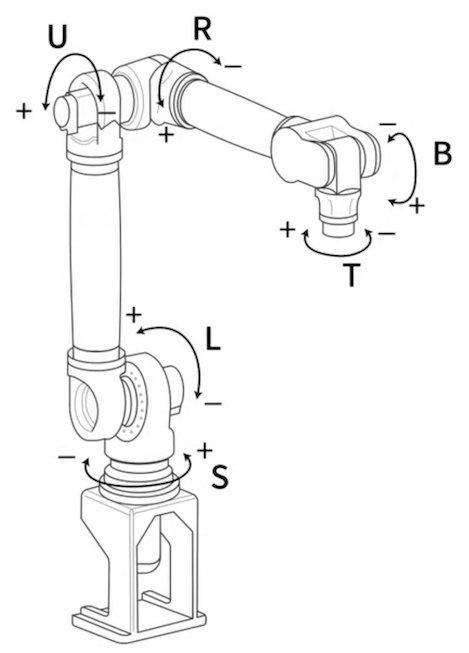

上图为关节坐标系中各关节的关节值，其中：

* S 轴、L 轴、U 轴 为 **基本轴** ，用于保证末端执行器达到工作空间任意**位置**的轴。也就是工具手能够到达空间中的任意位置。
* R 轴、B 轴、T 轴 为 **腕部轴**，用于实现末端执行器任意空间**姿态**的轴。

### 1.1.2. 轴的位置和姿态变化

下表描述了关节坐标系中操作每一个轴，机器人所表现的位置变化和姿态变化。

|  类别   |     轴名称     |  轴操作  |       动作       |                                   正向和反向描述                                   |
| ------ | ------------ | ------- | ------------ | ----------------------------------------------------------- |
| 基本轴 | 一轴（S轴） | S+/S-   | 本体左右旋转 | 向右转为正向，向左转为反向                                                   |
| 基本轴 | 二轴（L轴）  | L+/L-    | 下臂前后运动 | 向上转为正向，向下转为反向                                                   |
| 基本轴 | 三轴（U轴） | U+/U-   | 上臂上下运动 | 向上转为正向，向下转为反向                                                   |
| 腕部轴 | 四轴（R轴） | R+/R-   | 手腕旋转       | 逆时针为正方向，顺时针为反向.  （向右转为正，向左转为反） |
| 腕部轴 | 五轴（B轴） | B+/  B- | 手腕上下运动 | 向下为正方向，向上为反方向                                                   |
| 腕部轴 | 六轴（T轴）  | T+/T-   | 手腕旋转       | 逆时针为正方向，顺时针为反向.  （向右转为正，向左转为反） |

>正向和反向的前提是：示教器操作人站立在机器人正前方，且面对机器人。

机器人每个轴必须保证正方向和反方向如上表所示，否则机器人在运动过程中无法保证准确度。

示教器的轴向操作按钮如下图：

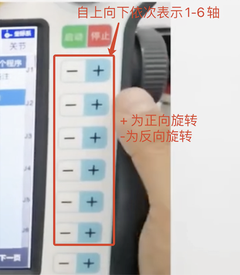

通过操作上面这些按钮就可以控制轴的正向和反向旋转。

### 1.1.3. 机器人示例

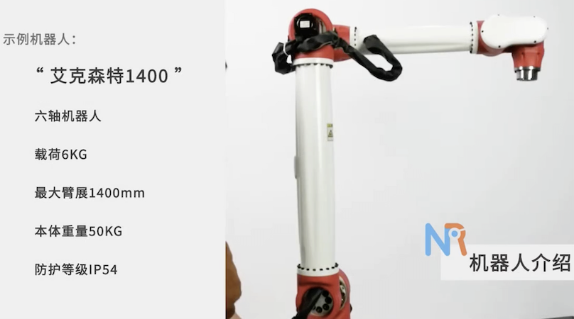

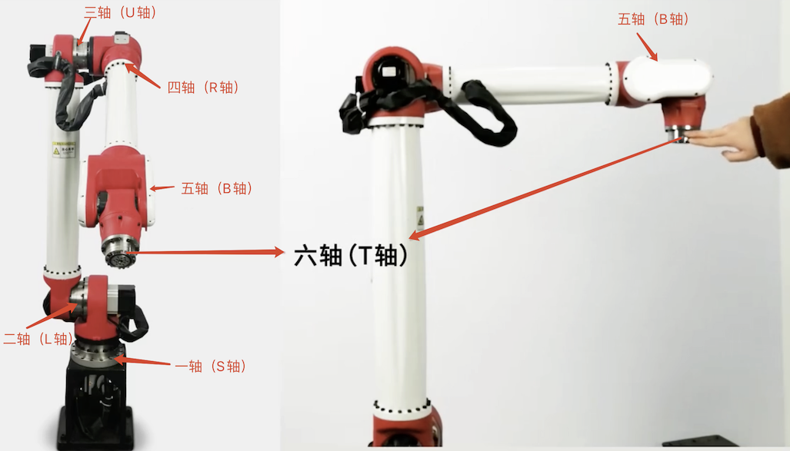

## 1.2. 直角坐标系

### 1.2.1. 直角坐标系和轴

`直角坐标系`（Cartesian coordinate system ），是**被固定在空间上的标准直角坐标系，其被固定在机器人事先确定的位置**。

这种 `直角坐标系` 在工业机器人行业中被称为 `世界坐标系` ， 也叫 `基坐标系`。

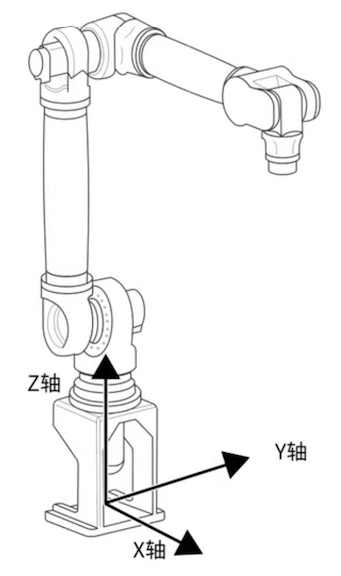

`直角坐标系` 的原点在机器人的基座中心，X、Y、Z 轴的方向如图所示。

`直角坐标系` 的原点定义在机器人轴轴线上，是与 2 轴所在水平面的交点。其方向规定：X 轴方向向前，Z 轴方向向上， Y 轴根据右手定则确定。不管机器人处于什么位置，均可沿着设定的 X 轴、Y 轴、Z 轴平行移动。

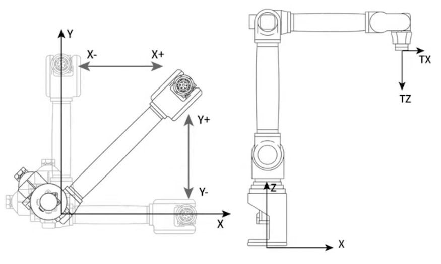

下表描述了直角坐标系中操作轴时，机器人所表现的位置变化和姿态变化：

|  类别   | 轴名称 | 轴操作 |         动作         |                                            正向和反向描述                                            |
| ------ | ------ | ------ | --------------- | ------------------------------------------------------------------------ |
| 基本轴 | X 轴    | X+/X- | 沿 X 轴平行移动 | 向前移动为正，向后移动为反。   正向时离人越来越近，反向时离人越来越远 |
| 基本轴 | Y 轴    | Y+/Y-  | 沿 Y 轴平行移动 | 向右移动为正，向左移动为反                                                                     |
| 基本轴 | Z 轴    | Z+/Z-  | 沿 Z 轴平行移动 |                                                                                                             |
| 姿态轴 | A 轴    | A+/A- | 绕 X 轴旋转       |                                                                                                             |
| 姿态轴 | B 轴    | B+/B-  | 绕 Y 轴旋转       |                                                                                                             |
| 姿态轴 | C 轴    | C+/C- | 绕 Z 轴旋转       |                                                                                                             |

>正向和反向的前提是：示教器操作人站立在机器人正前方，且面对机器人。

A、B、C 轴分别为机器人末端绕 X 、Y、Z 轴旋转。

### 1.2.2. 轴的反向示例

#### 1.2.2.1. X 轴方向

初始状态：

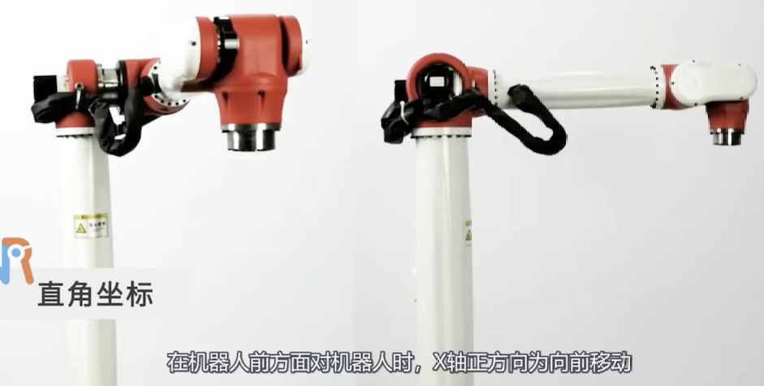

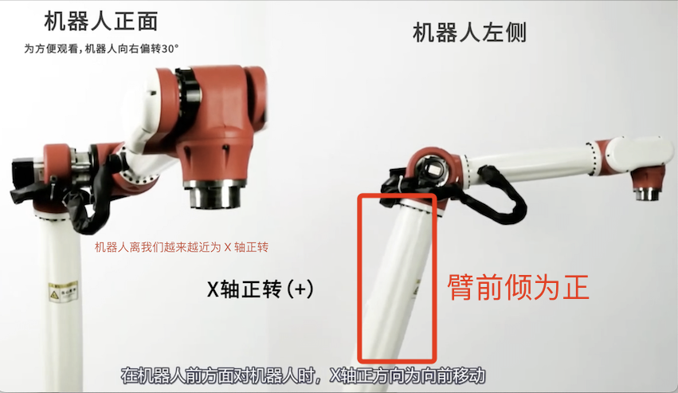

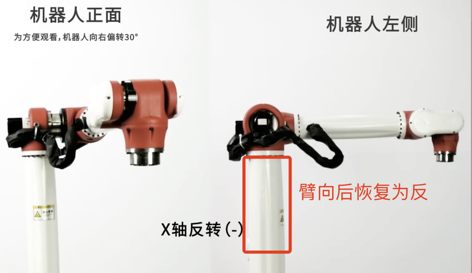

#### 1.2.2.2. Y 轴方向

初始状态

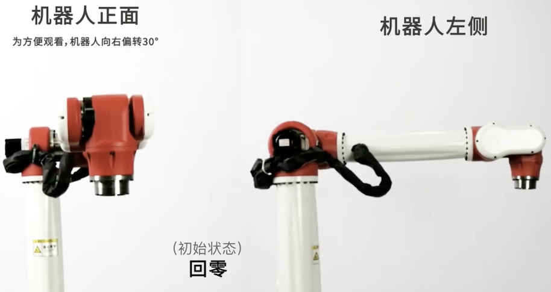

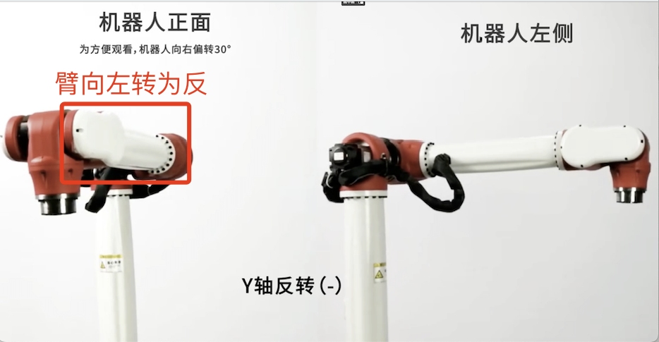

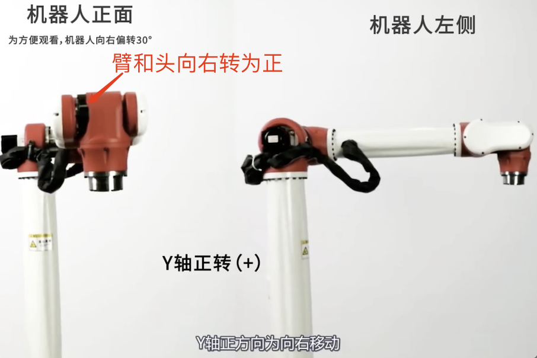

#### 1.2.2.3. Z 轴方向

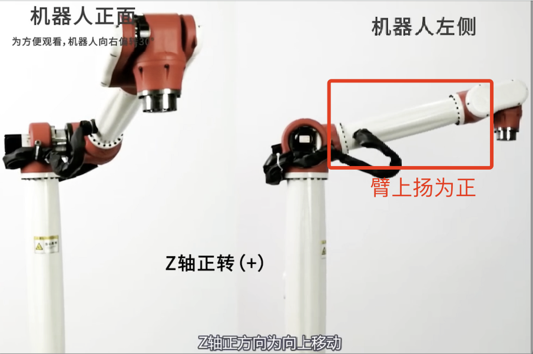

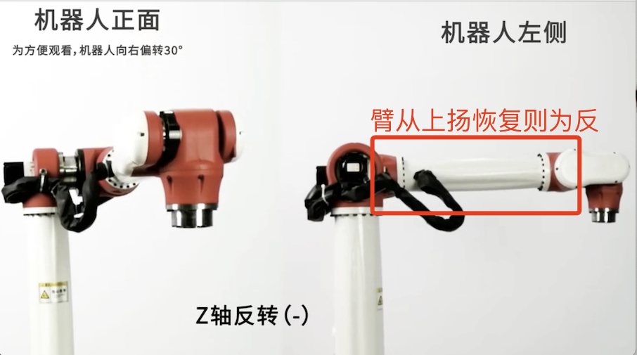

#### 1.2.2.4. A 轴方向

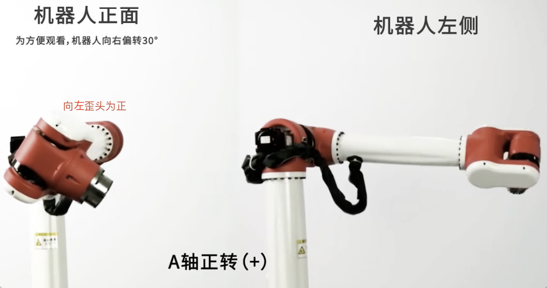

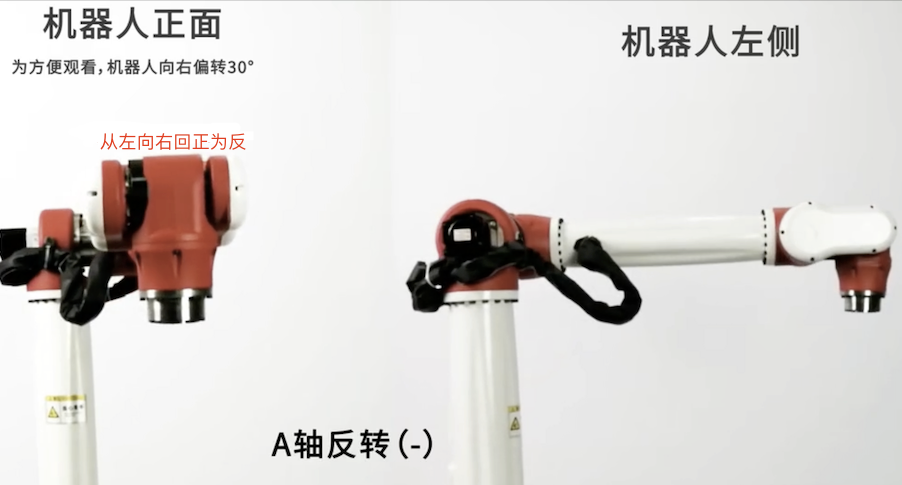

#### 1.2.2.5. B 轴方向

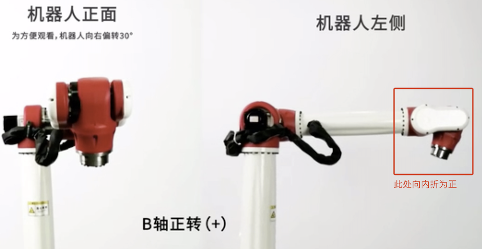

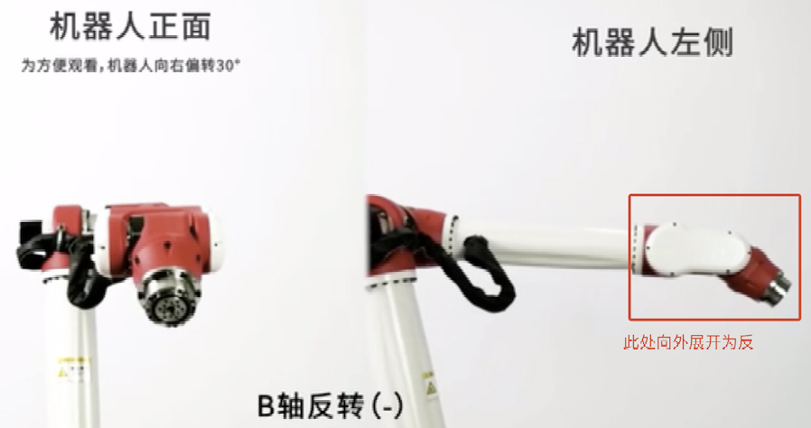

#### 1.2.2.6. C 轴方向

> CnPeng ： 原视频这里看着怪怪的。但按照关节坐标系中的描述，此处应该还是一样的。最前端的小头向右为正，向左为反。

## 1.3. 工具坐标系

### 1.3.1. 为什么引入工具坐标系和用户坐标系

实际工作中，机器人是拿着工具在工作台上工作的，工具有多重多样，工作台也并不全都是平的。现场工作环境复杂，为了利用好工具和平台的形态去更好的编程，所以引入了工具和用户坐标系。

### 1.3.2. 工具坐标系定义

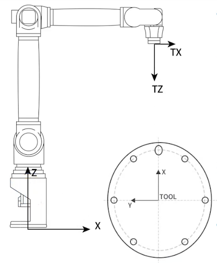

我们将机器人工具手的那个圆盘称为 `法兰盘`。

`法兰盘` 的中心就是工具中心点 TCP （Tool Center Point）， TCP 一般设置在手爪中心，焊丝端部，电焊静臂前端等工具末端。`机器人轨迹及速度` 指 TCP 点的轨迹和速度。

法兰盘中心指向法兰盘定位孔方向为 `+X` 方向，垂直法兰向外为 `+Z` 方向，最后根据右手法则即可判断 Y 方向，这就是**相对于原点的工具坐标系**。

当我们安装上其他的工具后，新的工具坐标系都是相对法兰的工具坐标系变换得到的。

> 补充：**坐标系中的右手法则**
> 
> 在坐标系中，右手法则同样有很重要的应用。一般而言，选择合适的坐标系来描述物理问题，可以简化对问题的分析和求解。
>
>其中，三维坐标系下常用的右手法则包括： 
>
>* `笛卡尔右手法则` ：在直角坐标系（x,y,z）中，将右手平放，让大拇指朝向正 z 轴方向，让食指朝向正 x 轴方向，那么此时中指所指的方向即为正 y 轴方向。这个规则经常用于表示叉积运算的结果方向，比如力矩、角动量等。
>
>* `电磁学右手法则` ：在直角坐标系（x,y,z）中，假设有一个磁场 B 和一个电场 E，同时一个电子以速度 v 运动，那么我们取右手，让四个手指分别沿着 B、E 和 v 的方向弯曲，在 v 方向上呈现出大拇指所指的方向称为该电子所受到的洛伦兹力方向。
>
>除此之外，右手法则还可以用于描述二维平面上的旋转方向、曲线斜率与切线方向的关系等。需要注意的是，不同的右手法则具有不同的应用和约定，应根据需要选择合适的方法使用。

### 1.3.3. 工具坐标系的意义

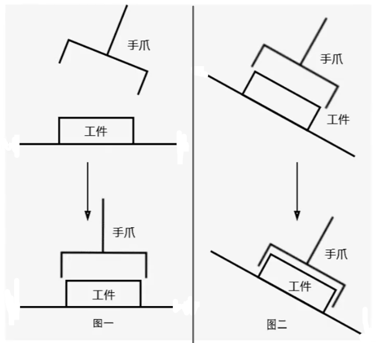

我们知道工具坐标系是运动中的一个研究对象，但是它在实际调试过程中，又起到了什么作用呢？思考上面图一和图二中手爪姿态和位置是如何调整得到的？

推测1：若图 1 中的手爪有一个旋转点，使手爪直接绕着这个旋转带你选择就可以。

推测2：若图 2 中有一个手爪的前进方向就可以直接移动过去了。

所以，**工具坐标系的意义就是：**

* 确立工具的  TCP 点（即工具中心点），方便调整工具状态。
* 确定工具进给方向，方便工具位置调整。

### 1.3.4. 如何确立工具的 TCP

使用七点标定法。

先找一个带有尖端的物体，越尖越好，如 `尖锥`。将 `尖锥` 放到机器人的可达范围内。

进入 `设置`-`工具手标定` 界面：

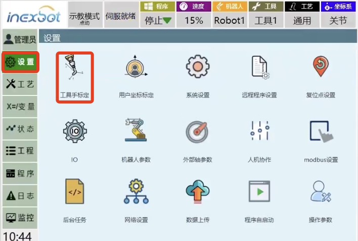

然后点击 `切换到无工具手状态`，然后在下拉列表中选择工具手序号：

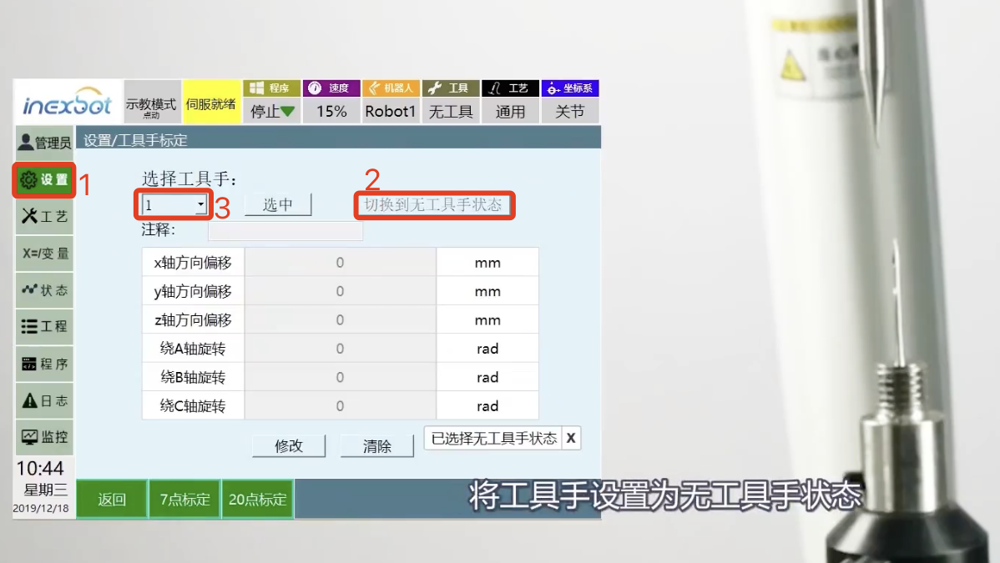

点击 `七点标定按钮`，

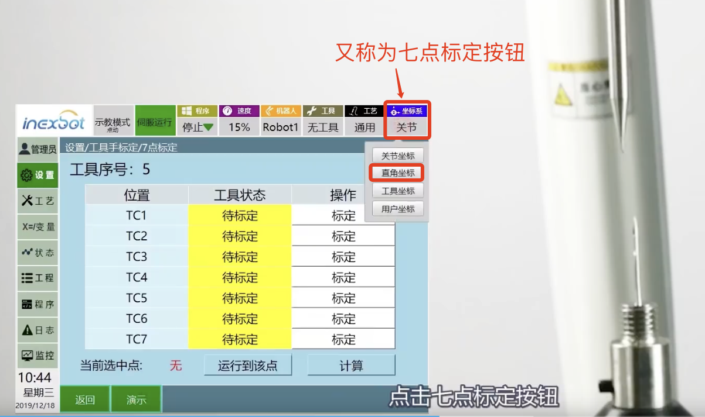

TC1 标定：工具手末端垂直向下，让工具手末端对准尖端

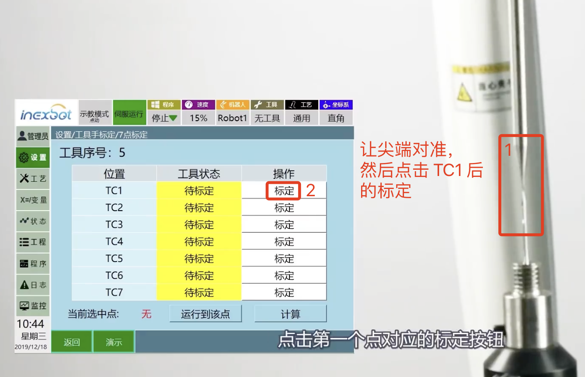

TC2 标定：在直角坐标系下，移动 A 轴、 B 轴、C 轴，调整机器人姿态，角度越大越好，让工具末端对准尖端，越准越好，然后点击 TC2 后面的 `标定`：

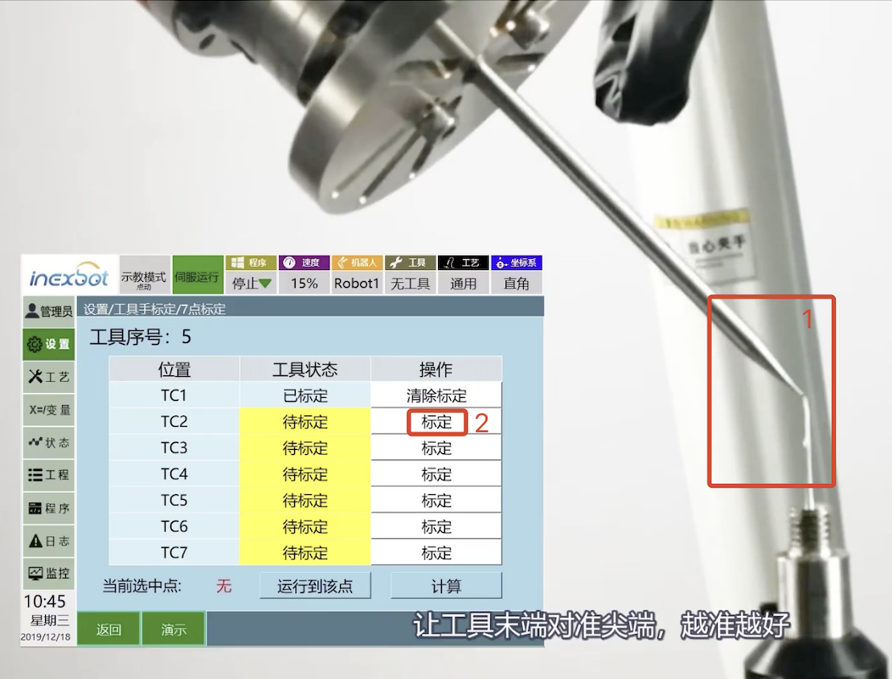

TC3 标定：移动 A 轴、B 轴、C 轴，变换机器人姿态，角度越大越好，然后让工具末端对准尖端，然后点击 TC3 后的 `标定`：

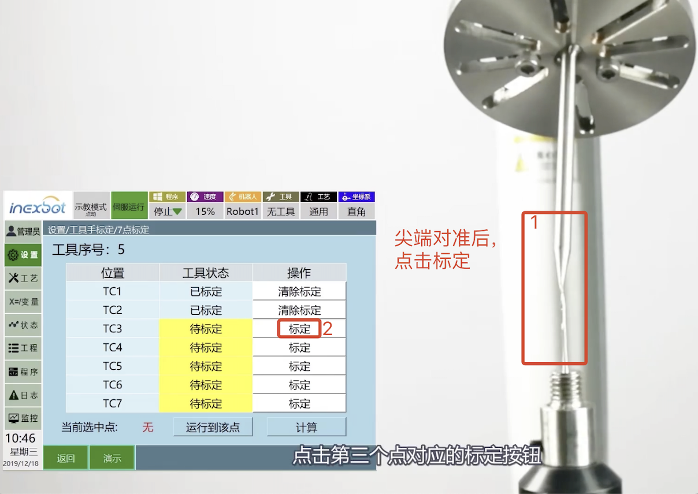

TC4 标定：移动  A 轴、B 轴、C 轴，再次变换机器人姿态，角度越大越好，让工具末端对准尖端，然后点击 TC4 后的标定：

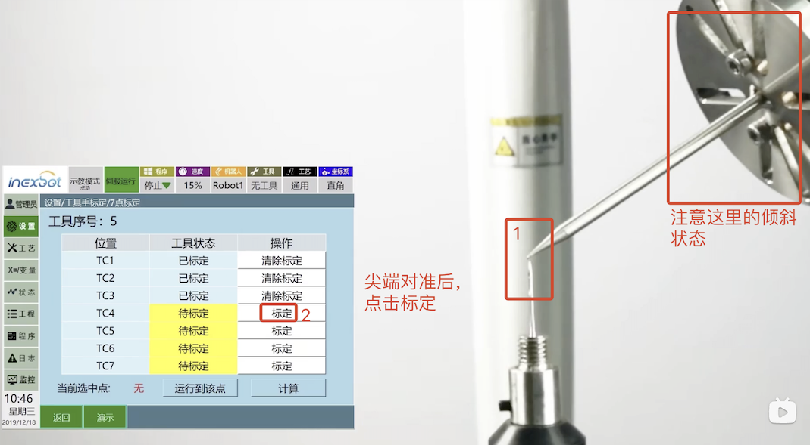

TC 5 标定：

P3-06:42