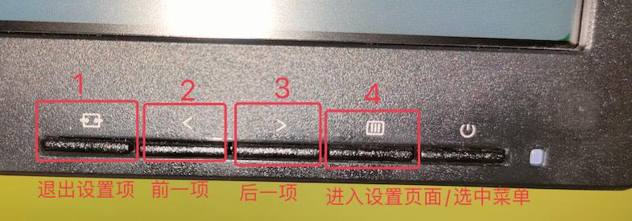

# 1. 1-Aoc的Q27P1U显示器白色页面中电流声音过大的解决

## 1.1. 问题

最近在学前端开发中的 Vue，夜间学习的时间有点长，偶然间发现打开 [Vue](https://cn.vuejs.org/guide/introduction.html) 官网中的页面时显示器会有吱吱吱的电流声，吵得很。

如果将该网站中的页面调节成夜间模式，则电流声消息；如果调节成日间模式，电流声又会附件。

尝试打开其他背景为白色，且白色内容比重较大的网页时，同样会有电流声。

## 1.2. 解决

最终经过多次尝试，发现**在显示器的设置中，将亮度值调节为高于对比度的值即可解决问题**。

显示器右下方的操作按钮及其功能如下：

点击上图中的 4 可以唤醒设置菜单，如下图：

