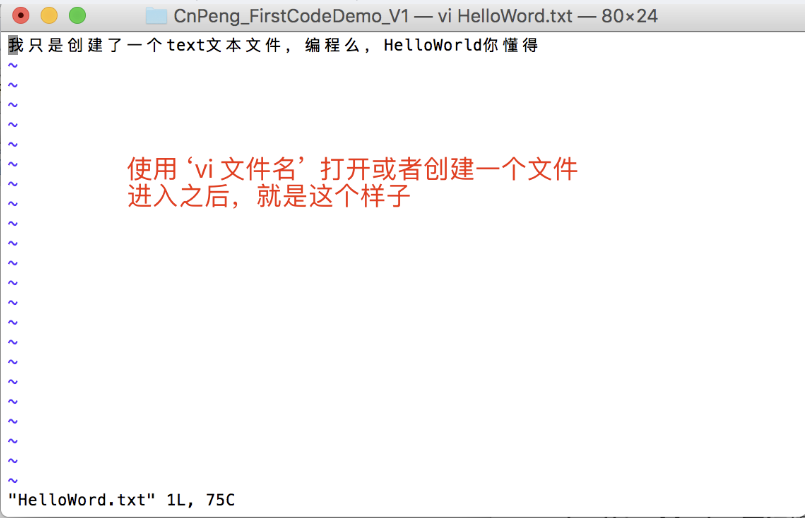
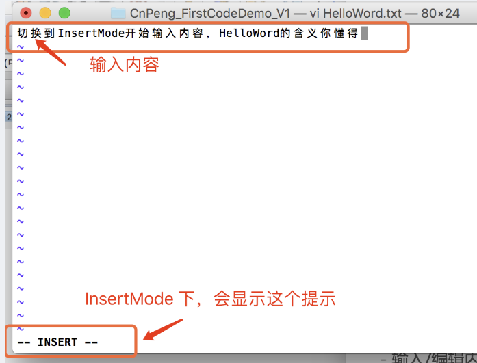
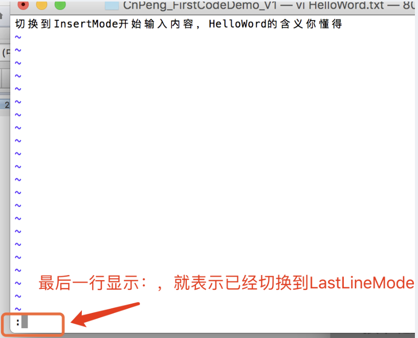
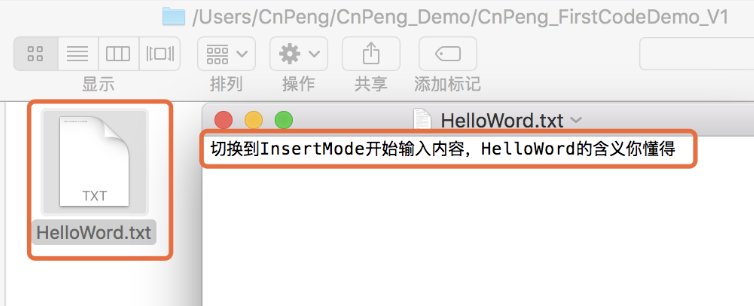

vim 编辑器是由 vi 发展而来，所以，我们先了解一下vi编辑器

## 1. Vi 简介

 vi 是“Visual interface”的简称，它在 Linux 上的地位就仿佛 Edit 程序在 DOS上一样。

它可以执行输出、删除、查找、替换、块操作等众多文本操作，而且用户可以根据自己的需要对其进行定制。

Vi 不是一个排版程序，它不象 Word 或 WPS 那样可以对字体、格式、段落等其他属性进行编排，它只是一个文本编辑程序。

 vi 没有菜单，只有命令，且命令繁多。

## 2. Vi 的三种基本工作模式

>* 命令模式
>* 文本输入模式
>* 末行模式。

### 2.1. 命令行模式

进入命令行模式的两种方法：
>* **在shell环境(提示符为$)下输入`Vi 文件名` ，即可进入vi 编辑器，此时默认处于命令行模式。**
>* **任何时候，不管用户处于何种模式，只要按下ESC键，即可使Vi进入命令模式；**

在该模式下，用户可以输入各种合法的Vi命令，用于管理自己的文档。

**此时从键盘上输入的任何字符都被当做编辑命令来解释**，若输入的字符是合法的Vi命令，则Vi在接受用户命令之后完成相应的动作。

>**注意 :**
>* 所输入的命令并不在屏幕上显示出来。
>* 若输入的字符不是Vi的合法命令，Vi会响铃报警。

### 2.2. 文本输入模式

在命令模式下输入**`插入命令i`**、**`附加命令a`** 、**`打开命令o`**、**`修改命令c`**、**`取代命令r`** 或 **`替换命令s`** 都可以进入文本输入模式。

在该模式下，用户 **输入的任何字符都被Vi当做文件内容保存起来，并将其显示在屏幕上**。

在文本输入过程中，若想回到命令模式下，按键 ESC 即可。

### 2.3. 末行模式

末行模式也称 **ex转义模式**。

在命令模式下，**用户按“:”键即可进入末行模式下**，此时Vi会在显示窗口的最后一行(通常也是屏幕的最后一行)显示一个“:”作为末行模式的提示符，等待用户输入命令。

多数文件管理命令都是在此模式下执行的(如把编辑缓冲区的内容写到文件中等)。末行命令执
行完后，Vi自动回到命令模式。

例如：
**`:sp newfile `**  则分出一个窗口编辑newfile文件。

>**总结：**
>* 如果要从命令模式转换到编辑模式，可以键入命令a或者i；
>* 如果需要从编
辑模式返回命令模式，按Esc键即可。
>* 在命令模式下输入“:”即可切换到末行模式，然后输入命令。

## 3. vim 基础操作

vim是从 vi 发展出来的一个文本编辑器 。

### 3.1. 基础操作

#### 3.1.1. 进入vi/vim编辑器

* `vi 文件名（含扩展名）`

该命令用来创建一个文件或者打开一个已有的文件，如：` vi HelloWord.txt` , 输入该命令之后并回车，如果当前目录下没有 HelloWord.txt 这个文件，就会创建；如果有了，就会打开。效果如图：

进入 vi/vim 编辑器之后，默认是 CommandMode模式，此时并不能输入内容。但可以通过 `d` 直接删除一行内容。

### 3.2. 输入/编辑内容

输入/编辑内容的时候，需要先从 CommandMode 进入到 InsertMode , 方法就是：**在英文输入法模式下， 按下键盘上的 `i` 键**，这样就可以实现切换到 InsertMode

切换到 InsertMode 之后，在最底部的一行会显示`- - -INSERT- - -`， 这时候，你就可以输入内容了，如下图：

### 3.3. 保存并退出

输入完成之后，按下键盘上的 `ESC` 可以从 InsertMode 回退到 CommandMode ；

然后再在英文输入状态下，按下键盘上的 冒号 `:` ， 这样就可以切换到 LastLineMode ；（如果，单纯按 `:` 无法切换模式的话，就同时按下 `shift +:` ）

切换模式成功之后，屏幕最底部一行会显示 `:` ，然后再输入 `wq` ，就会将刚才输入内容以文件的形式保存到当前的目录下。

按下 `:` 或者 `shift+:` 之后的效果如下：

输入 `:wq` 之后会在本地保存文件，我们找到文件打开并查看，如下图：

### 3.4. 相关命令

进入插入模式:

命令|含义
--|--
i | 插入光标前一个字符 
I | 插入行首 
a | 插入光标后一个字符
A | 插入行未 
o | 向下新开一行,插入行首 
O | 向上新开一行,插入行首

进入命令模式:

命令|含义
--|--
ESC | 从插入模式或末行模式进入命令模式

移动光标:

命令|含义
--|--
h | 左移 
j | 下移
k | 上移 
l | 右移
M | 光标移动到中间行 
L | 光标移动到屏幕最后一行行首 
G | 移动到指定行,行号 -G
w | 向后一次移动一个字 
b | 向前一次移动一个字
{ | 按段移动,上移 
} |  按段移动,下移
`Ctr-d` | 向下翻半屏 
`Ctr-u` | 向上翻半屏
`Ctr-f` | 向下翻一屏 
`Ctr-b` | 向上翻一屏
gg | 光标移动文件开头 
G | 光标移动到文件末尾

删除命令:

命令|含义
--|--
x | 删除光标后一个字符,相当于 Del 
X | 删除光标前一个字符,相当于 Backspace
dd | 删除光标所在行,
`n dd` | 从当前行起删除n行(含当前行)，如果当前行后面的行数小于n , 删除无效 
D | 删除光标后本行所有内容,包含光标所在字符 
`d0` | 删除光标前本行所有内容,不包含光标所在字符
`dw` | 删除光标开始位置的字,包含光标所在字符

撤销命令:

命令|含义
--|--
u | 一步一步撤销（最多撤销2步） 
`Ctr+r` | 反撤销（可撤销多步）

重复命令:

命令|含义
--|--
**.** | 重复上一次操作的命令

文本行移动:

命令|含义
--|--
`>>` | 文本行右移 
`<<` | 文本行左移

复制粘贴:

命令|含义
--|--
`yy` | 复制当前行,
`n yy` | 复制 n 行 
`p` | 复制内容到光标所在位置的下一行
`n p` | 向下复制n行

可视模式:

命令|含义
--|--
v | 按字符移动,选中文本 
V |  按行移动,选中文本

>可视模式可以配合 d, y, `>>`, `<<` 实现对文本块的删除,复制,左右移动

替换操作:

命令|含义
--|--
r | 替换当前字符 
R | 替换当前行光标后的字符

查找命令:
命令|含义
--|--
`/ str` | 查找str
n | 下一个
N |上一个

替换命令：

命令|含义
--|--
`%s/abc/123/g` | 末行模式下，将全部行中的abc替换成123
`1, 10s/abc/123/g` | 末行模式下，将第一行至第10行之间的abc替换成123:

>vim 里执行 shell 下命令:
>**`末行模式里输入!,后面跟命令`**

