# 1. 2-排序算法


在我们的程序中，排序是非常常见的一种需求，提供一些数据元素，把这些数据元素按照一定的规则进行排序。比如查询一些订单，按照订单的日期进行排序；再比如，查询一些商品，按照商品的价格进行排序等。

在 java 的开发工具包 jdk 中，已经给我们提供了很多数据结构与散发的实现，比如 List、Set、Map、Math 等等， 都是以 API 的方式提供，这种方式的好处在于一次编写，多处使用。我们借鉴 jdk 的方式，也把算法封装到某个类中，这样就需要先进行 API 设计，设计好之后再对这些  API 进行实现。

比如：我们设计一套 API 如下：

类名| ArrayList
---|---
构造方法| ArrayList() ， 创建 ArrayList 对象
成员方法| 1、boolean add(E e), 向集合中添加元素 <br> 2、E remove(int index) 从集合中删除指定的元素

然后再使用 java 代码去实现它，之后我们讲接的数据结构和算法都是以该方式进行。

## 1.1. 简单排序

### 1.1.1. Comparable 接口介绍

进行排序时，必然需要对元素进行比较。java 提供了一个 Comparable 接口用来定义排序规则。

**需求**：

* 定义一个学生类 Student, 有年龄 age 和姓名 username 两个属性，并通过 Comparable 接口提供比较规则。
* 定义测试类 Test, 在测试类 Test 中定义测试方法 Comparable getMax(Comparable c1, Comparable c2 ) 完成测试。

Student.java

```java
package comparable;

/**
 * 作者：CnPeng
 * 时间：3/22/21
 */
class Student implements Comparable<Student> {

    private String username;
    private int    age;

    public String getUsername() {
        return username;
    }

    public void setUsername(String username) {
        this.username = username;
    }

    public int getAge() {
        return age;
    }

    public void setAge(int age) {
        this.age = age;
    }

    @Override
    public String toString() {
        return "Student{" +
                "username='" + username + '\'' +
                ", age=" + age +
                '}';
    }

    // 实现比较函数
    @Override
    public int compareTo(Student o) {
        return this.getAge() - o.getAge();
    }
}
```

TestStudent.java

```java
package comparable;

/**
 * 作者：CnPeng
 * 时间：3/22/21
 */
class TestStudent {
    public static void main(String[] args) {
        Student s1 = new Student();
        s1.setUsername("张三");
        s1.setAge(23);

        Student s2 = new Student();
        s2.setUsername("李四");
        s2.setAge(24);

        Comparable result = getMax(s1, s2);
        System.out.println(result);
    }


    public static Comparable getMax(Comparable c1, Comparable c2) {
        int result = c1.compareTo(c2);
        if (result >= 0) {
            // result >= 0 表示 c1 >= c2
            return c1;
        } else {
            // result <= 表示 c1 < c2
            return c2;
        }
    }
}
```

运行结果：

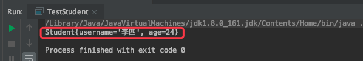


### 1.1.2. 冒泡排序

冒泡排序（Bubble Sort）是计算机科学领域中比较简单的排序算法。

#### 1.1.2.1. 需求

* 排序前：{4,5,6,3,2,1}
* 排序后：{1,2,3,4,5,6}

#### 1.1.2.2. 排序原理

* 比较相邻的元素，如果前一个元素比后一个元素大，就交换这两个元素
* 对每一对相邻的元素做同样的工作，从开始第一对元素到结尾的最后一对元素，最终最后位置的元素就是最大值。

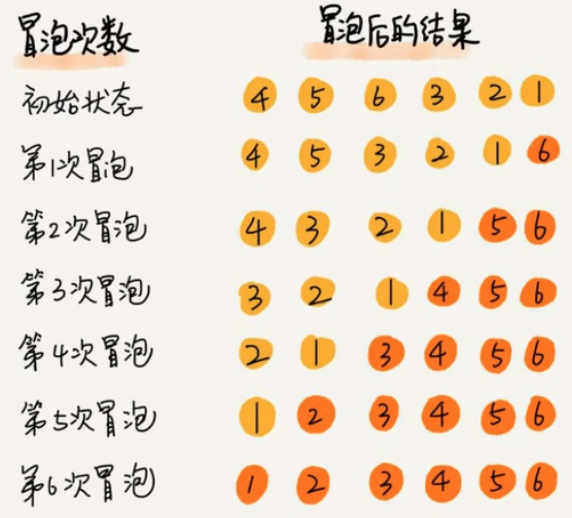


#### 1.1.2.3. 冒泡排序 API 设计

类名 | BubbleSort
---|---
构造方法 | BubbleSort() 创建 BubbleSort 对象
成员方法 | 1. public static sort(Comparable[] a) 对数组内的元素进行排序 <br> 2. private static boolean greater(Comparable v, Comparable w) 判断 v 是否大于 w <br> 3. private static void exch(Comparable[] a, int i, int j) 在数组 a 中交互索引 i 和 j 处的值。

#### 1.1.2.4. 冒泡排序的代码实现

BubbleSort.java

```java
package BubbleSort;

/**
 * 作者：CnPeng
 * 时间：3/22/21
 * 功用：冒泡排序的实现
 */
class BubbleSort {

    /**
     * 排序
     */
    public static void sort(Comparable[] a) {
        // 确定每次冒泡有几个元素参与排序：初始冒泡时全部元素都参与排序，最后一次冒泡时只有一个元素参与排序
        for (int i = a.length-1; i > 0; i--) {
            // 比较相邻元素，
            for (int j = 0; j < i; j++) {
                if (greater(a[j], a[j + 1])) {
                    exch(a, j, j + 1);
                }
            }
        }
    }

    /**
     * 交换元素
     */
    private static void exch(Comparable[] a, int i, int j) {
        Comparable temp;
        temp = a[i];
        a[i] = a[j];
        a[j] = temp;
    }

    /**
     * 检查 v > w
     */
    private static boolean greater(Comparable v, Comparable w) {
        return v.compareTo(w) > 0;
    }
}
```

BubbleTest.java

```java
package BubbleSort;

import java.util.Arrays;

/**
 * 作者：CnPeng
 * 时间：3/22/21
 * 功用：冒泡排序测试类
 */
class BubbleTest {
    public static void main(String[] args) {
        // 注意，此处需要使用 Integer 包装类
        Integer[] arr = {4, 5, 6, 3, 2, 1};
        BubbleSort.sort(arr);

        // 转换成字符串输出
        System.out.println(Arrays.toString(arr));
    }
}
```

运行结果：

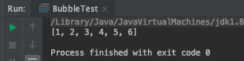

#### 1.1.2.5. 冒泡排序的时间复杂度分析

冒泡排序使用了双层 for 循环，其中内存循环的循环体时真正完成排序的代码。所以，我们分析冒泡排序的时间复杂度，主要就是分析其内层循环体的执行次数。

在最坏情况下，也就是假如要排序的元素为 {6,5,4,3,2,1} 逆序，那么：

元素比较的次数为：(n-1)+(n-2)+(n-3)+... +2+1= ((n-1)+1)*(n-1)/2 = (n^2)/2 - n/2

元素交换的次数为：(n-1)+(n-2)+(n-3)+... +2+1= ((n-1)+1)*(n-1)/2 = (n^2)/2 - n/2

总的执行次数为：（n^2/2-n/2）+(n^2/2-n/2)=n^2-n

按照大 O 推导法则，保留函数中的最高阶项，那么，最终冒泡排序的时间复杂度为：O(N^2)

### 1.1.3. 选择排序

选择排序是一种更加加单直观的排序方法。

#### 1.1.3.1. 需求

* 排序前：{4,6,8,7,9,2,10,1}
* 排序后：{1,2,4,5,7,8,9,10}

#### 1.1.3.2. 排序原理

* 每一次遍历的过程中，都假定第一个索引处的元素是最小值，和其他索引处的值依次进行比较，如果当前索引处的值大于其他某个索引处的值，则假定其他索引处的值为最小值，最后可以找到最小值所在的索引。
* 交换第一个索引处和最小值所在的索引处的值。

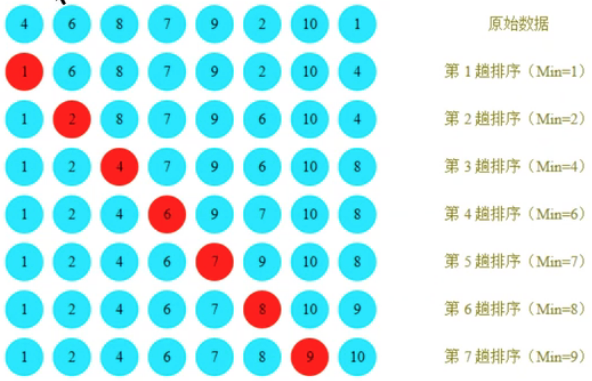

#### 1.1.3.3. 选择排序 API 设计

类名|SelectSort
---|---
构造方法 | SelectSort() 创造 SelectSort 对象
成员方法 | 1.public static void sort(Comparable[]a) 对数组内元素进行排序  <br>2.private static boolean greater(Comparable v,Comparable w) 判断 v 是否大于 w  <br>3.private static void exch(Comparable[]a , int i, int j) 交换 a 数组中 i 和 j 处的内容。


#### 1.1.3.4. 选择排序的代码实现

SelectSort.java

```java
package SelectSort;

/**
 * 作者：CnPeng
 * 时间：3/22/21
 * 功用：选择排序
 */
class SelectSort {
    public static void sort(Comparable[] a) {
        // 本次排序共有多少个元素要排序
        for (int i = 0; i <= a.length - 2; i++) {
            // 假定本次遍历最小值索引为 i
            int minIndex = i;
            // 本次有多少个元素需要与本次第一个元素比较（第一个元素只需要和他后面的元素比较）
            for (int j = i + 1; j < a.length; j++) {
                if (greater(a[minIndex], a[j])) {
                    // 更新最小值所在索引
                    minIndex = j;
                }
            }
            // 交换内容
            exch(a, minIndex, i);
        }
    }

    // 交换内容
    private static void exch(Comparable[] a, int j, int i) {
        Comparable temp = a[i];
        a[i] = a[j];
        a[j] = temp;
    }

    // 比较内容
    private static boolean greater(Comparable i, Comparable j) {
        return i.compareTo(j) > 0;
    }
}
```

SelectSortTest.java

```java
package SelectSort;

import java.util.Arrays;

/**
 * 作者：CnPeng
 * 时间：3/22/21
 * 功用：测试选择排序
 */
class SelectSortTest {

    public static void main(String[] args) {
        Integer[] arr = {4, 6, 8, 7, 9, 2, 10, 1};
        SelectSort.sort(arr);

        System.out.println(Arrays.toString(arr));
    }
}
```

#### 1.1.3.5. 时间复杂度分析

选择排序使用了双层 for 循环，其中外层循环完成了数据交换，内存循环完成了数据比较，所以我们分别统计数据交换次数和数据比较次数：

数据比较次数：(N-1)+(N-2)+(N-3)+...+2+1 = ((N-1)+1)*(N-1)/2 = N^2/2-N/2

数据交换次数：N-1

总的时间复杂度： N^2/2-N/2 +(N-1)=N^2/2+N/2-1

根据大 O 推导规则，保留最高阶项，去除常数因子，时间复杂度为 O(N^2)

### 1.1.4. 插入排序

插入排序（Insertion sort）是一种简单直观且稳定的排序算法。

插入排序的工作方式非常像人们对扑克牌的排序。开始时，我们的作为为空并且桌子上的牌面朝下。然后，我们每次从桌子上拿走一张牌并将它插入左手中的正确位置。为了找到一张牌的正确位置，我们从右到左将它与已在手中的每张牌进行比较，如下图所示：

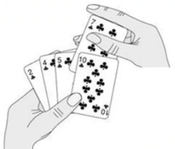

#### 1.1.4.1. 需求

* 排序前：{4,3,2,10,12,1,5,6}
* 排序后：{1,2,3,4,5,6,10,12}

#### 1.1.4.2. 排序原理

* 把所有的元素分为两组，已经排序的和未排序的
* 找到未排序的组中的第一个元素，向已排序的组中进行插入。
* **倒序**遍历已经排序的元素，依次和待插入的元素进行比较，直到找到一个元素小于等于待插入元素，那么就把待插入元素放到这个位置，其他的元素向后移动一位（如果没有比待插入元素小的，那就说明待插入元素最小，就需要将其放在 0 索引处）。

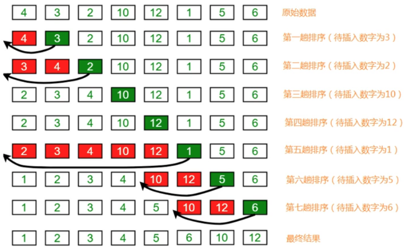

#### 1.1.4.3. API 设计

类名|InsertSort
---|---
构造方法 | InsertSort() 创建 InsertSort 对象
成员方法 | 1. public static void sort(Comparable[] a) 对数组内的元素进行排序    <br>2.private static boolean greater(Comparable v, Comparable w) 判断 v 是否大于 w   <br>3.private static void exch(Comparable[]a ,int i,int j) 交换数组 a 中索引 i 和 j 处的元素内容。

#### 1.1.4.4. 代码实现

InsertSort.java

```java
package InsertSort;

/**
 * 作者：CnPeng
 * 时间：3/22/21
 * 功用：插入排序
 */
class InsertSort {
    public static void sort(Comparable[] a) {
        // 默认 0 索引处元素为已排序好的元素
        for (int i = 1; i < a.length; i++) {
            // 倒序遍历已排序的元素，j 为待插入的元素，j-1 及以前的元素为已排序好的元素
            for (int j = i; j > 0; j--) {
                if (greater(a[j - 1], a[j])) {
                    // 如果 j-1 处的元素比 j 处的元素大，则将 j 处元素向前移动
                    exch(a, j - 1, j);
                } else {
                    break;
                }
            }
        }
    }

    private static void exch(Comparable[] a, int i, int j) {
        Comparable temp = a[i];
        a[i] = a[j];
        a[j] = temp;
    }

    private static boolean greater(Comparable a, Comparable b) {
        return a.compareTo(b) > 0;
    }
}
```

InsertSortTest.java

```java
package InsertSort;

import java.util.Arrays;

/**
 * 作者：CnPeng
 * 时间：3/22/21
 * 功用：插入排序测试
 */
class InsertSortTest {
    public static void main(String[] args) {
        // Integer 实现了 Comparable 接口
        Integer[] arr = {4, 3, 2, 10, 12, 1, 5, 6};
        InsertSort.sort(arr);

        // 将输入转换为 string
        System.out.println(Arrays.toString(arr));
    }
}
```

#### 1.1.4.5. 时间复杂度分析

插入排序使用了双层 for 循环，其中内存循环的循环体是真正完成排序的代码，所以，我们分析插入排序的时间复杂度时，主要分析内存循环体的执行次数即可。

最坏情况，也就是假设待排序的数组元素为 {12,10,6,5,4,3,2,1} 那么：

比较次数为：(N-1)+(N-2)+(N-3)+...+2+1 = ((N-1)+1)*(N-1)/2 = N^2/2 - N/2

交换的次数为：(N-1)+(N-2)+(N-3)+...+2+1 = ((N-1)+1)*(N-1)/2 = N^2/2 - N/2

总执行次数为：(N^2/2 - N/2)+(N^2/2 - N/2) = N^2-N

按照大 O 推导法则，保留函数中的最高阶项，那么插入排序的时间复杂度最终为 O(N^2)

## 1.2. 高级排序

前面学习的基础排序（冒泡排序、插入排序、选择排序）的时间复杂度都为 O(N^2), 也就是平方阶，在前面的算法分析中我们知道，随着输入规模的增大， 时间成本将急剧上升，所以，这些基本排序方法不能处理大规模的数据。

处理大规模数据时，就需要使用高级的排序方法， 进而争取降低算法时间复杂度的最高阶次幂。

### 1.2.1. 希尔排序

希尔排序是插入排序的一种，又称 **缩小增量排序**。是插入排序算法的一种更高效的改进版本。

前面学习插入排序的时候，我们发现一个很不友好的事情，如果已排序的分组元素为 {2,5,7,9,10} ，未排序的分组为 {1,8} ，那么，下一个待插入元素为 1，我们需要拿着 1 从后往前，依次和 10、9、7、5、2 进行位置交换，才能完成真正的插入，每次只能和相邻的元素交换位置。

如果我们要提高效率，直观的想法就是一次交换能把 1 放到更加靠前的位置，比如一次交换就能把 1 放到 2 和 5 之间，这样通过一次交换 1 就像前走了 5 个位置，可以减少交换的次数。这样的需求如何实现呢？如下：


#### 1.2.1.1. 需求

* 排序前：{9,1,2,5,7,4,8,6,3,5}
* 排序后：{1,2,3,4,5,5,6,7,8,9}

#### 1.2.1.2. 排序原理

##### 1.2.1.2.1. 原理分析

* 选定一个增长量 h, 按照增长量 h 作为数据分组的依据，对数据进行分组. ( h 表示从起始索引再向后数 h 位)
* 对分好组的每一组数据完成插入排序(只比较每个分组中第一个元素和最后一个元素，如果后者小于前者，则交换位置)
* 减小增长量，最小减为 1 ，重复第二步操作

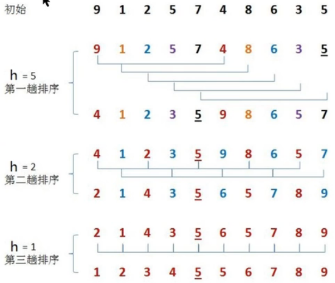

当 h=5 时，

* 初始情况下索引分组为：0-5，1-6，2-7，3-8，4-9 对应的数据分别为：{9,1,2,5,7,4},{1,2,5,7,4,8},{2,5,7,4,8,6},{5,7,4,8,6,3},{7,4,8,6,3,5}。
* **在进行插入排序时，只比较每组的第一个和最后一个元素。当后者小于前者时，交换二者位置** 这样，第一个数组就变成了 {4,1,2,5,7,9}, 
* 由于**在分组时是按照索引分组，而不是按照索引元素分组**，所以，此时完整的数据为：4，1，2，5，7，9，8，6，3，5，相应的数据分组也随之发生变化，依次为：{4,1,2,5,7,9},{1,2,5,7,9,8},{2,5,7,9,8,6},{5,7,9,8,6,3},{7,9,8,6,3,5}，
* 再对新第二组中的数据进行排序，也是只比较其中的第一个和最后一个元素，由于 8>1，所以数据不变
* 再对新第三组数据进行排序，6>2 ，所以数据不变
* 再对新第四组数据进行排序，3<5 ，交换位置，得到 {3,7,9,8,6,5} , 此时完整数据为：4，1，2，3，7，9，8，6，5，5，相应的数据分组变为：{4,1,2,3,7,9},{1,2,3,7,9,8},{2,3,7,9,8,6},{3,7,9,8,6,5},{7,9,8,6,5,5}，
* 再对新第五组数据进行排序，5<7, 交换位置，得到 {5,9,8,6,5,7} 。
* 至此，每一组数据都完成了一次插入排序，此时的完整数据为：4，1，2，3，5，9，8，6，5，7

当 h=2 时，参考 h=5 时的分组和排序方式，得到：2，1，4，3，5，6，5，7，8，9

当 h=1 时，最终得到 1，2，3，4，5，5，6，7，8，9

##### 1.2.1.2.2. 确定增长量 h

在确定增长量 h 时，采用如下规则：

```java
// 循环结束时就可以确定h的最大值
int h=1;
whilt(h<数据长度/2){
    h=2h+1;
}

// h 的减小规则
h=h/2;
```

按照上述规则计算，我们在对 {9,1,2,5,7,4,8,6,3,5} 进行希尔排序时，h 应该为 7，但是上面图中初始 h=5 ，这只是为了方便演示和讲解原理。

#### 1.2.1.3. API 设计

类名|Shell
---|---
构造方法 | Shell() 创建 Shell 对象
成员方法 | 1. public static void sort(Comparable[] a) 对数组内的元素进行排序    <br>2.private static boolean greater(Comparable v, Comparable w) 判断 v 是否大于 w   <br>3.private static void exch(Comparable[]a ,int i,int j) 交换数组 a 中索引 i 和 j 处的元素内容。

#### 1.2.1.4. 代码实现

[视频地址-P21](https://www.bilibili.com/video/BV1Cz411B7qd?p=21&spm_id_from=pageDriver)

Shell.java

```java
package Shell;

/**
 * 作者：CnPeng
 * 时间：3/23/21
 * 功用：希尔排序
 * 其他：
 */
class Shell {

    public static void sort(Comparable[] a) {
        // 1、根据数据长度确定增长量h
        int h = 1;
        while (h < a.length / 2) {
            h = 2 * h + 1;
        }

        // 2. 希尔排序
        while (h >= 1) {
            // 2-1-排序
            // 2-1-1-找到待插入的元素，初始待插入的元素是 h,然后依次为 h+1,h+2,直到数组的最后一个元素
            for (int i = h; i < a.length; i++) {
                // 2-1-2-把待插入的元素放到有序数列中。h 位置的元素需要和 h-h 位置的元素进行比较；h+1 位置的元素需要和 (h+1)-h 处的元素比较。
                for (int j = i; j >= h; j -= h) {
                    if (greater(a[j - h], a[j])) {
                        exch(a, j - h, j);
                    } else {
                        break;
                    }
                }
            }

            // 2-2-减小 h 的值
            h = h / 2;
        }

    }

    public static boolean greater(Comparable v, Comparable w) {
        return v.compareTo(w) > 0;
    }

    public static void exch(Comparable[] a, int i, int j) {
        Comparable temp = a[i];
        a[i] = a[j];
        a[j] = temp;
    }
}
```

ShellTest.java

```java
package Shell;

import java.util.Arrays;

/**
 * 作者：CnPeng
 * 时间：3/23/21
 * 功用：希尔排序测试
 * 其他：
 */
class ShellTest {
    public static void main(String[] args) {
        Integer[] arr = {9, 1, 2, 5, 7, 4, 8, 6, 3, 5};
        Shell.sort(arr);
        System.out.println(Arrays.toString(arr));
    }
}
```

运行结果：

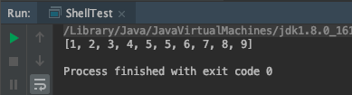

#### 1.2.1.5. 时间复杂度分析

在希尔排序中，增长量 h 并没有固定的规则，有很多论文研究了各种不同的递增序列，但都无法证明某个序列是最好的，对于希尔排序的时间复杂度分析，此处不再对此做分析。

我们可以利用事后分析法对希尔排序和插入排序做性能比较。

测试思路是：准备 100000 到 1 的逆向数据，在执行排序前记录一个时间，在排序完成后记录一个时间，两者的时间差就是排序耗时。

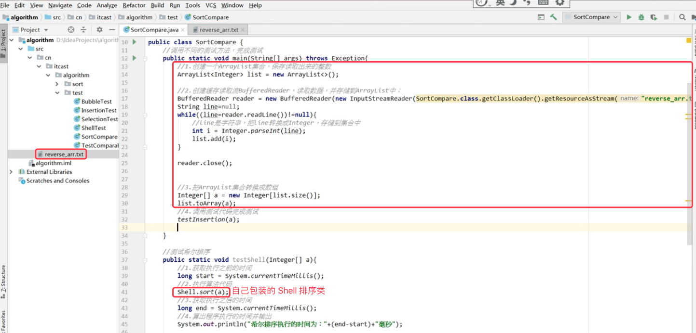

结论：希尔排序效率由于插入排序或其他普通排序算法。


### 1.2.2. 归并排序

#### 1.2.2.1. 递归

##### 1.2.2.1.1. 定义

定义方法时，在方法内部调用方法本身，称之为递归

```java
public void show() {
   System.out.println("CnPeng");
   // 注意，此处没有定义退出条件，是不规范的
   show();
}
```

##### 1.2.2.1.2. 作用

它通常把一个大型复杂的问题，层层转换为一个与原问题相似的，规模较小的问题来解决。

递归策略只需要少量的程序就可以描述出解题过程所需的多次重复计算，大大地减少了程序的代码量。

##### 1.2.2.1.3. 注意事项

在递归中，不能无限制的调用自己，必须要有边界条件能够让递归结束。因为**每一次递归调用都会在栈内存开辟新的空间，重新执行方法**，如果递归的层级太深，很容易造成栈内存溢出。

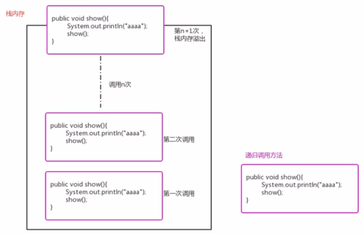

##### 1.2.2.1.4. 需求

定义一个方法，使用递归完成 N 的阶乘。

分析：

阶乘|说明
---|---
1！ | 1
2!  | `2*1 =2*1!`
3!  | `3*2*1=3*2!`
4！| `4*3*2*1=4*3!`
...|
N! | `N*(N-1)*(N-2)...*2*1=N*(N-1)!`

所以，假设有一个方法 factorial(n) 用来求 n 的阶乘，那么 n 的阶乘还可以表示为  n*factorial(n-1)

##### 1.2.2.1.5. 代码实现

```java
package CpRecursion;

/**
 * 作者：CnPeng
 * 时间：3/24/21
 * 功用：递归
 */
class CpRecursion {

    public static void main(String[] args) {
        int result = factorial(5);
        System.out.println(result);
    }

    public static int factorial(int n) {
        if (n == 1) {
            return 1;
        }
        return n * factorial(n - 1);
    }
}
```

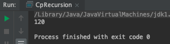

#### 1.2.2.2. 归并排序

归并排序是建立在归并操作上的一种有效的排序算法，该算法是采用分治法的一种非常典型的应用。

将已有序的子序列合并，得到完全有序的序列。即**先使每个子序列有序，再使子序列段间有序**。

若将两个有序表合并成一个有序表，称为二路归并。

##### 1.2.2.2.1. 需求

排序前：{8,4,5,7,1,3,6,2}

排序后：{1,2,3,4,5,6,7,8}

##### 1.2.2.2.2. 排序原理

[视频讲解 p24](https://www.bilibili.com/video/BV1Cz411B7qd?p=24&spm_id_from=pageDriver)

* 尽可能的将数据拆分成两个元素相等的子组，并对每个子组继续拆分，直到拆分后的每个子组的元素个数是 1 为止。
* **将相邻的两个子组合并成一个有序的大组, 合并过程中进行排序**
* 不断重复上一步，直到最终只有一个组为止。

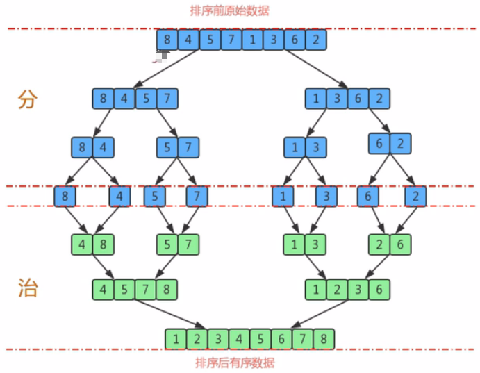

##### 1.2.2.2.3. API 设计

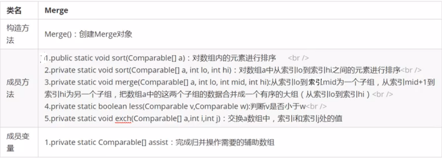

##### 1.2.2.2.4. 代码实现

[视频讲解 P25-30](https://www.bilibili.com/video/BV1Cz411B7qd?p=26&spm_id_from=pageDriver)

以下图片内容，演示的是 merge 函数操作：

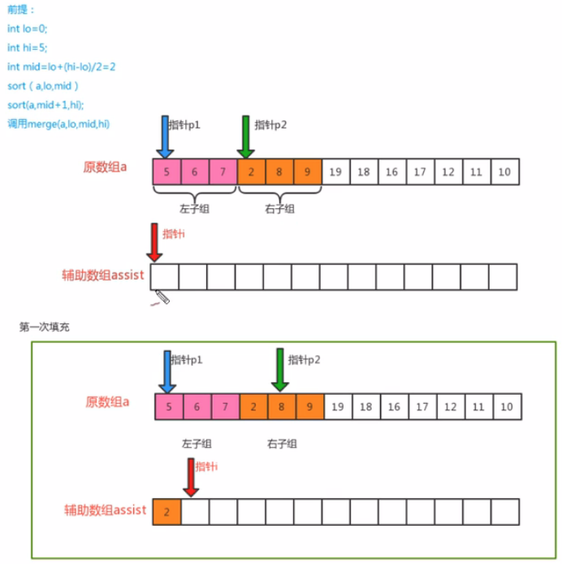

上图中描述将左子祖数据和右子组数据放到 assist 数组的同时做排序。

比较 p1 和 p2 指针所对应的数据，将小值放到指针 i 处。

由于 p2 指向的值是 2 ，比 p1 处的值 5 要小，所以，p2 的值会放到指针 i 处，然后将 p2 后移一位，指针 i 也后移一位。

此时，p1 的值还是指向 5 ，p2 的值指向 8 ，p1<p2 所以，将 p1 的值放到指针 i 处，然后将 p1 和指针 i 后移一位，如下图：


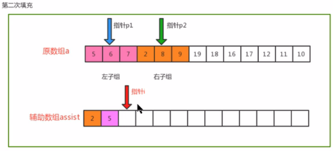

上图中，p1 的值为 6，p2 的值为 8，p1<p2, 将 p1 的值放到指针 i 处，然后将指针 p1 和指针 i 后移一位，如下图：

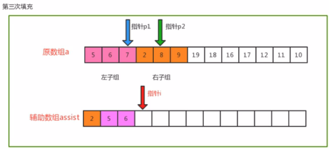

上图中，p1 的值为 7，p2 的值为 8 ，p1<p2，将 p1 的值放到指针 i 处。指针 p1 已经到达了左子组的最后位置，无法再后移，仅将指针 i 后移一位，如下图：

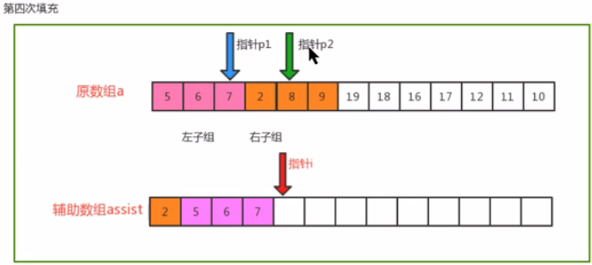

左子组中的内容都已经放到 assist 辅助数组中了，所以，此时不再需要比较，直接将 p2 指向的值 8 放到指针 i 处，然后指针 p2 和指针 i 后移一位，具体为下图：

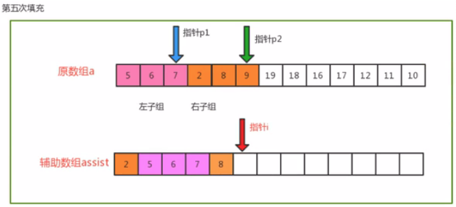

在上图中，将指针 p2 对应的元素放到指针 i 处，至此，两个子组数据完成了归并，并且在归并的同时完成了排序。结果如下图：

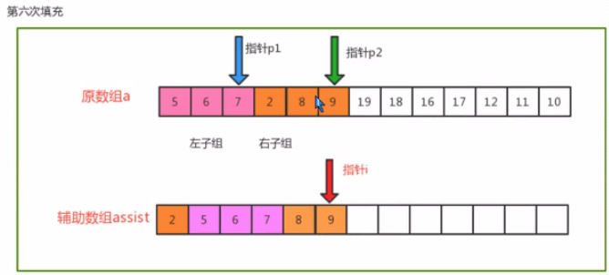

接下来要做的事情就是将辅助数组中排序号的元素拷贝到原数组中。

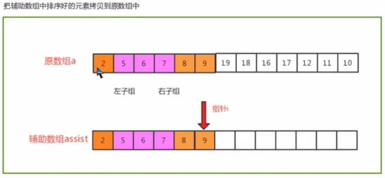

* Merge.java

```java
package merge;

/**
 * 作者：CnPeng
 * 时间：3/24/21
 * 功用：归并排序
 */
class Merge {
    // 归并所需的辅助数组
    private static Comparable[] assist;

    // 比较元素 v 是否小于元素 w
    private static boolean less(Comparable v, Comparable w) {
        return v.compareTo(w) < 0;
    }

    // 交换元素
    private static void exch(Comparable[] a, int i, int j) {
        Comparable t = a[i];
        a[i] = a[j];
        a[j] = t;
    }

    // 对数组 a 中的元素进行排序
    public static void sort(Comparable[] a) {
        //1 初始化辅助数组 assist
        assist = new Comparable[a.length];

        //2 定义一个 lo 变量和 hi 变量，分别记录数组中最小的索引和最大的索引
        int lo = 0;
        int hi = a.length - 1;

        //3 调用 sort 重载方法完成数组 a 中，从索引 lo 到索引 hi 间元素的排序
        sort(a, lo, hi);
    }

    // 对数组 a 中从 lo 到 hi 的元素进行排序
    public static void sort(Comparable[] a, int lo, int hi) {
        // 1 安全性校验
        if (hi <= lo) {
            return;
        }

        //2 对 lo 到 hi 间的数据进行分组--两个组，
        int mid = lo + (hi - lo) / 2;

        //3 分别对每组数据进行排序
        sort(a, lo, mid);
        sort(a, mid + 1, hi);

        //4 把两个组中的数据进行归并
        merge(a, lo, mid, hi);
    }

    // 对数组中，从 lo 到 mid 为一组，从 mid+1 到 hi 为一组，对这两组数据进行归并，归并的过程中进行排序
    public static void merge(Comparable[] a, int lo, int mid, int hi) {
        // 定义三个指针
        int i = lo;  // 辅助数组索引
        int p1 = lo; //左子组索引
        int p2 = mid + 1; // 右子组索引


        // 遍历，移动指针p1和p2, 并比较两个指针处的值，找出小值放到辅助数组的对应索引处
        while (p1 <= mid && p2 <= hi) {   //当 p1 或 p2 移动到所属子组的最后一个索引时，终止循环
            if (less(a[p1], a[p2])) {
                assist[i++] = a[p1++]; //如果 p1 对应的值小于 p2 对应的值，则将 p1 值放到辅助数组，并移动对应的指针-p1 和 i
            } else {
                assist[i++] = a[p2++]; //如果 p1 对应的值大于 p2 对应的值，则将 p2 值放到辅助数组，并移动对应的指针-p2 和 i
            }
        }


        // 遍历，如果 p1 的指针没有走完，则顺序移动p1指针，并将对应的元素放到辅助数组的对应索引处
        while (p1 <= mid) {
            assist[i++] = a[p1++];
        }

        // 遍历，如果 p2 的指针没有走完，则顺序移动p2指针，并将对应的元素放到辅助数组的对应索引处
        while (p2 <= hi) {
            assist[i++] = a[p2++];
        }
        
        // 把辅助数组中的元素拷贝到原数组中
        for (int index = lo; index <= hi; index++) {
            a[index] = assist[index];
        }
    }
}
```

* MergeTest.java

```java
package merge;

import java.util.Arrays;

/**
 * 作者：CnPeng
 * 时间：3/29/21
 * 功用：测试归并排序
 */
class MergeTest {
    public static void main(String[] args) {
        Integer[] a = {8, 4, 5, 7, 1, 3, 6, 2};
        Merge.sort(a);
        System.out.println(Arrays.toString(a));
    }
}
```

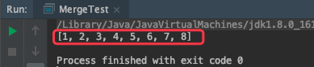

##### 1.2.2.2.5. 时间复杂度分析

归并排序时分治思想最典型的例子。

上面的算法中，对 a[lo...hi] 进行排序，先将它分为 a[lo...mid] 和 a[mid+1...hi] 两部分，分别通过递归调用将他们单独排序，最后将有序的子数组归并为最终的结果。

该递归的出口在于如果一个数组不能再被分为两个子数组，那么就会执行 merge 函数进行归并，在归并的时候判断元素的大小并进行排序。

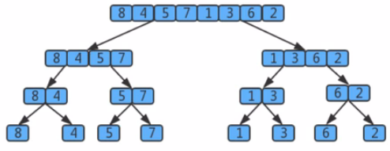

上图用树状图来描述归并。

如果一个数组有 8 个元素，那么它将每次除以 2 找最小的子数组，共拆分 log8 次 ，值为 3, 所以共有 3 层，

那么，自顶层向下第 k 层有 2^k 个子数组，每个数组的长度(元素个数)为 2^(3-k) ，归并最多需要 2^(3-k) 次比较，

因此，每层的比较次数为 `2^k*2^(3-k) = 2^3` ，那么 3 层共需要 `3*2^3`.

假设元素个数为 n, 那么使用归并排序拆分的次数为 log2(n), 所以共有 log2(n) 层，

那么，使用 log2(n) 替换上面 `3*2^3` 中的 3 这个层数，最终得到的归并排序的时间复杂度为：`log2(n)*2^(log2(n)) = log2(n)*n`

根据大 O 推导法则，忽略底数，最终归并排序的时间复杂度为：`O(nlogn)`

##### 1.2.2.2.6. 归并排序的缺点

需要申请额外的数组空间（即辅助数组所占用的空间），导致空间复杂度提升，是典型的以空间换时间的操作。


##### 1.2.2.2.7. 归并排序与希尔排序性能测试

使用事后估算法

测试思路是：准备 100000 到 1 的逆向数据，在执行排序前记录一个时间，在排序完成后记录一个时间，两者的时间差就是排序耗时。

具体代码参考希尔排序中的测试内容

结论：希尔排序和归并排序效率（执行时间）差不多，在实际应用时还需要参考排序稳定性来决定到底使用谁。


### 1.2.3. 快速排序

快速排序是对冒泡排序的一种改进。

其基本思路是：通过一趟排序将要排序的数据分割成独立的两部分，其中一部分的所有数据都比另外一部分的所有数据都小，然后再按此方法对这两部分数据分别进行快速排序，整个排序过程可以递归进行，以此达到整个数据变成有序序列。

#### 1.2.3.1. 需求

* 排序前：{6,1,2,7,9,3,4,5,8}
* 排序后：{1,2,3,4,5,6,7,8,9}

#### 1.2.3.2. 排序原理

* 首先设定一个分界值，通过该分界值将数组分成左右两部分
* 将大于或等于分界值的数据放到数组右边，小于分界值的数据放到数组左边。此时，左边部分中各元素都小于或等于分界值，而右边部分中各元素都大于或等于分界值。
* 然后，左边和右边的数据可以独立排序。对于左侧的数组数据，又可以取一个分界值，将该部分数据分成左右两部分，同样在左边放置较小值，右边放置较大值。右侧的数组数据也可以做类似处理。
* 重复上述过程，可以看出，这是一个递归定义。通过递归将左侧部分排好序后，再递归排好右侧部分的顺序。当左侧和右侧两个部分的数据拍完序后，整个数组的排序也就完成了。

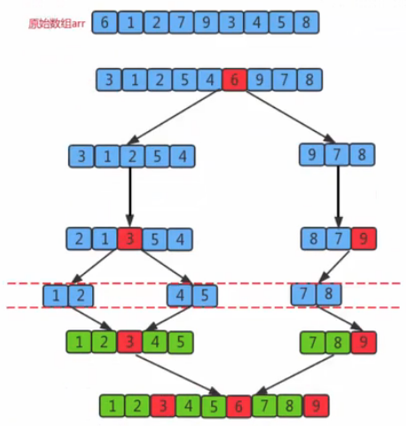

默认以数组中的第一个元素为分界值。

上图中，原始数组 arr 的第一个元素为 6，初始情况下就以 6 为分界值。把比 6 小的放到左边，比 6 大的放大右边。

然后就得到了两个分组，{3,1,2,5,4} 和 {9,7,8} 。然后再分别以数组第一个元素 3 和 9 为分界值，比分界值小的放左边，大的放右边。

重复取临界值并分组的操作，直到子分组仅有两个元素，并对这两个元素排好序。

最后，将排好序的内容和分界值组合成一个数组。

#### 1.2.3.3. API 设计

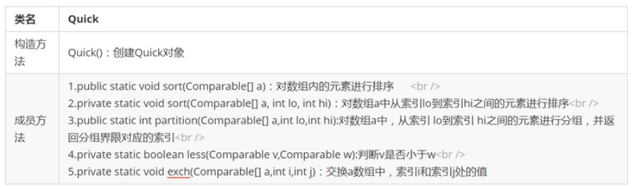

#### 1.2.3.4. 切分原理

把一个数组切分成两个子数组的基本思想：

* 找一个基准值，用两个指针分别指向数组的头部和尾部
* 先从尾部向头部开始搜索一个比基准值小的元素，搜索到即停止，并记录指针的位置。
* 再从头部向尾部开始搜索一个比基准值大的元素，搜索到即停止，并记录指针的位置。
* 交换当前左边指针位置和右边指针位置的元素
* 重复上述第 2，3，4 步骤，直到左边指针的值大于右边指针的值停止。

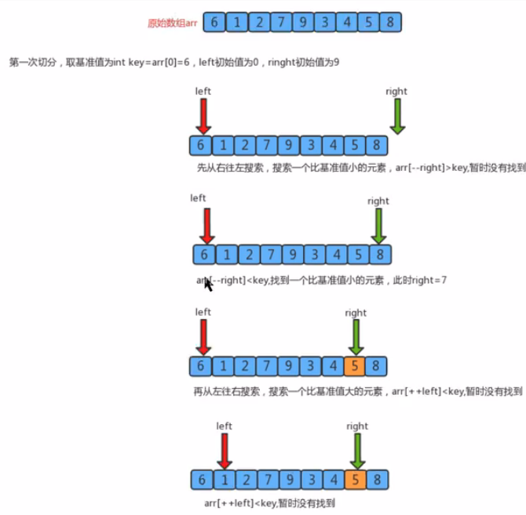

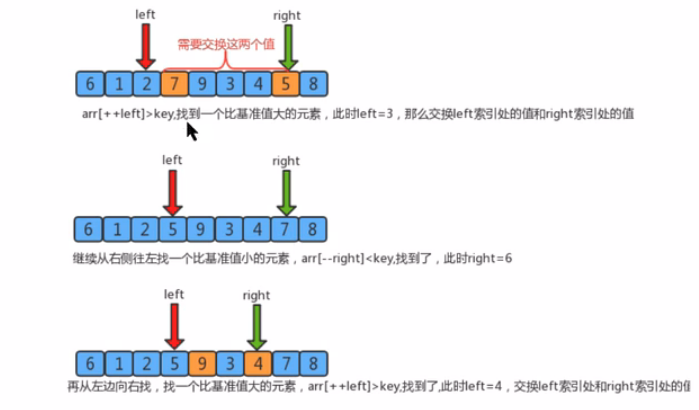

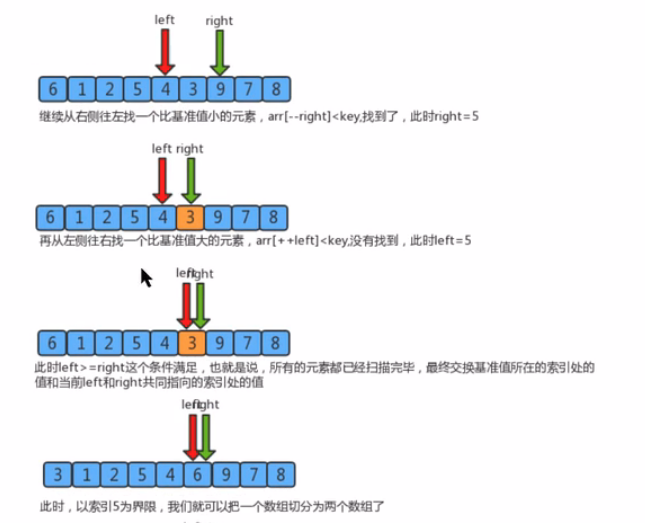

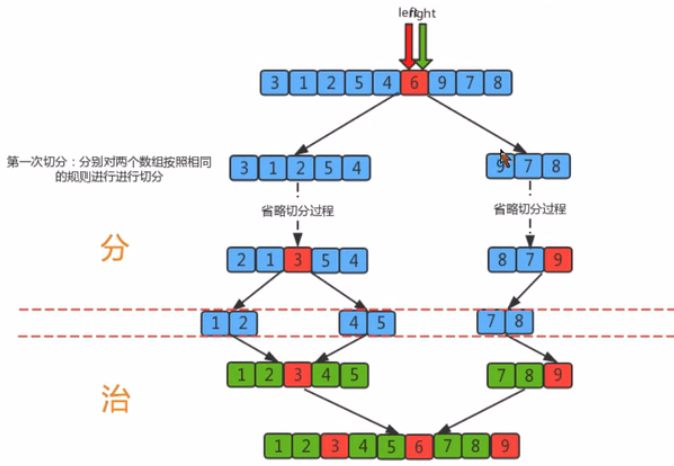

#### 1.2.3.5. 代码实现

[原视频地址](https://www.bilibili.com/video/BV1Cz411B7qd?p=35&spm_id_from=pageDriver)

* Quick.java

```java
package sort.quick;

/**
 * 作者：CnPeng
 * 时间：3/30/21
 * 功用：快速排序
 * 其他：
 */
class Quick {

    // 判断 a 是否比 b 小
    private static boolean less(Comparable a, Comparable b) {
        return a.compareTo(b) < 0;
    }

    // 元素交换位置
    private static void exch(Comparable[] a, int i, int j) {
        Comparable t = a[i];
        a[i] = a[j];
        a[j] = t;
    }

    // 对数组内的元素进行排序
    public static void sort(Comparable[] a) {
        int lo = 0;
        int hi = a.length - 1;
        sort(a, lo, hi);

    }

    // 对数组 a 中从 lo 到 hi 之间的元素进行排序
    private static void sort(Comparable[] a, int lo, int hi) {
        // 安全校验
        if (hi <= lo) {
            return;
        }

        // 对数组中 lo 索引到 hi 索引之间的元素进行分组，分为左子组和右子组
        int partitionIndex = partition(a, lo, hi);

        // 对左子组内容排序
        sort(a, lo, partitionIndex - 1);

        // 对右子组内容排序
        sort(a, partitionIndex + 1, hi);
    }

    // 对数组 a 中从索引 lo 到 hi 之间的元素进行分组，并返回分组分组之后分界值对应的索引
    public static int partition(Comparable[] a, int lo, int hi) {
        // 确定分界值，默认为数组的第一个元素值
        Comparable key = a[lo];
        // 定义两个指针，分别指向待切分元素的最小索引和（最大索引+1）位置
        int left = lo;
        int right = hi + 1;

        // 切分
        while (true) {
            // 先从右向左扫描，移动 right 指针，找到比分界值小的元素，停止
            while (less(key, a[--right])) {  // 当基准值小于 right 指针，继续
                if (right == lo) {
                    break; // 当 right 指针移动到最小索引时终止
                }

            }

            // 再从左向右扫描，移动 left 指针，找到比分界值大的元素，停止
            while (less(a[++left], key)) {  //
                if (left == hi) {  // 当 left 指针移动到最大索引时终止
                    break;
                }
            }

            // 当 left>=right 时，表说明元素扫描结束，结束循环，否则，交换元素
            if (left >= right) {
                break;
            } else {
                exch(a, left, right);
            }
        }

        // 当 left >= right 时退出 while 循环，并将分界值和 right(或left) 索引指向的内容交换。此时 right或left索引就是分界值的索引
        exch(a, lo, right);

        return right;
    }
}
```

* QuickTest.java

```java
package sort.quick;

import java.util.Arrays;

/**
 * 作者：CnPeng
 * 时间：3/30/21
 * 功用：快速排序的测试
 */
class QuickTest {
    public static void main(String[] args) {
        Integer[] arr = {6, 1, 2, 7, 9, 3, 4, 5, 8};
        Quick.sort(arr);
        System.out.println(Arrays.toString(arr));
    }
}
```

运行结果：

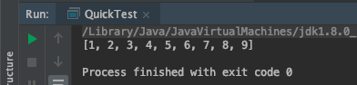

#### 1.2.3.6. 快速排序和归并排序的区别

快速排序是另外一种分治的排序算法， 它将一个数组分成两个子数组，将两部分独立排序。

快速排序和归并排序是互补的：归并排序将数组分成两个子数组分别排序，并将有序的子数组归并从而实现整个数组的排序；而快速排序的方式则是当两个数组都有序时，整个数组自然就有序了。

**在归并排序中，一个数组被等分成两半，归并调用发生在处理整个数组之前**；

**在快速排序中，切分数组的位置取决于数组的内容荣，递归调用发生在处理整个数组之后**。

#### 1.2.3.7. 快速排序时间复杂度分析

快速排序的一次切分从两头开始交替搜索，直到 left 和 right 重合。因此，一次切分算法的时间复杂度为 O(n), 但整个快速排序的时间复杂度和切分的次数相关。

* 最优情况：每次切分选择的基准数值刚好将当前序列等分

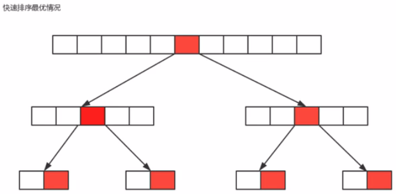

如果我们把数组的切分看做是一个数，那么上图就是它的最优情况的图示，共切分了 logn 次，所以，最优情况下快速排序的时间复杂度为 O(nlogn)

* 最坏情况：每一次切分选择的基准数字是当前序列中最大数或者最小数，这使得每次切分都会有一个子组，那么总共就要气氛 n 次，所以，最坏情况下，快速排序的时间复杂度为 O(n^2)

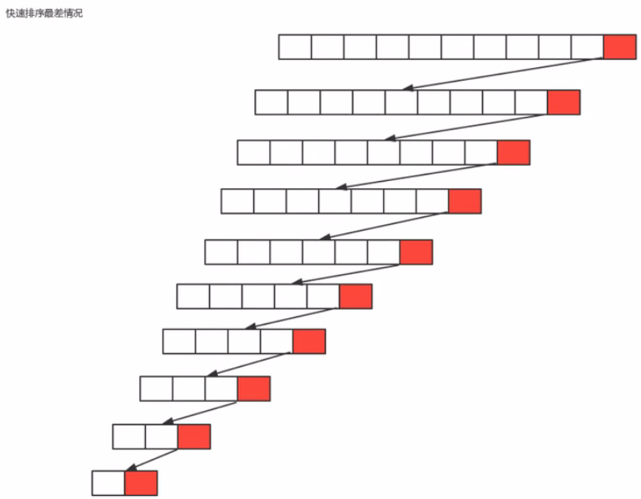

* 平均情况：每一次切分选择的基准数字不是最大或最小，也不是中值，这种情况我们也可以用数学归纳法证明。**快速排序的时间复杂度为 O(nlogn),** 由于数学归纳法有很多数学相关的知识，此处不再介绍。

### 1.2.4. 排序的稳定性

#### 1.2.4.1. 稳定性的定义

**数组 arr 中有若干元素，其中 A 元素和 B 元素相等，并且 A 元素在 B 元素前面，如果使用某种排序算法之后，能够保证 A 元素依旧在 B 元素的前面，则认为该算法是稳定的**。


#### 1.2.4.2. 稳定性的意义

如果一组数据只需要一次排序，则稳定性一般是没有意义的，如果一组数据需要多次排序，则稳定性是有意义的。

例如，要排序的内容是一组商品对象，第一次排序按照价格由低到高排序，第二次排序按照销量由高到低排序。**如果第二次排序使用稳定性算法，就可以使得相同销量的对象依旧保持着价格高低的顺序展现**，只有销量不同的对象才需要重新排序。这样既可以保持第一次排序的原有意义，而且可以减少系统开销。

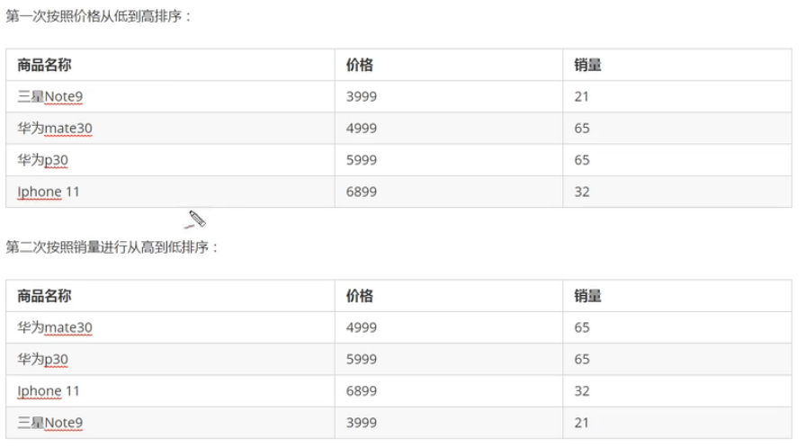

#### 1.2.4.3. 常见排序算法的稳定性

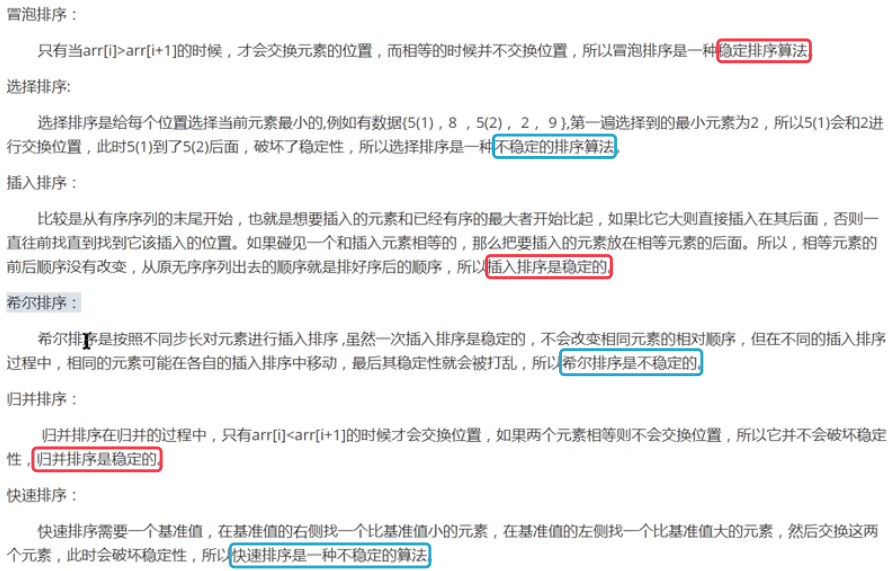

实际应用中尽量选择高性能且高稳定性的排序算法。


