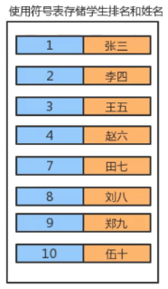
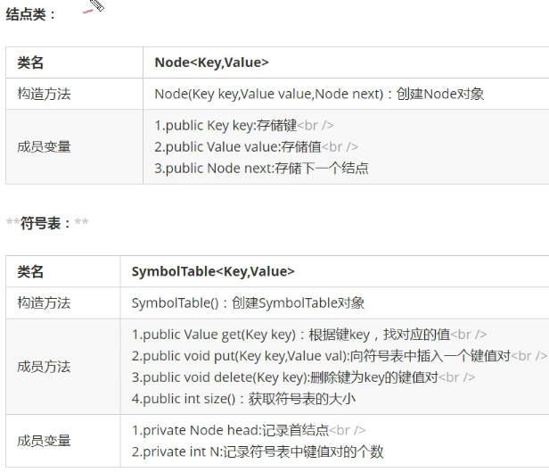
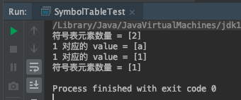
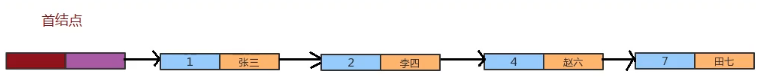
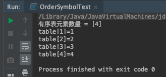

# 1. 4-符号表

符号表最重要的目的就是将一个键和一个值关联起来，也就是说，符号表中存储的是键值对数据。我们根据键就可以找到值。



**符号表中，键具有唯一性。**

符号表在实际生活中的使用场景是非常官方的，如：

应用|  查找目的 | 键 | 值
---|---|---|---
字典 | 找出单词的释义 | 单词 | 释义
图书索引 | 找出某个术语相关的页码 | 术语 | 一串页码
网络搜索 | 找出某个关键字对应的网页 | 关键字 | 网页名称

## 1.1. 符号表 API 设计




## 1.2. 符号表实现

* SymbolTable.java

```java
package symbol;

/**
 * 作者：CnPeng 4/2/21 2:11 PM
 * 功用：符号表
 * 其他：
 */
class SymbolTable<Key, Value> {
    // 头节点
    private Node head;
    // 元素数量
    private int  N;


    public SymbolTable() {
        head = new Node(null, null, null);
        N = 0;
    }

    // 获取元素数量
    public int size() {
        return N;
    }

    // 插入数据
    public void put(Key key, Value value) {
        // 符号表中存在对应的键，更新值
        Node node = head;
        while (node.next != null) {
            node = node.next;
            // 键一致，更新值
            if (node.key.equals(key)) {
                node.value = value;
                return;
            }
        }

        // 不存在对应的键，插入值
        Node oldFirst = head.next;
        Node newNode = new Node(key, value, oldFirst);
        head.next = newNode;

        // 数量 +1
        N++;
    }

    // 删除
    public void delete(Key key) {
        Node node = head;
        while (node.next != null) {
            if (node.next.key.equals(key)) {
                // 如果节点 key 一致，更新 next
                node.next = node.next.next;
                //更新数量
                N--;
                return;
            }
            // 如果不一致，更新 node
            node = node.next;
        }

    }

    // 获取数据
    public Value get(Key key) {
        Node node = head;
        // 只有最后一个节点的 next 才为 null
        while (node.next != null) {
            node = node.next;
            if (node.key.equals(key)) {
                return node.value;
            }
        }
        return null;
    }

    private class Node {
        private Key   key;
        private Value value;
        public  Node  next;

        public Node(Key key, Value value, Node next) {
            this.key = key;
            this.value = value;
            this.next = next;
        }
    }
}
```

* SymbolTableTest.java

```java
package symbol;

/**
 * 作者：CnPeng 4/2/21 7:28 PM
 * 功用：符号表测试
 * 其他：
 */
class SymbolTableTest {
    public static void main(String[] args) {
        // 创建符号表对象
        SymbolTable<Integer, String> symbolTable = new SymbolTable();

        symbolTable.put(1, "a");
        symbolTable.put(2, "b");
        System.out.println("符号表元素数量 = [" + symbolTable.size() + "]");
        System.out.println("1 对应的 value = [" + symbolTable.get(1) + "]");

        symbolTable.put(1, "1");
        System.out.println("1 对应的 value = [" + symbolTable.get(1) + "]");

        symbolTable.delete(1);
        System.out.println("符号表元素数量 = [" + symbolTable.size() + "]");
    }
}
```

运行结果：



## 1.3. 有序符号表

用键来保证符号表有序，所以就需要对键提供比较规则。

有序符号表示意图：



在下面的代码中，重点是让 Key 继承了 Comprable<Key>，这样 Key 就是可比较的了，然后就可以根据 key 排序。

* OrderSymbolTable.java

```java
package symbol;

/**
 * 作者：CnPeng 4/2/21 2:11 PM
 * 功用：有序符号表(按照键的大小排序)
 * 其他：
 */
class OrderSymbolTable<Key extends Comparable<Key>, Value> {
    // 头节点
    private Node head;
    // 元素数量
    private int  N;


    public OrderSymbolTable() {
        head = new Node(null, null, null);
        N = 0;
    }

    // 获取元素数量
    public int size() {
        return N;
    }

    // 插入数据
    public void put(Key key, Value value) {
        // 1-定义两个节点分别记录当前节点和前一个节点
        Node pre = head;
        Node curr = head.next;

        // 2-新插入的数据 key >当前数据 key 时, 继续向后比较。新插入的数据 key<= 当前数据 key 时跳出循环
        while (curr != null && key.compareTo(curr.key) > 0) {
            pre = curr;
            curr = curr.next;
        }

        // 3-新插入数据的 key == 当前数据的 key，更新 value
        if (curr != null && key.compareTo(curr.key) == 0) {
            curr.value = value;
            return;
        }

        // 4-新插入数据的 key < 当前数据 key, 则在当前数据之前插入新数据
        Node newNode = new Node(key, value, curr);
        pre.next = newNode;

        // 数量 +1
        N++;
    }

    // 删除
    public void delete(Key key) {
        Node node = head;
        while (node.next != null) {
            if (node.next.key.equals(key)) {
                // 如果节点 key 一致，更新 next
                node.next = node.next.next;
                //更新数量
                N--;
                return;
            }
            // 如果不一致，更新 node
            node = node.next;
        }

    }

    // 获取数据
    public Value get(Key key) {
        Node node = head;
        // 只有最后一个节点的 next 才为 null
        while (node.next != null) {
            node = node.next;
            if (node.key.equals(key)) {
                return node.value;
            }
        }
        return null;
    }

    private class Node {
        private Key   key;
        private Value value;
        public  Node  next;

        public Node(Key key, Value value, Node next) {
            this.key = key;
            this.value = value;
            this.next = next;
        }
    }
}
```

* OrderSymbolTest.java

```java
package symbol;

/**
 * 作者：CnPeng 4/2/21 8:23 PM
 * 功用：有序符号表测试
 * 其他：
 */
class OrderSymbolTest {
    public static void main(String[] args) {
        // 创建有序符号表对象
        OrderSymbolTable<Integer, Object> table = new OrderSymbolTable<>();

        table.put(2, "2");
        table.put(4, "4");
        table.put(3, "3");
        table.put(1, "1");

        System.out.println("有序表元素数量 = [" + table.size() + "]");

        System.out.println("table[" + 1 + "]=" + table.get(1));
        System.out.println("table[" + 2 + "]=" + table.get(2));
        System.out.println("table[" + 3 + "]=" + table.get(3));
        System.out.println("table[" + 4 + "]=" + table.get(4));
    }
}
```

运行结果：




