# 1. 5-二叉树

之前我们在实现符号表时不难看出，符号表中随着元素个数 N 的增多，其增删查操作的耗时也是线性增多的，时间复杂度都是 O(n)。为了提供运算效率，接下来我们就学习树这种数据结构

## 1.1. 树的基本定义和相关术语

### 1.1.1. 树的基本定义

数是计算机中非常重要的一种数据结构。使用树这种数据结构可以描述现实生活中很多的事物，如家谱、单位的组织架构等。

树是由 n ( n>=1) 个有限节点组成一个具有层次关系的集合。把它叫做 "树" 是因为它看起来像一棵倒挂的树，也就是说其根朝上，叶朝下。如下图：


树具有如下特点：

* 每个节点有零个或多个子节点
* 没有父节点的节点为根节点
* 每一个非根节点只有一个父节点
* 每个节点及其后代节点整体上可以看做是一棵树，称为当前节点的父节点的一个子树。


### 1.1.2. 树的相关术语

* **节点的度**：一个节点含有的子树的个数称为该节点的度
* **叶节点**：度为 0 的节点称为叶节点，也可以叫做**终端节点**
* **分支节点**：度不为 0 的节点称为分支节点，也可以叫做**非终端节点**
* **节点的层次**：从根节点开始，根节点的层次为 1，根的直接后继层次依次为 2，3，4，依次类推
* **节点的层序编号**：将树中的节点按照从上层到下层，同层从左到右的次数排成一个线性序列，把它们变成连续的自然数。
* **树的度**：树中所有节点的度的最大值
* **树的高度（深度）**：树中节点的最大层次
* **森林**：即 m（m>0）个互不相交的树的集合。将一棵非空树的根节点删去，树就变成一个森林；给森林增加一个统一的根节点，森林就变成一棵树。
* **孩子节点**：一个节点的直接后继节点称该节点的孩子节点
* **双亲节点（父节点）**：一个节点的直接前驱称为该节点的双亲节点
* **兄弟节点**：同一双亲节点的孩子节点间互称兄弟节点。

## 1.2. 二叉树

### 1.2.1. 二叉树的基本定义

* **二叉树**：二叉树就是度不超过 2 的树（每个节点最多有两个子节点）, 如下图：

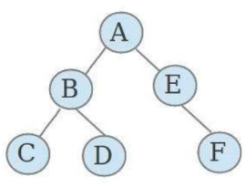

* **满二叉树**：一个二叉树，如果每一层的节点树都达到最大值，则这个二叉树就是满二叉树，如下图：


* **完全二叉树**：叶节点只能出现在**最下层和次下层**，并且最下面一层的节点都集中在该层最坐标的若干位置的二叉树。如下图：

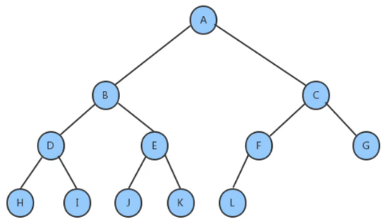

### 1.2.2. 二叉查找树的创建

#### 1.2.2.1. 二叉树的节点类

根据对图的观察，我们发现二叉树其实就是由一个个的节点及其之间的关系组成的，按照面向对象的思想，我们设计一个节点类来描述节点这个事物。

* 节点类 API 设计

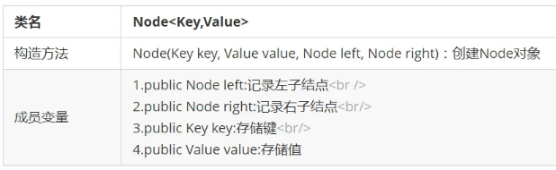

* 节点类代码实现

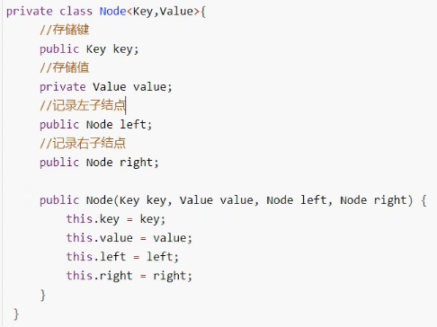


#### 1.2.2.2. 二叉查找树 API 设计

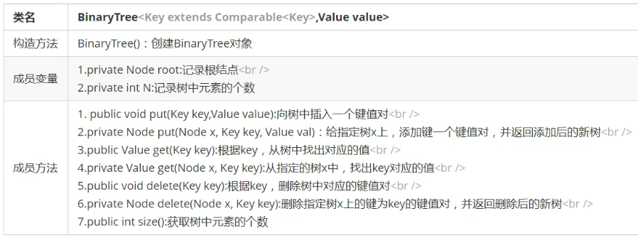

#### 1.2.2.3. 二叉查找树实现

##### 1.2.2.3.1. 插入方法 put 实现思路

* 如果当前树中没有任何节点，则直接把新节点当做根节点使用
* 如果当前树不为空，则从根节点开始
    * 如果新节点的 key 小于当前节点的 key, 则继续查找当前节点的左子节点
    * 如果新节点的 key 大于当前节点的 key , 则继续查找当前节点的右子节点
    * 如果新节点的 key 等于当前节点的 key，则树中已经存在这样的节点，替换其 value 值即可

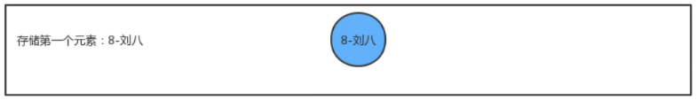


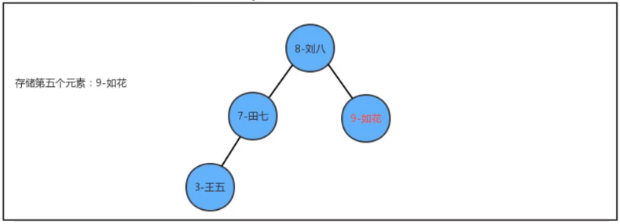

##### 1.2.2.3.2. 查询方法 get 实现事项

从根节点开始：

* 如果要查询的 key 小于当前节点的 key, 则继续找当前节点的左子节点
* 如果要查询的 key 大于当前节点的 key，则继续找当前节点的右子节点
* 如果要查询的 key 等于当前节点的 key , 则返回当前节点的 value


##### 1.2.2.3.3. 删除方法 delete 实现思想

[对应视频 p85 ](https://www.bilibili.com/video/BV1Cz411B7qd?p=85&spm_id_from=pageDriver)

* 找到被删除节点
* 找到被删除节点右子树中的最小节点 minNode
* 删除右子树中的最小节点
* 让被删除节点的左子树成为最小节点 minNode 的左子树；让被删除节点的右子树成为最小节点 minNode 的右子树
* 让被删除节点的父节点指向最小节点 minNode

(根本思路：被删除节点的左子树根节点和右子树根节点必然小于被删除节点，所以，就从右子树中找到最小的那个节点，然后将该节点替代被删除节点)

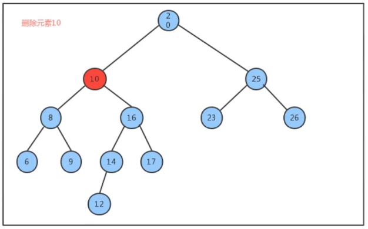

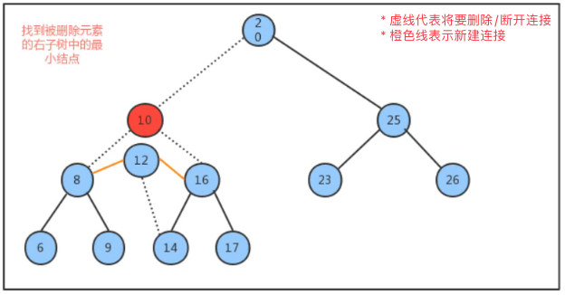

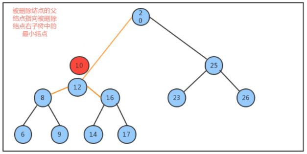

##### 1.2.2.3.4. 代码实现

* BinaryTree.java

```java
package tree;

/**
 * 作者：CnPeng 4/6/21 2:58 PM
 * 功用：二叉树
 * 其他：
 */
class BinaryTree<Key extends Comparable<Key>, Value> {
    // 根节点
    private Node root;
    // 元素个数
    private int  N;


    private class Node {
        // 键
        public  Key   key;
        // 值
        private Value value;
        // 左子节点
        public  Node  left;
        // 右子节点
        public  Node  right;

        public Node(Key key, Value value, Node left, Node right) {
            this.key = key;
            this.value = value;
            this.left = left;
            this.right = right;
        }
    }

    /**
     * CnPeng 4/6/21 3:04 PM
     * 功用：获取树中元素的个数
     */
    public int size() {
        return N;
    }

    /**
     * CnPeng 4/6/21 3:05 PM
     * 功用：向树中添加 key-value
     */
    public void put(Key key, Value value) {
        root = put(root, key, value);
    }

    /**
     * CnPeng 4/6/21 3:06 PM
     * 功用：向指定的树 x 中添加 key-value,并返回添加元素后的树
     */
    public Node put(Node x, Key key, Value value) {
        // 如果节点为空
        if (x == null) {
            N++;
            return new Node(key, value, null, null);
        }

        // 如果树非空，比较 x 节点的键和 key 的大小
        int flag = key.compareTo(x.key);
        if (flag > 0) {
            // 如果要插入的 key 大于 x.key ,则放到 x 右侧子树中
            x.right = put(x.right, key, value);
        } else if (flag < 0) {
            // 如果插入的 key 小于 x.key ,则放到 x 左侧子树中
            x.left = put(x.left, key, value);
        } else {
            // 如果插入的 key 和现有的 key 一致，则替换 value
            x.value = value;
        }

        return x;
    }


    /**
     * CnPeng 4/6/21 3:11 PM
     * 功用：查找树中指定 key 对应的 value
     */
    public Value get(Key key) {
        return get(root, key);
    }

    /**
     * CnPeng 4/6/21 3:13 PM
     * 功用：从指定的树 x 中查找 key 对应的值
     */
    public Value get(Node x, Key key) {
        // 如果 x 节点为空
        if (x == null) {
            return null;
        }

        // 如果 x 节点非空，则比较 key
        int flag = key.compareTo(x.key);
        if (flag > 0) {
            // 如果要查询的 key 大于 x.key ,则继续向右子节点查找
            return get(x.right, key);
        } else if (flag < 0) {
            // 如果要查询的 key 小于 x.key, 则继续向左子节点查找
            return get(x.left, key);
        } else {
            // 如果正好相等，则返回 value
            return x.value;
        }
    }

    /**
     * CnPeng 4/6/21 3:14 PM
     * 功用：删除树中 key 对应的 value
     */
    public void delete(Key key) {
        delete(root, key);
    }

    /**
     * CnPeng 4/6/21 4:24 PM
     * 功用：从指定的树 x 中删除 key 对应的 value, 并返回删除之后用于替代 x 的新树
     * 说明：
     */
    public Node delete(Node x, Key key) {
        if (x == null) {
            return null;
        }

        // 找到将要被删除的节点
        int flag = key.compareTo(x.key);

        if (flag > 0) {
            // 如果 key > x.key , 继续向右找
            x.right = delete(x.right, key);
        } else if (flag < 0) {
            // 如果 key < x.key , 继续向左找
            x.left = delete(x.left, key);
        } else {
            // 找到了将要被删除的节点, 接下来就需要找用于替换被删除节点的节点——被删除节点右子树中的最小节点

            if (x.right == null) {
                // 1-如果没有右子树，直接使用左子树作为替代,元素个数减-
                N--;
                return x.left;
            }
            if (x.left == null) {
                // 2-如果没有左子树，则直接使用右子树作为替代元素个数减-
                N--;
                return x.right;
            }

            // 3-如果左右子树都不为 null, 使用右子树中最小的左子节点作为替代
            Node minNode = x.right;
            while (minNode.left != null) {
                minNode = minNode.left;
            }

            // 4-删除右子树中最小的左子节点
            Node n = x.right;
            while (n.left != null) {
                if (n.left.left == null) {
                    // 4-1 如果孙子节点没有数据，表示子节点 n.left 就是最后一个左节点
                    n.left = null;
                } else {
                    n = n.left;
                }
            }

            // 5-将右子树中的最小左子节点放到被删除节点的位置, 并更新其指向关系
            // 5-1-让 x 左子树作为 minNode 的左子树
            minNode.left = x.left;
            // 5-2-让 x 右子树作为 minNode 的右子树
            minNode.right = x.right;
            // 5-3-让 x 的父节点指向 minNode
            x = minNode;

            // 6 元素个数-1
            N--;
        }
        return x;
    }
}
```

* BinaryTree.test

```java
package tree;

/**
 * 作者：CnPeng 4/6/21 5:02 PM
 * 功用：二分查找树测试
 * 其他：
 */
class BinaryTreeTest {
    public static void main(String[] args) {
        // 创建二叉查找树对象
        BinaryTree<Integer, String> tree = new BinaryTree<>();

        // 测试插入
        tree.put(1, "张三");
        tree.put(2, "李四");
        tree.put(3, "王五");
        tree.put(4, "赵六");

        System.out.println("树的元素数量 = [" + tree.size() + "]");
        // 测试获取
        System.out.println("[2] = [" + tree.get(2) + "]");

        // 测试删除
        tree.delete(3);
        System.out.println("树的元素数量2 = [" + tree.size() + "]");
        System.out.println("[3] = [" + tree.get(3) + "]");
    }
}
```

运行结果：

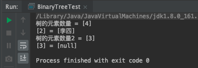


#### 1.2.2.4. 二叉查找树其他便捷方法

##### 1.2.2.4.1. 查找二叉树中最小的键

在某些情况下，我们需要查找出树中存储所有元素的键的最小值，比如我们的树中存储的是学生的排名和姓名数据，那么需要查找出排名最低的是多少名，这里我们设计如下两个方法来完成：


```java
   /**
     * CnPeng 4/6/21 5:32 PM
     * 功用：查找整个树中最小的键
     */
    public Key min() {
        return min(root).key;
    }

    /**
     * CnPeng 4/6/21 5:32 PM
     * 功用：在指定树中找出最小键所在的节点
     */
    private Node min(Node x) {

        if (x.left != null) {
            return min(x.left);
        } else {
            return x;
        }
    }
```

##### 1.2.2.4.2. 查找二叉树中最大的键

在某些情况下，我们需要查找出树中存储所有元素的键的最大值，比我我们的树中存储的是学生的成绩和学生的姓名，那么需要查找出最高的分数是多少。这里我们设计两个方法来完成：


```java
/**
 * CnPeng 4/6/21 5:46 PM
 * 功用：查找整个树中最大的键
 */
public Key max() {
    return max(root.right).key;
}
/**
 * CnPeng 4/6/21 5:50 PM
 * 功用：在指定树中查找最大键所在的节点
 */
public Node max(Node x) {
    if (x.right != null) {
        return max(x.right);
    } else {
        return x;
    }
}
```

### 1.2.3. 二叉树的基础遍历

很多情况下，我们可能需要像遍历数组一样对树进行遍历，从而拿出树中存储的每一个元素。

由于树状结构和线性结构不同，它无法从头开始依次向后遍历，所以存在如何遍历的问题，也就是按照什么样的搜索路径进行遍历的问题。

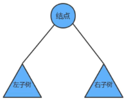

我们把树简单的画作上图中的样子，由一个根节点、一个左子树、一个右子树组成，那么**按照根节点什么时候被访问**，我们可以把二叉树的遍历分为以下三种方式：

* **前序遍历**：先访问根节点，然后再访问左子树，最后访问右子树
* **中序遍历**：先访问左子树，中间访问根节点，最后访问右子树（常用--中序遍历得到的数据是有顺序的 ）
* **后续遍历**: 先访问左子树，再访问右子树，最后访问根节点。

如果我们分别对下面的树使用三种遍历方式进行遍历，得到的结果如下：

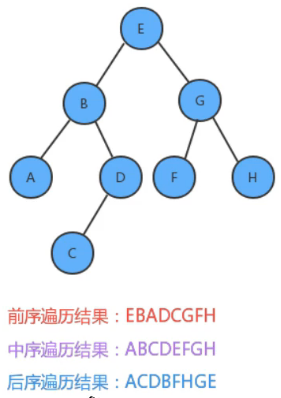

#### 1.2.3.1. 前序遍历

##### 1.2.3.1.1. API

基于前面已有的二叉树代码，添加前序遍历的 API 内容：

* `public Queue<Key> preErgodic() `: 使用前序遍历，获取整个树中的所有键
* `public void preErgodic(Node x,Queue<Key> keys)`：使用前序遍历，把指定树 x 中的所有键放入到 keys 队列中

在实现过程中，我们通过倒序遍历，把每个节点的键取出，放入到队列中返回即可。

##### 1.2.3.1.2. 实现步骤

* 把当前节点的 key 放到队列中
* 找到当前节点的左子树，如果不为空，递归遍历左子树
* 找到当前节点的右子树，如果不为空，递归遍历右子树

##### 1.2.3.1.3. 核心代码

```java
/**
 * CnPeng 4/6/21 7:03 PM
 * 功用：获取整个树中的所有键
 * 注意：次数的 Queue 为前面线性表中定义的 liner.Queue.Queue
 */
public Queue<Key> preErgodic() {
    Queue<Key> keys = new Queue<>();
    preErgodic(root, keys);
    return keys;
}
/**
 * CnPeng 4/6/21 7:03 PM
 * 功用：获取指定树 x 中的所有键，并将其放入 keys 中
 */
public void preErgodic(Node x, Queue<Key> keys) {
    if (x == null) {
        return;
    }
    // 把 x 节点的 key 放入到 keys 中
    keys.enqueue(x.key);
    // 把 x 左子树的所有 key 放入 keys 中
    if (x.left != null) {
        preErgodic(x.left, keys);
    }
    // 把 x 右子树的所有 key 放入 keys 中
    if (x.right != null) {
        preErgodic(x.right, keys);
    }
}
```

前序遍历的测试代码：

```java
package tree;


import liner.Queue.Queue;

/**
 * 作者：CnPeng 4/6/21 7:12 PM
 * 功用：二叉树遍历测试
 * 其他：
 */
class BinaryTreeErgodicTest {
    public static void main(String[] args) {
        BinaryTree<String, String> tree = new BinaryTree<>();

        // 向树中添加元素
        tree.put("E", "5");
        tree.put("B", "2");
        tree.put("G", "7");
        tree.put("A", "1");
        tree.put("D", "4");
        tree.put("F", "6");
        tree.put("H", "8");
        tree.put("C", "3");

        // 前序遍历
        Queue<String> keys = tree.preErgodic();
        for (String key : keys) {
            String value = tree.get(key);
            System.out.println(key + " = [" + value + "]");
        }
    }
}
```

运行结果：

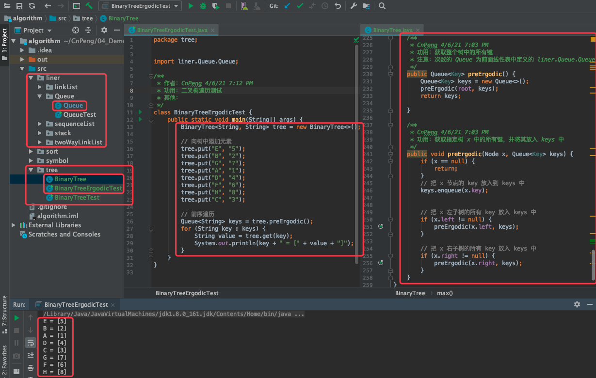

#### 1.2.3.2. 中序遍历

##### 1.2.3.2.1. API 

基于前面已有的二叉树代码，添加中序遍历的 API 内容：

* `public Queue<Key> midErgodic() `: 使用中序遍历，获取整个树中的所有键
* `public void midErgodic(Node x,Queue<Key> keys)`：使用中序遍历，把指定树 x 中的所有键放入到 keys 队列中

##### 1.2.3.2.2. 实现步骤

* 找到当前节点的左子树，如果不为空，递归遍历左子树
* 把当前节点的 key 放入到队列中
* 找到当前节点的右子树，如果不为空，递归遍历右子树

##### 1.2.3.2.3. 核心代码

```java
/**
 * CnPeng 4/6/21 7:03 PM
 * 功用：获取整个树中的所有键
 * 注意：次数的 Queue 为前面线性表中定义的 liner.Queue.Queue
 */
public Queue<Key> midErgodic() {
    Queue<Key> keys = new Queue<>();
    midErgodic(root, keys);
    return keys;
}
/**
 * CnPeng 4/6/21 7:03 PM
 * 功用：获取指定树 x 中的所有键，并将其放入 keys 中
 */
public void midErgodic(Node x, Queue<Key> keys) {
    if (x == null) {
        return;
    }
    // 把 x 左子树的所有 key 放入 keys 中
    if (x.left != null) {
        midErgodic(x.left, keys);
    }
    // 把 x 节点的 key 放入到 keys 中
    keys.enqueue(x.key);
    // 把 x 右子树的所有 key 放入 keys 中
    if (x.right != null) {
        midErgodic(x.right, keys);
    }
}
```

测试代码：

```java
package tree;


import liner.Queue.Queue;

/**
 * 作者：CnPeng 4/6/21 7:12 PM
 * 功用：二叉树遍历测试
 * 其他：
 */
class BinaryTreeErgodicTest {
    public static void main(String[] args) {
        BinaryTree<String, String> tree = new BinaryTree<>();

        // 向树中添加元素
        tree.put("E", "5");
        tree.put("B", "2");
        tree.put("G", "7");
        tree.put("A", "1");
        tree.put("D", "4");
        tree.put("F", "6");
        tree.put("H", "8");
        tree.put("C", "3");

        mid(tree);
    }

    private static void mid(BinaryTree<String, String> tree) {
        // 前序遍历
        Queue<String> keys = tree.midErgodic();
        for (String key : keys) {
            String value = tree.get(key);
            System.out.println(key + " = [" + value + "]");
        }
    }
}
```

运行结果：

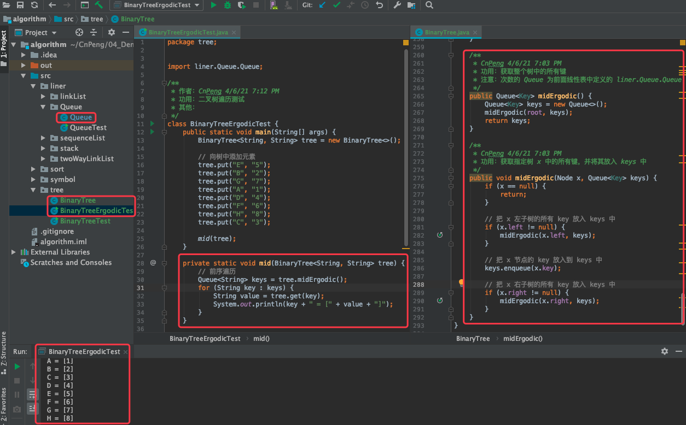


#### 1.2.3.3. 后序遍历

##### 1.2.3.3.1. API 

基于前面已有的二叉树代码，添加中序遍历的 API 内容：

* `public Queue<Key> afterErgodic() `: 使用后序遍历，获取整个树中的所有键
* `public void afterErgodic(Node x,Queue<Key> keys)`：使用后序遍历，把指定树 x 中的所有键放入到 keys 队列中

##### 1.2.3.3.2. 实现步骤

* 找到当前节点的左子树，如果不为空，递归遍历左子树
* 找到当前节点的右子树，如果不为空，递归遍历右子树
* 把当前节点的 key 放入到队列中

##### 1.2.3.3.3. 核心代码

```java
/**
 * CnPeng 4/6/21 7:03 PM
 * 功用：获取整个树中的所有键
 * 注意：此处的 Queue 为前面线性表中定义的 liner.Queue.Queue
 */
public Queue<Key> afterErgodic() {
    Queue<Key> keys = new Queue<>();
    afterErgodic(root, keys);
    return keys;
}
/**
 * CnPeng 4/6/21 7:03 PM
 * 功用：获取指定树 x 中的所有键，并将其放入 keys 中
 */
public void afterErgodic(Node x, Queue<Key> 
    if (x == null) {
        return;
    }
    // 把 x 左子树的所有 key 放入 keys 中
    if (x.left != null) {
        afterErgodic(x.left, keys);
    }
    // 把 x 右子树的所有 key 放入 keys 中
    if (x.right != null) {
        afterErgodic(x.right, keys);
    }
    // 把 x 节点的 key 放入到 keys 中
    keys.enqueue(x.key);
}
```

测试代码：

```java
package tree;


import liner.Queue.Queue;

/**
 * 作者：CnPeng 4/6/21 7:12 PM
 * 功用：二叉树遍历测试
 * 其他：
 */
class BinaryTreeErgodicTest {
    public static void main(String[] args) {
        BinaryTree<String, String> tree = new BinaryTree<>();

        // 向树中添加元素
        tree.put("E", "5");
        tree.put("B", "2");
        tree.put("G", "7");
        tree.put("A", "1");
        tree.put("D", "4");
        tree.put("F", "6");
        tree.put("H", "8");
        tree.put("C", "3");

        after(tree);
    }

    private static void after(BinaryTree<String, String> tree) {
        Queue<String> keys = tree.afterErgodic();
        for (String key : keys) {
            String value = tree.get(key);
            System.out.println(key + " = [" + value + "]");
        }
    }
}
```

运行结果：

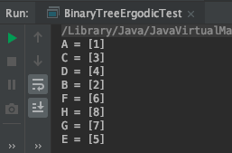


### 1.2.4. 二叉树的层序遍历

[原视频：p93](https://www.bilibili.com/video/BV1Cz411B7qd?p=93&spm_id_from=pageDriver)

所谓的层序遍历，就是从根节点（第一层）开始，依次向下，获取每一层所有节点的值。（整体遍历顺序是从上向下，从左向右）

有二叉树如下，

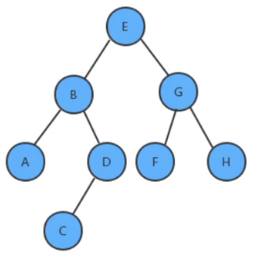

那么层序遍历的结果是：E、B、G、A、D、F、H、C

#### 1.2.4.1. API

基于前面已有的二叉树代码，我们添加层序遍历的 API：

* `public Queue<Key> layerErgodic()` :  使用层序遍历，获取整个树中的所有键

#### 1.2.4.2. 实现步骤

* 创建队列，存储每一层的节点
* 使用循环从队列中弹出一个节点
    * 获取当前节点的 key
    * 如果当前节点的左子节点不为空，则把左子节点放入到队列中
    * 如果当前节点的右子节点不为空，则把右子节点放入到队列中

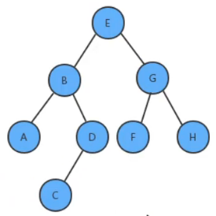

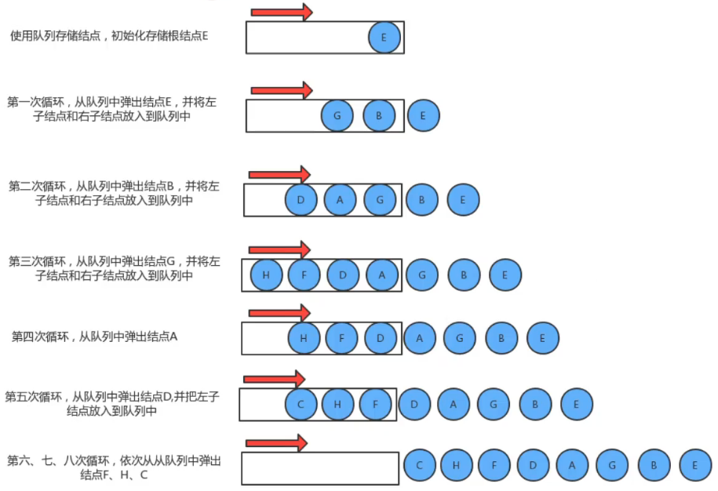

#### 1.2.4.3. 核心代码

```java
/**
 * CnPeng 4/6/21 8:20 PM
 * 功用：使用层序遍历，获取整个树中所有的键
 */
public Queue<Key> layerErgodic() {
    // 1-创建两个辅助队列，分别存储 key 和 node
    Queue<Key> keys = new Queue<>();
    Queue<Node> nodes = new Queue<>();
    // 1-1 初始化 nodes 元素
    nodes.enqueue(root);
    // 2-遍历
    while (!nodes.isEmpty()) {
        // 2-1-从 nodes 队列中弹出一个元素,
        Node node = nodes.dequeue();
        // 2-2-将其 key 追加到 keys
        keys.enqueue(node.key);
        // 2-3-如果该 node 还有左子节点，追加到 nodes 中
        if (node.left != null) {
            nodes.enqueue(node.left);
        }
        // 2-4-如果该 node 还有右子节点，追加到 nodes 中
        if (node.right != null) {
            nodes.enqueue(node.right);
        }
    }
    return keys;
}
```

测试代码：

```java
package tree;


import liner.Queue.Queue;

/**
 * 作者：CnPeng 4/6/21 7:12 PM
 * 功用：二叉树遍历测试
 * 其他：
 */
class BinaryTreeErgodicTest {
    public static void main(String[] args) {
        BinaryTree<String, String> tree = new BinaryTree<>();

        // 向树中添加元素
        tree.put("E", "5");
        tree.put("B", "2");
        tree.put("G", "7");
        tree.put("A", "1");
        tree.put("D", "4");
        tree.put("F", "6");
        tree.put("H", "8");
        tree.put("C", "3");

        layer(tree);
    }

    private static void layer(BinaryTree<String, String> tree) {
        Queue<String> keys = tree.layerErgodic();
        for (String key : keys) {
            String value = tree.get(key);
            System.out.println(key + " = [" + value + "]");
        }
    }
}
```

运行结果：

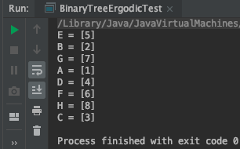

> 层序遍历体现的是数据遍历中的广度优先思想，基础遍历体现的是深度优先思想。


### 1.2.5. 实例-最大深度问题

[原视频 P94](https://www.bilibili.com/video/BV1Cz411B7qd?p=94&spm_id_from=pageDriver)

#### 1.2.5.1. 需求

给定一棵树，请计算树的最大深度（即树的根节点到最远叶子节点的最长路径上的节点树）


如上图，其最大深度为 4.

#### 1.2.5.2. API 

基于前面已有的二叉树代码，添加如下 API 

* `public int maxDepth()` : 计算整个树的最大深度
* `public int maxDepth(Node x)` : 计算指定树 x 的最大深度

#### 1.2.5.3. 实现步骤

* 如果根节点为空，则最大深度为 0
* 计算左子树的最大深度
* 计算右子树的最大深度
* 当前树的最大深度 = 左子树的最大深度和右子树的最大深度中的较大者 + 1

#### 1.2.5.4. 核心代码

```java
/**
 * CnPeng 4/7/21 11:03 AM
 * 功用：计算指定树 x 的最大深度
 */
private int maxDepth(Node x) {
    //1- 安全判断
    if (x == null) {
        return 0;
    }
    //2-定义三个变量用来记录左子树、右子树、x 的最大深度
    int max = 0; // x 的最大深度
    int maxL = 0; // 左子树最大深度
    int maxR = 0; // 右子树的最大深度
    //3-计算左子树最大深度
    if (x.left != null) {
        maxL = maxDepth(x.left);
    }
    // 4-计算右子树的最大深度
    if (x.right != null) {
        maxR = maxDepth(x.right);
    }
    // 5-比较左子树和右子树的大小，大值+1 即为 x 的最大深度
    max = maxL > maxR ? maxL + 1 : maxR + 1;
    return max;
}
```

测试代码

```java
package tree;

/**
 * 作者：CnPeng 4/7/21 11:23 AM
 * 功用：二叉树最大深度测试
 * 其他：
 */
class BinaryTreeMaxDepthTest {
    public static void main(String[] args) {
        BinaryTree<String, String> tree = new BinaryTree<>();

        // 向树中添加元素
        tree.put("E", "5");
        tree.put("B", "2");
        tree.put("G", "7");
        tree.put("A", "1");
        tree.put("D", "4");
        tree.put("F", "6");
        tree.put("H", "8");
        tree.put("C", "3");

        int max = tree.maxDepth();
        System.out.println("tree 的最大深度 = [" + max + "]");
    }
}
```

运行结果：

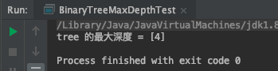

### 1.2.6. 实例-折纸问题

[原视频 P95](https://www.bilibili.com/video/BV1Cz411B7qd?p=95&spm_id_from=pageDriver)

#### 1.2.6.1. 需求

把一段纸条竖着放在桌子上，然后从纸条的下边向上方对折 1 次，压出折痕后再展开。此时，折痕是凹下去的，即折痕凸起的方向指向纸条的背面。如果从纸条的下边向上方连续对折 2 次，压出折痕后展开，此时有三条折痕，从上到下依次是：下折痕、下折痕和上折痕。

给定一个输入参数 N，代表纸条都从下边向上方连续对折的次数。请从上到下打印所有折痕的方向。

例如：N=1时，打印 down；N=2 时，打印 down、down、up

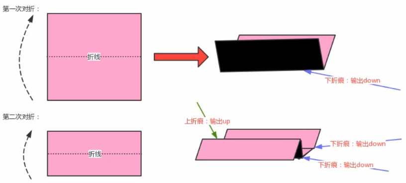

#### 1.2.6.2. 分析

我们把对折后的纸翻过来，**让粉色朝下**，这时把第一次对折产生的折痕看做是根节点，那第二次对折产生的下折痕就是该节点的左子节点，而第二次对折产生的上折痕就是该节点的右子节点，这样，我们就可以使用树形数据结构来描述对折后产生的折痕。

这棵树有这样的特点：

* 根节点为下折痕
* 每一个节点的左子节点为下折痕，
* 每一个节点的右子节点为上折痕

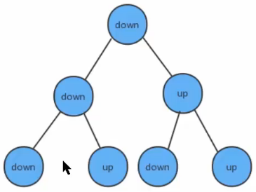

#### 1.2.6.3. 实现步骤

##### 1.2.6.3.1. 主要实现步骤

* 定义节点类
* 构建深度为 N 的折痕树
* 使用中序遍历，打印出树中所有节点的内容

##### 1.2.6.3.2. 构建深度为 N 的折痕树

* 第一次对折，只有一条折痕，创建根节点
* 如果不是第一次对折，则使用队列保存根节点
* 循环遍历队列
    * 从队列中拿出一个节点
    * 如果这个节点的左子节点不为空，则把这个左子节点添加到队列中
    * 如果这个节点的右子节点不为空，则把这个右子节点添加到对垒中
    * 判断当前节点的左子节点和右子节点都不为空，如果是，则需要为当前节点创建一个值为 down 的左子节点，一个值为 up 的右子节点。

#### 1.2.6.4. 代码实现

核心代码：

```java
package tree;

import liner.Queue.Queue;

/**
 * 作者：CnPeng 4/7/21 5:06 PM
 * 功用：用二叉树解决折纸问题
 * 其他：
 */
class PagerFolding {
    public static void main(String[] args) {
        // 1-模拟折纸过程，产生树
        Node tree = createTree(2);

        // 2-遍历树，打印节点
        printTree(tree);
    }

    /**
     * CnPeng 4/7/21 5:08 PM
     * 功用：模拟对折 N 次纸时产生的树
     */
    private static Node createTree(int N) {
        // 1-定义根节点
        Node<String> root = null;

        for (int i = 0; i < N; i++) {
            // 2-1 如果是第一次对折
            if (0 == i) {
                root = new Node<>("down", null, null);
                continue; // 跳出循环
            }

            // 2-2 如果不是第一次对折，定义辅助队列，通过层序遍历的思想，找到叶子节点，并为叶子节点添加子节点
            Queue<Node> queue = new Queue<>();
            queue.enqueue(root);

            // 2-3 循环遍历队列（层序遍历）
            while (!queue.isEmpty()) {
                // 弹出一个节点
                Node<String> temp = queue.dequeue();
                if (temp.left != null) {
                    // 如果左子节点非空，则将左子节点放入队列中继续遍历
                    queue.enqueue(temp.left);
                }
                if (temp.right != null) {
                    // 如果右子节点非空，则将右子节点放入队列中继续遍历
                    queue.enqueue(temp.right);
                }
                // 如果左右子节点都为空，则为该节点插入左子节点和右子节点
                while (temp.left == null && temp.right == null) {
                    temp.left = new Node<>("down", null, null);
                    temp.right = new Node<>("up", null, null);
                }
            }
        }
        return root;
    }

    /**
     * CnPeng 4/7/21 5:09 PM
     * 功用：打印树(使用中序遍历)
     */
    private static void printTree(Node node) {
        if (null == node) {
            return;
        }

        // 打印左子树的每个节点
        if (node.left != null) {
            printTree(node.left);
        }

        // 打印当前节点内容
        System.out.print("[" + node.item + "]");

        // 打印右子树的每个节点
        if (node.right != null) {
            printTree(node.right);
        }
    }


    /**
     * CnPeng 4/7/21 5:07 PM
     * 功用：节点类
     */
    private static class Node<T> {
        public T    item;   // 节点存储的元素
        public Node left;   // 节点的左子节点
        public Node right;  // 节点的右子节点

        public Node(T item, Node left, Node right) {
            this.item = item;
            this.left = left;
            this.right = right;
        }
    }
}
```

运行结果：

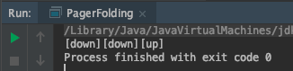


