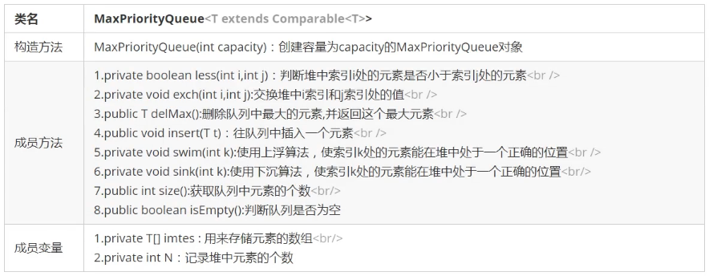
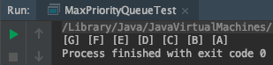
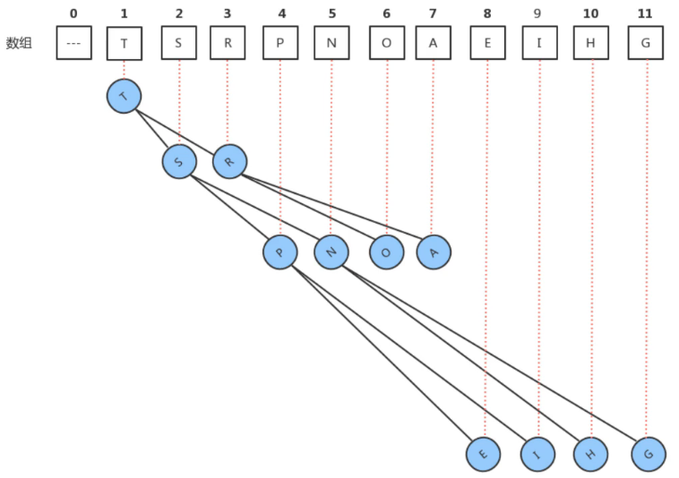
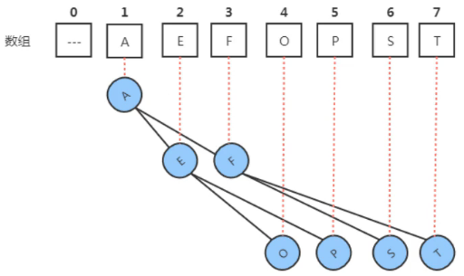
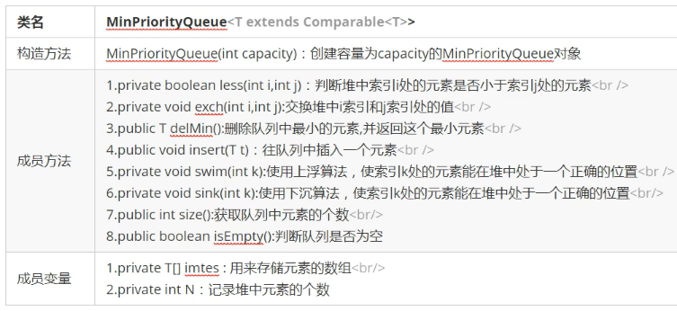
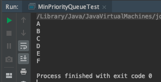
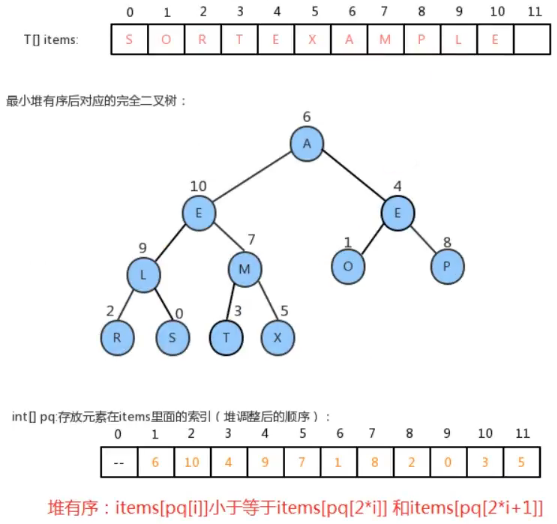
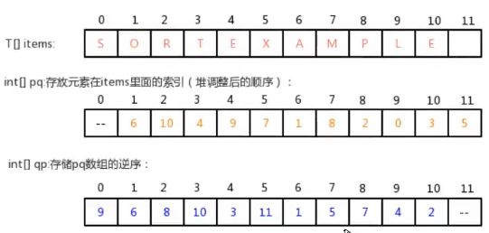
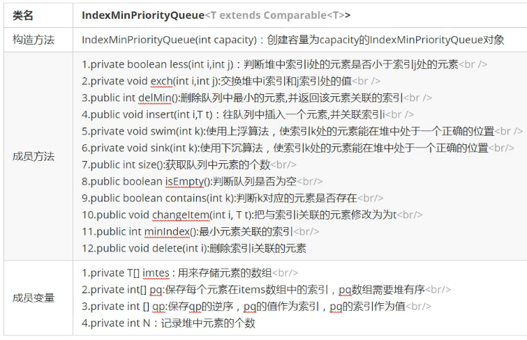
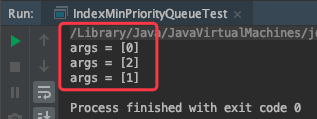

# 1. 7-优先队列


普通的队列是一种先进先出的数据结构，元素在队列尾追加，从队列头删除。

在某些情况下，我们可能需要找出队列中的最大值或者最小值。

比如，使用一个队列保存计算机的任务，一般情况下计算机的任务都是有优先级的，我们需要在这些计算机的任务中找出优先级最高的任务先执行，执行完毕后就需要把这个任务从队列中移除。

普通的队列要完成这样的功能，需要每次遍历队列中的所有元素，比较并找出最大值，效率不高。此时，我们就可以使用一种特殊的队列来完成这种需求——即**优先队列**。


优先队列按照其作用不同，可以分为如下两种：

* **最大优先队列**：可以获取并删除队列中最大的值
* **最小优先队列**：可以获取并删除队列中最小的值

## 1.1. 最大优先队列

我们之前学习过堆，而堆这种结构时可以方便的删除最大的值，所以，接下来我们可以基于堆来实现最大优先队列。

### 1.1.1. API 设计



### 1.1.2. 代码实现

```java
package priority;

/**
 * 作者：CnPeng 4/8/21 5:58 PM
 * 功用：最大优先队列
 * 其他：相关原理参考 堆 的实现
 */
class MaxPriorityQueue<T extends Comparable<T>> {
    // 用来存储元素的数组
    private T[] items;
    // 记录堆中的元素数量
    private int N;

    public MaxPriorityQueue(int capacity) {
        items = (T[]) new Comparable[capacity + 1];
        N = 0;
    }

    /**
     * CnPeng 4/8/21 5:59 PM
     * 功用：判断 i 处的元素是否小于 j 处的元素
     */
    private boolean less(int i, int j) {
        return items[i].compareTo(items[j]) < 0;
    }

    /**
     * CnPeng 4/8/21 6:02 PM
     * 功用：交换 i 和 j 处的元素
     */
    private void exch(int i, int j) {
        T temp = items[i];
        items[i] = items[j];
        items[j] = temp;
    }

    /**
     * CnPeng 4/8/21 6:04 PM
     * 功用：删除最大元素，并返回最大元素
     */
    public T delMax() {
        T maxT = items[1];
        // 交换 1 索引和 N 索引处的元素
        exch(1, N);
        // 置为 null,即表示删除
        items[N] = null;
        // 数量减1
        N--;
        // 数据下沉
        sink(1);

        return maxT;
    }

    /**
     * CnPeng 4/8/21 6:04 PM
     * 功用：向队列中插入一个元素
     */
    public void insert(T t) {
        // 插入元素
        items[++N] = t;
        // 上浮
        swim(N);
    }

    /**
     * CnPeng 4/8/21 6:05 PM
     * 功用：通过上浮算法，让 k 处的元素处于合适位置
     */
    private void swim(int k) {
        while (k > 1) {
            // k/2 为 k 的父节点，子节点大于父节点时交换
            if (less(k / 2, k)) {
                exch(k / 2, k);
            }
            k = k / 2;
        }
    }

    /**
     * CnPeng 4/8/21 6:05 PM
     * 功用：通过下沉算法，将 k 处的元素处于合适位置
     * 说明：将 k 处的元素与其子元素中的大值比较，如果小于其子元素中的大值，则下沉
     */
    private void sink(int k) {
        // 2*k<=N 表示 k 有子节点（左子节点）
        while (2 * k <= N) {
            int maxIndex;
            if (2 * k + 1 <= N) {
                // 2*k+1<=N 表示有右节点
                maxIndex = less(2 * k, 2 * k + 1) ? 2 * k + 1 : 2 * k;
            } else {
                maxIndex = 2 * k;
            }

            // k 处元素大于等于其子节点元素中的大值时，终止
            if (!less(k, maxIndex)) {
                break;
            }

            // 如果 k 处的元素小于其子节点元素中的大值，交换。
            exch(k, maxIndex);
            k = maxIndex;
        }
    }

    /**
     * CnPeng 4/8/21 6:06 PM
     * 功用：返回队列中的元素个数
     */
    public int size() {
        return N;
    }

    /**
     * CnPeng 4/8/21 6:06 PM
     * 功用：判断队列是否为空
     */
    public boolean isEmpty() {
        return N == 0;
    }
}
```

测试代码：

```java
package priority;

/**
 * 作者：CnPeng 4/8/21 8:39 PM
 * 功用：最大优先队列测试
 * 其他：
 */
class MaxPriorityQueueTest {
    public static void main(String[] args) {
        // 创建最大优先队列
        MaxPriorityQueue queue = new MaxPriorityQueue(10);
        // 插入元素
        queue.insert("A");
        queue.insert("B");
        queue.insert("C");
        queue.insert("D");
        queue.insert("E");
        queue.insert("F");
        queue.insert("G");

        // 删除元素
        while (!queue.isEmpty()) {
            System.out.print("[" + queue.delMax() + "] ");
        }
    }
}
```



## 1.2. 最小优先队列

我们同样也可以基于堆来实现最小优先队列。

我们前面学习堆时已经知道，堆中存放数据元素的数组要满足如下特性：

* **最大的元素放在数组的索引 1 处**
* **每个节点的数据总是大于或等于其子节点数据**



其实，我们之前实现的堆可以被称为**最大堆**。

我们用反向思想可以实现**最小堆**, 让堆中存放数据元素的数组满足如下特性：

* **最小的元素放在数组的索引 1 处**
* **每个节点的数据总是小于或等于它两个子节点的数据**



这样，我们就能快速的访问到堆中最小的数据。

### 1.2.1. API 设计



### 1.2.2. 代码实现

```java
package priority;

/**
 * 作者：CnPeng 4/8/21 8:54 PM
 * 功用：最小堆队列
 * 其他：
 */
class MinPriorityQueue<T extends Comparable<T>> {
    // 存储元素的数组
    private T[] items;
    // 记录堆中的元素个数
    private int N;

    public MinPriorityQueue(int capacity) {
        items = (T[]) new Comparable[capacity + 1];
        N = 0;
    }

    /**
     * CnPeng 4/8/21 8:57 PM
     * 功用：i 处的元素是否小于 j 处的元素
     */
    private boolean less(int i, int j) {
        return items[i].compareTo(items[j]) < 0;
    }

    /**
     * CnPeng 4/8/21 8:57 PM
     * 功用：交换 i 处和 j 的元素
     */
    private void exch(int i, int j) {
        T temp = items[i];
        items[i] = items[j];
        items[j] = temp;
    }

    /**
     * CnPeng 4/8/21 8:59 PM
     * 功用：向队列中插入一个元素
     * 说明：插入之后，要判断该元素是否比父节点元素小，小则上浮
     */
    public void insert(T t) {
        // 先把元素放到队尾
        items[++N] = t;

        // 上浮元素
        swim(N);
    }

    /**
     * CnPeng 4/8/21 9:01 PM
     * 功用：如果 k 处的元素小于其父节点，则上浮，保证 k 处于正确的位置（上浮之后，如果比新的父节点还小，继续上浮）
     */
    private void swim(int k) {
        // k = 1 时表示已经达到了根节点
        while (k > 1) {
            // 如果 k 处的元素比其父节点大,终止
            if (!less(k, k / 2)) {
                break;
            }

            // 与父节点交换位置
            exch(k, k / 2);

            // 更新 k 的值
            k = k / 2;
        }
    }


    /**
     * CnPeng 4/8/21 8:59 PM
     * 功用：删除最小元素（即 1 索引处的元素，0 索引空置不存元素）
     * 说明：
     */
    public T delMin() {
        // 0 处置空，1 处存最小值，所以此处删除 1 索引元素。
        T minT = items[1];
        // 交换元素
        exch(1, N);
        // 置空表示元素被删除
        items[N] = null;
        // 数量-1
        N--;
        // 数据下沉
        sink(1);
        return minT;
    }

    /**
     * CnPeng 4/8/21 9:06 PM
     * 功用：将 k 处的元素下沉（如果 k 处的元素比其子节点中的小值大，则交换位置；下沉后，如果比新的子节点中的小值还大，继续下沉）
     */
    private void sink(int k) {
        // 如果有左子节点（堆的特点：最后一个节点可以不满，但必须有左子节点）
        while (2 * k <= N) {
            int minIndex;
            if (2 * k + 1 <= N) {
                // 2*k+1<=N 表示有右子节点
                minIndex = less(2 * k, 2 * k + 1) ? 2 * k : 2 * k + 1;
            } else {
                minIndex = 2 * k;
            }

            // 如果 k 处的元素比子元素的小值小，则终止
            if (less(k, minIndex)) {
                break;
            }

            // 交换元素
            exch(k, minIndex);
            // 改变k
            k = minIndex;
        }
    }


    /**
     * CnPeng 4/8/21 9:08 PM
     * 功用：获取队列中元素的个数
     */
    public int size() {
        return N;
    }

    /**
     * CnPeng 4/8/21 9:08 PM
     * 功用：队列元素是否为空
     */
    public boolean isEmpty() {
        return N == 0;
    }
}
```

测试代码：

```java
package priority;

/**
 * 作者：CnPeng 4/8/21 9:28 PM
 * 功用：最小优先队列测试
 * 其他：
 */
class MinPriorityQueueTest {
    public static void main(String[] args) {
        // 创建队列
        MinPriorityQueue<String> queue = new MinPriorityQueue<>(10);
        // 插入元素
        queue.insert("F");
        queue.insert("D");
        queue.insert("E");
        queue.insert("B");
        queue.insert("C");
        queue.insert("A");

        // 删除内容
        while (!queue.isEmpty()) {
            System.out.println(queue.delMin() + " ");
        }
    }
}
```

运行结果:



## 1.3. 索引优先队列

在之前实现的最大优先队列和最小优先队列中，他们分别可以快速访问但队列中最大元素和最小元素，但是他们有一个缺点：无法通过索引访问已存在于优先队列中的对象，并更新他们。

为了实现上述目的，就需索引优先队列。

接下来就以**最小索引优先队列**来讲解如何实现。

### 1.3.1. 实现思路

#### 1.3.1.1. 步骤1

存储数据时给每一个数据元素关联一个整数，例如 `insert(int k,T t)`, 我们可以将 k 看做 t 关联的证书，那么我们的实现需要通过 k 这个值快速获取到队列中 t 这个元素，此时 k 就需要具有唯一性。

最直观的想法就是，我们可以用一个 `T[] items` 数组来保存数据元素，在 `insert(int k,T t)` 完成插入时，把 k 看做是 items 数组的索引，把 t 元素放到 items 数组的索引 k 处，这样，我们再根据 k 获取元素 t 时就很方便了，直接就可以通过 items[k] 获取 t 元素值。


#### 1.3.1.2. 步骤2

步骤一完成以后，虽然我们给每个元素关联了一个整数，并且可以使用这个整数快速的获取到该元素，但是，items 数组中的元素顺序是随机的，并不是堆有序的。

所以，为了完成该需求，我们可以增加一个数组 `int[]pq`，来保存每个元素在 items 数组中的索引，pq 数组需要堆有序，也就是说，pq[1] 对应的数据元素 `items[pq[1]]` 要小于等于 `items[pq[2]]` 和 `items[pq[3]]` 。



#### 1.3.1.3. 步骤3

通过步骤 2 的分析，我们可以发现，其实我们通过上浮和下沉做堆调整的时候，其实调整的是 pq 数组。

如果需要对 items 中的元素进行修改，比如让 `items[0]="H"`, 那么， 我们也必须对 pq 中的数据做出调整，而且是调整 `pq[9]` 中元素的位置。

但此时就会遇到一个问题， 我们修改的是 items 数组中 0 索引处的值，如何才能快速的知道需要挑中 `pq[9]` 中元素的位置呢？

最直观的想法就是遍历 pq 数组，拿出每一个元素和 0 做比较，如果当前元素是 0，那么调整该索引处的元素即可，但效率会很低。

我们可以另外再增加一个数组 `int[]qp`，用来存储 pq 的逆序（把 pq 的索引作为 qp 的元素，把 pq 的元素作为 qp 中的索引）。如：

在  pq 数组中，`pq[1]=6`, 那么在 qp 数组中，把 6 作为索引，1 作为值，即 `qp[6]=1`



这样，有了 pq 数组后，如果我们修改 `items[0]=H`, 那么就可以先通过索引 0 在 qp 数组中找到 pq 的索引 `qp[0]=9`, 那么直接调整 pq[9] 即可。

### 1.3.2. API 设计




### 1.3.3. 代码实现

[原视频地址 p113-118](https://www.bilibili.com/video/BV1Cz411B7qd?p=113&spm_id_from=pageDriver)

```java
package priority;

/**
 * 作者：CnPeng 4/9/21 8:17 AM
 * 功用：最小索引优先队列
 * 其他：
 */
class IndexMinPriorityQueue<T extends Comparable<T>> {
    // 用来存储元素的数组
    private T[]   items;
    // 堆数组，保存 items 中元素的索引，并且需要堆有序。通过调整该数组，可以让数据有序
    private int[] pq;
    // 保存 pq 的逆序，即将 pq 的值作为索引，将索引作为值
    private int[] qp;
    // 记录元素数量
    private int   N;

    public IndexMinPriorityQueue(int capacity) {
        items = (T[]) new Comparable[capacity + 1];
        pq = new int[capacity + 1];
        qp = new int[capacity + 1];
        N = 0;

        // 默认情况下，队列中没有存储任何数组，所以让 qp 中的元素都为 -1, 表示没有数据
        for (int i = 0; i < qp.length; i++) {
            qp[i] = -1;
        }
    }

    /**
     * CnPeng 4/9/21 8:24 AM
     * 功用：判断 i 处元素是否比 j 处元素小
     */
    private boolean less(int i, int j) {
        // pq 是存储 items 元素索引的堆数组，所以 pq[i] 和 pq[j] 获取的是 items 中元素的索引值。
        return items[pq[i]].compareTo(items[pq[j]]) < 0;
    }

    /**
     * CnPeng 4/9/21 8:25 AM
     * 功用：交换 i 处和 j 处的元素
     * 说明：
     */
    private void exch(int i, int j) {
        // 交换 pq 中的数据
        int temp = pq[i];
        pq[i] = pq[j];
        pq[j] = temp;

        // 交换 qp 中的数据，qp 中存储 pq 的逆序，即 qp 中的索引为 pq 的值，qp 值为 pq 中索引
        qp[pq[i]] = i;
        qp[pq[j]] = j;
    }

    /**
     * CnPeng 4/9/21 8:30 AM
     * 功用：判断 k 处是否有对应的元素
     * 说明：
     */
    public boolean contains(int k) {
        // 默认情况下，qp 的元素都为-1，其元素代表 pq 中元素的索引，-1 即表示没有数据
        return qp[k] != -1;
    }


    /**
     * CnPeng 4/9/21 8:26 AM
     * 功用：向队列中插入元素 t 并为其关联索引 i
     * 说明：
     */
    public void insert(int i, T t) {
        // 如果 i 处已经有数据了，不再插入
        if (contains(i)) {
            return;
        }

        // 数量 +1
        N++;
        // 把数据存储到 items 中的 i 位置
        items[i] = t;
        // 把 i 存储到 pq 中
        pq[N] = i;
        // 更新 qp
        qp[i] = N;

        // 通过堆上浮调整堆中的内容处于正确位置
        swim(N);
    }


    /**
     * CnPeng 4/9/21 8:29 AM
     * 功用：获取队列中元素的个数
     * 说明：
     */
    public int size() {
        return N;
    }

    /**
     * CnPeng 4/9/21 8:29 AM
     * 功用：判断队列是否为空
     * 说明：
     */
    public boolean isEmpty() {
        return N == 0;
    }

    /**
     * CnPeng 4/9/21 8:31 AM
     * 功用：最小元素关联的索引
     * 说明：
     */
    public int minIndex() {
        return pq[1];
    }

    /**
     * CnPeng 4/9/21 8:32 AM
     * 功用：删除索引 i 处对应的元素
     * 说明：
     */
    public void delete(int i) {
        // 找到 i 在 pq 中的索引
        int k = pq[i];

        // 交换 pq 中索引 k 处的值和索引 N 处的值
        exch(k, N);

        // 删除 qp 中的内容
        qp[pq[N]] = -1;

        // 删除 pq 中的内容
        pq[N] = -1;

        // 删除 items 中的内容
        items[k] = null;

        // 元素的数量 -1
        N--;

        // 堆的调整
        sink(k);
        swim(k);
    }

    /**
     * CnPeng 4/9/21 8:25 AM
     * 功用：删除队列中最小元素，并返回其对应的索引
     * 说明：
     */
    public int delMin() {
        // 获取最小元素关联的索引
        int minIndex = pq[1];

        // 交换 pq 中索引 1 处和最大索引处的元素
        exch(1, N);

        // 删除 qp 中对应的内容
        qp[pq[N]] = -1;

        // 删除 pq 最大索引处的内容
        pq[N] = -1;

        // 删除 items 中对应的内容
        items[minIndex] = null;

        // 元素个数 -1
        N--;

        // 下沉调整
        sink(1);
        return minIndex;
    }


    /**
     * CnPeng 4/9/21 8:30 AM
     * 功用：将索引 i 处关联的元素修改为 t
     * 说明：
     */
    public void changeItem(int i, T t) {
        // 修改 items 数组中 i 位置的元素为 t
        items[i] = t;
        // 找到 i 在 pq 中出现的位置
        int k = qp[i];
        // 堆调整
        sink(k);
        swim(k);
    }

    /**
     * CnPeng 4/9/21 8:27 AM
     * 功用：使用上浮算法，使索引 k 处的元素能在堆中处于正确位置
     * 说明：
     */
    private void swim(int k) {
        while (k > 1) {
            // k 是元素本身，k/2 表示其父节点
            if (less(k, k / 2)) {
                exch(k, k / 2);
            }
            k = k / 2;
        }
    }

    /**
     * CnPeng 4/9/21 8:28 AM
     * 功用：使用下沉算法，使索引 k 处的元素能在堆中处于正确位置
     * 说明：
     */
    private void sink(int k) {
        // 2 * k <= N 表示有左子节点
        while (2 * k <= N) {
            // 1-找到子节点中的较小值
            int min;
            // 2*k+1<=N 表示有右子节点
            if (2 * k + 1 <= N) {
                min = less(2 * k, 2 * k + 1) ? 2 * k : 2 * k + 1;
            } else {
                min = 2 * k;
            }

            // 2-比较当前节点和较小值
            if (less(k, min)) {
                break;
            }

            // 3-如果 k 比 min 大，则交换
            exch(k, min);
            k = min;
        }
    }
}
```

测试代码：

```java
package priority;

/**
 * 作者：CnPeng 4/9/21 8:17 AM
 * 功用：最小索引优先队列测试
 * 其他：
 */
class IndexMinPriorityQueueTest {
    public static void main(String[] args) {
        // 创建最小索引优先队列
        IndexMinPriorityQueue<String> queue = new IndexMinPriorityQueue<>(10);

        // 向队列中添加元素
        queue.insert(0,"A");
        queue.insert(1,"C");
        queue.insert(2,"F");

        // 修改元素
        queue.changeItem(2,"B");

        // 删除元素
        while (!queue.isEmpty()){
            System.out.println("args = [" + queue.delMin() + "]");
        }
    }
}
```

运行结果：



