# 1. 8-树的进阶

## 1.1. 平衡树

前面学习了二叉查找树，发现它的查询效率比单纯的链表和数组的查询效率要高很多，大部分情况下，确实如此，但在最坏情况下，二叉查找树的性能还是比较糟糕的。

例如，我们依次向二叉查找树中插入 9、8、7、6、5、4、3、2、1 这 9 个数据，那么，最终构造出来的树是下面的样子：

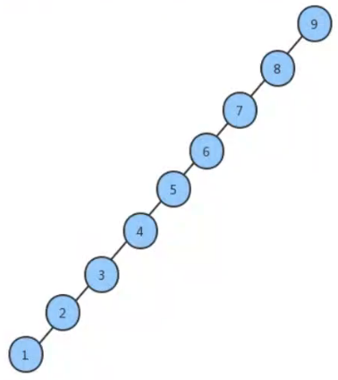

我们会发现，如果要查找 1 这个元素，查找的效率会比较低。

效率低的原因在于该树并不平衡，全部时向左边分支，如果我们有一种方法，能够不受插入数据的影响，让生成的树都向完全儿茶那样。那么，即使在最坏情况下，查找的效率依旧会很高。

### 1.1.1. `2-3` 查找树

为了保证查找树的平衡性，我们需要一些灵活性，因此在这里我们允许树中的一个节点保存多个键。

确切的说，我们将一棵标准的二叉查找树中的节点称为 `2-节点`（含有一个键和两条链）。而现在我们引入 `3-节点`，它含有两个键和三条链。

`2-节点` 和 `3-节点` 中的每条链都对应着其中保存的键所分割产生的一个区间。

#### 1.1.1.1. `2-3` 查找树的定义

一棵 `2-3` 查找树要么全空，要么满足如下两个要求：

* `2-节点`：含有一个键（及其对应的值）和两条链。左链接指向的 `2-3树` 中的键都小于该节点，右链接指向的 `2-3树` 中的键都大于该节点。
* `3-节点`：含有两个键（及其对应的值）和三条链。左链接指向的 `2-3树` 中的键都小于该节点，右链接指向的 `2-3树` 中的键都大于该节点，中连接指向的 `2-3树` 中的键都位于该节点的两个键之间。

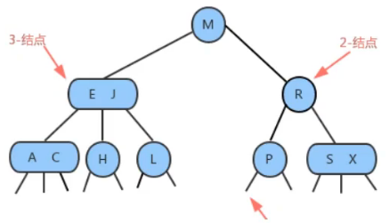

上图中，

E J 节点就是一个 `3-节点` ，其中包含 E 和 J 一大一小两个键。其左链接指向 A C 节点，左链接中的键小于其小建；右链接指向 L 节点，右链接中的键大于其大键；中连接指向 H 节点，中链接的键比其小值大，比其大值小。

R 节点是一个 `2-节点`，其左链接指向 P 节点，P 节点小于 R 节点；右链接指向 S X 节点，右链接中的键大于 R 节点的键。

#### 1.1.1.2. 查找

将二叉查找树的查找算法一般化我们就能够直接得到 `2-3` 查找树的查找方法。

要判断一个键是否在树中，我们先将它和根节点中的键比较。如果它和其中任意一个相等，查找命中；否则我们就根据比较的结果找到指向相应区间的连接，并在其指向的子树中继续递归查找。如果是空连接，则查找不会命中。

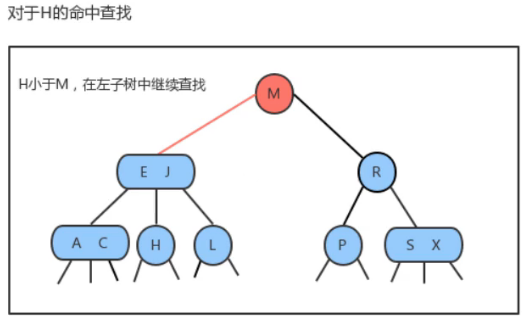

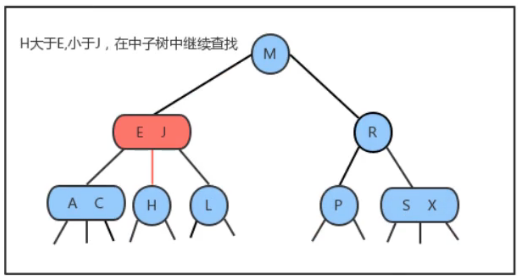

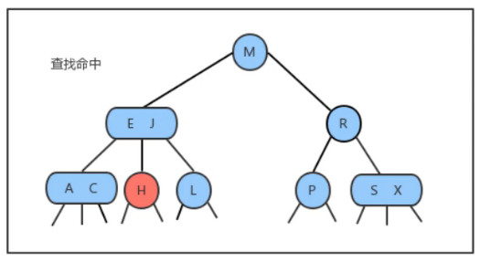

#### 1.1.1.3. 插入

[原视频地址 P121](https://www.bilibili.com/video/BV1Cz411B7qd?p=121&spm_id_from=pageDriver)

##### 1.1.1.3.1. 向 `2-` 节点中插入新键

向 `2-3` 树中插入元素和向二叉查找树中插入元素一样，首先要进行查找，然后将节点挂到未找到的节点上。

`2-3` 树之所以能够保证在最差情况下的效率是因为在插入数据之后仍能够保持平衡状态。

如果查找后未找到的节点是一个 `2-` 节点，我们只需要将新的元素放到该节点内，让其变成一个 `3-` 节点即可。如果查找的节点结束于一个 `3-` 节点，则会有些麻烦。

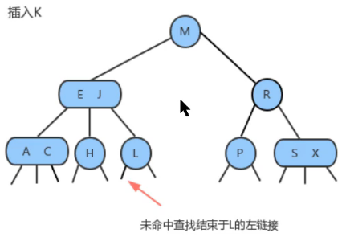

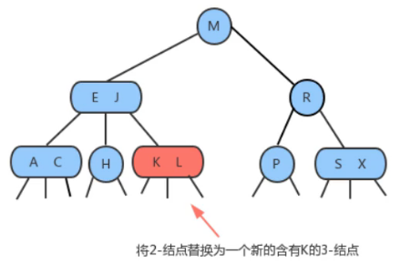


##### 1.1.1.3.2. 向只含有一个 `3-` 节点的树中插入新键

假设 `2-3` 树只包含一个 `3-` 节点，该节点有两个键，没有空间来插入第三个键了，最自然的方式是我们假设该节点能存放三个元素，暂时使其变成一个 `4-` 节点，同时它包含四条链接。然后，我们将这个 `4-` 节点的中间元素提升，左边的键作为其左子节点，右边的键作为其右子节点。插入完成，变为平衡 `2-3` 查找树，树的高度从 0 变为 1.

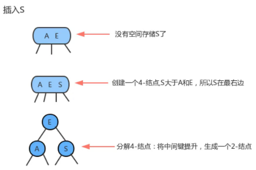


##### 1.1.1.3.3. 向父节点为 `2-` 节点的 `3-` 节点中插入新键

和上面的情况一样，我们也可以将新的元素插入到 `3-` 节点中，使其成为一个临时的 `4-` 节点，然后，将该节点中的中间元素提升到父节点即 `2-` 节点中，使用父节点成为一个 `3-` 节点，然后将左右节点分别挂在这个 `3-` 节点的恰当位置。

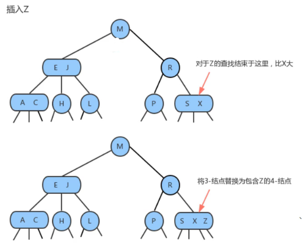
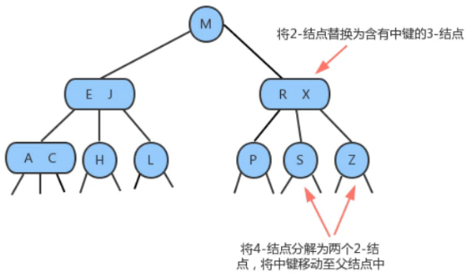


##### 1.1.1.3.4. 向父节点为 `3-` 节点的 `2-` 节点中插入新键

当我们插入的节点是 `3-` 节点时，我们将该节点拆分，中间元素提升至父节点，但是此时父节点是一个 `3-` 节点，插入之后，父节点变成了 `4-` 节点，然后继续将中间元素提升至其父节点，直到遇到一个父节点是 `2-` 节点，然后将其变为 `3-` 节点，不需要继续拆分。

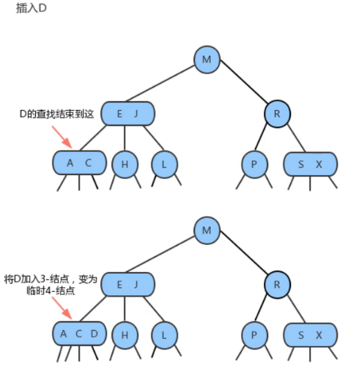

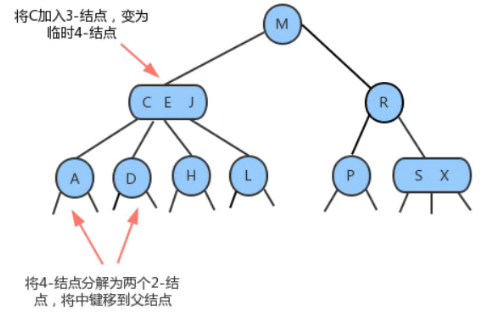

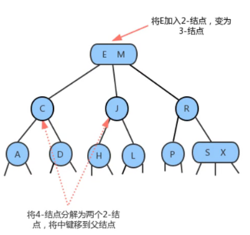

##### 1.1.1.3.5. 分解根节点

当插入节点到根节点的路径上全部是 `3-` 节点时，最终我们的根节点会变成一个临时的 `4-` 节点，此时，就需要将根节点拆分为两个 `2-` 节点，树的高度 +1.

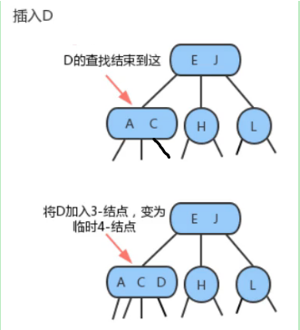

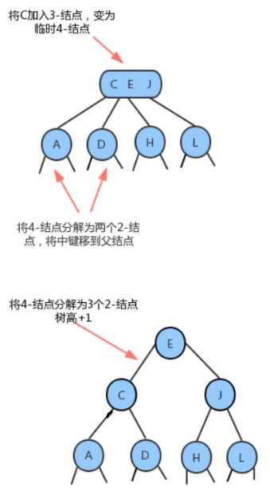


#### 1.1.1.4. 树的性质

通过对 `2-3` 树插入操作的分析，我们发现在插入的时候，`2-3` 树需要做一些局部的变换来保持 `2-3` 树的平衡。

一棵完全平衡的 `2-3` 树具有以下特点：

* 任意空链接（即叶子节点的链接）到根节点的路径长度都是相等的
* `4-` 节点变换为 `3-` 节点时，树的高度不会发生变化；只有当根节点时临时的 `4-` 节点，分解根节点时，树高 +1
* `2-3` 树与普通二叉查找树最大的区别在于，普通的二叉查找树是自顶向下生长，而 `2-3` 树是自底向上生长

#### 1.1.1.5. 树的实现

直接实现 `2-3` 树比较复杂，因为：

* 需要处理不同的节点类型，非常繁琐
* 需要多次比较操作来将节点下移
* 需要上移来拆分 `4-` 节点
* 拆分 `4-` 节点的情况有多种

`2-3` 查找树实现起来比较复杂，在某些情况插入后的平衡操作可能会使得效率降低。

但是 `2-3` 树作为一种比较重要的概念和思路对于我们后面要讲的红黑树、B树和 B+ 树非常重要。


### 1.1.2. 红黑树

[原视频 P123](https://www.bilibili.com/video/BV1Cz411B7qd?p=123&spm_id_from=pageDriver)

我们前面介绍了 `2-3` 树，可以看到 `2-3` 树能保证在插入元素之后，树依然保持平衡状态。它的最坏情况下所有子节点都是 `2-` 节点，树的高度为 `lgN`。而普通二叉树最坏情况下树的高度为 N。

`2-3` 树保证了最坏情况下的时间复杂度，但是 `2-3` 树实现起来过于复杂，所以我们介绍一种 `2-3` 树思想的简单实现：**红黑树**。

**红黑树** 主要是对 `2-3` 树进行编码，红黑树背后的基本思想是用标准的二叉查找树（完全由 `2-` 节点构成）和一些额外的信息（替换 `3-` 节点）来表示 `2-3` 树，我们将树中的链接分为两种类型：

* 红链接：将两个 `2-` 节点链接起来构成一个 `3-` 节点
* 黑链接：即 `2-3` 树中的普通链接。

确切的说，我们将 `3-` 节点表示为由一条**左斜**的红色链接（两个 `2-` 节点中一个是另一个的左子节点）相连的两个 `2-` 节点。这种表示法的一个优点是：我们无需修改就可以直接使用标准的二叉查找树的 get 方法。

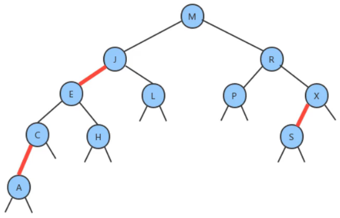

上图中， E 和 J 使用红色链接相连，则表示它俩构成了一个 `3-` 节点，该节点中的键为 E 和 J。该 `3-` 节点的左链接为 C，中连接为 H，右链接为 L 。

#### 1.1.2.1. 红黑树定义

红黑树是含有红黑链接，并满足下列条件的二叉查找树：

* 红链接均为左链接
* 没有任何一个节点同时和两条红链接相连
* 该树是完美黑色平衡的，即任意空链接到根节点的路径上的黑链接数量相同。

下图时红黑树与 `2-3` 树的对应关系：

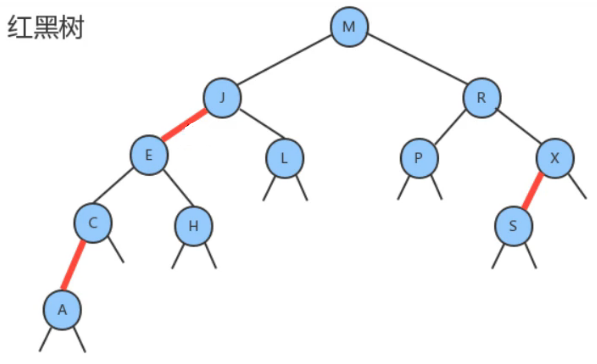

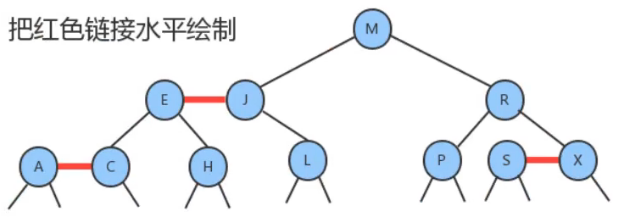

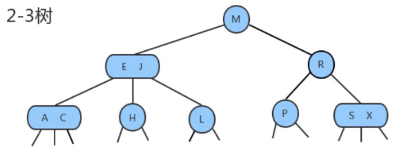


#### 1.1.2.2. 红黑树节点 API

因为每个节点都只有一条指向自己的链接（从它的父节点指向它），我们可以在之前的 Node 节点中添加一个布尔类型的变量 color 来表示链接的颜色。如果指向它的链接是红色的，那么该变量的值为 true，如果链接是黑色的，那么该变量的值为 false 。

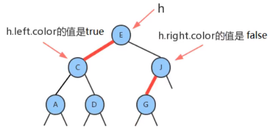

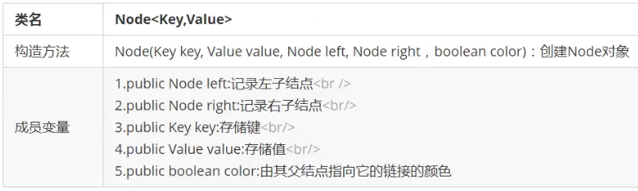

#### 1.1.2.3. 平衡化

在对红黑树进行一些增删改查的操作后，很有可能会出现红色的右链接或者两条连续红色的连接，而这些都不满足红黑树的定义，所以，我们需要对这些情况通过**旋转**来修复，从而让红黑树保持平衡。

##### 1.1.2.3.1. 左旋

**当某个节点的左子节点为黑色，右子节点为红色，此时需要左旋。**

假设当前节点为 h，它的右子节点为 x，则其左旋过程如下：

* 让 x 的左子节点变为 h 的右子节点：h.right=x.left
* 让 h 成为 x 的左子节点：x.left = h
* 让 h 的 color 属性变为 x 的 color 属性值：x.color = h.color
* 让 h 的 color 属性变为 RED：h.color = true

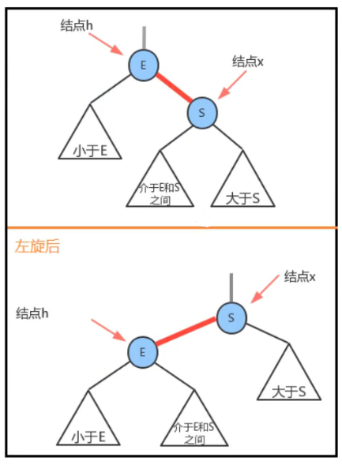

##### 1.1.2.3.2. 右旋 

**当某个节点的左子节点是红色，且左子节点的左子节点也是红色，需要右旋。**

假设当前节点为 h, 它的左子节点为 x，其右旋过程如下：

* 让 x 的右子节点成为 h 的左子节点：h.left = x.right
* 让 h 成为 x 的右子节点：x.right = h
* 让 x 的 color 变为 h 的 color 属性值：x.color = h.color
* 让 h 的 color 为 red

  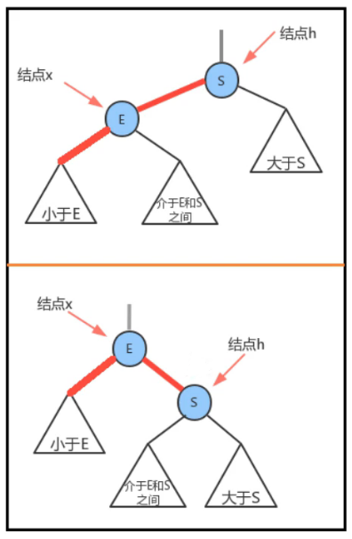

注意：上图中右转之后，E 的左链接和右链接都是红色，这并不符合红黑树的定义。所以，还需要后面的**颜色反转**做进一步的处理。


#### 1.1.2.4. 向单个 `2-` 节点中插入新键

一棵只含有一个键的红黑树只含有一个 `2-` 节点。插入另一个键之后，我们马上就需要将他们旋转。

* 如果新键小于当前节点的键，只需要新增一个红色节点即可。新的红黑树和单个 `3-` 节点完全等价

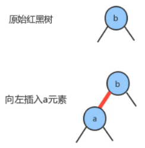

* 如果新建大于当前节点的键，那么新增的红色节点将会产生一条红色的右链接。此时，我们需要通过左旋把红色右链接变成左链接，插入操作才算完成。形成的新的红黑树依然和 `3-` 节点等价，其中含有两个键，一个红色链接。

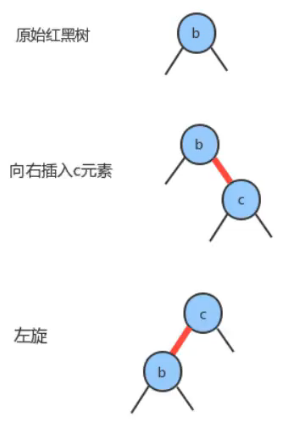


#### 1.1.2.5. 向底部的 `2-` 节点中插入新键

用和二叉查找树相同的方式向一棵红黑树中插入一个新键，会在树的底部新增一个节点（可以保证有序性），唯一区别是我们会用红链接将新节点和它的父节点相连。

如果它的父节点是一个 `2-` 节点，那么刚才讨论的两种方式依然适用。

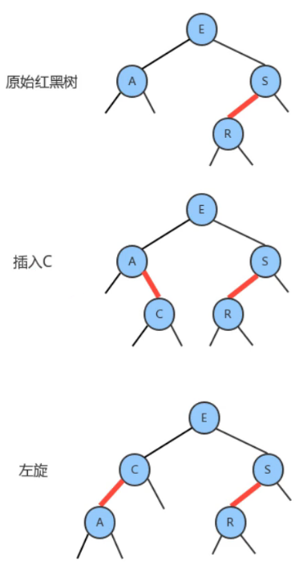

#### 1.1.2.6. 颜色反转

当一个节点的左子节点和右子节点的 color 都为 RED 时，也就是出现了临时的 `4-` 节点。此时，只需要把左子节点和右子节点的颜色变为 Black 黑色，同时让当前节点的颜色变为 Red 红色即可。

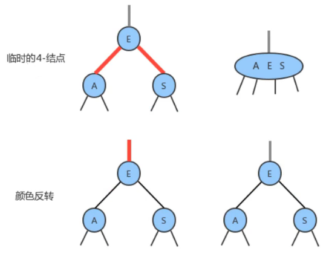

#### 1.1.2.7. 向一棵双键树（即一个 `3-` 节点）中插入新键

这种情况又可以分为三种子情况：

##### 1.1.2.7.1. 新插入的键大于原树中的两个键

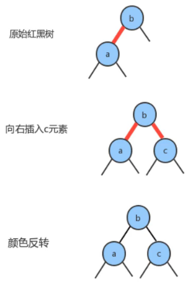

上图中，由于 b 是根节点，所以没有用红色链接标识指向它。

> 通过前面这些插入可以总结出，新插入的键不论是左节点还是右节点，都是红色链接节点

##### 1.1.2.7.2. 新插入的键小于原树中的两个键

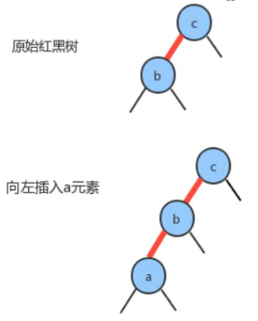

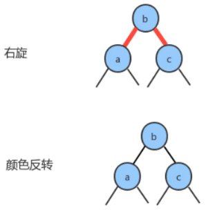

##### 1.1.2.7.3. 新插入的键介于原树中两个键之间

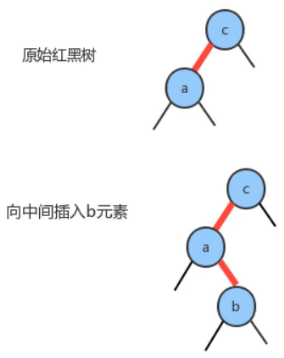

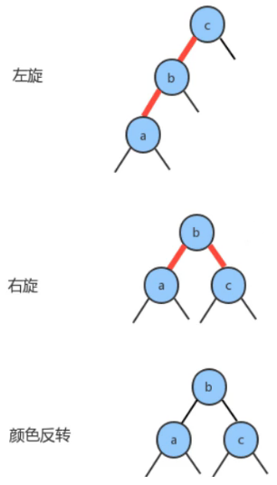

#### 1.1.2.8. 根节点的颜色总是黑色

之前介绍节点 API 的时候，在节点 Node 对象中 color 属性表示的是父节点指向当前节点的链接的颜色，由于根节点不存在父节点，所以，**每次插入操作后，我们都需要把根节点的颜色设置为黑色**。

#### 1.1.2.9. 向树底部的 `3-` 节点插入新键

假设在树的底部的一个 `3-` 节点中加入新的节点。前面我们所讲的三种情况都会出现：指向新节点的链接可能是 `3-` 节点的右链接（此时我们只需要转换颜色即可），或是左链接（需要先进行右旋转然后再转换颜色），或是中链接（先坐旋转，再右旋转，最后转换颜色）。

颜色转换会使中间节点的颜色变红，相当于将它送入了父节点。这也就意味着父节点中继续插入一个新键，我们只需要使用相同的方法解决即可，直到遇到一个 `2-` 节点或者根节点为止。

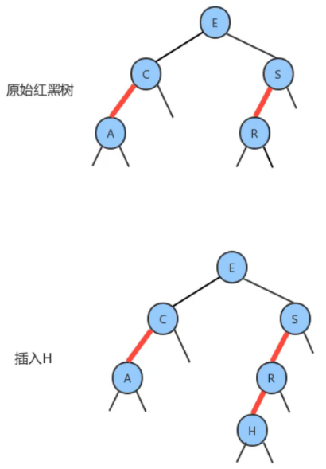

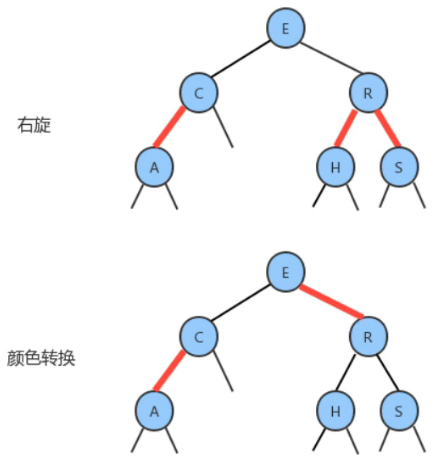

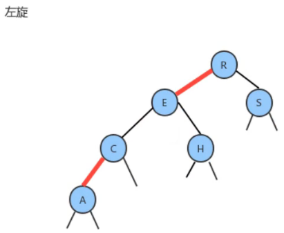

#### 1.1.2.10. 红黑树的 API 

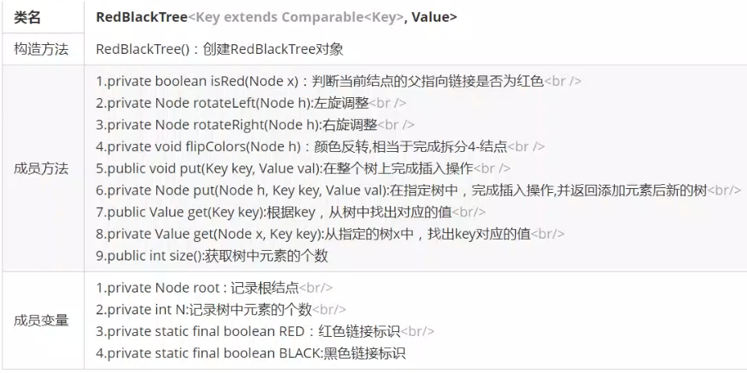


#### 1.1.2.11. 红黑树的实现

[原视频 P128-130](https://www.bilibili.com/video/BV1Cz411B7qd?p=128&spm_id_from=pageDriver)

```java
package tree;

/**
 * 作者：CnPeng 4/13/21 10:25 AM
 * 功用：红黑树
 * 其他：
 */
class RedBlackTree<Key extends Comparable<Key>, Value> {
    // 根节点
    private              Node    root;
    // 记录元素个数
    private              int     N;
    // 红色链接标识
    private static final boolean RED   = true;
    // 黑色链接标识
    private static final boolean BLACK = false;

    /**
     * CnPeng 4/13/21 10:36 AM
     * 功用：判断与父节点的链接是否为红链接
     */
    private boolean isRed(Node x) {
        if (null == x) {
            return false;
        }
        return x.color == RED;
    }

    /**
     * CnPeng 4/13/21 10:38 AM
     * 功用：左旋调整 (返回当前 h 位置的最终节点元素)
     */
    private Node rotateLeft(Node h) {
        // 获取 h 的右子节点，用 x 来表示
        Node x = h.right;
        // 让 x 的左子节点称为 h 的右子节点
        h.right = x.left;
        // 让 h 成为 x 的左子节点
        x.left = h;
        // 更新 x 节点的颜色为 h 节点的颜色
        x.color = h.color;
        // 将 h 节点的颜色设置为 红色
        h.color = RED;
        return x;
    }

    /**
     * CnPeng 4/13/21 10:39 AM
     * 功用：右旋调整(返回当前 h 位置的最终节点元素)
     */
    private Node rotateRight(Node h) {
        // 取 h 的左子节点
        Node x = h.left;
        // 将 x 的右子节点作为 h 的左子节点
        h.left = x.right;
        // 将 h 作为 x 的右子节点
        x.right = h;
        // 将 h 的颜色更新给 x
        x.color = h.color;
        // 让 h 的 color 设置为 x
        h.color = RED;

        return x;
    }

    /**
     * CnPeng 4/13/21 10:39 AM
     * 功用：颜色反转，相当于完成 4- 节点的拆分
     */
    private void flipColors(Node h) {
        // 让当前节点变为红色
        h.color = RED;
        // 让其左右子节点变为黑色
        h.left.color = BLACK;
        h.right.color = BLACK;
    }

    /**
     * CnPeng 4/13/21 10:41 AM
     * 功用：在整个树上完成插入操作
     */
    public void put(Key key, Value value) {
        root = put(root, key, value);

        // 根节点的颜色总是为黑色
        root.color = BLACK;
    }

    /**
     * CnPeng 4/13/21 10:47 AM
     * 功用：在指定的树中插入元素，并返回插入元素之后的树
     */
    private Node put(Node h, Key key, Value value) {
        //1- 如果 h 为空，直接返回一个红色的节点
        if (null == h) {
            N++;
            return new Node(key, value, null, null, RED);
        }

        //2- 比较 h 节点的键和 key 的大小
        int cmp = key.compareTo(h.key);
        if (cmp > 0) {
            // key 比 h.key 大，需要放到 h 的右边
            h.right = put(h.right, key, value);
        } else if (cmp < 0) {
            // key 比 h.key 小，需要放到 h 的左边
            h.left = put(h.left, key, value);
        } else {
            // k==h.key, 则替换值
            h.value = value;
        }

        //3-旋转和颜色反转
        if (isRed(h.right) && !isRed(h.left)) {
            // 右子节点为红色链接，左子节点为黑色链接，则需要左旋
            h = rotateLeft(h);
        }
        if (isRed(h.left) && isRed(h.left.left)) {
            // 如果左子节点和左孙子节点都为红色，则右旋
            h = rotateRight(h);
        }
        if (isRed(h.left) && isRed(h.right)) {
            // 如果左子节点和右子节点都为红色，则反转
            flipColors(h);
        }

        return h;
    }

    /**
     * CnPeng 4/13/21 10:47 AM
     * 功用：根据 key, 从树中找出对应的值
     */
    public Value get(Key key) {
        return get(root, key);
    }

    /**
     * CnPeng 4/13/21 10:48 AM
     * 功用：在指定的树中找出 key 对应的值
     */
    public Value get(Node x, Key key) {
        if (x == null) {
            return null;
        }
        int cmp = key.compareTo(x.key);
        if (cmp < 0) {
            // key 小于 x.key, 则向左侧继续查找
            return get(x.left, key);
        } else if (cmp > 0) {
            // key 大于 x.key, 则向右侧继续查找
            return get(x.right, key);
        } else {
            // key 等于 x.key，则直接返回 value
            return x.value;
        }
    }

    /**
     * CnPeng 4/13/21 10:48 AM
     * 功用：获取树中元素的个数
     */
    public int size() {
        return N;
    }


    private class Node {
        // 左子节点
        private Node    left;
        // 右子节点
        private Node    right;
        // 键
        private Key     key;
        // 值
        private Value   value;
        // 与父节点的链接是否为红色，true 红色，false 黑色
        private boolean color;

        public Node(Key key, Value value, Node left, Node right, boolean color) {
            this.left = left;
            this.right = right;
            this.key = key;
            this.value = value;
            this.color = color;
        }
    }
}
```

测试代码：

```java
package tree;

/**
 * 作者：CnPeng 4/13/21 2:58 PM
 * 功用：红黑树测试
 * 说明：
 */
public class RebBlackTreeTest {
    public static void main(String[] args) {
        // 创建红黑树
        RedBlackTree<String, String> tree = new RedBlackTree<>();

        // 插入数据
        tree.put("1","张三");
        tree.put("2","李四");
        tree.put("3","王五");

        // 获取数据
        System.out.println("1 = [" + tree.get("1") + "]");
        System.out.println("2 = [" + tree.get("2") + "]");
        System.out.println("3 = [" + tree.get("3") + "]");
    }
}
```

运行结果：

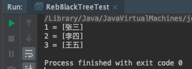

### 1.1.3. 红黑树总结

红黑树本质上通过左旋、右旋和颜色反转保证了树的平衡性，并降低了树的高度，从而提高了效率。

## 1.2. B树

前面我们已经学习了二叉查找树、`2-3` 树及 `2-3`树的实现——红黑树。

`2-3` 树中，一个节点最多能有两个 key，它的实现——红黑树中使用对链接染色的方式去表示这两个 key。

接下来我们学习另外一种树形结构 ——B 树，这种数据结构中，**一个节点允许多于两个 key 的存在**。

**B 树是一种树状数据结构，它能够存储数据，可以对其排序，也可以用 O(logn) 的时间复杂度进行查找、顺序读取、插入和删除等操作。**

### 1.2.1. B 树的特性

B 树中允许一个节点中包含多个 key。

我们选择一个参数 M ，然后构造一个 B 树，我们就可以将该树称为 **M 阶的 B 树**，该树具有如下特点：

* **每个节点最多有 M-1 个 key，并且升序排列**。
* **每个节点最多能有 M 个子节点**
* **根节点至少有两个子节点**（以保证平衡性）

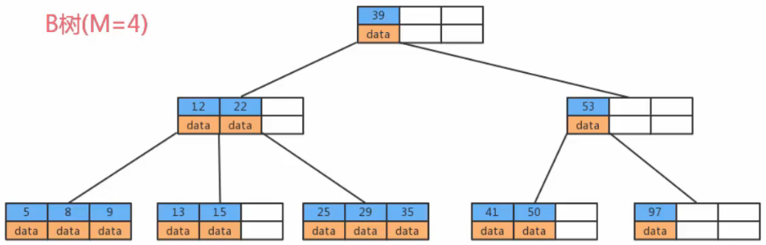

在实际应用中，B 树的阶数一般都比较大（通常大于 100），所以，即使存储大量的数据，B 树的高度仍然比较小（高度小则查询效率高），这样在某些应用场景下，就可以体现出它的优势。

### 1.2.2. B 树存储数据

若参数 M 设置为 5，那么每个节点最多包含 4 个键值对，我们就以 5 阶 B 树为例，看看 B 树的数据存储。

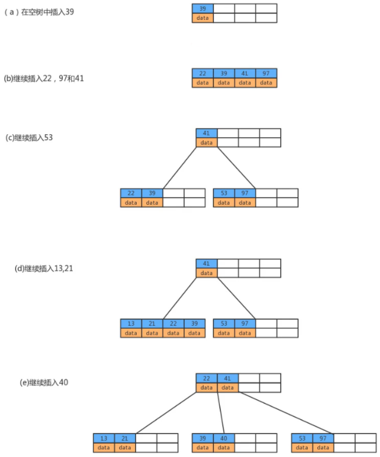

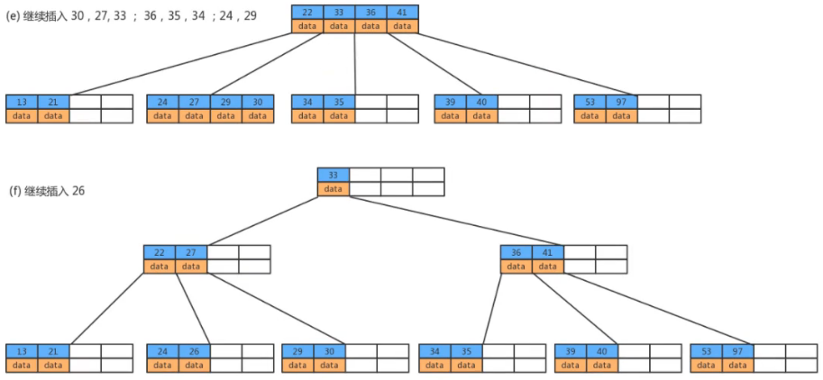


### 1.2.3. B 树在磁盘文件中的应用

在我们的程序中，不可避免的需要通过 IO 操作文件，而我们的文件是存储在磁盘上的。计算机操作磁盘上的文件是通过文件系统进行的，在文件系统中就使用到了 B 树这种数据结构。

### 1.2.4. 磁盘

磁盘能够保存大量的数据，从 GB 一直到 TB，但是它的读取速度比较慢，因为涉及到机器操作，读取速度为毫秒级。

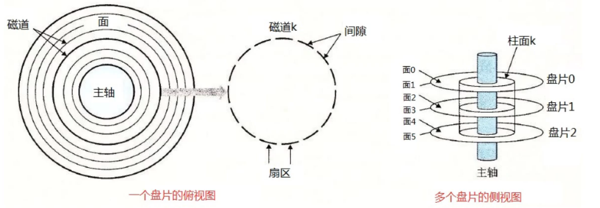

磁盘由盘片构成，每个盘片有两面，又称为盘面。

盘片中央有一个可以旋转的主轴，它使得盘片以固定的旋转速率旋转，通常是 5400rpm 或 7200rpm，一个磁盘中包含了多个这样的盘片并封装在一个密封的容器内。盘片的每个表面是由一组称为磁道同心圆组成的，每个磁道被划分为一组扇区，每个扇区包含相同数量的数据位，通常是 512 字节，扇区之间由一些间隙隔开，这些间隙中不存储数据。

### 1.2.5. 磁盘 IO

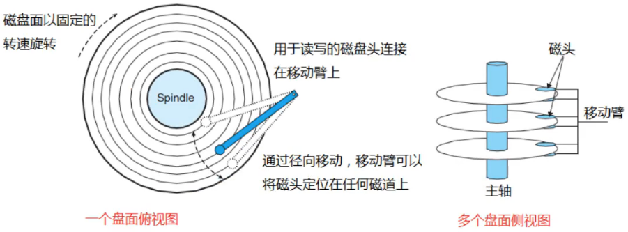

磁盘用磁头来读写存储在盘片表面的位，而磁头连接到一个移动臂上，移动臂沿着盘片半径前后移动，可以将磁头定位到任何磁道上，这就是**寻道操作**。一旦定位到磁道后，盘片转动，次岛上的每个位经过磁头时，读写磁头就可以感知到该位的值，也可以修改值。

对磁盘的访问时间分为：寻道时间、旋转时间以及传送时间。

由于存储介质的特性，磁盘本身存取就比主存（即内存条）慢很多，再加上机械运动耗费，因此为了提高效率，要尽量减少磁盘 I/O，减少读写操作。为了达到改目的，磁盘往往不是严格按需读取，而是每次都会预读，即时只需要一个字节，磁盘也会从这个位置开始，顺序向后读取一定长度的数据放入内存。这样做的理论依据是计算机科学中著名的局部性原理：当一个数据被用到时，其附近的数据也通常会马上被使用。由于磁盘顺序读取的效率很高（不需要寻道时间，只需要很少的旋转时间），因此预读可以提高 I/O 效率。

**页** 是计算机管理存储器的逻辑块，硬件及操作系统往往将主存和磁盘存储区分割为连续的大小相等的块，每个存储块称为一页（1024 字节或其整数倍），预读的长度一般为页的整数倍。主存和磁盘以页为单位交换数据。当程序要读取的数据不在主存中时，会触发一个缺页异常，此时系统会向磁盘发出度盘信号，磁盘会找到数据的起始位置并向后连续读取一页或几页载入内存中，然后异常返回，程序继续进行。

文件系统的设计者利用了磁盘预读原理，将一个节点的大小设为等于一个页（1024 字节或其整数倍），这样每个节点只需要一次 I/O 就可以完全载入。

那么，3 层的 B 树可以容纳 `1024*1024*1024` 差不多 10亿个数据，如果换成二叉查找树，则需要 30 层。假定操作系统一次读取一个节点，并且根节点保留在内存中，那么 B 树在 10 亿个数据中查找目标值，只需要小于 3 次硬盘读取就可以找到目标值，但红黑树需要小于 30 次，因此 B 树大大提高了 I/O 的操作效率。


## 1.3. B+树

B+ 树是 B 树的一种变形树，它与 B 树的差异在于：

* **非叶节点仅具有索引功能，也就是说，非叶子节点只存储 key, 不存储 value **
* **树的所有叶节点构成一个有序链表，可以按照 key 排序的次序遍历全部数据**

### 1.3.1. B+树存储数据

[原视频 P134](https://www.bilibili.com/video/BV1Cz411B7qd?p=134&spm_id_from=pageDriver)

若将参数 M 设置为 5，那么每个节点最多包含 4 个键值对，我们以 5 阶 B+ 树为例，看看 B+ 树的数据存储。

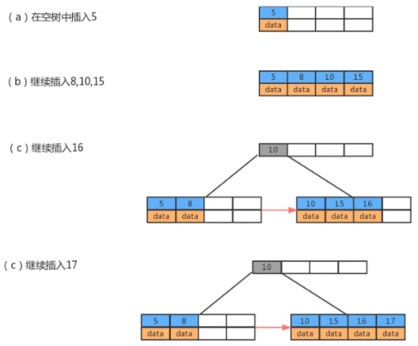

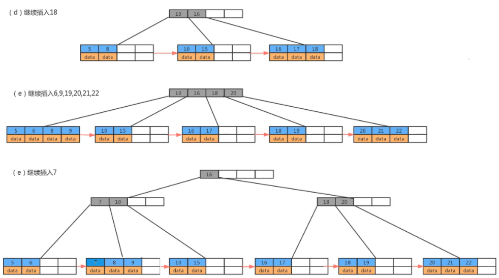


### 1.3.2. B+树和B树对比

#### 1.3.2.1. B+ 树的优点

* 由于 B+ 树在非叶子节点上不包含真正的数据，只存储 key 当做索引使用，因此在内存相同的情况下，能够存放更多的 key
* B+ 树的叶子节点都是相连的，因此对整棵树的遍历只需要一次线性遍历叶子节点即可。而且由于数据顺序排列并且相连，所以便于区间查找和搜索。而 B 树则需要进行每一层的递归遍历

#### 1.3.2.2. B 树的优点

* 由于 B 树的每一个节点都包含 key 和 value，因此我们根据 key 查找 value 时，只需要找到 key 所在的位置，就能找到 value，但 B+ 树只有叶子节点存储数据，所以每次查找都必须一次一次一直找到树的最大深度处，也就是叶子节点的深度，才能找到 value。

### 1.3.3. B+树在数据库中的应用

[原视频 P135](https://www.bilibili.com/video/BV1Cz411B7qd?p=135&spm_id_from=pageDriver)

在数据库的操作中，查询操作是最频繁的操作。因此在设计数据库时，必须要考虑查询的效率问题，在很多数据库中，都使用了 B+ 树来提高查询的效率。

在操作数据库时，我们为了提高查询效率，可以基于某张表的某个字段建立索引，这样就可以提高查询效率。其实，**数据库索引就是用 B+ 树这种数据结构实现的**。

#### 1.3.3.1. 未建立主键索引查询

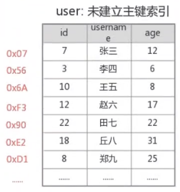

执行 `select * from user where id = 18` 时，需要从第一条数据开始，一直查询到第 6 条，发现 id = 18，此时才能查询出目标结果，共需要比较 6 次。

#### 1.3.3.2. 建立主键索引查询

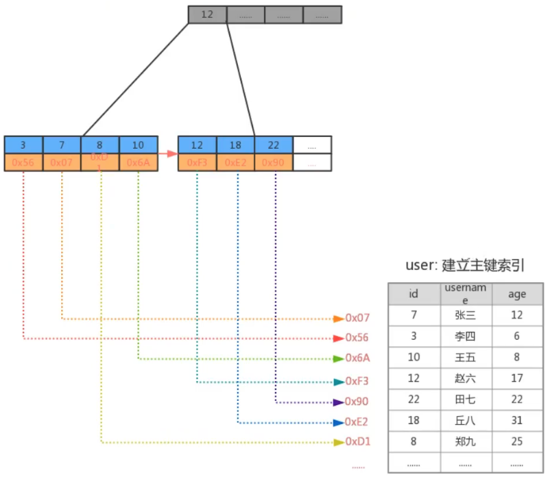

建立索引后，执行前述查询语句时，仅需要三次比较即可。第一次和上图 B+ 树中灰色背景的 key 12 进行比较，然后和叶子节点的 12 比较，再然后和叶子节点 18 比较。

#### 1.3.3.3. 区间查询

执行 `select * from user where id>=12 and id<=18` 时，如果有了索引，由于 B+ 树的叶子节点形成了一个有序的链表，所以，我们只需要找到 id 为 12 的叶子节点，按照遍历链表的方式顺序向后查即可，效率非常高。

如果没有索引，则需要与数据库中的每一个数据挨个作比较，效率非常低。

## 1.4. 并查集

并查集是一种树形的数据结构，并查集可以高效的进行如下操作：

* 查询元素 p 和元素 q 是否属于同一组
* 合并元素 p 和元素 q 所在的组

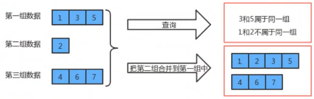

### 1.4.1. 并查集结构

并查集也是一种树形结构，但这棵树与前面学习的二叉树、红黑树、B 树等都不一样，这种树的要求比较简单：

* 每个元素都唯一的对应一个节点
* 每一组数据中的多个元素都在同一棵树中
* 一个组中的数据对应的树和另一组中的数据对应的树之间没有任何联系
* 元素在树中并没有子父级关系的硬性要求

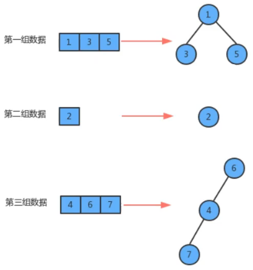


### 1.4.2. 并查集 API 设计

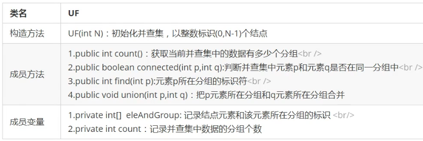


### 1.4.3. 并查集的实现

#### 1.4.3.1. UF(int N) 构造方法实现

* 初始情况下，每个元素都在一个独立的分组中，所以，初始情况下，并查集中的数据默认分为 N 个组
* 初始化数组 eleAndGroup
* 把 eleAndGroup 数组的索引看做是每个节点存储的元素，把 eleAndGroup 数组每个索引处的值看做是该节点所在的分组，那么初始化情况下，i 索引处存储的值就是 i

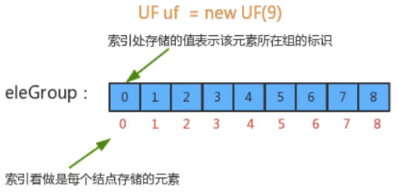


#### 1.4.3.2. union(int p,int q) 合并方法的实现

* 如果 p 和 q 已经在同一个分组中，无需合并
* 如果 p 和 q 不在同一个分组，则只需要将 p 元素所在组的所有的元素的组标识符修改为 q 元素所在组的标识符即可
* 分组数量 -1

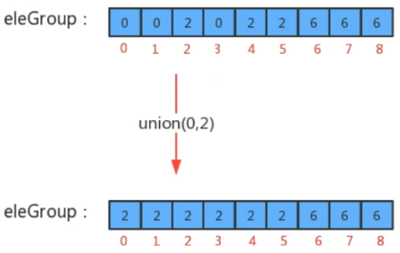


#### 1.4.3.3. 完整代码

```java
package tree;

/**
 * 作者：CnPeng 4/13/21 6:41 PM
 * 功用：并查集
 * 说明：
 */
public class UF {
    // 记录节点元素和该元素所在分组的标识。将节点元素做数组的索引，元素所在分组的标识作为数组的元素内容。
    private int[] eleAndGroup;
    // 记录并查集中数据的分组个数
    private int   count;

    /**
     * CnPeng 4/13/21 6:44 PM
     * 功用：构造函数
     */
    public UF(int N) {
        // 初始化分组的数量，默认情况下，有 N 个分组
        this.count = N;
        // 初始化 eleAndGroup 数组
        this.eleAndGroup = new int[N];
        // 初始化 eleAndGroup 中的元素及元素所在组的标识符。让 eleAndGroup 数组的索引作为并查集的每个节点的元素，
        // 并且让索引作为每个索引处的值（即元素所在组的标识符）。
        for (int i = 0; i < eleAndGroup.length; i++) {
            eleAndGroup[i] = i;
        }
    }

    /**
     * CnPeng 4/13/21 6:44 PM
     * 功用：并查集中分组的个数
     */
    public int count() {
        return count;
    }

    /**
     * CnPeng 4/13/21 6:45 PM
     * 功用：查找元素 p 所在分组的标识
     */
    public int find(int p) {
        return eleAndGroup[p];

    }

    /**
     * CnPeng 4/13/21 6:45 PM
     * 功用：判断元素 p 和 q 是否在同一分组中
     */
    public boolean connected(int p, int q) {
        return find(p) == find(q);
    }

    /**
     * CnPeng 4/13/21 6:46 PM
     * 功用：将 p 元素所在分组和 q 所在分组合并
     */
    public void union(int p, int q) {
        // p 和 q 是否已经在同一分组中，不在同一分组时才合并
        if (connected(p, q)) {
            return;
        }

        // 分别找到 p 和 q 的分组标识符
        int pGrup = find(p);
        int qGroup = find(q);

        // 合并组：将 p 组中的所有元素的组标识符变更为 q 的组标识符
        for (int i = 0; i < eleAndGroup.length; i++) {
            // eleAndGroup 数组中，索引 i 对应树节点的元素，而数组中的元素则代表节点元素的分组。
            if (eleAndGroup[i] == pGrup) {
                eleAndGroup[i] = qGroup;
            }
        }

        // 分组数量 -1
        this.count--;
    }
}
```

测试代码：

```java
package tree;

import java.util.Scanner;

/**
 * 作者：CnPeng 4/13/21 7:11 PM
 * 功用：并查集测试
 * 说明：
 */
public class UFTest {
    public static void main(String[] args) {
        // 创建并查集对象
        UF uf = new UF(5);
        System.out.println("默认分组数量" + uf.count());

        // 从控制台录入两个要合并的元素，调用合并方法合并，查看合并后并查集的分组数量是否减少
        Scanner sc = new Scanner(System.in);

        while (true) {
            System.out.println("输入第1个要合并的元素");
            int p = sc.nextInt();
            System.out.println("输入第2个要合并的元素");
            int q = sc.nextInt();

            // 判断上述两元素是否在同一个分组中
            if (uf.connected(p, q)) {
                System.out.println(p + "-" + q + "已经在同一分组中");
                continue;
            }

            // 合并分组
            uf.union(p, q);
            System.out.println("分组数量" + uf.count());
        }
    }
}
```

运行结果：

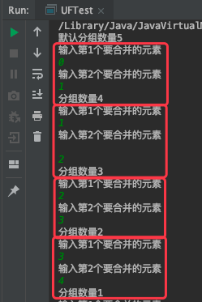

如上图，我们会发现，合并 4 次（即 N-1 次）之后（前提是，输入的元素不能超过 N-1），所有元素都处于同一个分组了。


### 1.4.4. 并查集应用举例

如果并查集存储的每一个整数表示一个大型计算机网络中的计算机，那么我们就可以通过 connected(int p, int q) 来检测该网络中的某两台计算机之间是否连通。如果连通，则它们之间可以通信；如果不连通，则不能通信。此时，我们又可以调用 union(int q,int p) 使得 p 和 q 之间连通，这样两台计算机之间就可以通信了。

一般像计算机这样的网络型的数据，我们要求网络中的每两个数据之间都是相连通的。也就是说，我们需要调用很多次 union 方法，使得网络中所有数据相连。其实，我们很容易获知，如果要让网络中的数据都相连，则我们至少要调用 N-1 次 union 方法才可以，但由于我们的 union 方法中使用 for 循环遍历了所有的元素，所以，很明显我们之前实现的合并算法的时间复杂度为 O(N^2) ，如果要解决大规模问题，它是不合适的，所以我们需要对算法进行优化。

### 1.4.5. `UF_Tree` 算法优化

为了提升 union 算法的性能，我们需要重新设计 find 方法和 union 方法的实现，此时，我们需要先重新设定之前数据结构中 eleAndGroup 数组的含义：

* 仍然让 eleAndGroup 数组的索引作为某个节点的元素
* eleAndGroup[i] 的值不再是当前节点所在的分组标识，而是该节点的父节点。

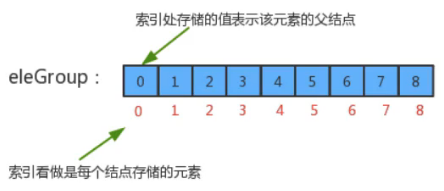

#### 1.4.5.1. UF_Tree 算法优化

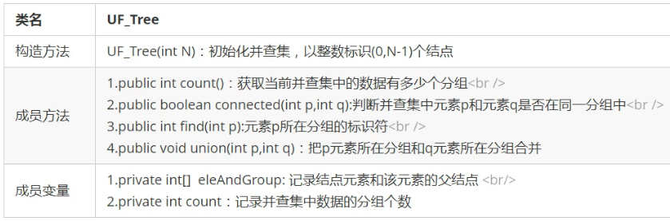

#### 1.4.5.2. find(int p) 查询方法实现

* 判断当前元素 p 的父节点 eleAndGroup 是不是自己，如果是自己则证明已经是根节点了。
* 如果当前元素 p 的父节点不是自己，则让 p = eleAngGroup[p] ，继续查找父节点的父节点，直到找到根节点为止

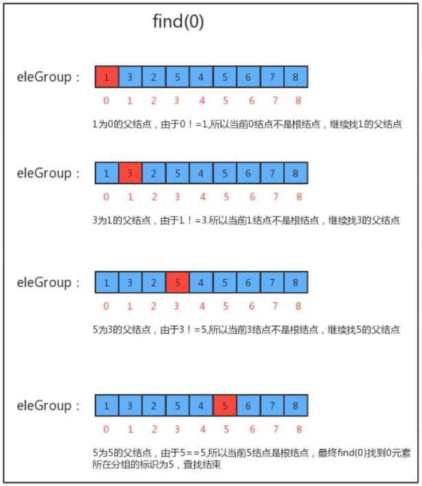

#### 1.4.5.3. union(int p,int q) 合并方法的实现

* 找到 p 元素所在树的根节点
* 找到 q 元素所在树的根节点
* 如果 p 和 q 已经在同一个树中，无需合并
* 如果 p 和 q 不在同一个分组，则只需要将 p 元素所在树根节点的父节点设置为 q 元素的根节点即可。
* 分组数量 -1

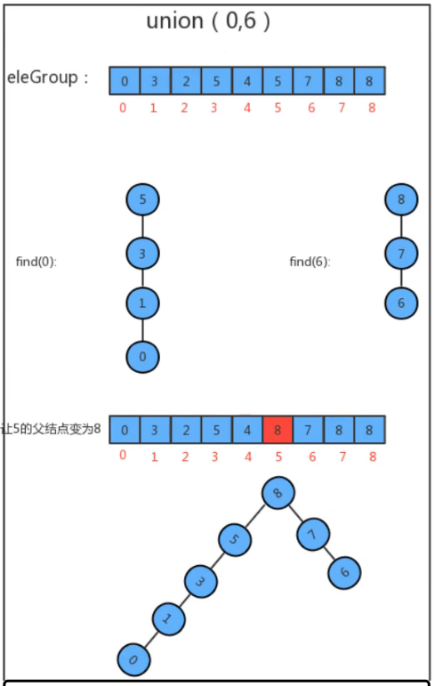

> 上面这个配图好像有问题，合并 0 和 6 时，0 的父节点还是 0， 是怎么找到 根节点 5 的呢？

#### 1.4.5.4. 完整代码

```java
package tree;

import java.util.Scanner;

/**
 * 作者：CnPeng 4/13/21 7:11 PM
 * 功用：并查集测试
 * 说明：
 */
public class UFTreeTest {
    public static void main(String[] args) {
        // 创建并查集对象
        UFTree uf = new UFTree(5);
        System.out.println("默认分组数量" + uf.count());

        // 从控制台录入两个要合并的元素，调用合并方法合并，查看合并后并查集的分组数量是否减少
        Scanner sc = new Scanner(System.in);

        while (true) {
            System.out.println("输入第1个要合并的元素");
            int p = sc.nextInt();
            System.out.println("输入第2个要合并的元素");
            int q = sc.nextInt();

            // 判断上述两元素是否在同一个分组中
            if (uf.connected(p, q)) {
                System.out.println(p + "-" + q + "已经在同一分组中");
                continue;
            }

            // 合并分组
            uf.union(p, q);
            System.out.println("分组数量" + uf.count());
        }
    }
}
```

测试代码：

```java
package tree;

/**
 * 作者：CnPeng 4/13/21 8:54 PM
 * 功用：并查集优化
 * 说明：
 */
public class UFTree {
    // 记录节点元素和该元素的父节点
    private int[] eleAndGroup;
    // 数据分组的个数
    private int   count;

    public UFTree(int N) {
        // 默认有 N 个分组
        this.count = N;
        // 初始化数组
        eleAndGroup = new int[N];
        // 初始化 eleAndGroup 数组内容
        for (int i = 0; i < eleAndGroup.length; i++) {
            eleAndGroup[i] = i;
        }
    }

    /**
     * CnPeng 4/13/21 9:04 PM
     * 功用：获取当前并查集中分组的数量
     */
    public int count() {
        return count;
    }

    /**
     * CnPeng 4/13/21 9:05 PM
     * 功用：判断 p q 是否在同一分组汇总
     */
    public boolean connected(int p, int q) {
        return find(p) == find(q);
    }

    /**
     * CnPeng 4/13/21 9:05 PM
     * 功用：查找 p 所在分组的标识符
     */
    public int find(int p) {
        while (true) {
            if (p == eleAndGroup[p]) {
                return p;
            }
            p = eleAndGroup[p];
        }
    }

    /**
     * CnPeng 4/13/21 9:06 PM
     * 功用：把 p 元素所在分组和 q 元素所在分组合并（把 p 的根节点修改为 q 的根节点）
     */
    public void union(int p, int q) {
        // 找到 p 和 q 所在组的根节点
        int pRoot = find(p);
        int qRoot = find(q);

        // 如果已经在同一分组了，不需要合并
        if (pRoot == qRoot) {
            return;
        }

        // 让 p 所在树的根节点变为 q 所在树的根节点
        eleAndGroup[pRoot] = qRoot;

        // 数量-1
        count--;
    }
}
```

运行结果：

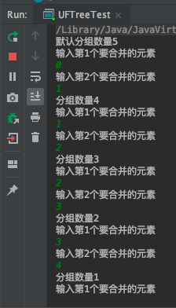

如上图，我们会发现，合并 4 次（即 N-1 次）之后（前提是，输入的元素不能超过 N-1），所有元素都处于同一个分组了。

#### 1.4.5.5. 优化后的性能分析

我们优化后的算法 union 如果要把并查集中所有的数据连通，仍然需要至少要调用 N-1 次 Union 方法， 但是，我们发现 union 方法中已经没有 for 循环了，所以 union 算法的时间复杂度有 O(N^2) 变成了 O(N)

但是，这个算法仍然有问题，因为我们优化时不仅修改了 union 算法，还修改了 find 算法。我们修改前的 find 算法的时间复杂度在任何情况下都为 O(1)，但修改后的 find 算法在最坏情况下是  O(N)。在 union 方法中调用了 find 方法， 所以在最坏情况下 union 算法的时间复杂度仍然为 O(N^2)

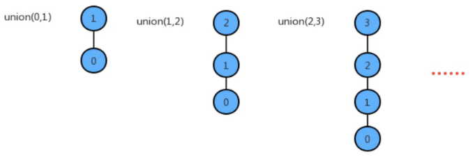

### 1.4.6. 路径压缩

[原视频 P140](https://www.bilibili.com/video/BV1Cz411B7qd?p=140&spm_id_from=pageDriver)

UF_Tree 中最坏情况下 union 算法的时间复杂度为 O(N^2) ，其最主要的问题在于，最坏情况下树的深度和数组的大小一样。如果我们能够通过一些算法让合并时生成的树的深度尽可能的小，就可以优化 find 方法。

之前我们在 union 算法中，合并树的时候将任意的一棵树连接到了另外一棵树，这种合并方法是比较暴力的。如果我们把并查集中每一棵树的大小记录下来，然后在每次**合并树时将较小的树链接到较大的树上，就可以减少树的深度**。

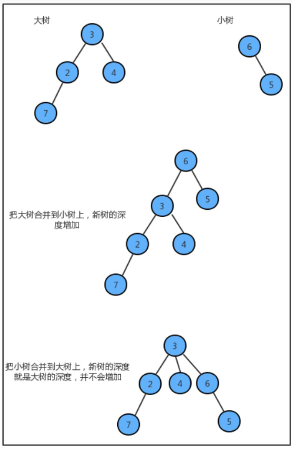

只要我们保证每次合并都能把小树合并到大树上，就能压缩合并后新树的路径，这样就能提高 find 方法的效率。为了完成这个需求，我们需要另外一个数组来记录每个根节点对应的树中元素的个数，并且需要一些代码调整数组中的值。

#### 1.4.6.1. UF_Tree_Weighted API 设计

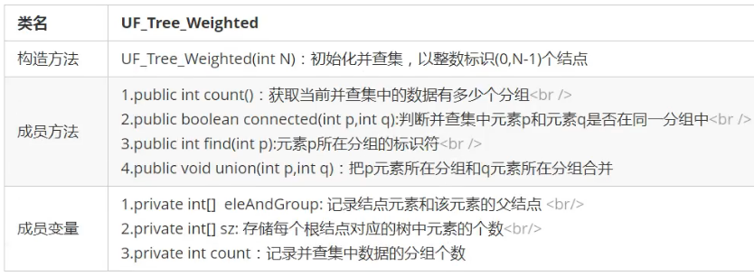

#### 1.4.6.2. 实现代码

```java
package tree;

/**
 * 作者：CnPeng 4/13/21 8:54 PM
 * 功用：并查集优化
 * 说明：
 */
public class UFTreeWeighted {
    // 记录节点元素和该元素的父节点
    private int[] eleAndGroup;
    // 数据分组的个数
    private int   count;
    // 记录每个分组中元素的数量
    private int[] sz;

    public UFTreeWeighted(int N) {
        // 默认有 N 个分组
        this.count = N;

        // 初始化数组
        eleAndGroup = new int[N];
        // 初始化 eleAndGroup 数组内容
        for (int i = 0; i < eleAndGroup.length; i++) {
            eleAndGroup[i] = i;
        }

        // 初始化 sz 数组.
        this.sz = new int[N];
        for (int i = 0; i < sz.length; i++) {
            // 因为 eleAndGroup 中初始化时每个 i 代表一个分组和一个元素，所以，每个分组中元素的数量默认为1
            sz[i] = 1;
        }
    }

    /**
     * CnPeng 4/13/21 9:04 PM
     * 功用：获取当前并查集中分组的数量
     */
    public int count() {
        return count;
    }

    /**
     * CnPeng 4/13/21 9:05 PM
     * 功用：判断 p q 是否在同一分组汇总
     */
    public boolean connected(int p, int q) {
        return find(p) == find(q);
    }

    /**
     * CnPeng 4/13/21 9:05 PM
     * 功用：查找 p 所在分组的根节点
     */
    public int find(int p) {
        while (true) {
            if (p == eleAndGroup[p]) {
                return p;
            }
            p = eleAndGroup[p];
        }
    }

    /**
     * CnPeng 4/13/21 9:06 PM
     * 功用：把 p 元素所在分组和 q 元素所在分组合并（把 p 的根节点修改为 q 的根节点）
     */
    public void union(int p, int q) {
        // 找到 p 和 q 所在组的根节点
        int pRoot = find(p);
        int qRoot = find(q);

        // 如果已经在同一分组了，不需要合并
        if (pRoot == qRoot) {
            return;
        }

        // 让 p 所在树的根节点变为 q 所在树的根节点
        int pCount = sz[p];
        int qCount = sz[q];
        if (pCount < qCount) {
            eleAndGroup[pRoot] = qRoot;
            sz[qCount] += pCount;
        } else {
            eleAndGroup[qRoot] = pRoot;
            sz[pCount] += qCount;
        }

        // 数量-1
        count--;
    }
}
```

测试代码：

```java
package tree;

import java.util.Scanner;

/**
 * 作者：CnPeng 4/13/21 7:11 PM
 * 功用：并查集测试
 * 说明：
 */
public class UFTreeWeightedTest {
    public static void main(String[] args) {
        // 创建并查集对象
        UFTreeWeighted uf = new UFTreeWeighted(5);
        System.out.println("默认分组数量" + uf.count());

        // 从控制台录入两个要合并的元素，调用合并方法合并，查看合并后并查集的分组数量是否减少
        Scanner sc = new Scanner(System.in);

        while (true) {
            System.out.println("输入第1个要合并的元素");
            int p = sc.nextInt();
            System.out.println("输入第2个要合并的元素");
            int q = sc.nextInt();

            // 判断上述两元素是否在同一个分组中
            if (uf.connected(p, q)) {
                System.out.println(p + "-" + q + "已经在同一分组中");
                continue;
            }

            // 合并分组
            uf.union(p, q);
            System.out.println("分组数量" + uf.count());
        }
    }
}
```

运行结果：

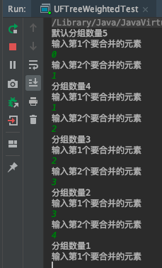

### 1.4.7. 案例-畅通工程

某省调查城镇交通状态，得到现有城镇道路统计表，表中列出了每条道路直接连通的城镇。省政府 "畅通工程" 的目标是使全省任何两个城镇间都可以实现交通（但不一定有直接的道路相连，只要互相间接通过道路可达即可）。问最少还需要建设多少条道路？

假设我们有一个名称为 trffic_project.txt 的文件，其中存储该省份城市数量和已经修建的道路总数，以及道路连通的城市。其中的数据内容和含义如下：


总共有 20 个城镇，目前已经修好了 7 条道路，问还需要修建多少条道路才能让这 20 个城市之间全部相同？

#### 1.4.7.1. 解题思路

* 创建一个并查集 UF_Tree_Weighted(20)
* 分别调用 union(0,1)，union(6,9)，union(3,8)，union(5,11)，union(2,12)，union(6,10)，union(4,8)，表示用已经修建好的道路把对应的城市连接起来
* 如果城市全部连接起来了，那么并查集中剩余的分组数目为 1，所有的城市都在一个树中，所以，只需要获取当前并查集中剩余的数目，减去 1，就是还需要修建的道路数目。

#### 1.4.7.2. 代码实现

```java
package tree;

import java.io.BufferedReader;
import java.io.IOException;
import java.io.InputStream;
import java.io.InputStreamReader;

/**
 * 作者：CnPeng 4/14/21 10:02 AM
 * 功用：并查集实例——市政畅通工程
 * 说明：
 */
public class TrafficProjectTest {
    public static void main(String[] args) throws IOException {
        // 构建读取输入流（注意，txt 文件和当前类在同一目录下， 所以文件名前面需要前缀相对于 src 目录的路径）
        InputStream is = TrafficProjectTest.class.getClassLoader().getResourceAsStream("tree/traffic_project.txt");
        // 构建缓冲读取流-BufferedReader
        BufferedReader br = new BufferedReader(new InputStreamReader(is));
        // 读取第一行数据--城市数量
        int cityNum = Integer.parseInt(br.readLine());
        // 构建一个并查集对象
        UFTreeWeighted uf = new UFTreeWeighted(cityNum);
        // 读取第二行数据——目前已经修改的道路数量
        int roadNum = Integer.parseInt(br.readLine());
        // 循环读取当前的城市相同情况（即第三行至最后一行的数据）
        for (int i = 1; i <= roadNum; i++) {
            // 文件中，每一行中的两个数字代表相连的城市
            String line = br.readLine();
            // 文件中，相连的城市编码通过空格分割
            String[] strs = line.split(" ");

            int p = Integer.parseInt(strs[0]);
            int q = Integer.parseInt(strs[1]);

            // 调用并查集的 union 方法让上一步中的城市在代码层面相连通
            uf.union(p, q);
        }

        // 获取当前并查集中剩余分组的数量，然后-1 即可获知还需要修建的道路数量
        int need = uf.count()-1;
        System.out.println("还需要 "+need+" 条道路才能完全相连");
    }
}
```

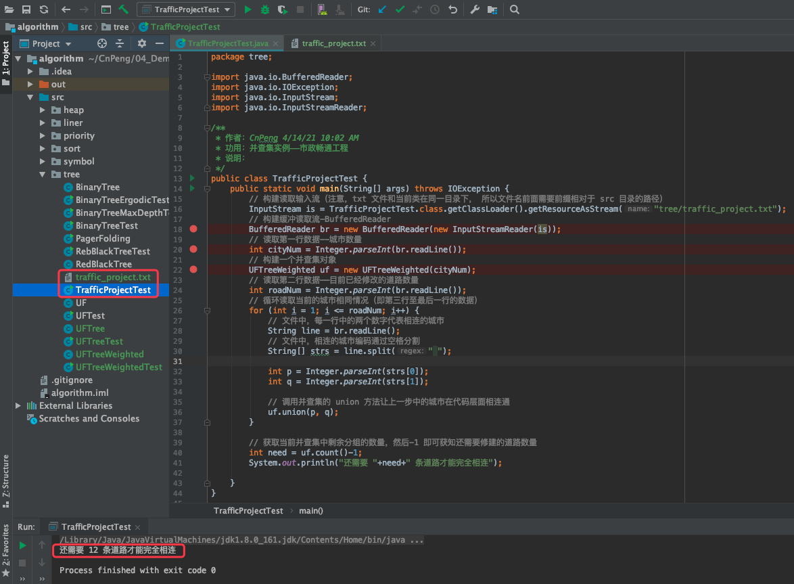

文本文件中的内容为:

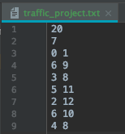
