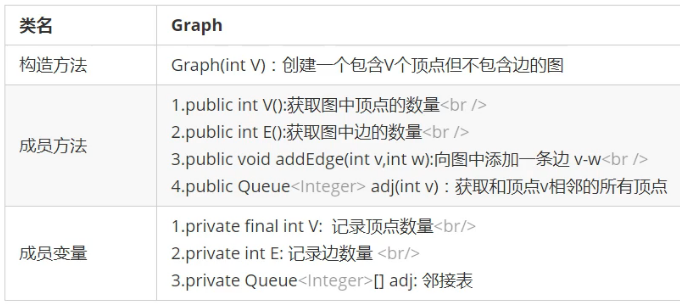
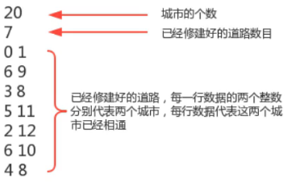
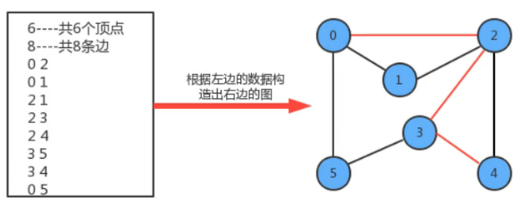
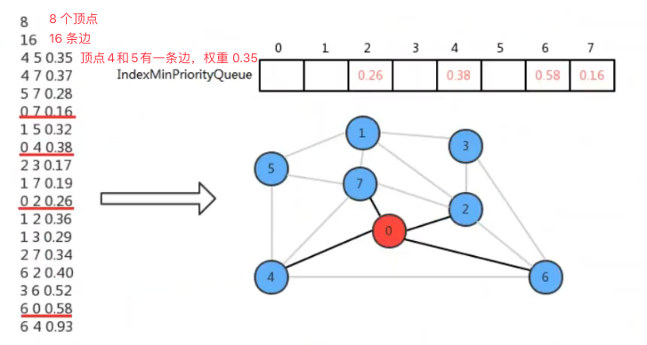
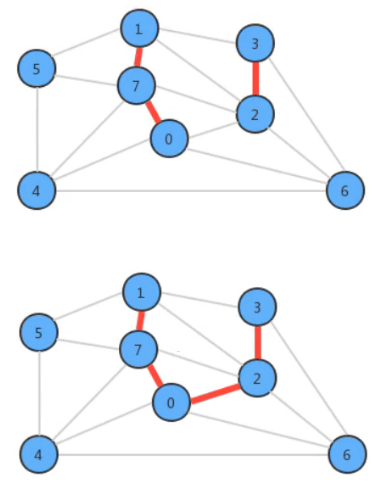

# 1. 9-图

## 1.1. 图的实际应用

现实生活中，有许多应用场景会包含很多点以及点点之间的连线，而这些应用场景我们都可以用接下来要学习的 **图** 这种数据结构去解决。

我们生活中常用的地图基本上就是由城市已经连接城市的道路组成。如果我们把城市看做是一个个的点，把道路看做是一条条的连接线，那么地图就是一种 **图** 的数据结构。


## 1.2. 图的定义及分类

### 1.2.1. 图的定义

图是由一组顶点和一组能够将两个顶点相连的边组成的。


### 1.2.2. 特殊的图

* 自环：即一条连接一个顶点和其自身的边
* 平行边：连接同一对顶点的两条边


### 1.2.3. 图的分类

按照连接两个顶点的边的不同，可以把图分为以下两种：

* 无向图：边仅连接两个顶点，无其他含义
* 有向图：边不仅连接两个顶点，并且具有方向

## 1.3. 无向图

### 1.3.1. 图的相关术语

* **相邻顶点**：当两个顶点通过一条边相连时，我们称这两个顶点是相邻的，并且称这条边依附于这两个顶点
* **度**：某个顶点的度就是依附于该顶点的边的个数
* **子图**：是一副图的所有边的子集（包含边依附的顶点）组成的图
* **路径**：是由边顺序连接的一系列的顶点组成
* **环**：是一条至少含有一条边且重点和起点相同的路径


* **连通图**：如果图中任意一个顶点都存在一条路径到达另外一个顶点，那么这幅图就称之为连通图


* **连通子图**：一个非连通图由若干连通的部分组成，每一个连通的部分都可以称为该图的连通子图

### 1.3.2. 图的存储结构

[原视频 P144](https://www.bilibili.com/video/BV1Cz411B7qd?p=144&spm_id_from=pageDriver)

要表示一幅图，只需要标示清楚以下两部分内容即可：

* 图中所有的顶点
* 所有连接顶点的边

常见的图的存储结构有两种：邻接矩阵和邻接表

#### 1.3.2.1. 邻接矩阵

* 使用一个 `V*V` 的二维数组 `int[v][v] adj`，把索引的值看做是顶点
* 如果顶点 v 和顶点 w 相连，我们只需要将 `adj[v][w]` 和 `adj[w][v]` 的值设置为 1，否则设置为 0 即可


很明显，邻接矩阵这种存储方式的空间复杂度是 V^2 , 如果我们处理的问题规模比较大的话，内存空间极有可能不够。

#### 1.3.2.2. 邻接表

* 使用一个大小为 v 的数组，`Queue[v] adj`，把索引看做是顶点
* 每个索引处 `adj[v]` 存储了一个队列，该队列中存储的是所有与该顶点相邻的其他顶点


通过上图可知，邻接表的空间并不是线性级别的，所以，后面我们一直采用邻接表这种存储形式来表示图。

### 1.3.3. 图的实现

由于邻接表占用的空间小，所以后续以邻接表来表示图。并且此处实现的是无向图。

#### 1.3.3.1. API 设计



#### 1.3.3.2. 代码实现

```java
package graph;

// 这是前面线性表中自定义的 Queue
import liner.Queue.Queue;

/**
 * 作者：CnPeng 4/14/21 11:58 AM
 * 功用：无向图
 * 说明：
 */
public class Graph {
    // 记录顶点数量
    private final int              V;
    // 记录边的数量
    private       int              E;
    // 邻接表
    private       Queue<Integer>[] adj;

    public Graph(int v) {
        V = v;
        E = 0;
        // 初始化邻接表
        adj = new Queue[V];
        // 初始化邻接表中的数据
        for (int i = 0; i < adj.length; i++) {
            adj[i] = new Queue<>();
        }
    }

    /**
     * CnPeng 4/14/21 12:01 PM
     * 功用：获取图中顶点的数量
     */
    public int V() {
        return V;
    }

    /**
     * CnPeng 4/14/21 12:01 PM
     * 功用：获取图中边的数量
     */
    public int E() {
        return E;
    }

    /**
     * CnPeng 4/14/21 12:02 PM
     * 功用：向图中添加边 v-w
     */
    public void addEdge(int v, int w) {
        // 无向图中，边既是从 v 到 w 的，也是从 w 到 v 的
        adj[v].enqueue(w);
        adj[w].enqueue(v);

        E++;
    }

    /**
     * CnPeng 4/14/21 12:02 PM
     * 功用：获取和顶点 v 相邻的所有顶点
     */
    public Queue<Integer> adj(int v) {
        return adj[v];
    }
}
```

## 1.4. 图的搜索

在很多情况下，我们需要遍历图，得到图的一些性质，例如，找出图中与指定的顶点相连的所有顶点，或者判定摸个顶点与指定顶点是否相通，这都是非常常见的需求。

有关图的搜索，最经典的算法有**深度优先搜索**和**广度优先搜索**。

### 1.4.1. 深度优先搜索

[原视频-p147](https://www.bilibili.com/video/BV1Cz411B7qd?p=147&spm_id_from=pageDriver)

所谓的深度优先搜索，指的是在搜索时，如果遇到一个节点既有子节点又有兄弟节点，那么**先找子节点，再找兄弟节点**。


很明显，由于边是没有方向的，所以，如果 4 和 5 顶点相连，那么 4 会出现在 5 的相邻链表中，5 也会出现在 4 的相邻链表中。那么，为了不对顶点进行重复搜索，应该要有相应的标记来表示当前顶点有没有被搜素过。可以使用一个布尔类型的数组 `boolean[v] marked` ，索引代表顶点，值代表当前顶点是否已经被搜索过，如果已经搜索，标记为 true；如果没有搜索，标记为 false.

#### 1.4.1.1. API  设计


#### 1.4.1.2. 代码实现

```java
package graph;

/**
 * 作者：CnPeng 4/14/21 2:48 PM
 * 功用：深度优先搜索
 * 说明：
 */
public class DepthFirstSearch {
    // 标记是否已经被搜索过：索引代表顶点，值代表是否已经被搜索过
    private boolean[] marked;
    // 记录有多少个顶点与 s 滴定相通
    private int       count;

    /**
     * CnPeng 4/14/21 2:50 PM
     * 功用：构造深度优先搜索对象，使用深度优先搜索找出 G 图中 s 顶点的所有相通顶点
     */
    public DepthFirstSearch(Graph G, int s) {
        // 初始化 marked 数组, 长度为 G.V(),即顶点总数量
        marked = new boolean[G.V()];
        // 初始化跟顶点 s 相通的顶点数量
        count = 0;
        // 查找 G 图中与 s 相通的顶点
        dfs(G, s);
    }

    /**
     * CnPeng 4/14/21 2:52 PM
     * 功用：使用深度优先搜索找出 G 图中 v 顶点的所有相通顶点
     */
    private void dfs(Graph G, int v) {
        // 把 v 顶点标识为已搜索
        marked[v] = true;

        // 遍历与 v 相连的顶点
        for (Integer w : G.adj(v)) {
            // 判断 w 顶点是否被搜索过，如果没有被搜索过，则递归调用 dfs 深度搜索
            if (!marked[w]) {
                dfs(G, w);
            }
        }
        // 相通顶点数量 +1
        count++;
    }

    /**
     * CnPeng 4/14/21 2:52 PM
     * 功用：判断顶点 w 与构建对象时传入的 s 是否相通
     * 说明：marked 为 true ,必然相通；false 时表示该顶点不在 s 的邻接表中，也就不相通
     */
    public boolean marked(int w) {
        return marked[w];
    }

    /**
     * CnPeng 4/14/21 2:53 PM
     * 功用：获取与顶点 s 相通的所有顶点总数量
     */
    public int count() {
        return count;
    }
}
```

测试代码：

```java
package graph;

/**
 * 作者：CnPeng 4/14/21 3:08 PM
 * 功用：深度优先搜索测试
 * 说明：
 */
public class GraphFirstSearchTest {
    public static void main(String[] args) {
        // 准备 Graph 对象，并添加边
        Graph graph = new Graph(13);
        graph.addEdge(0,5);
        graph.addEdge(0,1);
        graph.addEdge(0,2);
        graph.addEdge(0,6);
        graph.addEdge(5,3);
        graph.addEdge(5,4);
        graph.addEdge(3,4);
        graph.addEdge(4,6);

        graph.addEdge(7,8);

        graph.addEdge(9,10);
        graph.addEdge(9,11);
        graph.addEdge(9,12);
        graph.addEdge(11,12);

        // 准备深度优先搜索对象，构建时就完成了邻接表（相通顶点）的搜索

        DepthFirstSearch depthFirstSearch = new DepthFirstSearch(graph, 0);

        // 获取与某个顶点相通的顶点数量
        int count = depthFirstSearch.count();
        System.out.println("与顶点 0 相通的顶点有[" + count + "] 个");

        // 测试某顶点与起点是否相通
        System.out.println("顶点 5 与顶点 0 是否相通 = [" +depthFirstSearch.marked(5) + "]");
        System.out.println("顶点 7 与顶点 0 是否相通 = [" +depthFirstSearch.marked(7) + "]");
    }
}
```

运行结果：


### 1.4.2. 广度优先搜索

广度优先搜索，指的是在搜索时，如果遇到一个节点既有子节点又有兄弟节点，那么会先搜索兄弟节点，然后再搜索子节点。


#### 1.4.2.1. API  设计

前面二叉树的层序遍历就使用了广度优先的策略。


#### 1.4.2.2. 代码实现

```java
package graph;

import liner.Queue.Queue;

/**
 * 作者：CnPeng 4/14/21 4:14 PM
 * 功用：广度优先搜索
 * 说明：
 */
public class BreadthFirstSearch {
    // 索引表示顶点，值表示当前顶点是否已经被搜索过
    private boolean[]      marked;
    // 记录有多少个顶点与构造函数中的 s 顶点相连
    private int            count;
    // 等到搜索的邻接表中的顶点
    private Queue<Integer> waitSearch;

    public BreadthFirstSearch(Graph graph, int s) {
        // 数组中的值表示是否被搜索过，所以其长度等同于图的长度——即 graph.V
        marked = new boolean[graph.V()];
        count = 0;
        // 等待搜索的 s 顶点的邻接表中的顶点
        waitSearch = new Queue<>();
        // 触发搜索
        bfs(graph,s);
    }


    /**
     * CnPeng 4/14/21 4:20 PM
     * 功用：使用广度优先搜索找出 g 图中 v 顶点的所有相邻顶点
     */
    private void bfs(Graph g, int v) {
        // 把当前节点标识为已搜索
        marked[v] = true;
        // 让顶点 v 进入待搜索队列
        waitSearch.enqueue(v);
        // 循环，如果带搜索队列不为空，则从队列中弹出一个待搜索的顶点进行搜索
        while (!waitSearch.isEmpty()){
            // 弹出一个待搜索顶点
            Integer wait = waitSearch.dequeue();
            // 遍历 wait 顶点的邻接表
            for (Integer w : g.adj(wait)) {
                if(!marked[w]){
                    bfs(g,w);
                }
            }
        }

        // 相同顶点 +1
        count++;
    }

    /**
     * CnPeng 4/14/21 4:21 PM
     * 功用：判断 w 顶点与构造函数中的 s 顶点是否相通
     */
    public boolean marked(int w) {
        return marked[w];
    }

    /**
     * CnPeng 4/14/21 4:22 PM
     * 功用：获取与顶点 s 相通的所有顶点的总数量
     */
    public int count() {
        return count;
    }
}
```

测试代码：

```java
package graph;

/**
 * 作者：CnPeng 4/14/21 3:08 PM
 * 功用：深度优先搜索测试
 * 说明：
 */
public class BreadthFirstSearchTest {
    public static void main(String[] args) {
        // 准备 Graph 对象，并添加边
        Graph graph = new Graph(13);
        graph.addEdge(0,5);
        graph.addEdge(0,1);
        graph.addEdge(0,2);
        graph.addEdge(0,6);
        graph.addEdge(5,3);
        graph.addEdge(5,4);
        graph.addEdge(3,4);
        graph.addEdge(4,6);

        graph.addEdge(7,8);

        graph.addEdge(9,10);
        graph.addEdge(9,11);
        graph.addEdge(9,12);
        graph.addEdge(11,12);

        // 准备深度优先搜索对象，构建时就完成了邻接表（相通顶点）的搜索

        BreadthFirstSearch depthFirstSearch = new BreadthFirstSearch(graph, 0);

        // 获取与某个顶点相通的顶点数量
        int count = depthFirstSearch.count();
        System.out.println("与顶点 0 相通的顶点有[" + count + "] 个");

        // 测试某顶点与起点是否相通
        System.out.println("顶点 5 与顶点 0 是否相通 = [" +depthFirstSearch.marked(5) + "]");
        System.out.println("顶点 7 与顶点 0 是否相通 = [" +depthFirstSearch.marked(7) + "]");
    }
}
```

运行结果：


### 1.4.3. 案例-畅通工程（续）

[原视频 P152](https://www.bilibili.com/video/BV1Cz411B7qd?p=152&spm_id_from=pageDriver)

某省调查城镇交通状态，得到现有城镇道路统计表，表中列出了每条道路直接连通的城镇。省政府 "畅通工程" 的目标是使全省任何两个城镇间都可以实现交通（但不一定有直接的道路相连，只要互相间接通过道路可达即可）。

假设我们有一个名称为 trffic_project.txt 的文件，其中存储该省份城市数量和已经修建的道路总数，以及道路连通的城市。其中的数据内容和含义如下：



总共有 20 个城镇，目前已经修好了 7 条道路，问：按目前的道路情况，9 号城市和 10 号城市是否相通？ 9 号城市和 8 号城市是否相通？

#### 1.4.3.1. 解题思路

* 创建一个图 Graph 对象，表示城市
* 分别调用 addEdge(0,1)、addEdge(6,9)、addEdge(3,8)、addEdge(5,11)、addEdge(2,12)、addEdge(6,10)、addEdge(4,8)，表示已经修建好且连通的城市。
* 通过 Graph 对象和顶点 9，构建 DepthFirstSearch 或 BreadthFirstSearch 对象
* 调用搜索对象的 marked(10) 方法和 marked(8) 方法，即可得到 9 和 10、9 和 8 所代表的的城市是否相连通

#### 1.4.3.2. 实现代码

```java
package graph;

import java.io.BufferedReader;
import java.io.IOException;
import java.io.InputStream;
import java.io.InputStreamReader;

/**
 * 作者：CnPeng 4/14/21 4:55 PM
 * 功用：图的使用案例--路通工程
 * 说明：
 */
public class TrafficProjectTest2 {
    public static void main(String[] args) throws IOException {
        // 构建输入流
        InputStream is = TrafficProjectTest2.class.getClassLoader().getResourceAsStream("graph/traffic_project.txt");
        // 构建缓冲流
        BufferedReader bf = new BufferedReader(new InputStreamReader(is));
        // 读取城市数量
        int cityNum = Integer.parseInt(bf.readLine());
        // 构建图 graph 对象
        Graph graph = new Graph(cityNum);
        // 读取现有道路数量
        int roadNum = Integer.parseInt(bf.readLine());
        // 循环读取有限次，获取道路和城市连通信息
        for (int i = 1; i <= roadNum; i++) {
            String str = bf.readLine();
            String[] s = str.split(" ");

            // p 和 q 表示城市代号
            int p = Integer.parseInt(s[0]);
            int q = Integer.parseInt(s[1]);

            // 在 图 中添加边（链接），表示已经修好的道路
            graph.addEdge(p, q);
        }

        // 构建深度优先搜索对象，传入顶点 9
        DepthFirstSearch depthFirstSearch = new DepthFirstSearch(graph, 9);
        System.out.println("9 与 8 是否相连 = [" + depthFirstSearch.marked(8) + "]");
        System.out.println("9 与 10 是否相连 = [" + depthFirstSearch.marked(10) + "]");

        // 构建广度优先搜索对象，传入顶点 9
        BreadthFirstSearch breadthFirstSearch = new BreadthFirstSearch(graph, 9);
        System.out.println("9 与 8 是否相连 = [" + breadthFirstSearch.marked(8) + "]");
        System.out.println("9 与 10 是否相连 = [" + breadthFirstSearch.marked(10) + "]");
    }
}
```

运行结果：


## 1.5. 路径查找

在实际生活中，地图使我们经常使用的一种工具，通常我们会用它进行导航，输入一个出发城市，输入一个目的地城市，就可以把路线规划好，而在规划好的这个路线上，会路过很过中间的城市。这类问题翻译成专业问题就是：从 s 顶点到 v 顶点是否存在一条路径？如果存在则找出。



例如，在上图中查找顶点 0 到顶点 4 的路用红色标识出来，那么我我们就可以把该路径标识为`0-2-3-4`。（其他路径也可以）


### 1.5.1. 路径查找 API 设计

基于深度优先搜索路径


### 1.5.2. 路径查找实现

[原视频 -154](https://www.bilibili.com/video/BV1Cz411B7qd?p=154&spm_id_from=pageDriver)

我们实现路径查找，最基本的操作还是遍历和搜索图，所以，我们的实现暂且基于深度优先搜索来完成。我们添加了 `edgeTo[]` 整型数组，该整型数组会记录从每个顶点回到起点 s 的路径。

如果我们把顶点设定为 0，那么它的搜索可以表示为下图：


根据最终 edgeTo 的结果，我们很容易能够找到从起点 0 到任意顶点的路径。

```java
package graph;

import liner.stack.Stack;

/**
 * 作者：CnPeng 4/14/21 5:32 PM
 * 功用：路径查找--基于深度优先实现
 * 说明：
 */
public class DepthFirstPaths {
    // 索引代表顶点，值表示当前顶点是否已经被搜索
    private boolean[] marked;
    // 起始顶点
    private int       s;
    // 索引代表顶点，值表示从起点 s 到当前顶点路径上的最后一个顶点（即当前顶点前的一个顶点）
    private int[]     edgeTo;

    /**
     * CnPeng 4/14/21 5:39 PM
     * 功用：构造深度优先查找对象。并找出 graph 图中起点为 s 的所有路径
     */
    public DepthFirstPaths(Graph graph, int s) {
        this.s = s;
        this.marked = new boolean[graph.V()];
        this.edgeTo = new int[graph.V()];

        dfs(graph, s);
    }

    /**
     * CnPeng 4/14/21 5:46 PM
     * 功用：使用深度优先搜索找出 g 图中 v 顶点的所有相邻顶点
     */
    private void dfs(Graph g, int v) {
        // 把 v 标识为已经被搜索
        marked[v] = true;

        // 遍历 v 的邻接表
        for (Integer w : g.adj(v)) {
            // 如果没有被搜索过，则递归搜索
            if (!marked[w]) {
                // 存储到达 w 顶点时的最后一个节点（即 w 的前一个节点）
                edgeTo[w] = v;
                // 递归搜索 w 的邻接表
                dfs(g, w);
            }
        }
    }

    /**
     * CnPeng 4/14/21 5:47 PM
     * 功用：判断 v 顶点与 s 顶点间是否存在路径
     */
    public boolean hasPathTo(int v) {
        return marked[v];
    }

    /**
     * CnPeng 4/14/21 5:49 PM
     * 功用：找出从起点 s 到顶点 v 的路径（即该路径经过的顶点）
     */
    public Stack<Integer> pathTo(int v) {
        if (!hasPathTo(v)) {
            return null;
        }
        // 创建栈对象，保存路径中的所有顶点
        Stack<Integer> path = new Stack<>();

        //循环，从 v 顶点开始，向前找，直到起始顶点 s 为止
        for (int i = v; i != s; i = edgeTo[i]) {
            path.push(i);
        }

        // 把起点 s 放入到栈中
        path.push(s);

        return path;
    }
}
```

测试代码：

```java
package graph;

import java.io.BufferedReader;
import java.io.IOException;
import java.io.InputStream;
import java.io.InputStreamReader;

import liner.stack.Stack;

/**
 * 作者：CnPeng 4/14/21 6:59 PM
 * 功用：图的路径查找--深度查找 测试
 * 说明：
 */
public class DepthFirstPathsTest {
    public static void main(String[] args) throws IOException {
        // 获取输入流
        InputStream is = DepthFirstPathsTest.class.getClassLoader().getResourceAsStream("graph/road_find.txt");
        // 获取 buffered
        BufferedReader bf = new BufferedReader(new InputStreamReader(is));
        // 获取顶点个数
        int dotNum = Integer.parseInt(bf.readLine());
        // 构建图对象
        Graph graph = new Graph(dotNum);
        // 读取边的个数
        int edgeNum = Integer.parseInt(bf.readLine());

        // 插入边
        for (int i = 1; i <= edgeNum; i++) {
            // 读取边的顶点
            String edgesStr = bf.readLine();
            // 分割顶点
            String[] edges = edgesStr.split(" ");
            // 获取顶点
            int p = Integer.parseInt(edges[0]);
            int q = Integer.parseInt(edges[1]);

            // 在图中创建边
            graph.addEdge(p, q);
        }

        // 构建路径查找对象
        DepthFirstPaths search = new DepthFirstPaths(graph, 0);

        // 是否有0 到 4 的路径
        boolean flag = search.hasPathTo(4);
        System.out.println("是否有 0 到 4 的路径？--[" + flag + "]");

        // 获取 0 到 4 的路径
        Stack<Integer> path = search.pathTo(4);
        StringBuilder sb = new StringBuilder();
        for (Integer v : path) {
            sb.append(v + "-");
        }
        sb.deleteCharAt(sb.length() - 1);
        System.out.println("0 到 4 的路径为：[" + sb + "]");
    }
}
```

运行结果：


road_find.txt 文件内容：


> 前面的示例都是基于无向图

## 1.6. 有向图

在实际生活中，很多应用相关的图都是有方向性的，最直观的就是网络，可以从 A 页面通过链接跳转到 B 页面，那么 A 和 B 连接的方向是 A->B ，但不能说是 B->A，此时，我们就需要使用有向图来解决这一问题，它和无向图之间最大的区别就在于连接是具有方向的，在代码的处理上也会有很大的不同。 

### 1.6.1. 定义及相关术语

有向图是一副具有方向性的图，是由一组顶点和一组有方向的边组成的，每条方向的边都连着一对有序的顶点。

* **出度**：由某个顶点指出的边的个数称为该顶点的出度。
* **入度**：指向某个顶点的边的个数称为该顶点的入度。
* **有向路径**：由一系列顶点组成，对于其中的每个顶点都存在一条有向边，从它指向序列的下一个顶点
* **有向环**：一条至少含有一条边，且起点和终点相同的有向路径


一副有向图中两个顶点 v 和 w 可能存在以下四种关系：

* 没有边相连
* 存在从 v 到 w 的边 ，v->w
* 存在从 w 到 v 的边，w->v
* 既存在从  w 到 v 的边，也存在从 v 到 w 的边，即双向连接。

理解有向图比较简单，但是要通过眼睛看出复杂有向图中的路径就并不容易了，如：


### 1.6.2. 有向图的实现

#### 1.6.2.1. API 设计


在 API 中设计了一个反向图，是因为在有向图的实现中，用 adj 方法获取出来的是由当前顶点 v 指向的其他节点，如果能得到其反向图，就可以很容易的得到指向 v 的其他顶点。

#### 1.6.2.2. 代码实现

```java
package graph;

import liner.Queue.Queue;

/**
 * 作者：CnPeng 4/14/21 9:07 PM
 * 功用：有向图
 * 说明：
 */
public class Digraph {
    // 记录顶点数量
    private final int              V;
    // 记录边的数量
    private       int              E;
    // 邻接表
    private       Queue<Integer>[] adj;

    public Digraph(int v) {
        this.V = v;
        this.E = 0;
        this.adj = new Queue[v];

        for (int i = 0; i < adj.length; i++) {
            adj[i] = new Queue<>();
        }
    }

    /**
     * CnPeng 4/14/21 9:08 PM
     * 功用：获取图中顶点的数量
     */
    public int V() {
        return V;
    }

    /**
     * CnPeng 4/14/21 9:09 PM
     * 功用：获取图中边的数量
     */
    public int E() {
        return E;
    }

    /**
     * CnPeng 4/14/21 9:09 PM
     * 功用：向有向图中添加从 v 向 w 的边
     * 说明：只需要让顶点 w 出现在顶点 v 的邻接表中，因为边是有向的。最终，顶点 v 的邻接表中存储的是从 v 指向其他顶点的边
     */
    public void addEdge(int v, int w) {
        adj[v].enqueue(w);
        E++;
    }

    /**
     * CnPeng 4/14/21 9:10 PM
     * 功用：获取从 v 指出的边所连接的所有顶点
     */
    public Queue<Integer> adj(int v) {
        return adj[v];
    }

    /**
     * CnPeng 4/14/21 9:11 PM
     * 功用：获取该图的反向图
     */
    private Digraph reverse() {
        // 创建反向有向图
        Digraph rDigraph = new Digraph(V);
        // 获取从顶点 v 指出的所有边
        for (int v = 0; v < V; v++) {
            for (Integer w : adj[v]) {
                // 遍历指出的边，并反向添加到反向图中，即从 w 指向 v 
                rDigraph.addEdge(w, v);
            }
        }
        return rDigraph;
    }
}
```

## 1.7. 拓扑排序

在现实生活中，我们经常会同一时间接到很多任务，但这些任务的完成是有先后次序的。以我们学习的 java 为例，我们需要学习很多知识，但这些知识在学习的过程中也是有先后次序的。从 java 基础、到 jsp/servlet、到 ssm、到 springboot 等，这是一个循序渐进且有依赖的过程。在学习 jsp 前首先要掌握 java 基础和 html 基础，学习 ssm 框架前要先掌握 jsp/servlet 。


为了简化问题，我么能使用整数为顶点编号的标准模型来表示该案例：


此时，如果某个同学要学习这些课程，就需要制定出一个学习方案，我们只需要对图中的顶点进行排序，让它转换为一个线性序列，就可以解决问题，这时就需要用到一种叫做 **拓扑排序** 的算法。

**拓扑排序**：给定一副有向图，将所有的顶点排序，使得所有的有向边均从排在前面的元素指向排在后面的元素，此时就可以明确的表示出每个顶点的优先级。

下面时一副拓扑排序后的示意图：


### 1.7.1. 检测有向图中的环

[原视频 P160](https://www.bilibili.com/video/BV1Cz411B7qd?p=160&spm_id_from=pageDriver)

如果学习 x 课程前必须先学习 y 课程，学习 y 课程前必须先学习 z 课程，学习 z 课程前必须先学习 x 课程，那么这就有问题了，我们就不知道该从哪里开始学习了，因为这三个条件没有办法同时满足。其实，这三门课程 x、y、z 的条件组成了一个环：


因此，如果我们要使用拓扑排序解决优先级问题，首先要保证有序图中没有环的存在。

#### 1.7.1.1. 检测有向环的 API


#### 1.7.1.2. 检测有向环的实现

[原视频 P161](https://www.bilibili.com/video/BV1Cz411B7qd?p=161&spm_id_from=pageDriver)

在 API 中添加了 onStack[] 布尔数组，索引为图的顶点，当我们进行深度搜索时：

* 如果当前顶点正在被搜索，则把对应的 onStack 数组中的值改为 true, 标识进栈。
* 如果当前顶点搜索完毕，则把对应的 onStack 数组中的值改为 false , 标识出栈
* 如果即将要搜索某个顶点，但该顶点已经在栈中，则有向图中有环。


上图中， t 表示 true , f 表示 false 

```java
package graph;

/**
 * 作者：CnPeng 4/14/21 9:45 PM
 * 功用：有向环检测
 * 说明：
 */
public class DirectedCycle {
    // 索引代表顶点，值表示当前顶点是否已经被搜索过
    private boolean[] marked;

    // 记录图中是否有环
    private boolean hasCycle;

    // 索引代表顶点，使用栈的思想，记录当前顶点是否已经处于正在搜索的有向路径上
    private boolean[] onStack;

    /**
     * CnPeng 4/14/21 9:48 PM
     * 功用：创建有向环检测对象，检测 G 中是否有环
     */
    public DirectedCycle(Digraph G) {
        this.marked = new boolean[G.V()];
        this.hasCycle = false;
        this.onStack = new boolean[G.V()];

        // 找到图中的每一个顶点，让每一个顶点都有机会作为入口，调用 dfs 进行深度搜索。
        // 这样才能准确的判断是否有环——因为可能会出现不连通的图
        for (int v = 0; v < G.V(); v++) {
            // 如果 v 顶点还没有被搜索过，则执行搜索
            if (!marked[v]) {
                dfs(G, v);
            }
        }
    }

    /**
     * CnPeng 4/14/21 9:48 PM
     * 功用：基于深度优先搜索，加测图 G 中是否有环。v 表示图的入口
     */
    private void dfs(Digraph G, int v) {
        // 把顶点 v 标识为已经搜索
        this.marked[v] = true;
        // 把顶点 v 进栈
        onStack[v] = true;
        // 对 v 进行深度搜索
        for (Integer w : G.adj(v)) {
            // 如果 w 顶点没有被搜索过，则递归进行深度抖索
            if (!marked[w]) {
                dfs(G, w);
            }
            // 如果已经搜索过，则判断是否已经在栈中, 如果已经在栈中，则有环
            if (onStack[w]) {
                hasCycle = true;
                return;
            }
        }

        // 把当前顶点出栈
        onStack[v] = false;
    }

    /**
     * CnPeng 4/14/21 9:49 PM
     * 功用：判断当前有向图 G 中是否有环
     */
    public boolean hasCycle() {
        return hasCycle;
    }
}
```

### 1.7.2. 基于深度优先的顶点排序

[原视频 P162](https://www.bilibili.com/video/BV1Cz411B7qd?p=162&spm_id_from=pageDriver)

如果要把图中的顶点生成线性序列其实是一件非常简单事，前面学习并多次使用深度优先搜索，我们会发现其实深度优先搜索有一个特点：**在一个连通子图上，每个顶点只会被搜索一次**。如果我们在深度优先搜索的基础上，增加一行代码，该代码会将搜索的顶点放入到线性序列的数据结构中，这样，我们就可以把图中的顶点生成线性序列。

#### 1.7.2.1. 顶点排序 API 设计


#### 1.7.2.2. 顶点排序实现

在 API 的设计中，我们添加了一个栈 reversePost 用来存储顶点，当我们深度搜索图时，每搜索完一个顶点，把该顶点放入到 reversePost 中，这样就可以实现顶点排序。


```java
package graph;

import liner.stack.Stack;

/**
 * 作者：CnPeng 4/15/21 8:45 AM
 * 功用：基于深度优先的顶点排序
 * 说明：
 */
public class DepthFirstOrder {
    // 索引代表顶点，值表示当前顶点是否已经被搜索过
    private boolean[]      marked;
    // 使用栈存储顶点序列
    private Stack<Integer> reversePost;

    public DepthFirstOrder(Digraph G) {
        marked = new boolean[G.V()];
        reversePost = new Stack<>();

        // 遍历图中的每一个顶点，基于每一个顶点都做一次深度搜索
        for (int v = 0; v < G.V(); v++) {
            if (!marked[v]) {
                dfs(G, v);
            }
        }
    }

    /**
     * CnPeng 4/15/21 8:48 AM
     * 功用：基于深度优先搜索，生成顶点线性序列
     */
    private void dfs(Digraph G, int v) {
        // 标记 v 已经被搜索
        marked[v] = true;
        // 深度搜索 v 的邻接表
        for (Integer w : G.adj(v)) {
            if (!marked[w]) {
                dfs(G, w);
            }
        }

        // 让顶点 v 进展
        reversePost.push(v);
    }

    /**
     * CnPeng 4/15/21 8:49 AM
     * 功用：获取顶点线性序列
     */
    public Stack<Integer> reversePost() {
        return reversePost;
    }
}
```

### 1.7.3. 拓扑排序实现

前面已经实现了环的检测和顶点排序，那么在实现拓扑排序时，首先检测是否有环，如果没有环，则调用顶点排序即可。

#### 1.7.3.1. 拓扑排序 API 


#### 1.7.3.2. 代码实现

```java
package graph;

import liner.stack.Stack;

/**
 * 作者：CnPeng 4/15/21 9:19 AM
 * 功用：拓扑排序
 * 说明：
 */
public class TopoLogical {
    // 顶点的拓扑排序
    private Stack<Integer> order;

    public TopoLogical(Digraph G) {
        // 创建有向环检测对象
        DirectedCycle directedCycle = new DirectedCycle(G);
        // 如果无环，获取排序后的顶点
        if (!directedCycle.hasCycle()) {
            // 获取深度优先的顶点排序对象
            DepthFirstOrder depthFirstOrder = new DepthFirstOrder(G);
            order = depthFirstOrder.reversePost();
        }
    }

    /**
     * CnPeng 4/15/21 9:21 AM
     * 功用：是否有环
     */
    public boolean isCycle() {
        return order == null;
    }

    /**
     * CnPeng 4/15/21 9:21 AM
     * 功用：获取拓扑排序的所有顶点
     */
    public Stack<Integer> order() {
        return order;
    }
}
```

测试代码：

```java
package graph;

import liner.stack.Stack;

/**
 * 作者：CnPeng 4/15/21 9:19 AM
 * 功用：拓扑排序测试
 * 说明：
 */
public class TopoLogicalTest {
    public static void main(String[] args) {
        // 准备有向图
        Digraph digraph = new Digraph(6);

        digraph.addEdge(0, 2);
        digraph.addEdge(0, 3);
        digraph.addEdge(2, 4);
        digraph.addEdge(3, 4);
        digraph.addEdge(4, 5);
        digraph.addEdge(1, 3);

        // 通过 TopoLogical 对象对有向图中的顶点进行排序
        TopoLogical topoLogical = new TopoLogical(digraph);

        // 获取顶点的线性序列并打印
        Stack<Integer> order = topoLogical.order();
        StringBuilder sb = new StringBuilder();
        for (Integer v : order) {
            sb.append(v+"->");
        }
        String str = sb.toString();
        int index = str.lastIndexOf("->");
        str = str.substring(0,index);
        System.out.println("线性序列为： = [" + str + "]");
    }
}
```

运行结果：


## 1.8. 加权无向图

[原视频 P165](https://www.bilibili.com/video/BV1Cz411B7qd?p=165&spm_id_from=pageDriver)

加权无向图是一种**为每条边关联一个权重值或是成本的图模型**。

这种图能够自然的表示许多应用，在一副航空图总，边表示航线，权值则可以表示距离或是费用；在电路图中，边表示导线，权值则可能表示导线的长度（即成本），或是信号通过这条线所需的时间。此时，我们很容易就能小到最小成本问题。比如，从西安飞纽约，怎样飞才能使时间成本最低或者金钱成本最低呢？

在下图中，从顶点 0 到顶点 4 有三条路径，分别为：0-2-3-4，0-2-4，0-5-3-4，那么我们通过那条路线到达 4 顶点最好呢？此时就要考虑哪条路径的成本最低。


### 1.8.1. 加权无向图边的表示

我们不能简单的使用 v-w 两个顶点来表示加权无向图中的边，而必须要给边关联一个权重值，因此，我们可以使用对象来描述一条边。

#### 1.8.1.1. API 设计


#### 1.8.1.2. 代码实现

```java
package graph;

/**
 * 作者：CnPeng 4/15/21 10:01 AM
 * 功用：加权边
 * 说明：
 */
public class Edge implements Comparable<Edge> {
    // 顶顶1
    private final int    v;
    // 顶点2
    private final int    w;
    // 边的权重
    private final double weight;

    public Edge(int v, int w, double weight) {
        this.v = v;
        this.w = w;
        this.weight = weight;
    }

    /**
     * CnPeng 4/15/21 10:02 AM
     * 功用：获取边的权重值
     */
    public double weight() {
        return weight;
    }

    /**
     * CnPeng 4/15/21 10:03 AM
     * 功用：获取当前边的任一顶点
     */
    public int either() {
        return v;
    }

    /**
     * CnPeng 4/15/21 10:03 AM
     * 功用：获取当前边中除 vertex 外的另一个顶点
     */
    public int ohter(int vertex) {
        return v == vertex ? w : v;
    }

    @Override
    public int compareTo(Edge that) {
        // 记录比较的结果.如果当前边权重大返回 1，当前边权重小返回 -1，相等则返回 0 
        int cmp;

        if (this.weight > that.weight) {
            cmp = 1;
        } else if (this.weight < that.weight) {
            cmp = -1;
        } else {
            cmp = 0;
        }
        return cmp;
    }
}
```

### 1.8.2. 加权无向图的实现

基于前述实现的无向图和加权边来实现加权无向图。

#### 1.8.2.1. API


#### 1.8.2.2. 代码实现

```java
package graph;

import liner.Queue.Queue;

/**
 * 作者：CnPeng 4/15/21 10:14 AM
 * 功用：加权无向图
 * 说明：
 */
public class EdgeWeightedGraph {
    // 记录顶点数量
    private final int           V;
    // 记录边的数量
    private       int           E;
    // 邻接表. 索引代表顶点，值代表该顶点的邻接表
    private       Queue<Edge>[] adj;

    public EdgeWeightedGraph(int v) {
        V = v;
        E = 0;
        adj = new Queue[v];
        for (int i = 0; i < adj.length; i++) {
            adj[i] = new Queue<>();
        }
    }

    /**
     * CnPeng 4/15/21 10:20 AM
     * 功用：获取顶点的数量
     */
    public int V() {
        return V;
    }

    /**
     * CnPeng 4/15/21 10:20 AM
     * 功用：获取边的数量
     */
    public int E() {
        return E;
    }

    /**
     * CnPeng 4/15/21 10:20 AM
     * 功用：向加权无向图中添加一条边 e
     * 说明：因为是无向图，所以添加边时，该边需要关联到两个顶点中, 即放到两个顶点的邻接表中。
     */
    public void addEdge(Edge e) {
        // 获取顶点
        int p = e.either();
        int q = e.ohter(p);

        // 为顶点添加关联的边
        adj[p].enqueue(e);
        adj[q].enqueue(e);

        // 边数量 +1
        E++;
    }

    /**
     * CnPeng 4/15/21 10:22 AM
     * 功用：获取和顶点 v 关联的所有边(实际返回的是邻接表，邻接表中存储了边)
     */
    public Queue<Edge> adj(int v) {
        return adj[v];
    }

    /**
     * CnPeng 4/15/21 10:22 AM
     * 功用：获取加权无向图的所有边
     */
    public Queue<Edge> edges() {
        // 创建队列对象，用来存储所有的边
        Queue<Edge> queue = new Queue<>();
        // 遍历图中的每一个顶点，找到该顶点的邻接表，邻接表中存储了该顶点关联的每一条边
        for (int v = 0; v < V; v++) {
            for (Edge edge : adj[v]) {
                // 无向图中，边会出现在两个顶点的邻接表中，所以需要去重。
                // 又由于边中的两个顶点必然会是一大一小，所以此处判断 v<edge.ohter(v) 时将边追加到 queue 中，反之亦可
                if (v<edge.ohter(v)){
                    queue.enqueue(edge);
                }
            }
        }

        return queue;
    }
}
```

## 1.9. 最小生成树

之前学习了加权图，我们发现它的边关联了一个权重，那么我们就可以根据这个权重解决最小成本问题，但是如何才能找到最小成本对应的顶点和边呢？最小生成树相关算法可以额解决。

### 1.9.1. 最小生成树的定义及相关约定

#### 1.9.1.1. 定义

图的生成树是它的**一棵含有其所有顶点的无环连通子图**。

一副加权无向图的**最小生成树是它的一棵权值（树中所有变得权重之和）最小的生成树**。


#### 1.9.1.2. 约定

* 只考虑连通图，最小生成树的定义说明它只能存在于连通图中。（如果图不是连通的，那么分别计算每个连通图子图的最小生成树，合并到一起成为**最小生成森林**。）


* **所有边的权重都各不相同**。如果不同的边权重可以相同，那么一副图的最小生成树可能就不唯一了，虽然我们的算法可以处理这种情况，但为了好理解，我们约定所有边的权重都各不相同。

### 1.9.2. 最小生成树原理

#### 1.9.2.1. 树的性质

> 下面图中，红色连接的部分称为树

* 用一条边接树中的任意两个顶点都会产生一个新的环


* 从树中删除任意一条边，将会得到两棵独立的树


#### 1.9.2.2. 切分定理

要从一副连通图中找出该图的最小生成树，需要通过切分定理完成。

##### 1.9.2.2.1. 切分

即将图的所有顶点按照某些规则**分为两个非空且没有交集的集合**

##### 1.9.2.2.2. 横切边

**连接两个属于不同集合的顶点的边称之为横切边**

例如，我们将图中的顶点切分为两个集合，灰色顶点属于一个集合，白色顶点属于另外一个集合，那么效果如下：


上图中，黑色的线即表示横切边。

##### 1.9.2.2.3. 切分定理

在一副加权图中，给定任意的切分，它的横切边中的权重最小者必然属于图中的最小生成树。


**注意：** 一次切分产生的多个横切边中，权重最小的边不一定是所有横切边中唯一属于图的最小生成树的边。

### 1.9.3. 贪心算法

[原视频 p170](https://www.bilibili.com/video/BV1Cz411B7qd?p=170&spm_id_from=pageDriver)

贪心算法是计算图的最小生成树的基础算法。它的基本原理就是切分定理，**使用切分定理找到最小生成树的一条边，不断的重复直到找到最小生成树的所有边**。

**如果图有 V 个顶点，那么需要找到 V-1 条最小横切边，就可以表示该图的最小生成树。**


上图为初始图。


上图中，将顶点切分为两棵树，一棵用灰色标识，一棵用白色标识。两棵树的横切边用黑色和红色标识，其中，红色表示最小横切边。


上图中，继续切分，又找到一条最小横切边。


上图中，再次切分，找到了第三条最小横切边。


上图中，切分，并找到第四条最小横切边。


**计算图的最小生成树的算法有很多中，但这些算法都可以看做是贪心算法的一种特殊情况。这些算法的不同之处在于保存切分和判断权重最小的横切边的方式。**

### 1.9.4. Prim 算法

[原视频 P171](https://www.bilibili.com/video/BV1Cz411B7qd?p=171&spm_id_from=pageDriver)

Prim 算法的每一步都会为一棵生成中的树添加一条边。开始时这棵树仅有一个顶点，然后会向他添加 V-1 条边，每次总是将下一条连接树中的顶点与不在树中的顶点且权重最小的边加入到树中。

Prim 算法的切分规则是：**把最小生成树中的顶点看做是一个集合，把不在最小生成树中的顶点看做是另外一个集合**。


初始时，默认将任一顶点作为最小生成树中的顶点，然后就可以将顶点分为两部分：在最小生成树中的顶点和不在最小生成树中的顶点。然后也就可以分析出连接两个数的最小横切边。找到最小横切边之后，将最小横切边连接的不在最小生成树中的顶点加入最小生成树。然后再分成两个树继续寻找最小横切边，直到找到 V-1 个最小横切边为止。

#### 1.9.4.1. API 设计


#### 1.9.4.2. 实现原理

Prim 算法始终将图中的顶点切分为两个集合，最小生成树顶点集合和非最小生成树顶点集合，通过不断的重复做某些操作，可以逐渐将非最小生成树中的顶点加入到最小生成树中，知道所有的顶点都加入到最小生成树中。

我们在设计 API 的时候，使用最小索引优先队列存放树中顶点与非树中顶点的有效横切边，那么，它是如何表示的呢？我们可以让最小索引优先队列的**索引值表示图的顶点，让最小索引优先队列中的值表示从其他某个顶点到当前顶点的边权重**。



初始化状态，先默认 0 是最小生成树中的唯一顶点，其他的顶点都不在最小生成树中，此时横切边就是顶点 0 的邻接表中 0-2、0-4、0-6、0-7 这四条边，我们只需要将索引优先队列的 2、4、6、7 索引处分别存储这些边的权重值即可。

现在，只需要从这四条横切边中找出权重最小的边，然后把对应的顶点加进来即可。由于 0-7 这边横切边的权重最小，所以把 0-7 这条边添加到队列中（实际是把 0-7 这条边对应的权重添加到队列中），此时，0 和 7 属于最小生成树的顶点，其他的不属于，现在顶点 7 的邻接表中的边也成了横切边，此时，需要做两个操作:

* 0-7 这条边已经不是横切边了，需要让它失效。
    * 只需要调用最小索引优先队列的 delMin( ) 方法即可完成
* 2 和 4 顶点各有两条连接指向最小生成树，需要只保留一条。
    * 4-7 的权重小于 0-4 的权重，所以保留 4-7，调用索引优先队列的 changeItem(4,0.37) 即可。
    * 0-2 的权重小于 2-7 的权重，所以保留 0-2，不需要做额外操作。


我们不断重复上面的动作，就可以把所有的顶点添加到最小生成树中。


#### 1.9.4.3. 实现代码

[原视频 P173-174](https://www.bilibili.com/video/BV1Cz411B7qd?p=174&spm_id_from=pageDriver)

```java
package graph;

import liner.Queue.Queue;
import priority.IndexMinPriorityQueue;

/**
 * 作者：CnPeng 4/15/21 3:27 PM
 * 功用：通过 prim 算法获取最小生成树
 * 说明：
 */
public class PrimMST {
    // 索引代表顶点，值表示当前顶点和最小生成树之前的最短边
    private Edge[]                        edgeTo;
    // 索引代表顶点，值表示当前顶点和最小生成树之间最短边的权重
    private double[]                      distTo;
    // 索引代表顶点，如果当前顶点已经在树中，则值为 true,否则为 false
    private boolean[]                     marked;
    //存放树中顶点与非树中顶点之间的有效横切边的权重
    private IndexMinPriorityQueue<Double> pq;

    /**
     * CnPeng 4/15/21 3:33 PM
     * 功用：根据加权无向图创建最小生成树的计算对象
     */
    public PrimMST(EdgeWeightedGraph G) {
        this.edgeTo = new Edge[G.V()];

        this.distTo = new double[G.V()];
        for (int i = 0; i < distTo.length; i++) {
            // 默认权重为 Double 的最大值，方便比较处权重较小值
            distTo[i] = Double.POSITIVE_INFINITY;
        }

        this.marked = new boolean[G.V()];
        this.pq = new IndexMinPriorityQueue<>(G.V());

        // 默认让顶点 0 作为最小生成树。此时，树中只有一个顶点 0，没有与其他顶点相连，所以让 distTo 中 0 索引的值为 0.0
        distTo[0] = 0.0;
        pq.insert(0, 0.0);

        // 遍历索引最小优先队列，拿到最小横切边对应的顶点，把该顶点加入到最小生成树中
        while (!pq.isEmpty()) {
            visit(G, pq.delMin());
        }
    }

    /**
     * CnPeng 4/15/21 3:33 PM
     * 功用：将顶点 v 添加到最小生成树中，并且更新数据
     */
    private void visit(EdgeWeightedGraph G, int v) {
        // 把顶点 v 放到最小优先队列中
        marked[v] = true;

        // 更新数据
        for (Edge e : G.adj(v)) { // 遍历邻接边
            // 获取 e 边的另外一个顶点
            int w = e.other(v);
            // 判断另一个顶点是不是已经在树中
            if (marked[w]) {
                continue;
            }

            // 判断 e 边的权重是否小于从 w 顶点到树中已经存在的最小边的权重
            if (e.weight() < distTo[w]) {
                // 更新数据
                edgeTo[w] = e;
                distTo[w] = e.weight();

                // 判断最小生成树队列中是否已经存在 w, 存在则更新其权重值，不存在则插入
                if (pq.contains(w)) {
                    pq.changeItem(w, e.weight());
                } else {
                    pq.insert(w, e.weight());
                }
            }
        }
    }

    /**
     * CnPeng 4/15/21 3:35 PM
     * 功用：获取最小生成树的所有边
     */
    public Queue<Edge> edges() {
        // 创建队列对象
        Queue<Edge> edges = new Queue<>();
        // 遍历 edgeTo 数组，拿到每一条边，如果不为 null,则添加到队列中
        for (Edge edge : edgeTo) {
            if (null != edge) {
                edges.enqueue(edge);
            }
        }
        return edges;
    }
}
```

测试代码

```java
package graph;

import java.io.BufferedReader;
import java.io.IOException;
import java.io.InputStream;
import java.io.InputStreamReader;

import liner.Queue.Queue;

/**
 * 作者：CnPeng 4/15/21 4:18 PM
 * 功用：测试通过 prim 算法获取图的最小生成树
 * 说明：
 */
public class PrimMSTTest {

    public static void main(String[] args) throws IOException {
        // 获取输入流
        InputStream is = PrimMSTTest.class.getClassLoader().getResourceAsStream("graph/min_create_tree.txt");
        BufferedReader bf = new BufferedReader(new InputStreamReader(is));

        // 准备一副加权无向图
        int dotNum = Integer.parseInt(bf.readLine());
        EdgeWeightedGraph graph = new EdgeWeightedGraph(dotNum);

        // 添加边
        int edgeNum = Integer.parseInt(bf.readLine());
        for (int i = 0; i < edgeNum; i++) {
            String edgeStr = bf.readLine();
            String[] strs = edgeStr.split(" ");
            int p = Integer.parseInt(strs[0]);
            int q = Integer.parseInt(strs[1]);
            double weight = Double.parseDouble(strs[2]);

            graph.addEdge(new Edge(p, q, weight));
        }

        // 创建 PrimMST 对象，计算加权无向图中的最小生成树
        PrimMST primMST = new PrimMST(graph);

        // 获取最小生成树，并打印其全部的边
        Queue<Edge> edges = primMST.edges();
        for (Edge edge : edges) {
            int p = edge.either();
            int q = edge.other(p);
            double weight = edge.weight();
            System.out.println(p + "-" + q + "::" + weight);
        }
    }
}
```

运行结果：


### 1.9.5. kruskal 算法

kruskal 算法是计算一副加权无向图的最小生成树的另一种算法。它的主要思想是**按照边的权重（从小到大）处理它们，将边加入最小生成树中，加入的边不会与已经加入最小生成树的边构成环，直到树中含有 V-1 条边为止。**

#### 1.9.5.1. 与 Prim 算法的区别

Prim 算法是一条边一条边的构造最小生成树，每一步都为一棵树添加一条边。

Kruskal 算法构造最小生成树的时候也是一条边一条边地构造，但它的切分规则是不一样的。它每一次寻找的边会连接一片森林中的两棵树。如果一副加权无向图由 V  个顶点组成，初始化情况下每个顶点都构成一棵独立的树，则 V 个顶点对应 V 棵树，组成一片森林。**kruskal 算法每一次处理都会将两棵树合并为一棵树，直到整个森林中只剩一棵树为止**。



#### 1.9.5.2. API 设计


#### 1.9.5.3. 实现原理

在设计 API 的时候，使用了一个 `MinPriorityQueue<Edge> pq` 存储图中所有的边，每次使用 `pd.delMin()` 取出权重最小的边，并得到该边关联的两个顶点 v 和 w。通过 `uf.connect(v,w)` 判断 v 和 w 是否已经连通，如果连通，则证明这两个顶点在同一棵树中，那么就不能再把这条边添加到最小生成树中了。因为在一棵树的任意两个顶点上添加一条边，都会形成环，而最小生成树不能有环的存在；如果不连通，则通过 `uf.union(v,w)` 把顶点 v 所在的树和顶点 w 所在的树合并成一棵树，并把这条边加入到 `mst` 队列中。这样如果把所有的边处理完，最终 `mst` 中存储的就是最小生成树的所有边。

默认情况下，每个顶点都是一棵树（各顶点间使用灰色线连接）初始图如下：


先找出 pq 队列中权重最小的边，判断它的两个顶点是否在同一棵树中，不在同一棵树则添加到 mst 队列中（用红色线连接），并从 pq 中弹出：


再判断 pq 队列中当前权重最小的边的两个顶点是否在同一棵树中，不在同一棵树中则添加到 mst 队列中, 并从 pq 中弹出：


在上图中，1-3、1-5、2-7 已经在同一棵树中的，所以直接从 pq 对列中弹出。


如上图，判断完 6-2 这条边之后，所有的顶点已经都在同一棵树中了，所以，最小生成树就已经找出来了。

#### 1.9.5.4. 实现代码

```java
package graph;

import liner.Queue.Queue;
import priority.MinPriorityQueue;
import tree.UFTreeWeighted;

/**
 * 作者：CnPeng 4/15/21 6:32 PM
 * 功用：通过 Kruskal 算法获取图的最小生成树
 * 说明：
 */
public class KruskalMST {
    // 保存最小生成树的所有边
    private Queue<Edge>            mst;
    // 索引代表顶点，使用 uf.connect(v,w) 可以判断是否在同一棵树中，uf.union(v,w) 可以合并树
    private UFTreeWeighted         uf;
    // 存储图中所有的边，使用最小优先队列，对边按照权重进行排序
    private MinPriorityQueue<Edge> pq;

    /**
     * CnPeng 4/15/21 6:35 PM
     * 功用：基于一副加权无向图创建最小生成树计算对象
     */
    public KruskalMST(EdgeWeightedGraph G) {
        this.mst = new Queue<>();
        // 基于顶点数量创建并查集
        this.uf = new UFTreeWeighted(G.V());
        // pq 存储边，所以要使用 G.E(); 最小优先队列底层基于堆实现，堆中 0 索引空置，所以要+1才能存储全部的边
        this.pq = new MinPriorityQueue<>(G.E() + 1);

        // 把图中所有的边存储到 pq 中. 在存储的同时会尽心最小权重排序。
        for (Edge e : G.edges()) {
            pq.insert(e);
        }

        // 遍历 pq 队列，拿到最小权重的边，并进行处理
        while (!pq.isEmpty() && mst.size() < G.V() - 1) {
            Edge min = pq.delMin();
            int p = min.either();
            int q = min.other(p);

            if (!uf.connected(p, q)) {
                // 如果两个顶点不在一棵树中，合并树
                uf.union(p, q);
                // 并且将边添加到 mst 统计数组中
                mst.enqueue(min);
            }
        }
    }

    /**
     * CnPeng 4/15/21 6:36 PM
     * 功用：获取最小生成树的所有边
     */
    public Queue<Edge> edges() {
        return mst;
    }
}
```

测试代码：

```java
package graph;

import java.io.BufferedReader;
import java.io.IOException;
import java.io.InputStream;
import java.io.InputStreamReader;

import liner.Queue.Queue;

/**
 * 作者：CnPeng 4/15/21 6:52 PM
 * 功用：测试通过 KruskalMST 算法获取最小生成树
 * 说明：
 */
public class KruskalMSTTest {
    public static void main(String[] args) throws IOException {
        // 获取输入流
        InputStream is = PrimMSTTest.class.getClassLoader().getResourceAsStream("graph/min_create_tree.txt");
        BufferedReader bf = new BufferedReader(new InputStreamReader(is));

        // 准备一副加权无向图
        int dotNum = Integer.parseInt(bf.readLine());
        EdgeWeightedGraph graph = new EdgeWeightedGraph(dotNum);

        // 添加边
        int edgeNum = Integer.parseInt(bf.readLine());
        for (int i = 0; i < edgeNum; i++) {
            String edgeStr = bf.readLine();
            String[] strs = edgeStr.split(" ");
            int p = Integer.parseInt(strs[0]);
            int q = Integer.parseInt(strs[1]);
            double weight = Double.parseDouble(strs[2]);

            graph.addEdge(new Edge(p, q, weight));
        }

        // 创建 KruskalMST 对象，计算加权无向图中的最小生成树
        KruskalMST primMST = new KruskalMST(graph);

        // 获取最小生成树，并打印其全部的边
        Queue<Edge> edges = primMST.edges();
        for (Edge edge : edges) {
            int p = edge.either();
            int q = edge.other(p);
            double weight = edge.weight();
            System.out.println(p + "-" + q + "::" + weight);
        }
    }
}
```

运行结果：


## 1.10. 加权有向图

### 1.10.1. 加权有向图的边

#### 1.10.1.1. API 设计


#### 1.10.1.2. 代码实现

```java
package graph;

/**
 * 作者：CnPeng 4/15/21 7:00 PM
 * 功用：有向图的边
 * 说明：
 */
public class DirectedEdge {
    // 起点
    private final int    v;
    // 终点
    private final int    w;
    // 边的权重
    private final double weight;

    public DirectedEdge(int v, int w, double weight) {
        this.v = v;
        this.w = w;
        this.weight = weight;
    }

    /**
     * CnPeng 4/15/21 7:02 PM
     * 功用：获取权重
     */
    public double weight() {
        return weight;
    }

    /**
     * CnPeng 4/15/21 7:02 PM
     * 功用：有向边的起点
     */
    public int from() {
        return v;
    }

    /**
     * CnPeng 4/15/21 7:02 PM
     * 功用：有向边的终点
     */
    public int to() {
        return w;
    }
}
```

### 1.10.2. 加权有向图的实现

[原视频 P181](https://www.bilibili.com/video/BV1Cz411B7qd?p=181&spm_id_from=pageDriver)

前面已经实现过有向图，在有向图的基础上，我们只需要把边的表示切换成 DirectedEdge 对象即可。

#### 1.10.2.1. API 设计


#### 1.10.2.2. 代码实现

```java
package graph;

import liner.Queue.Queue;

/**
 * 作者：CnPeng 4/15/21 7:06 PM
 * 功用：加权有向图
 * 说明：
 */
public class EdgeWeightedDigraph {
    // 顶点数量
    private final int                   V;
    // 边的数量
    private       int                   E;
    // 邻接表
    private       Queue<DirectedEdge>[] adj;

    public EdgeWeightedDigraph(int v) {
        V = v;
        E = 0;

        adj = new Queue[v];
        for (int i = 0; i < v; i++) {
            adj[i] = new Queue<>();
        }
    }

    /**
     * CnPeng 4/15/21 7:09 PM
     * 功用：向加权有向图中添加边
     */
    public void addEdge(DirectedEdge e) {
        // 边 e 是有方向的，所以只需要让 e 出现在起点的邻接表中即可。这样还可以去重
        int start = e.from();
        adj[start].enqueue(e);
        E++;
    }


    /**
     * CnPeng 4/15/21 7:10 PM
     * 功用：获取加权有向图的所有边
     */
    public Queue<DirectedEdge> edges() {
        Queue<DirectedEdge> queue = new Queue<>();

        // 读取全部邻接表中的边
        for (Queue<DirectedEdge> edges : adj) {
            for (DirectedEdge edge : edges) {
                queue.enqueue(edge);
            }
        }

        return queue;
    }


    /**
     * CnPeng 4/15/21 7:10 PM
     * 功用：获取由顶点 v 指出的所有边(实际返回的是其邻接表)
     */
    public Queue<DirectedEdge> adj(int v) {
        return adj[v];
    }

    /**
     * CnPeng 4/15/21 7:08 PM
     * 功用：获取顶点数量
     */
    public int V() {
        return V;
    }

    /**
     * CnPeng 4/15/21 7:09 PM
     * 功用：获取边的数量
     */
    public int E() {
        return E;
    }
}
```

## 1.11. 最短路径

[原视频 P182](https://www.bilibili.com/video/BV1Cz411B7qd?p=182&spm_id_from=pageDriver)

有了加权有向图之后，我们立刻就能联想到实际生活中的使用场景。比如，在一副地图中，找到顶点 a 和顶点 b 之间的路径，该路径可以时距离最短，也可以是时间最短，也可以是费用最少，如果我们把 `距离/费用/时间` 看做是成本，那么就需要找到地点 a 和 b 之间成本最小的路径，也就是我们接下来要解决的最短路径问题。

### 1.11.1. 最短路径定义及性质

#### 1.11.1.1. 定义

在一副加权有向图中，从顶点 s 到顶点 t 的最短路径是**所有从顶点 s 到顶点 t 的路径中总权重最小的那条路径**。


#### 1.11.1.2. 性质

* 路径具有方向性
* 权重不一定定价与距离。权重可以是距离、时间、花费等。权重最小指的是成本最低
* 只考虑连通图。一副图中并不是所有的顶点都是可达的，如果 s 和 t 不可达，那么他们之间也就不存在最短路径，为了简化问题，这里只考虑连通图
* 最短路径不一定是唯一的。从一个顶点到达另外一个顶点的权重最小的路径可能会有很多条，我们此处仅找出一条即可。

#### 1.11.1.3. 最短路径树

给定一副加权有向图和一个顶点 s，以 s 为起点的一棵最短路径树是图的一副子图，它包含顶点 s 以及从 s 可达的所有顶点。这棵有向树的根节点为 s，树的每条路径都是有向图中的一条最短路径。

### 1.11.2. 最短路径树 API 设计

计算最短路径树的经典算法是  dijkstra 算法， 为了实现它，先设计如下 API：


### 1.11.3. 松弛技术

[原视频 P183](https://www.bilibili.com/video/BV1Cz411B7qd?p=183&spm_id_from=pageDriver)

松弛这个词来源于生活：一条橡皮筋沿着两个顶点的某条路径紧紧展开，如果这两个顶点之间的路径不止一条，还存在有更短的路径，那么把橡皮筋移到更短的路径上，皮筋就可以放松了。


松弛这种简单的原理刚好可以用来计算最短路径树。

在我们的 API 中，需要用到两个成员变量 edgeTo 和 distTo，分别存储边和权重。一开始给定一副图 G 和顶点 s，我们只知道图的边以及这些边的权重，其他的一无所知。此时，初始化顶点 s 到顶点 s 的最短路径的总权重 disto[s]=0；顶点 s 到其他顶点的总权重默认为无穷大，沿着算法的执行，不断的使用松弛技术处理图的边和顶点，并按一定的条件更新 edgeTo 和 distTo 中的数据，最终就可以得到最短路径树。

#### 1.11.3.1. 边的松弛

放松边 v->w 意味着检查从 s 到 w 的最短路径是否先从 s 到 v，然后再从 v 到 w?

如果是，则 v->w  这条边需要加入到最短路径树中，更新 edgeTo 和 distTo 中的内容：edgeTo[w]=表示 v->w 这条边的 DirectedEdge 对象 , distTo[w]=distTo[v]+v->w 这条边的权重。

如果不是，则忽略 v->w 这条边。


#### 1.11.3.2. 顶点的松弛

**顶点的松弛时基于边的松弛完成的，只需要把某个顶点指出的所有边松弛，那么该顶点就松弛完毕**。例如要松弛顶点 v，只需要遍历 v 的邻接边，把每一条边都松弛，那么顶点 v 就松弛了。

如果把起点设置为顶点 0，那么找出起点 0 到顶点 6 的最短路径  0->2->7->3->6 的过程如下：


### 1.11.4. Dijstra 算法实现

[原视频 P184](https://www.bilibili.com/video/BV1Cz411B7qd?p=186&spm_id_from=pageDriver)

```java
package graph;

import liner.Queue.Queue;
import priority.IndexMinPriorityQueue;

/**
 * 作者：CnPeng 4/15/21 9:26 PM
 * 功用：通过 Dijkstra 算法获取最路径树
 * 说明：
 */
public class DijkstraSP {
    // 索引代表顶点，值表示从顶点 s 到当前顶点的最短路径上的最后一条边
    private DirectedEdge[]                edgeTo;
    // 索引代表顶点，值表示从顶点 s 到当前顶点的最短路径的总权重
    private double[]                      distTo;
    // 存放树中顶点与费书中顶点之间的有效横切边（的权重）
    private IndexMinPriorityQueue<Double> pq;

    /**
     * CnPeng 4/15/21 9:31 PM
     * 功用：根据一副加权有向图 G 和顶点 s ,创建一个计算顶点为 s 的最短路径树对象
     */
    public DijkstraSP(EdgeWeightedDigraph G, int s) {
        // 初始化 edgeTo
        this.edgeTo = new DirectedEdge[G.V()];
        // 初始化 distTo，并初始化每一个元素都为 Double 的最大值
        this.distTo = new double[G.V()];
        for (int i = 0; i < distTo.length; i++) {
            distTo[i] = Double.POSITIVE_INFINITY;
        }

        // 初始化 pq 队列
        this.pq = new IndexMinPriorityQueue<>(G.V());

        // 默认让顶点 s 进入到最短路径树中
        distTo[s] = 0.0;
        pq.insert(s, 0.0);

        // 遍历 pq ,非空时就进行松弛操作
        while (!pq.isEmpty()) {
            relax(G, pq.delMin());
        }
    }

    /**
     * CnPeng 4/15/21 9:32 PM
     * 功用：松弛 G 图中的顶点 v
     */
    private void relax(EdgeWeightedDigraph G, int v) {
        // 遍历邻接表中的边
        for (DirectedEdge edge : G.adj(v)) {
            // 获取边的终点
            int w = edge.to();
            // 通过松弛技术判断从起点 s 到顶点 w 时，其最短路径是否需要先从 s 到 v，在从 v 到 w
            // 即判断当前从 s 到 w 的路径权重是否大于 s 到 v 再到 w 的路径权重，如果是，则说明 s 到 v 再到 w 比当前 s 到 w 的路径近
            if (distTo[v] + edge.weight() < distTo[w]) {
                distTo[w] = distTo[v] + edge.weight();
                edgeTo[w] = edge;

                // 判断 pq 中是否已经存在顶点 w ,存在则更新权重，不存在则直接添加
                if (pq.contains(w)) {
                    pq.changeItem(w, distTo(w));
                } else {
                    pq.insert(w, distTo(w));
                }
            }
        }
    }

    /**
     * CnPeng 4/15/21 9:32 PM
     * 功用：获取从顶点 s 到顶点 v 的最短路径的总权重
     */
    public double distTo(int v) {
        return distTo[v];
    }

    /**
     * CnPeng 4/15/21 9:33 PM
     * 功用：判断从顶点 s 到顶点 v 是否可达
     */
    public boolean hasPathTo(int v) {
        // 初始化时 distTo[v] 都是 Double.POSITIVE_INFINITY，只要可达，则必然小于该值
        return distTo[v] < Double.POSITIVE_INFINITY;
    }

    /**
     * CnPeng 4/15/21 9:33 PM
     * 功用：查询从起点 s 到顶点 v 的最短路径中的所有边
     * 说明：需要逆向推断，即从 v 倒着向前推
     */
    public Queue<DirectedEdge> pathTo(int v) {
        // 如果送 s 到 v 不可达直接返回
        if (!hasPathTo(v)) {
            return null;
        }

        // 定义新的队列接收返回值
        Queue<DirectedEdge> edges = new Queue<>();
        while (true) {
            // 获取到达 v 的最后一条边（即连接 v 和 v-1 顶点的边）
            DirectedEdge lastEdge = edgeTo[v];

            if (lastEdge == null) {
                // 为 null 时表示已经到达了起点，只有起点才没有上一条条边
                break;
            }

            // 将边追加到返回结果中
            edges.enqueue(lastEdge);
            // 更新 v 为它的前一个点
            v = lastEdge.from();
        }

        return edges;
    }
}
```

测试代码：

```java
package graph;

import java.io.BufferedReader;
import java.io.IOException;
import java.io.InputStream;
import java.io.InputStreamReader;

import liner.Queue.Queue;

/**
 * 作者：CnPeng 4/16/21 9:43 AM
 * 功用：测试通过 Dijkstra 算法获取最短路径
 * 说明：
 */
public class DijkstraSPTest {
    public static void main(String[] args) throws IOException {
        // 获取输入流
        InputStream is = DijkstraSPTest.class.getClassLoader().getResourceAsStream("graph/min_route.txt");
        BufferedReader bf = new BufferedReader(new InputStreamReader(is));

        // 读取顶点数量
        int dotNum = Integer.parseInt(bf.readLine());
        // 构建加权有向树
        EdgeWeightedDigraph digraph = new EdgeWeightedDigraph(dotNum);
        // 读取边数
        int edgeNum = Integer.parseInt(bf.readLine());
        for (int i = 0; i < edgeNum; i++) {
            // 读取边信息
            String edgeStr = bf.readLine();
            // 基于空格切分边字符串
            String[] strs = edgeStr.split(" ");
            int start = Integer.parseInt(strs[0]);
            int end = Integer.parseInt(strs[1]);
            double weight = Double.parseDouble(strs[2]);

            digraph.addEdge(new DirectedEdge(start, end, weight));
        }

        // 获取最短路径
        DijkstraSP dijkstraSP = new DijkstraSP(digraph, 0);
        Queue<DirectedEdge> paths = dijkstraSP.pathTo(6);

        for (DirectedEdge edge : paths) {
            int start = edge.from();
            int end = edge.to();
            double weight = edge.weight();
            System.out.println(start + "->" + end + "|" + weight);
        }

        // while (!paths.isEmpty()) {
        //     DirectedEdge edge = paths.dequeue();
        //     int start = edge.from();
        //     int end = edge.to();
        //     double weight = edge.weight();
        //     System.out.println(start + "->" + end + "|" + weight);
        // }
    }
}
```

min_route.txt:

```
8
15
4 5 0.35
5 4 0.35
4 7 0.37
5 7 0.28
7 5 0.28
5 1 0.32
0 4 0.38
0 2 0.26
7 3 0.39
1 3 0.29
2 7 0.34
6 2 0.40
3 6 0.52
6 0 0.58
6 4 0.93
```

运行结果：


