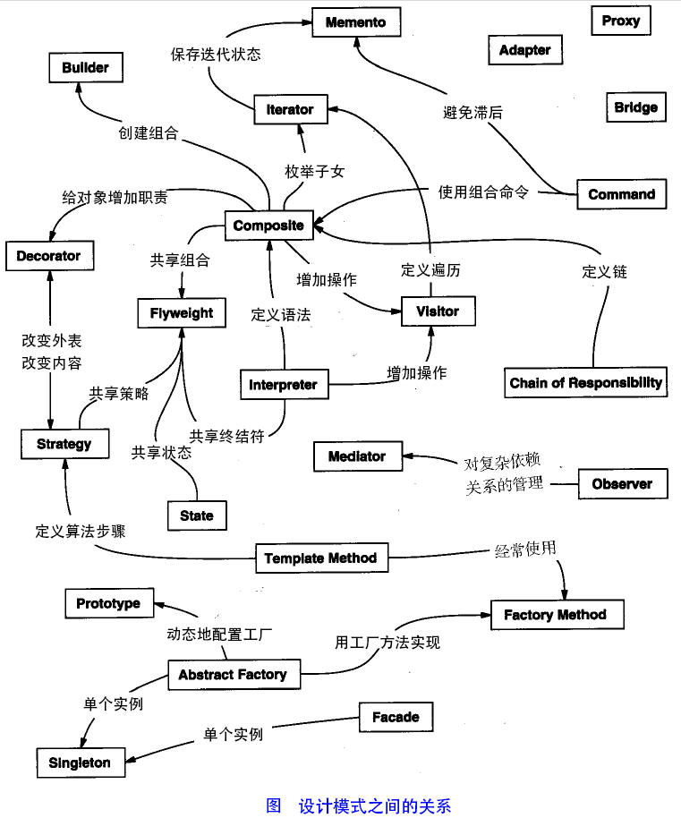

# 1. 1-设计模式简介

设计模式（Design pattern）是软件开发过程中一般问题的最佳解决方案。是众多软件开发人员长时间总结出来的一种编程经验。

使用设计模式是为了重用代码、让代码更容易被他人理解、保证代码可靠性。

每种模式在现实中都有相应的原理来与之对应，每种模式都描述了一个在我们周围不断重复发生的问题，以及该问题的核心解决方案，这也是设计模式能被广泛应用的原因。

## 1.1. GOF（Gang of Four）

1994 年，Erich Gamma、Richard Helm、Ralph Johnson 和 John Vlissides 四人合著出版了《 Design Patterns - Elements of Reusable Object-Oriented Software》（中文译名：《设计模式 - 可复用的面向对象软件元素》），该书首次提到软件开发中设计模式的概念。

四位作者合称 GOF（四人帮，全拼 Gang of Four）。

他们所提出的设计模式主要基于以下的面向对象设计原则：

* **对接口编程而不是对实现编程。**
* **优先使用对象组合而不是继承。**

## 1.2. 设计模式的类型

《设计模式 - 可复用的面向对象软件元素》 书中共提到 23 种设计模式。

这些模式可以分为三大类：`创建型模式`（Creational Patterns）、`结构型模式`（Structural Patterns）、`行为型模式`（Behavioral Patterns）。

当然，我们还会讨论另一类设计模式：`J2EE 设计模式`。

模式 | 包括 | 描述
---|---|---
创建型模式   ( 5 类 )|工厂模式（Factory Pattern） 抽象工厂模式（Abstract Factory Pattern） 单例模式（Singleton Pattern） 建造者模式（Builder Pattern） 原型模式（Prototype Pattern）| 在创建对象的同时隐藏创建逻辑， 而不是使用 new 运算符直接实例化对象。| 
结构型模式  （ 8 类 ） | 适配器模式（Adapter Pattern） 桥接模式（Bridge Pattern） 过滤器模式（Filter、Criteria Pattern） 组合模式（Composite Pattern） 装饰器模式（Decorator Pattern） 外观模式（Facade Pattern） 享元模式（Flyweight Pattern） 代理模式（Proxy Pattern） | 关注类和对象的组合。 继承被用来组合接口和定义组合对象获得新功能的方式。
行为型模式  （ 12 类 ） | 责任链模式（Chain of Responsibility Pattern） 命令模式（Command Pattern） 解释器模式（Interpreter Pattern） 迭代器模式（Iterator Pattern） 中介者模式（Mediator Pattern） 备忘录模式（Memento Pattern） 观察者模式（Observer Pattern） 状态模式（State Pattern） 空对象模式（Null Object Pattern） 策略模式（Strategy Pattern） 模板模式（Template Pattern） 访问者模式（Visitor Pattern）| 关注对象之间的通信。
J2EE 模式 | MVC 模式（MVC Pattern） 业务代表模式（Business Delegate Pattern） 组合实体模式（Composite Entity Pattern） 数据访问对象模式（Data Access Object Pattern） 前端控制器模式（Front Controller Pattern） 拦截过滤器模式（Intercepting Filter Pattern） 服务定位器模式（Service Locator Pattern） 传输对象模式（Transfer Object Pattern）| 关注表示层。 这些模式是由 Sun Java Center 鉴定的。

下面用一个图片来整体描述一下设计模式之间的关系：

## 1.3. 设计模式的六大原则

原则 |说明
---|---
`开闭原则`（Open Close Principle）|对扩展开放，对修改关闭。在程序**需要进行拓展的时候，不能去修改原有的代码，实现一个热插拔的效果**。简言之，是为了使程序的扩展性好，易于维护和升级。想要达到这样的效果，我们需要使用接口和抽象类，后面的具体设计中我们会提到这点。
`里氏代换原则`（Liskov Substitution Principle）|是面向对象设计的基本原则之一。 里氏代换原则中说，**任何基类可以出现的地方，子类一定可以出现**。LSP 是继承复用的基石，只有当派生类可以替换掉基类，且软件单位的功能不受到影响时，基类才能真正被复用，而派生类也能够在基类的基础上增加新的行为。里氏代换原则是对开闭原则的补充。实现开闭原则的关键步骤就是抽象化，而基类与子类的继承关系就是抽象化的具体实现，所以里氏代换原则是对实现抽象化的具体步骤的规范。
`依赖倒转原则`（Dependence Inversion Principle）|针对接口编程，**依赖于抽象而不依赖于具体**。该原则是开闭原则的基础
`接口隔离原则`（Interface Segregation Principle） |**使用多个隔离的接口**，比使用单个接口要好。它还有另外一个意思是：降低类之间的耦合度。由此可见，其实设计模式就是从大型软件架构出发、便于升级和维护的软件设计思想，它强调**降低依赖，降低耦合**。
`迪米特法则` （Demeter Principle）|又称`最少知道原则`。一个实体应当**尽量少地与其他实体之间发生相互作用，使得系统功能模块相对独立**。
`合成复用原则`（Composite Reuse Principle）|**尽量使用合成/聚合的方式，而不是使用继承**。