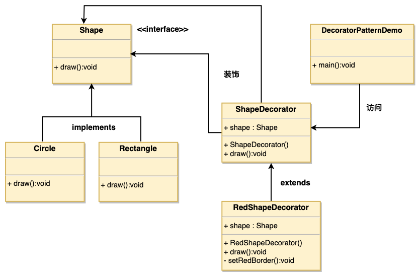

# 1. 11-装饰器模式

`装饰器模式`（Decorator Pattern）**允许向一个现有的对象添加新的功能，同时又不改变其结构**。这种类型的设计模式属于结构型模式，它是作为现有的类的一个包装。

这种模式**创建了一个装饰类，用来包装原有的类，并在保持类方法签名完整性的前提下，提供了额外的功能**。

我们通过下面的实例来演示装饰器模式的用法。其中，我们将把一个形状装饰上不同的颜色，同时又不改变形状类。

## 1.1. 介绍

标题 | 说明
---|---
意图 | **动态地给一个对象添加一些额外的职责**。就增加功能来说，装饰器模式相比生成子类更为灵活。
主要解决 | 一般的，我们为了扩展一个类经常使用继承方式实现，由于继承为类引入静态特征，并且随着扩展功能的增多，子类会很膨胀。
何时使用 | 在**不想增加很多子类**的情况下扩展类。
如何解决 | 将具体功能职责划分，同时继承装饰者模式。
关键代码 | 1、Component 类充当抽象角色，不应该具体实现。 <br> 2、修饰类引用和继承 Component 类，具体扩展类重写父类方法。
应用实例 | 1、孙悟空有 72 变，当他变成"庙宇"后，他的根本还是一只猴子，但是他又有了庙宇的功能。 <br> 2、不论一幅画有没有画框都可以挂在墙上，但是通常都是有画框的，并且实际上是画框被挂在墙上。在挂在墙上之前，画可以被蒙上玻璃，装到框子里；这时画、玻璃和画框形成了一个物体。
优点 | **装饰类和被装饰类可以独立发展，不会相互耦合；<br> 装饰模式是继承的一个替代模式，装饰模式可以动态扩展一个实现类的功能**。
缺点 | 多层装饰比较复杂。
使用场景 | 1、扩展一个类的功能。<br> 2、动态增加功能，动态撤销。
注意事项 | 可代替继承。

## 1.2. 实现

我们将创建一个 Shape 接口和实现了 Shape 接口的实体类。然后我们创建一个实现了 Shape 接口的抽象装饰类 ShapeDecorator，并把 Shape 对象作为它的实例变量。

RedShapeDecorator 是实现了 ShapeDecorator 的实体类。

DecoratorPatternDemo 类使用 RedShapeDecorator 来装饰 Shape 对象。



### 1.2.1. 接口

创建一个接口：

* Shape.java

```java
public interface Shape {
   void draw();
}
```

### 1.2.2. 实体类

创建实现接口的实体类。

* Rectangle.java

```java
public class Rectangle implements Shape {
   @Override
   public void draw() {
      System.out.println("Shape: Rectangle");
   }
}
```

* Circle.java

```java
public class Circle implements Shape {
   @Override
   public void draw() {
      System.out.println("Shape: Circle");
   }
}
```

### 1.2.3. 抽象装饰类

创建实现了 Shape 接口的抽象装饰类。

* ShapeDecorator.java

```java
public abstract class ShapeDecorator implements Shape {
   protected Shape decoratedShape;

   public ShapeDecorator(Shape decoratedShape){
      this.decoratedShape = decoratedShape;
   }

   public void draw(){
      decoratedShape.draw();
   }
}
```

### 1.2.4. 装饰类的实体类

创建扩展了 ShapeDecorator 类的实体装饰类。

* RedShapeDecorator.java

```java
public class RedShapeDecorator extends ShapeDecorator {

   public RedShapeDecorator(Shape decoratedShape) {
      super(decoratedShape);
   }

   @Override
   public void draw() {
      decoratedShape.draw();
      setRedBorder(decoratedShape);
   }

   private void setRedBorder(Shape decoratedShape){
      System.out.println("Border Color: Red");
   }
}
```

### 1.2.5. 使用

使用 RedShapeDecorator 来装饰 Shape 对象。

* DecoratorPatternDemo.java

```java
public class DecoratorPatternDemo {
   public static void main(String[] args) {

      Shape circle = new Circle();
      ShapeDecorator redCircle = new RedShapeDecorator(new Circle());
      ShapeDecorator redRectangle = new RedShapeDecorator(new Rectangle());
      //Shape redCircle = new RedShapeDecorator(new Circle());
      //Shape redRectangle = new RedShapeDecorator(new Rectangle());

      System.out.println("Circle with normal border");
      circle.draw();

      System.out.println("\nCircle of red border");
      redCircle.draw();

      System.out.println("\nRectangle of red border");
      redRectangle.draw();
   }
}
```

执行程序，输出结果：

```
Circle with normal border
Shape: Circle

Circle of red border
Shape: Circle
Border Color: Red

Rectangle of red border
Shape: Rectangle
Border Color: Red
```