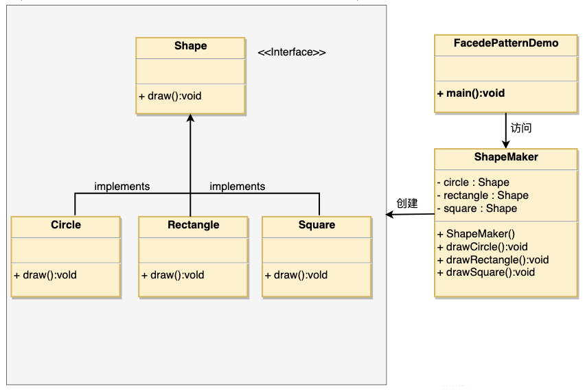

# 1. 12-外观模式

`外观模式`（Facade Pattern）**隐藏系统的复杂性，并向客户端提供了一个客户端可以访问系统的`接口`**。这种类型的设计模式属于结构型模式，它向现有的系统添加一个接口，来隐藏系统的复杂性。

这种模式涉及到一个单一的类，该类提供了客户端请求的简化方法和对现有系统类方法的委托调用。

## 1.1. 介绍

标题 | 说明
---|---
意图 | 为子系统中的一组接口提供一个一致的界面，外观模式定义了一个高层接口，这个接口使得这一子系统更加容易使用。
主要解决 | **降低访问复杂系统的内部子系统时的复杂度**，简化客户端之间的接口。
何时使用 | 1、客户端不需要知道系统内部的复杂联系，整个系统只需提供一个 `接待员` 即可。 <br> 2、定义系统的入口。
如何解决 | 客户端不与系统耦合，**外观类与系统耦合**。
关键代码 | **在客户端和复杂系统之间再加一层**，这一层将调用顺序、依赖关系等处理好。
应用实例 | 1、去医院看病，可能要去挂号、门诊、划价、取药，让患者或患者家属觉得很复杂，如果有提供接待人员，只让接待人员来处理，就很方便。<br> 2、JAVA 的三层开发模式。
优点 |1、减少系统相互依赖。<br> 2、提高灵活性。<br> 3、提高了安全性。
缺点 | 不符合开闭原则，如果要改东西很麻烦，继承重写都不合适。
使用场景 | 1、为复杂的模块或子系统提供外界访问的模块。<br> 2、子系统相对独立。<br> 3、预防低水平人员带来的风险。
注意事项 | 在层次化结构中，可以使用外观模式定义系统中每一层的入口。

## 1.2. 实现

我们将创建一个 Shape 接口和实现了 Shape 接口的实体类。下一步是定义一个外观类 ShapeMaker。

ShapeMaker 类使用实体类来代表用户对这些类的调用。

FacadePatternDemo 类使用 ShapeMaker 类来显示结果。



### 1.2.1. 接口

创建一个接口。

* Shape.java

```java
public interface Shape {
   void draw();
}
```

### 1.2.2. 接口实现类

创建实现接口的实体类。

* Rectangle.java

```java
public class Rectangle implements Shape {
   @Override
   public void draw() {
      System.out.println("Rectangle::draw()");
   }
}
```

* Square.java

```java
public class Square implements Shape {
   @Override
   public void draw() {
      System.out.println("Square::draw()");
   }
}
```

* Circle.java

```java
public class Circle implements Shape {
   @Override
   public void draw() {
      System.out.println("Circle::draw()");
   }
}
```

### 1.2.3. 外观类

创建一个外观类。

* ShapeMaker.java

```java
public class ShapeMaker {
   private Shape circle;
   private Shape rectangle;
   private Shape square;

   public ShapeMaker() {
      circle = new Circle();
      rectangle = new Rectangle();
      square = new Square();
   }

   public void drawCircle(){
      circle.draw();
   }
   public void drawRectangle(){
      rectangle.draw();
   }
   public void drawSquare(){
      square.draw();
   }
}
```

### 1.2.4. 使用

使用该外观类画出各种类型的形状。

* FacadePatternDemo.java

```java
public class FacadePatternDemo {
   public static void main(String[] args) {
      ShapeMaker shapeMaker = new ShapeMaker();

      shapeMaker.drawCircle();
      shapeMaker.drawRectangle();
      shapeMaker.drawSquare();
   }
}
```

执行程序，输出结果：

```
Circle::draw()
Rectangle::draw()
Square::draw()
```