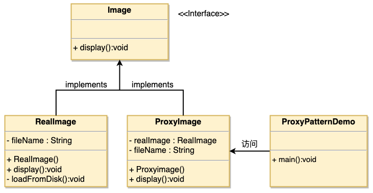

# 1. 14-代理模式

在`代理模式`（Proxy Pattern）中，**一个类代表另一个类的功能**。这种类型的设计模式属于结构型模式。

在代理模式中，我们**创建具有现有对象的对象，以便向外界提供功能接口**。

## 1.1. 介绍

标题 | 说明
---|---
意图 |为其他对象提供一种代理以**控制**对这个对象的访问。
主要解决 | 在直接访问对象时带来的问题，比如说：要访问的对象在远程的机器上。在面向对象系统中，有些对象由于某些原因（比如对象创建开销很大，或者某些操作需要安全控制，或者需要进程外的访问），直接访问会给使用者或者系统结构带来很多麻烦，我们可以**在访问此对象时加上一个对此对象的访问层**。
何时使用 | **想在访问一个类时做一些控制**。
如何解决 | **增加中间层**。
关键代码 | 实现与被代理类组合。
应用实例 | 1、Windows 里面的快捷方式。<br> 2、猪八戒去找高翠兰结果是孙悟空变的，可以这样理解：把高翠兰的外貌抽象出来，高翠兰本人和孙悟空都实现了这个接口，猪八戒访问高翠兰的时候看不出来这个是孙悟空，所以说孙悟空是高翠兰代理类。<br> 3、买火车票不一定在火车站买，也可以去代售点。<br> 4、一张支票或银行存单是账户中资金的代理。支票在市场交易中用来代替现金，并提供对签发人账号上资金的控制。<br> 5、spring aop。
优点 | 1、职责清晰。<br> 2、高扩展性。<br> 3、智能化。
缺点 | 1、由于在客户端和真实主题之间增加了代理对象，因此有些类型的代理模式可能会造成请求的处理速度变慢。<br> 2、实现代理模式需要额外的工作，有些代理模式的实现非常复杂。
使用场景 | 按职责来划分，通常有以下使用场景：<br> 1、远程代理。<br> 2、虚拟代理。 <br> 3、`Copy-on-Write` 代理。<br> 4、保护（Protect or Access）代理。 <br>5、Cache代理。<br> 6、防火墙（Firewall）代理。<br> 7、同步化（Synchronization）代理。<br> 8、智能引用（Smart Reference）代理。
注意事项 | 1、和适配器模式的区别：适配器模式主要改变所考虑对象的接口，而代理模式不能改变所代理类的接口。<br> 2、和装饰器模式的区别：**装饰器模式为了增强功能，而代理模式是为了加以控制**。

## 1.2. 实现

我们将创建一个 Image 接口和实现了 Image 接口的实体类。

ProxyImage 是一个代理类，减少 RealImage 对象加载的内存占用。

ProxyPatternDemo 类使用 ProxyImage 来获取要加载的 Image 对象，并按照需求进行显示。




### 1.2.1. 接口

创建一个接口。

* Image.java

```java
public interface Image {
   void display();
}
```

### 1.2.2. 实体类

创建实现接口的实体类。

* RealImage.java

```java
public class RealImage implements Image {

   private String fileName;

   public RealImage(String fileName){
      this.fileName = fileName;
      loadFromDisk(fileName);
   }

   @Override
   public void display() {
      System.out.println("Displaying " + fileName);
   }

   private void loadFromDisk(String fileName){
      System.out.println("Loading " + fileName);
   }
}
```

### 1.2.3. 代理类

* ProxyImage.java

```java
public class ProxyImage implements Image{

   private RealImage realImage;
   private String fileName;

   public ProxyImage(String fileName){
      this.fileName = fileName;
   }

   @Override
   public void display() {
      if(realImage == null){
         realImage = new RealImage(fileName);
      }
      realImage.display();
   }
}
```

### 1.2.4. 使用

当被请求时，使用 ProxyImage 来获取 RealImage 类的对象。

* ProxyPatternDemo.java

```java
public class ProxyPatternDemo {

   public static void main(String[] args) {
      Image image = new ProxyImage("test_10mb.jpg");

      // 图像将从磁盘加载
      image.display();
      System.out.println("");
      // 图像不需要从磁盘加载
      image.display();
   }
}
```


执行程序，输出结果：

```
Loading test_10mb.jpg
Displaying test_10mb.jpg

Displaying test_10mb.jpg
```