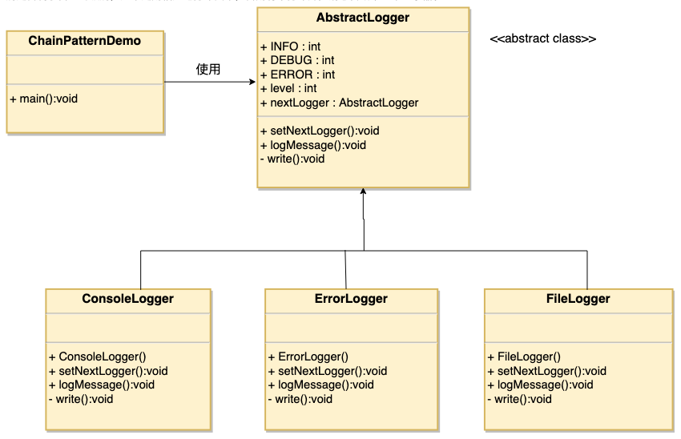

# 1. 15-责任链模式

`责任链模式`（Chain of Responsibility Pattern）为请求**创建了一个接收者对象的链**。这种模式给予请求的类型，对请求的发送者和接收者进行解耦。这种类型的设计模式属于行为型模式。

在这种模式中，**通常每个接收者都包含对另一个接收者的引用。如果一个对象不能处理该请求，那么它会把相同的请求传给下一个接收者，依此类推**。

## 1.1. 介绍

标题 | 说明
---|---
意图 | 避免请求发送者与接收者耦合在一起，让多个对象都有可能接收请求，**将这些对象连接成一条链，并且沿着这条链传递请求，直到有对象处理它为止**。
主要解决 | 职责链上的处理者负责处理请求，客户只需要将请求发送到职责链上即可，无须关心请求的处理细节和请求的传递，所以职责链将请求的发送者和请求的处理者解耦了。
何时使用 | 在处理消息的时候以过滤很多道。
如何解决 | **拦截的类都实现统一接口**。
关键代码 | Handler 里面聚合它自己，在 HandlerRequest 里判断是否合适，如果没达到条件则向下传递，向谁传递之前 set 进去。
应用实例 | 1、红楼梦中的"击鼓传花"。<br> 2、JS 中的事件冒泡。<br> 3、JAVA WEB 中 Apache Tomcat 对 Encoding 的处理，Struts2 的拦截器，jsp servlet 的 Filter。
优点 | 1、降低耦合度。它将请求的发送者和接收者解耦。<br> 2、简化了对象。使得对象不需要知道链的结构。<br> 3、增强给对象指派职责的灵活性。通过改变链内的成员或者调动它们的次序，允许动态地新增或者删除责任。<br> 4、增加新的请求处理类很方便。
缺点 | 1、不能保证请求一定被接收。<br> 2、系统性能将受到一定影响，而且在进行代码调试时不太方便，可能会造成循环调用。<br> 3、可能不容易观察运行时的特征，有碍于除错。
使用场景 | 1、有多个对象可以处理同一个请求，具体哪个对象处理该请求由运行时刻自动确定。<br> 2、在不明确指定接收者的情况下，向多个对象中的一个提交一个请求。<br> 3、可动态指定一组对象处理请求。
注意事项 | 在 JAVA WEB 中遇到很多应用。

## 1.2. 实现

我们创建抽象类 AbstractLogger，带有详细的日志记录级别。然后我们创建三种类型的记录器，都扩展了 AbstractLogger。每个记录器消息的级别是否属于自己的级别，如果是则相应地打印出来，否则将不打印并把消息传给下一个记录器。



### 1.2.1. 抽象类

创建抽象的记录器类。

* AbstractLogger.java

```java
public abstract class AbstractLogger {
   public static int INFO = 1;
   public static int DEBUG = 2;
   public static int ERROR = 3;

   protected int level;

   //责任链中的下一个元素
   protected AbstractLogger nextLogger;

   public void setNextLogger(AbstractLogger nextLogger){
      this.nextLogger = nextLogger;
   }

   public void logMessage(int level, String message){
      if(this.level <= level){
         write(message);
      }
      if(nextLogger !=null){
         nextLogger.logMessage(level, message);
      }
   }

   abstract protected void write(String message);
}
```

### 1.2.2. 实体类

创建扩展了该记录器类的实体类。

* ConsoleLogger.java

```java
public class ConsoleLogger extends AbstractLogger {

   public ConsoleLogger(int level){
      this.level = level;
   }

   @Override
   protected void write(String message) {
      System.out.println("Standard Console::Logger: " + message);
   }
}
```

* ErrorLogger.java

```java
public class ErrorLogger extends AbstractLogger {

   public ErrorLogger(int level){
      this.level = level;
   }

   @Override
   protected void write(String message) {
      System.out.println("Error Console::Logger: " + message);
   }
}
```

* FileLogger.java

```java
public class FileLogger extends AbstractLogger {

   public FileLogger(int level){
      this.level = level;
   }

   @Override
   protected void write(String message) {
      System.out.println("File::Logger: " + message);
   }
}
```

### 1.2.3. 使用

创建不同类型的记录器。赋予它们不同的错误级别，并在每个记录器中设置下一个记录器。每个记录器中的下一个记录器代表的是链的一部分。

* ChainPatternDemo.java

```java
public class ChainPatternDemo {

   private static AbstractLogger getChainOfLoggers(){

      AbstractLogger errorLogger = new ErrorLogger(AbstractLogger.ERROR);
      AbstractLogger fileLogger = new FileLogger(AbstractLogger.DEBUG);
      AbstractLogger consoleLogger = new ConsoleLogger(AbstractLogger.INFO);

      errorLogger.setNextLogger(fileLogger);
      fileLogger.setNextLogger(consoleLogger);

      return errorLogger;
   }

   public static void main(String[] args) {
      AbstractLogger loggerChain = getChainOfLoggers();

      loggerChain.logMessage(AbstractLogger.INFO, "This is an information.");

      loggerChain.logMessage(AbstractLogger.DEBUG, "This is a debug level information.");

      loggerChain.logMessage(AbstractLogger.ERROR, "This is an error information.");
   }
}
```

执行程序，输出结果：

```
Standard Console::Logger: This is an information.
File::Logger: This is a debug level information.
Standard Console::Logger: This is a debug level information.
Error Console::Logger: This is an error information.
File::Logger: This is an error information.
Standard Console::Logger: This is an error information.
```