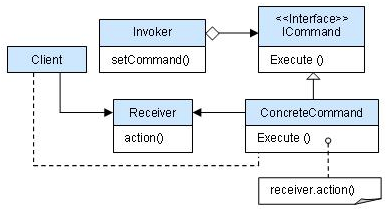
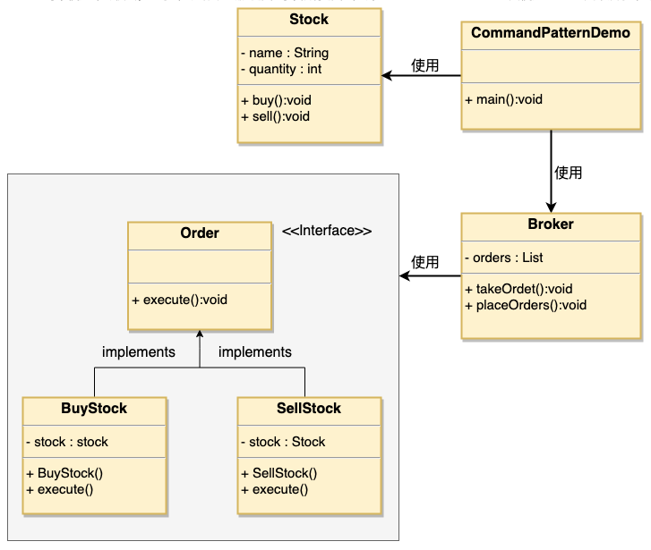

# 1. 16-命令模式

`命令模式`（Command Pattern）是一种数据驱动的设计模式，它属于行为型模式。**请求以命令的形式包裹在对象中，并传给调用对象。调用对象寻找可以处理该命令的合适的对象，并把该命令传给相应的对象，该对象执行命令**。

## 1.1. 介绍

标题 | 说明
---|---
意图 | **将一个请求封装成一个对象，从而使您可以用不同的请求对客户进行参数化**。
主要解决 | 在软件系统中，行为请求者与行为实现者通常是一种紧耦合的关系，但某些场合，比如需要对行为进行记录、撤销或重做、事务等处理时，这种无法抵御变化的紧耦合的设计就不太合适。
何时使用 | 在某些场合，比如要**对行为进行"记录、撤销/重做、事务"等处理，这种无法抵御变化的紧耦合是不合适的**。在这种情况下，如何将 `行为请求者` 与 `行为实现者` 解耦？将一组行为抽象为对象，可以实现二者之间的**松耦合**。
如何解决 | 通过**调用者调用接受者执行命令**，顺序：**调用者→命令→接受者**。
关键代码 | 定义三个角色：<br> 1、received 真正的命令执行对象 <br> 2、Command  <br> 3、invoker 使用命令对象的入口
应用实例 | struts 1 中的 action 核心控制器 ActionServlet 只有一个，相当于 Invoker，而模型层的类会随着不同的应用有不同的模型类，相当于具体的 Command。
优点 | 1、降低了系统耦合度。 <br> 2、新的命令可以很容易添加到系统中去。
缺点 | 使用命令模式可能会导致某些系统有过多的具体命令类。
使用场景 | 认为是命令的地方都可以使用命令模式，比如： <br> 1、GUI 中每一个按钮都是一条命令。<br> 2、模拟 CMD。
注意事项 | **系统需要支持命令的撤销(Undo)操作和恢复(Redo)操作，也可以考虑使用命令模式**，见命令模式的扩展。

命令模式结构示意图:



## 1.2. 实现

我们首先创建作为命令的接口 Order，然后创建作为请求的 Stock 类。

实体命令类 BuyStock 和 SellStock，实现了 Order 接口，将执行实际的命令处理。创建作为调用对象的类 Broker，它接受订单并能下订单。

Broker 对象使用命令模式，基于命令的类型确定哪个对象执行哪个命令。

CommandPatternDemo 类使用 Broker 类来演示命令模式。



### 1.2.1. 命令接口

创建一个命令接口。

* Order.java

```java
public interface Order {
   void execute();
}
```

### 1.2.2. 请求类

创建一个请求类。

* Stock.java

```java
public class Stock {

   private String name = "ABC";
   private int quantity = 10;

   public void buy(){
      System.out.println("Stock [ Name: "+name+", Quantity: " + quantity +" ] bought");
   }
   public void sell(){
      System.out.println("Stock [ Name: "+name+", Quantity: " + quantity +" ] sold");
   }
}
```

### 1.2.3. 接口实体类

创建实现了 Order 接口的实体类。

* BuyStock.java

```java
public class BuyStock implements Order {
   private Stock abcStock;

   public BuyStock(Stock abcStock){
      this.abcStock = abcStock;
   }

   public void execute() {
      abcStock.buy();
   }
}
```

* SellStock.java

```java
public class SellStock implements Order {
   private Stock abcStock;

   public SellStock(Stock abcStock){
      this.abcStock = abcStock;
   }

   public void execute() {
      abcStock.sell();
   }
}
```

### 1.2.4. 命令调用类

创建命令调用类。

* Broker.java

```java
import java.util.ArrayList;
import java.util.List;

public class Broker {
   private List<Order> orderList = new ArrayList<Order>();

   public void takeOrder(Order order){
      orderList.add(order);
   }

   public void placeOrders(){
      for (Order order : orderList) {
         order.execute();
      }
      orderList.clear();
   }
}
```

### 1.2.5. 使用

使用 Broker 类来接受并执行命令。

* CommandPatternDemo.java

```java
public class CommandPatternDemo {
   public static void main(String[] args) {
      Stock abcStock = new Stock();

      BuyStock buyStockOrder = new BuyStock(abcStock);
      SellStock sellStockOrder = new SellStock(abcStock);

      Broker broker = new Broker();
      broker.takeOrder(buyStockOrder);
      broker.takeOrder(sellStockOrder);

      broker.placeOrders();
   }
}
```

运行结果：

```
Stock [ Name: ABC, Quantity: 10 ] bought
Stock [ Name: ABC, Quantity: 10 ] sold
```