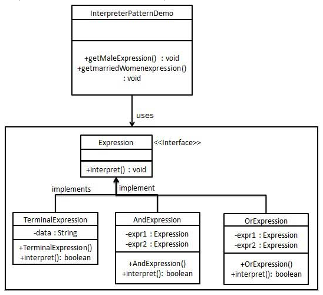

# 1. 17-解释器模式

`解释器模式`（Interpreter Pattern）提供了**评估语言的语法或表达式的方式**，它属于行为型模式。这种模式**实现了一个表达式接口，该接口解释一个特定的上下文。这种模式被用在 SQL 解析、符号处理引擎等**。

## 1.1. 介绍

标题 | 说明
---|---
意图 | **给定一个语言，定义它的文法表示，并定义一个解释器，这个解释器使用该标识来解释语言中的句子**。
主要解决 | 对于一些固定文法构建一个解释句子的解释器。
何时使用 | 如果一种特定类型的问题发生的频率足够高，那么可能就值得将该问题的各个实例表述为一个简单语言中的句子。这样就可以构建一个解释器，该解释器通过解释这些句子来解决该问题。
如何解决 | 构建语法树，定义终结符与非终结符。
关键代码 | **构建环境类，包含解释器之外的一些全局信息，一般是 HashMap。**
应用实例 | 编译器、运算表达式计算。
优点 | 1、可扩展性比较好，灵活。<br> 2、增加了新的解释表达式的方式。<br> 3、易于实现简单文法。
缺点 | 1、可利用场景比较少。<br> 2、对于复杂的文法比较难维护。<br> 3、解释器模式会引起类膨胀。<br> 4、解释器模式采用递归调用方法。
使用场景 | 1、可以将一个需要解释执行的语言中的句子表示为一个抽象语法树。<br> 2、一些重复出现的问题可以用一种简单的语言来进行表达。<br> 3、一个简单语法需要解释的场景。
注意事项 | 可利用场景比较少，JAVA 中如果碰到可以用 expression4J 代替。

## 1.2. 实现

我们将创建一个接口 Expression 和实现了 Expression 接口的实体类。

定义作为上下文中主要解释器的 TerminalExpression 类。其他的类 OrExpression、AndExpression 用于创建组合式表达式。

InterpreterPatternDemo，我们的演示类使用 Expression 类创建规则和演示表达式的解析。



### 1.2.1. 表达式接口

创建一个表达式接口。

* Expression.java

```java
public interface Expression {
   public boolean interpret(String context);
}
```

### 1.2.2. 接口的实体类

创建实现了上述接口的实体类。

* TerminalExpression.java

```java
public class TerminalExpression implements Expression {

   private String data;

   public TerminalExpression(String data){
      this.data = data;
   }

   @Override
   public boolean interpret(String context) {
      if(context.contains(data)){
         return true;
      }
      return false;
   }
}
```

* OrExpression.java

```java
public class OrExpression implements Expression {

   private Expression expr1 = null;
   private Expression expr2 = null;

   public OrExpression(Expression expr1, Expression expr2) {
      this.expr1 = expr1;
      this.expr2 = expr2;
   }

   @Override
   public boolean interpret(String context) {
      return expr1.interpret(context) || expr2.interpret(context);
   }
}
```

* AndExpression.java

```java
public class AndExpression implements Expression {

   private Expression expr1 = null;
   private Expression expr2 = null;

   public AndExpression(Expression expr1, Expression expr2) {
      this.expr1 = expr1;
      this.expr2 = expr2;
   }

   @Override
   public boolean interpret(String context) {
      return expr1.interpret(context) && expr2.interpret(context);
   }
}
```

### 1.2.3. 使用

InterpreterPatternDemo 使用 Expression 类来创建规则，并解析它们。

* InterpreterPatternDemo.java

```java
public class InterpreterPatternDemo {

   //规则：Robert 和 John 是男性
   public static Expression getMaleExpression(){
      Expression robert = new TerminalExpression("Robert");
      Expression john = new TerminalExpression("John");
      return new OrExpression(robert, john);
   }

   //规则：Julie 是一个已婚的女性
   public static Expression getMarriedWomanExpression(){
      Expression julie = new TerminalExpression("Julie");
      Expression married = new TerminalExpression("Married");
      return new AndExpression(julie, married);
   }

   public static void main(String[] args) {
      Expression isMale = getMaleExpression();
      Expression isMarriedWoman = getMarriedWomanExpression();

      System.out.println("John is male? " + isMale.interpret("John"));
      System.out.println("Julie is a married women? " + isMarriedWoman.interpret("Married Julie"));
   }
}
```

执行程序，输出结果：

```
John is male? true
Julie is a married women? true
```