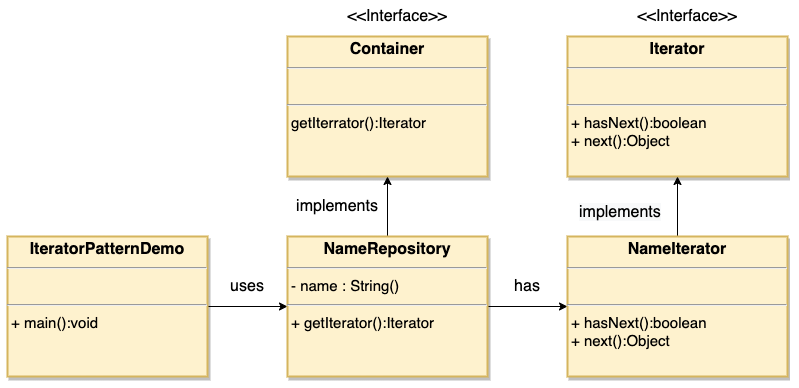

# 1. 18-迭代器模式

`迭代器模式`（Iterator Pattern）是 Java 和 .Net 编程环境中非常常用的设计模式。这种模式**用于顺序访问集合对象的元素，不需要知道集合对象的底层表示**。

迭代器模式属于行为型模式。

## 1.1. 介绍

标题 | 说明
---|---
意图 | 提供一种方法顺序访问一个聚合对象中各个元素, 而又无须暴露该对象的内部表示。
主要解决 | 不同的方式来遍历整个整合对象。
何时使用 | 遍历一个聚合对象。
如何解决 | 把在元素之间游走的责任交给迭代器，而不是聚合对象。
关键代码 | 定义接口：hasNext, next。
应用实例 | JAVA 中的 iterator。
优点 | 1、它支持以不同的方式遍历一个聚合对象。<br> 2、迭代器简化了聚合类。<br> 3、在同一个聚合上可以有多个遍历。<br> 4、在迭代器模式中，增加新的聚合类和迭代器类都很方便，无须修改原有代码。
缺点 | 由于迭代器模式将存储数据和遍历数据的职责分离，增加新的聚合类需要对应增加新的迭代器类，类的个数成对增加，这在一定程度上增加了系统的复杂性。
使用场景 | 1、访问一个聚合对象的内容而无须暴露它的内部表示。<br> 2、需要为聚合对象提供多种遍历方式。<br> 3、为遍历不同的聚合结构提供一个统一的接口。
注意事项 | 迭代器模式就是分离了集合对象的遍历行为，抽象出一个迭代器类来负责，这样既可以做到不暴露集合的内部结构，又可让外部代码透明地访问集合内部的数据。

## 1.2. 实现

我们将创建一个叙述导航方法的 Iterator 接口和一个返回迭代器的 Container 接口。实现了 Container 接口的实体类将负责实现 Iterator 接口。

IteratorPatternDemo，我们的演示类使用实体类 NamesRepository 来打印 NamesRepository 中存储为集合的 Names。



### 1.2.1. 步骤 1

创建接口:

* Iterator.java

```java
public interface Iterator {
   public boolean hasNext();
   public Object next();
}
```

* Container.java

```java
public interface Container {
   public Iterator getIterator();
}
```

### 1.2.2. 步骤 2

创建实现了 Container 接口的实体类。该类有实现了 Iterator 接口的内部类 NameIterator。

* NameRepository.java

```java
public class NameRepository implements Container {
   public String[] names = {"Robert" , "John" ,"Julie" , "Lora"};

   @Override
   public Iterator getIterator() {
      return new NameIterator();
   }

   private class NameIterator implements Iterator {

      int index;

      @Override
      public boolean hasNext() {
         if(index < names.length){
            return true;
         }
         return false;
      }

      @Override
      public Object next() {
         if(this.hasNext()){
            return names[index++];
         }
         return null;
      }
   }
}
```

### 1.2.3. 步骤 3

使用 NameRepository 来获取迭代器，并打印名字。

* IteratorPatternDemo.java

```java
public class IteratorPatternDemo {

   public static void main(String[] args) {
      NameRepository namesRepository = new NameRepository();

      for(Iterator iter = namesRepository.getIterator(); iter.hasNext();){
         String name = (String)iter.next();
         System.out.println("Name : " + name);
      }
   }
}
```

### 1.2.4. 步骤 4

执行程序，输出结果：

```
Name : Robert
Name : John
Name : Julie
Name : Lora
```