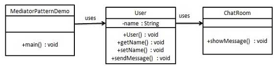

# 1. 19-中介者模式

`中介者模式`（Mediator Pattern）是用来**降低多个对象和类之间的通信复杂性**。这种模式**提供了一个中介类，该类通常处理不同类之间的通信，并支持松耦合，使代码易于维护**。中介者模式属于行为型模式。

## 1.1. 介绍

标题|说明
---|---
意图 | 用一个中介对象来封装一系列的对象交互，中介者使各对象不需要显式地相互引用，从而使其耦合松散，而且可以独立地改变它们之间的交互。
主要解决 | 对象与对象之间存在大量的关联关系，这样势必会导致系统的结构变得很复杂，同时若一个对象发生改变，我们也需要跟踪与之相关联的对象，同时做出相应的处理。
何时使用 | **多个类相互耦合，形成了网状结构**。
如何解决 | **将上述网状结构分离为星型结构。**
关键代码 | 对象 Colleague 之间的通信封装到一个类中单独处理。
应用实例 | 1、中国加入 WTO 之前是各个国家相互贸易，结构复杂，现在是各个国家通过 WTO 来互相贸易。<br> 2、机场调度系统。 <br> 3、MVC 框架，其中C（控制器）就是 M（模型）和 V（视图）的中介者。
优点 | 1、降低了类的复杂度，将一对多转化成了一对一。<br> 2、各个类之间的解耦。<br> 3、符合迪米特原则。
缺点 | 中介者会庞大，变得复杂难以维护。
使用场景 | 1、系统中对象之间存在比较复杂的引用关系，导致它们之间的依赖关系结构混乱而且难以复用该对象。<br> 2、想通过一个中间类来封装多个类中的行为，而又不想生成太多的子类。
注意事项 | 不应当在职责混乱的时候使用。

## 1.2. 实现

我们通过聊天室实例来演示中介者模式。实例中，多个用户可以向聊天室发送消息，聊天室向所有的用户显示消息。

我们将创建两个类 ChatRoom 和 User。User 对象使用 ChatRoom 方法来分享他们的消息。

MediatorPatternDemo，我们的演示类使用 User 对象来显示他们之间的通信。



### 1.2.1. 步骤 1

创建中介类。

* ChatRoom.java

```java
import java.util.Date;

public class ChatRoom {
   public static void showMessage(User user, String message){
      System.out.println(new Date().toString() + " [" + user.getName() +"] : " + message);
   }
}
```

### 1.2.2. 步骤 2

创建 user 类。

* User.java

```java
public class User {
   private String name;

   public String getName() {
      return name;
   }

   public void setName(String name) {
      this.name = name;
   }

   public User(String name){
      this.name  = name;
   }

   public void sendMessage(String message){
      ChatRoom.showMessage(this,message);
   }
}
```

### 1.2.3. 步骤 3

使用 User 对象来显示他们之间的通信。

* MediatorPatternDemo.java

```java
public class MediatorPatternDemo {
   public static void main(String[] args) {
      User robert = new User("Robert");
      User john = new User("John");

      robert.sendMessage("Hi! John!");
      john.sendMessage("Hello! Robert!");
   }
}
```

### 1.2.4. 步骤 4

执行程序，输出结果：

```
Thu Jan 31 16:05:46 IST 2013 [Robert] : Hi! John!
Thu Jan 31 16:05:46 IST 2013 [John] : Hello! Robert!
```