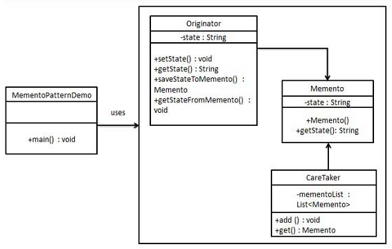

# 1. 20-备忘录模式

`备忘录模式`（Memento Pattern）**保存一个对象的某个状态，以便在适当的时候恢复对象**。备忘录模式属于行为型模式。

## 1.1. 介绍

标题 | 说明
---|---
意图 | 在不破坏封装性的前提下，捕获一个对象的内部状态，并在该对象之外保存这个状态。
主要解决 | 所谓备忘录模式就是在不破坏封装的前提下，捕获一个对象的内部状态，并在该对象之外保存这个状态，这样可以在以后将对象恢复到原先保存的状态。
何时使用 | 很多时候我们总是需要记录一个对象的内部状态，这样做的目的就是为了允许用户取消不确定或者错误的操作，能够恢复到他原先的状态，使得他有"后悔药"可吃。
如何解决 | **通过一个备忘录类专门存储对象状态**。
关键代码 | **客户不与备忘录类耦合，与备忘录管理类耦合。**
应用实例 | 1、后悔药。<br> 2、打游戏时的存档。<br> 3、Windows 里的 ctrl + z。<br> 4、IE 中的后退。<br> 5、数据库的事务管理。
优点 | 1、给用户提供了一种可以恢复状态的机制，可以使用户能够比较方便地回到某个历史的状态。<br> 2、实现了信息的封装，使得用户不需要关心状态的保存细节。 
缺点 | 消耗资源。如果类的成员变量过多，势必会占用比较大的资源，而且每一次保存都会消耗一定的内存。
使用场景 | 1、需要保存/恢复数据的相关状态场景。<br> 2、提供一个可回滚的操作。
注意事项 | 1、为了符合迪米特原则，还要增加一个管理备忘录的类。<br> 2、为了节约内存，可使用原型模式+备忘录模式。

## 1.2. 实现

备忘录模式使用三个类 Memento、Originator 和 CareTaker。

Memento 包含了要被恢复的对象的状态。Originator 创建并在 Memento 对象中存储状态。Caretaker 对象负责从 Memento 中恢复对象的状态。

MementoPatternDemo，我们的演示类使用 CareTaker 和 Originator 对象来显示对象的状态恢复。



### 1.2.1. 步骤 1

创建 Memento 类，包含了要被恢复的对象的状态

* Memento.java

```java
public class Memento {
   private String state;

   public Memento(String state){
      this.state = state;
   }

   public String getState(){
      return state;
   }
}
```

### 1.2.2. 步骤 2

创建 Originator 类，创建并在 Memento 对象中存储状态

* Originator.java

```java
public class Originator {
   private String state;

   public void setState(String state){
      this.state = state;
   }

   public String getState(){
      return state;
   }

   public Memento saveStateToMemento(){
      return new Memento(state);
   }

   public void getStateFromMemento(Memento Memento){
      state = Memento.getState();
   }
}
```

### 1.2.3. 步骤 3

创建 CareTaker 类，负责从 Memento 中恢复对象的状态。

* CareTaker.java

```java
import java.util.ArrayList;
import java.util.List;

public class CareTaker {
   private List<Memento> mementoList = new ArrayList<Memento>();

   public void add(Memento state){
      mementoList.add(state);
   }

   public Memento get(int index){
      return mementoList.get(index);
   }
}
```

### 1.2.4. 步骤 4

使用 CareTaker 和 Originator 对象。

* MementoPatternDemo.java

```java
public class MementoPatternDemo {
   public static void main(String[] args) {
      Originator originator = new Originator();
      CareTaker careTaker = new CareTaker();
      originator.setState("State #1");
      originator.setState("State #2");
      careTaker.add(originator.saveStateToMemento());
      originator.setState("State #3");
      careTaker.add(originator.saveStateToMemento());
      originator.setState("State #4");

      System.out.println("Current State: " + originator.getState());
      originator.getStateFromMemento(careTaker.get(0));
      System.out.println("First saved State: " + originator.getState());
      originator.getStateFromMemento(careTaker.get(1));
      System.out.println("Second saved State: " + originator.getState());
   }
}
```

### 1.2.5. 步骤 5

验证输出。

```
Current State: State #4
First saved State: State #2
Second saved State: State #3
```