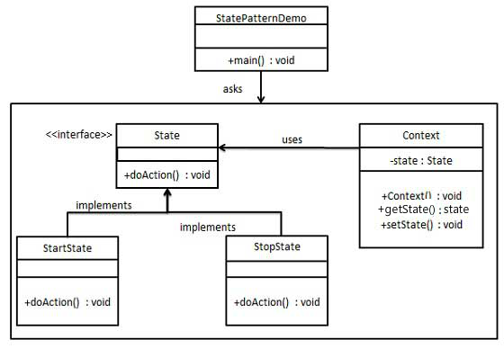

# 1. 22-状态模式

在`状态模式`（State Pattern）中，**类的行为是基于它的状态改变的**。这种类型的设计模式属于行为型模式。

在状态模式中，我们**创建表示各种状态的对象**和**一个行为随着状态对象改变而改变的 context 对象**。

## 1.1. 介绍

标题 | 说明
---|---
意图 | **允许对象在内部状态发生改变时改变它的行为**，对象看起来好像修改了它的类。
主要解决 | 对象的**行为依赖于它的状态**（属性），并且可以根据它的状态改变而改变它的相关行为。
何时使用 | 代码中包含大量与对象状态有关的条件语句。
如何解决 | 将各种具体的状态类抽象出来。
关键代码 | 通常命令模式的接口中只有一个方法。而**状态模式的接口中有一个或者多个方法**。而且，状态模式的实现类的方法，一般返回值，或者是改变实例变量的值。也就是说，状态模式一般和对象的状态有关。实现类的方法有不同的功能，覆盖接口中的方法。**状态模式和命令模式一样，也可以用于消除 if...else 等条件选择语句**。
应用实例 | 1、打篮球的时候运动员可以有正常状态、不正常状态和超常状态。<br> 2、曾侯乙编钟中，'钟是抽象接口','钟A'等是具体状态，'曾侯乙编钟'是具体环境（Context）。
优点 | 1、封装了转换规则。<br> 2、枚举可能的状态，在枚举状态之前需要确定状态种类。<br> 3、将所有与某个状态有关的行为放到一个类中，并且可以方便地增加新的状态，只需要改变对象状态即可改变对象的行为。<br> 4、允许状态转换逻辑与状态对象合成一体，而不是某一个巨大的条件语句块。<br> 5、可以让多个环境对象共享一个状态对象，从而减少系统中对象的个数。
缺点 | 1、状态模式的使用必然会增加系统类和对象的个数。<br> 2、状态模式的结构与实现都较为复杂，如果使用不当将导致程序结构和代码的混乱。<br> 3、状态模式对"开闭原则"的支持并不太好，对于可以切换状态的状态模式，增加新的状态类需要修改那些负责状态转换的源代码，否则无法切换到新增状态，而且修改某个状态类的行为也需修改对应类的源代码。
使用场景 | 1、行为随状态改变而改变的场景。<br> 2、条件、分支语句的代替者。
注意事项 | 在行为受状态约束的时候使用状态模式，而且**状态不超过 5 个**。

## 1.2. 实现

我们将创建一个 State 接口和实现了 State 接口的实体状态类。Context 是一个带有某个状态的类。

StatePatternDemo，我们的演示类使用 Context 和状态对象来演示 Context 在状态改变时的行为变化。



### 1.2.1. 步骤 1

创建一个接口。

* State.java

```java
public interface State {
   public void doAction(Context context);
}
```

### 1.2.2. 步骤 2

创建实现接口的实体类。

* StartState.java

```java
public class StartState implements State {

   public void doAction(Context context) {
      System.out.println("Player is in start state");
      context.setState(this);
   }

   public String toString(){
      return "Start State";
   }
}
```

* StopState.java

```java
public class StopState implements State {

   public void doAction(Context context) {
      System.out.println("Player is in stop state");
      context.setState(this);
   }

   public String toString(){
      return "Stop State";
   }
}
```

### 1.2.3. 步骤 3

创建 Context 类。

* Context.java

```java
public class Context {
   private State state;

   public Context(){
      state = null;
   }

   public void setState(State state){
      this.state = state;
   }

   public State getState(){
      return state;
   }
}
```

### 1.2.4. 步骤 4

使用 Context 来查看当状态 State 改变时的行为变化。

* StatePatternDemo.java

```java
public class StatePatternDemo {
   public static void main(String[] args) {
      Context context = new Context();

      StartState startState = new StartState();
      startState.doAction(context);

      System.out.println(context.getState().toString());

      StopState stopState = new StopState();
      stopState.doAction(context);

      System.out.println(context.getState().toString());
   }
}
```

执行程序，输出结果：

```
Player is in start state
Start State
Player is in stop state
Stop State
```