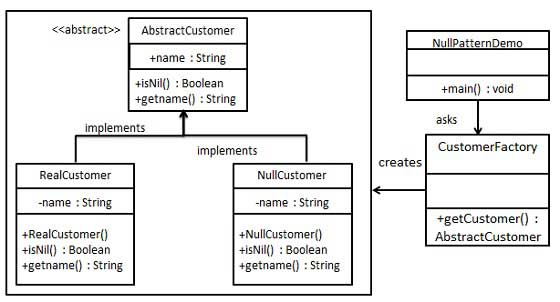

# 1. 23-空对象模式

在`空对象模式`（Null Object Pattern）中，**一个空对象取代 NULL 对象实例的检查**。Null 对象不是检查空值，而是反应一个不做任何动作的关系。这样的 Null 对象也可以在数据不可用的时候提供默认的行为。

在空对象模式中，我们创建一个指定各种要执行的操作的抽象类和扩展该类的实体类，还创建一个未对该类做任何实现的空对象类，该空对象类将无缝地使用在需要检查空值的地方。

## 1.1. 实现

我们将创建一个定义操作（在这里，是客户的名称）的 AbstractCustomer 抽象类，和扩展了 AbstractCustomer 类的实体类。工厂类 CustomerFactory 基于客户传递的名字来返回 RealCustomer 或 NullCustomer 对象。

NullPatternDemo，我们的演示类使用 CustomerFactory 来演示空对象模式的用法。




### 1.1.1. 步骤 1

创建一个抽象类。

* AbstractCustomer.java

```java
public abstract class AbstractCustomer {
   protected String name;
   public abstract boolean isNil();
   public abstract String getName();
}
```

### 1.1.2. 步骤 2

创建扩展了上述类的实体类。

* RealCustomer.java

```java
public class RealCustomer extends AbstractCustomer {

   public RealCustomer(String name) {
      this.name = name;
   }

   @Override
   public String getName() {
      return name;
   }

   @Override
   public boolean isNil() {
      return false;
   }
}
```

* NullCustomer.java

```java
public class NullCustomer extends AbstractCustomer {

   @Override
   public String getName() {
      return "Not Available in Customer Database";
   }

   @Override
   public boolean isNil() {
      return true;
   }
}
```

### 1.1.3. 步骤 3

创建 CustomerFactory 类。

* CustomerFactory.java

```java
public class CustomerFactory {

   public static final String[] names = {"Rob", "Joe", "Julie"};

   public static AbstractCustomer getCustomer(String name){
      for (int i = 0; i < names.length; i++) {
         if (names[i].equalsIgnoreCase(name)){
            return new RealCustomer(name);
         }
      }
      return new NullCustomer();
   }
}
```

### 1.1.4. 步骤 4

使用 CustomerFactory，基于客户传递的名字，来获取 RealCustomer 或 NullCustomer 对象。

* NullPatternDemo.java

```java
public class NullPatternDemo {
   public static void main(String[] args) {

      AbstractCustomer customer1 = CustomerFactory.getCustomer("Rob");
      AbstractCustomer customer2 = CustomerFactory.getCustomer("Bob");
      AbstractCustomer customer3 = CustomerFactory.getCustomer("Julie");
      AbstractCustomer customer4 = CustomerFactory.getCustomer("Laura");

      System.out.println("Customers");
      System.out.println(customer1.getName());
      System.out.println(customer2.getName());
      System.out.println(customer3.getName());
      System.out.println(customer4.getName());
   }
}
```

执行程序，输出结果：

```
Customers
Rob
Not Available in Customer Database
Julie
Not Available in Customer Database
```
