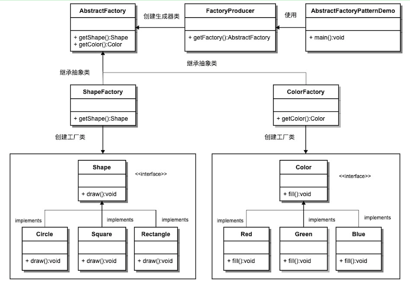

# 1. 3-抽象工厂模式

抽象工厂模式
抽象工厂模式（Abstract Factory Pattern）是围绕**一个超级工厂创建其他工厂**。该超级工厂又称为其他工厂的工厂。这种类型的设计模式属于创建型模式，它提供了一种创建对象的最佳方式。

在抽象工厂模式中，接口是负责创建一个相关对象的工厂，不需要显式指定它们的类。每个生成的工厂都能按照工厂模式提供对象。

## 1.1. 介绍

意图：提供一个创建一系列相关或相互依赖对象的接口，而无需指定它们具体的类。

主要解决：主要解决接口选择的问题。

何时使用：系统的产品有多于一个的产品族，而系统只消费其中某一族的产品。

如何解决：在一个产品族里面，定义多个产品。

关键代码：在一个工厂里聚合多个同类产品。

应用实例：工作了，为了参加一些聚会，肯定有两套或多套衣服吧，比如说有商务装（成套，一系列具体产品）、时尚装（成套，一系列具体产品），甚至对于一个家庭来说，可能有商务女装、商务男装、时尚女装、时尚男装，这些也都是成套的，即一系列具体产品。假设一种情况（现实中是不存在的，要不然，没法进入共产主义了，但有利于说明抽象工厂模式），在您的家中，某一个衣柜（具体工厂）只能存放某一种这样的衣服（成套，一系列具体产品），每次拿这种成套的衣服时也自然要从这个衣柜中取出了。用 OOP 的思想去理解，所有的衣柜（具体工厂）都是衣柜类的（抽象工厂）某一个，而每一件成套的衣服又包括具体的上衣（某一具体产品），裤子（某一具体产品），这些具体的上衣其实也都是上衣（抽象产品），具体的裤子也都是裤子（另一个抽象产品）。

优点：当一个产品族中的多个对象被设计成一起工作时，它能保证客户端始终只使用同一个产品族中的对象。

缺点：产品族扩展非常困难，要增加一个系列的某一产品，既要在抽象的 Creator 里加代码，又要在具体的里面加代码。

使用场景： 1、QQ 换皮肤，一整套一起换。 2、生成不同操作系统的程序。

注意事项：产品族难扩展，产品等级易扩展。

## 1.2. 实现

我们将创建 Shape 和 Color 接口和实现这些接口的实体类。

下一步是创建抽象工厂类 AbstractFactory。

接着定义工厂类 ShapeFactory 和 ColorFactory，这两个工厂类都是扩展了 AbstractFactory。

然后创建一个工厂创造器/生成器类 FactoryProducer。

AbstractFactoryPatternDemo 类使用 FactoryProducer 来获取 AbstractFactory 对象。它将向 AbstractFactory 传递形状信息 Shape（CIRCLE / RECTANGLE / SQUARE），以便获取它所需对象的类型。同时它还向 AbstractFactory 传递颜色信息 Color（RED / GREEN / BLUE），以便获取它所需对象的类型。



### 1.2.1. Shape接口及其实现类

#### 1.2.1.1. Shape 接口

为形状创建一个接口。

* Shape.java

```java
public interface Shape {
   void draw();
}
```

#### 1.2.1.2. Shape的实现类

创建实现接口的实体类。

* Rectangle.java

```java
public class Rectangle implements Shape {

   @Override
   public void draw() {
      System.out.println("Inside Rectangle::draw() method.");
   }
}
```

* Square.java

```java
public class Square implements Shape {

   @Override
   public void draw() {
      System.out.println("Inside Square::draw() method.");
   }
}
```

* Circle.java

```java
public class Circle implements Shape {

   @Override
   public void draw() {
      System.out.println("Inside Circle::draw() method.");
   }
}
```

### 1.2.2. Color接口及其实现类

#### 1.2.2.1. Color接口

为颜色创建一个接口。

* Color.java

```java
public interface Color {
   void fill();
}
```


#### 1.2.2.2. Color的实现类

创建实现接口的实体类。

* Red.java

```java
public class Red implements Color {
   @Override
   public void fill() {
      System.out.println("Inside Red::fill() method.");
   }
}
```

* Green.java

```java
public class Green implements Color {
   @Override
   public void fill() {
      System.out.println("Inside Green::fill() method.");
   }
}
```

* Blue.java

```java
public class Blue implements Color {
   @Override
   public void fill() {
      System.out.println("Inside Blue::fill() method.");
   }
}
```

### 1.2.3. 抽象工厂及其实现类

#### 1.2.3.1. 抽象工厂

为 Color 和 Shape 对象创建抽象类来获取工厂。

* AbstractFactory.java

```java
public abstract class AbstractFactory {
   public abstract Color getColor(String color);
   public abstract Shape getShape(String shape);
}
```

#### 1.2.3.2. 抽象工厂的实现类

创建扩展了 AbstractFactory 的工厂类，基于给定的信息生成实体类的对象。

* ShapeFactory.java

```java
public class ShapeFactory extends AbstractFactory {

   @Override
   public Shape getShape(String shapeType){
      if(shapeType == null){
         return null;
      }
      if(shapeType.equalsIgnoreCase("CIRCLE")){
         return new Circle();
      } else if(shapeType.equalsIgnoreCase("RECTANGLE")){
         return new Rectangle();
      } else if(shapeType.equalsIgnoreCase("SQUARE")){
         return new Square();
      }
      return null;
   }

   @Override
   public Color getColor(String color) {
      return null;
   }
}
```

* ColorFactory.java

```java
public class ColorFactory extends AbstractFactory {

   @Override
   public Shape getShape(String shapeType){
      return null;
   }

   @Override
   public Color getColor(String color) {
      if(color == null){
         return null;
      }
      if(color.equalsIgnoreCase("RED")){
         return new Red();
      } else if(color.equalsIgnoreCase("GREEN")){
         return new Green();
      } else if(color.equalsIgnoreCase("BLUE")){
         return new Blue();
      }
      return null;
   }
}
```


### 1.2.4. 抽象工厂构造器

创建一个工厂创造器/生成器类，通过传递形状或颜色信息来获取工厂。

* FactoryProducer.java

```java
public class FactoryProducer {
   public static AbstractFactory getFactory(String choice){
      if(choice.equalsIgnoreCase("SHAPE")){
         return new ShapeFactory();
      } else if(choice.equalsIgnoreCase("COLOR")){
         return new ColorFactory();
      }
      return null;
   }
}
```

### 1.2.5. 使用抽象工厂对象

使用 FactoryProducer 来获取 AbstractFactory，通过传递类型信息来获取实体类的对象。

* AbstractFactoryPatternDemo.java

```java
public class AbstractFactoryPatternDemo {
   public static void main(String[] args) {

      //获取形状工厂
      AbstractFactory shapeFactory = FactoryProducer.getFactory("SHAPE");

      //获取形状为 Circle 的对象
      Shape shape1 = shapeFactory.getShape("CIRCLE");
      //调用 Circle 的 draw 方法
      shape1.draw();

      //获取形状为 Rectangle 的对象
      Shape shape2 = shapeFactory.getShape("RECTANGLE");
      //调用 Rectangle 的 draw 方法
      shape2.draw();

      //获取形状为 Square 的对象
      Shape shape3 = shapeFactory.getShape("SQUARE");
      //调用 Square 的 draw 方法
      shape3.draw();

      //获取颜色工厂
      AbstractFactory colorFactory = FactoryProducer.getFactory("COLOR");

      //获取颜色为 Red 的对象
      Color color1 = colorFactory.getColor("RED");
      //调用 Red 的 fill 方法
      color1.fill();

      //获取颜色为 Green 的对象
      Color color2 = colorFactory.getColor("Green");
      //调用 Green 的 fill 方法
      color2.fill();

      //获取颜色为 Blue 的对象
      Color color3 = colorFactory.getColor("BLUE");
      //调用 Blue 的 fill 方法
      color3.fill();
   }
}
```

### 1.2.6. 步骤 9

执行程序，输出结果：

```
Inside Circle::draw() method.
Inside Rectangle::draw() method.
Inside Square::draw() method.
Inside Red::fill() method.
Inside Green::fill() method.
Inside Blue::fill() method.
```